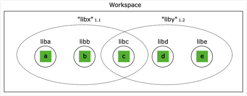
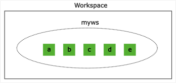

= Artifacts
:cljdoc-api-url: https://cljdoc.org/d/polylith/clj-poly/CURRENT/api

We assemble our bricks (xref:component.adoc[components] and xref:base.adoc[bases]) in xref:project.adoc[deployable projects] from which we build artifacts.

The base (a project typically has a single base) acts as the runtime entry point.

The `poly` tool has no say in what type of artifacts we build or how we xref:build.adoc[build] them.
Some artifact examples are:

* REST APIs
* Lambda functions
* Command line tools
* Libraries

[#libraries]
== Libraries

There are challenges associated with building more than one library from a single workspace.
But let's start with the simple case.

=== Single library

Let's say we have a workspace with three components:

Now we can easily build a library of these components (e.g. `libx.jar`) and everything will work just as well as if we had a traditional monolithic codebase:

It's natural to use a base to expose a library's functionality, as they are meant for that job (exposing APIs).
For instance, we can use a `libx-api` base to expose the functionality of the `libx` library above.
Alternatively, we can use a component to expose the functionality, as demonstrated by the {cljdoc-api-url}/polylith.clj.core.api[clj-poly] library.

=== Multiple libraries
Let's say we release `1.1` of library `libx` and `liby`, and then after a while we release `1.2`.
If someone out there now includes `libx-1.1` and `liby-1.2` in their classpath, we will get this situation:

Here the `c` component is used by both `libx` and `liby` and depending on which library that comes first in the classpath, we will get either `1.1` or `1.2` of `c`.

If the interface of `c` has changed between `1.1` and `1.2` then `libx` may fail to compile.
Even if it does compile, it remains problematic, because
`c` may exhibit new behavior that hasn't been tested from the `1.1` context.

=== One library per brick

There is another alternative, and that is to build one library/jar per brick:

Let's say we have built and released `1.1` of all these five libraries, and then after a while, we release `1.2`. Let's say someone has included version `1.1` of "libx" by including `liba`, `libb`, and `libc`, and version `1.2` of "liby" and included version `1.2` of `libc`, `libd` and `libe`.
Now, we can't be certain which version of component `c` will be picked up by the classloader, as it depends on the order in which the libraries are specified:

This means we experience the same problem as if we build `libx` and `liby` separately.

=== One library per workspace

The most solid solution is probably to build a single jar out of the entire workspace that includes all the bricks (`myws.jar` in this example) and thus all the libraries:

The disadvantage is that we have included more libraries than the user might need.

=== Adjust the top namespace at build time

The last alternative is to adjust the top namespace for each library, when building the jar. We should keep the namespace of the API base though, so that people don't have to change their `:require` statements when they use the library.

This approach comes with its own challenges, which is discussed in issue https://github.com/polyfy/polylith/issues/212[212].
