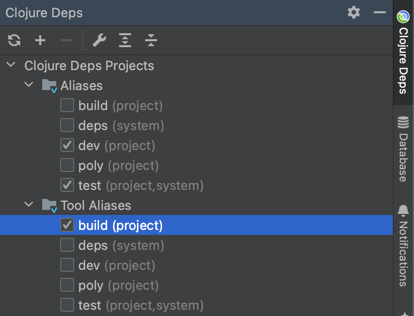

= Build

The `poly` tool doesn’t include a _build_ command.
That’s because we don’t want the tool to restrict our build pipeline in any way.
Instead, the tool lets us choose our own way to build our Polylith artifacts for our particular pipeline;
which could be with simple build scripts, all the way to cloud-based build tools.

Let's say we want to create an executable jar file out of the _command-line_ project.
Let's start by downloading
https://github.com/polyfy/polylith/blob/master/examples/doc-example/build.clj[build.clj]
and copy it to the workspace root:

[source,shell]
----
example
├── build.clj
----

Now add the _:uberjar_ alias to _projects/command-line/deps.edn_:

[source,clojure]
----
{...
 :aliases {:test {...}

           :uberjar {:main se.example.cli.core}}}
----

Also add the _:build_ alias to _./deps.edn_:

[source,clojure]
----
{:aliases {...
           :build {:deps {org.clojure/tools.deps {:mvn/version "0.16.1281"}
                          io.github.clojure/tools.build {:mvn/version "0.9.4"}
                          ;; because we use log4j 2.x:
                          io.github.seancorfield/build-uber-log4j2-handler {:git/tag "v0.1.5" :git/sha "55fb6f6"}}
                   :paths ["build/resources"]
                   :ns-default build}}
----

Now select the _build_ alias and refresh the IDE:

Also add "build" to Options in the REPL settings + restart the REPL:

== Old Cursive versions

If you use an older version of Cursive than 1.13.0, then set Options to _dev,test,build_ instead,
and you may also need to add this to your _./deps.edn_ if the IDE doesn't recognise _build.clj_ as source code:

[source,clojure]
----
{:aliases  {...
            :build {...
                    :extra-paths ["."]
----

== Try it out

Let's try to build the _command-line_ tool by executing this statement from the workspace root:

[source,shell]
----
clojure -T:build uberjar :project command-line
----

This will output:

[source,shell]
----
Compiling se.example.cli.core...
Building uberjar target/command-line.jar...
Uberjar is built.
----

Let's execute it:

[source,shell]
----
cd projects/command-line/target
java -jar command-line.jar Lisa
----

[source,shell]
----
Hello Lisa!
----

Nice, it worked!
