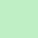
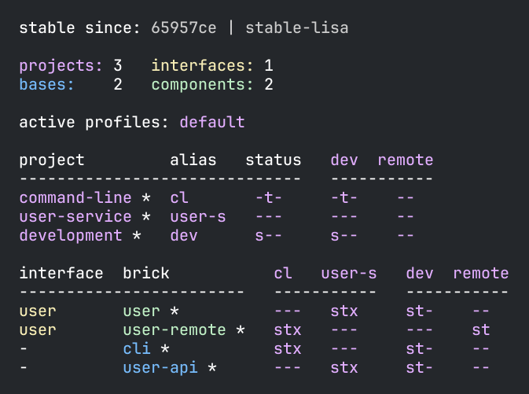
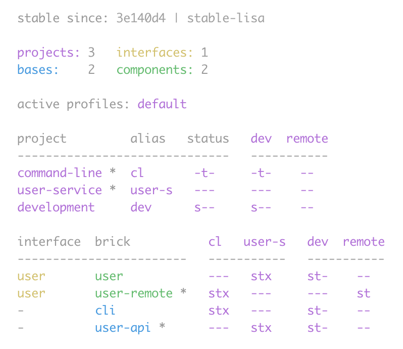

= Colors
:toc:

The `poly` tool uses color to make its output easier to digest.
The Dark column shows the colors used in all the examples, while Light is the colors used by xref:polyx.adoc[polyx] when `color-mode` is set to `light`.

[%autowidth]
|===
|Name |[.nowrap]#ANSI Color# |Dark |Light |Example `poly` Usages

|yellow
a|`ESC[33m`
a| +
[.nowrap]#`#f8eeb6`#
a| +
[.nowrap]#`#977f2a`#
|interfaces, warning messages

|green
a|`ESC[32m`
a| +
[.nowrap]`#bfefc5`
a| +
[.nowrap]`#2c9d3a`
|components, success messages

|blue
a|`ESC[34m`
a| +
[.nowrap]`#77bcfc`
a| +
[.nowrap]`#2c68a1`
|bases

|purple
a|`ESC[35m` +
(magenta)
a| +
[.nowrap]`#e2aeff`
a| +
[.nowrap]`#8e58ad`
|projects

|red
a|`ESC[31m`
a| +
[.nowrap]`#ee9b9a`
a|image:images/colors/light/red.png[width=65] +
[.nowrap]`#ee9b9a`
|error messages

|light grey
a|`ESC[37m` +
(white)
a| +
[.nowrap]`#cccccc`
a| +
[.nowrap]`#787878`
|tags and shas (dark mode)

|dark grey
a| `ESC[90m` +
(bright black)
|-
|-
|tags and shas (light mode)

|white (background)
a|`ESC[40m`
|-
a|image:images/colors/light/white.png[width=65] +
[.nowrap]`#ffffff`
|Used as background color by xref:polyx.adoc[polyx] when `color-mode` is set to `light`.

|black (background)
a|`ESC[40m`
a| +
[.nowrap]`#24272b`
|-
|Used as background color by xref:polyx.adoc[polyx] when `color-mode` is set to `dark`.

|===

Your OS terminal shell and its color theme configuration can redefine these colors.
If you want to match our dark scheme preference (inspired by the https://github.com/Misophistful/borealis-cursive-theme[Cursive Borealis color scheme]), configure your terminal to use the sample colors from the table above.

[[config]]
== Config

When you create your first xref:workspace.adoc[workspace], `poly` creates a xref:configuration.adoc#color-mode[user config file] that specifies a `color-mode`:

.~/.config/polylith/config.edn
[source,clojure]
----
{:color-mode "dark" ;; <1>
 :thousand-separator ","
 :empty-character "·"}
----
<1> The `poly` tool sets the initial value to `"dark"` on macOS and Linux and to `"none"` on Windows.

Valid `color-mode` values are `"none"`, `"light"`, and `"dark"`.

NOTE: We don't support colored text on Windows, so `poly` sets the initial `:color-mode` on Windows to `"none"`.

If you use a light theme for your OS terminal shell, consider switching `:color-mode` to `"light"`.
The only difference between `"light"` and `"dark"` is very subtle; they use different link:/components/util/src/polylith/clj/core/util/colors.clj#L3-L13[shades of grey].
The shade of grey in the `"light"` mode can show up better when using a light theme in your OS terminal shell.

== Usage

Throughout our documentation, our screenshots show output from an OS terminal shell configured with a dark theme with `:color-mode` left at its default `"dark"`:

[source,text]
----
poly info
----

When you can specify `color-mode` as an argument, it will override your `poly` xref:#config[config].
Assuming you've configured your OS terminal shell to a light color scheme, you might want to tell `poly` to use `color-mode:light`:

[source,text]
----
poly info color-mode:light
----

When you specify a `color-mode` of `none`:

[source,text]
----
poly info color-mode:none
----

The `poly` tool will emit uncolored plaintext:

[source,text]
----
  stable since: 65957ce | stable-lisa

  projects: 3   interfaces: 1
  bases:    2   components: 2

  active profiles: default

  project         alias   status   dev  remote
  ------------------------------   -----------
  command-line *  cl       -t-     -t-    --
  user-service *  user-s   ---     ---    --
  development *   dev      s--     s--    --

  interface  brick           cl   user-s   dev  remote
  ------------------------   -----------   -----------
  user       user *          ---   stx     st-    --
  user       user-remote *   stx   ---     ---    st
  -          cli *           stx   ---     st-    --
  -          user-api *      ---   stx     st-    --
----

