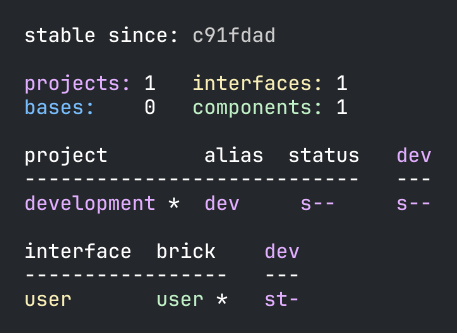

= Component

Now when we have a working development environment, let's continue and create our first component.
But before we do that, open _workspace.edn_ in a text editor and set _:auto-add_ to true:

[source,clojure]
----
...
 :vcs {:name "git"
       :auto-add true}
...
----

By doing this, we want to ensure that the created files and directories from the xref:commands.adoc#create[create]
command is also added to xref:git.adoc[git], which will come in handy in this example.

If _:auto-add_ is set to _false_, then we have to manually add created files to git,
after the xref:commands.adoc#create[create] command has been executed, or pass in `:git-add`
to explicitly add them, which will have the same effect as setting _:auto-add_ to true.

== How to execute commands

Before we continue with creating a component, let's say a few words about the different ways of executing commands.
We have described three ways already, e.g.:

1. `poly help` - using the compiled version of the tool.

2. `clojure -M:poly help` - using Clojure CLI from the workspace directory.

3. `clojure -Tpoly help` - as a Clojure CLI Tool

All the documentation refers to the first form, even though the other two are also valid.
There is also a fourth way, and that is to execute the command from a xref:commands#shell[shell]:

1. `poly shell`

2. `clojure -M:poly shell`

3. `clojure -T:poly shell`

There is a shorter form that works in the first two cases:

1. `poly`

2. `clojure -M:poly`

image::images/component/start-a-shell.png[]

From here it's enough to enter the name of the command, e.g.:

image::images/component/shell-info.png[]

This way of executing commands is the most convenient way in most cases, because it gives us instant feedback, history,
and autocomplete. Feel free to use the xref:shell.adoc[shell] from now on. It will make you more productive and enhances
the development experience!

Now let's continue with our example by executing the xref:commands.adoc#create-component[create component] command:

[source,shell]
----
poly create component name:user
----

Our workspace will now look like this:

[source,shell]
----
example
├── bases
├── components
│   └── user
│       ├── deps.edn
│       ├── resources
│       │   └── user
│       ├── src
│       │   └── se
│       │       └── example
│       │           └── user
│       │               └── interface.clj
│       └── test
│           └── se
│               └── example
│                   └── user
│                       └── interface_test.clj
├── deps.edn
├── development
│   └── src
│       └── dev
│           └── lisa.clj
├── logo.png
├── projects
├── readme.md
└── workspace.edn
----

The command also printed out this message:

[source,shell]
----
  Remember to add :local/root dependencies to dev and project 'deps.edn' files.
----

This was a reminder for us to add the component to _deps.edn_. If we don't, then _tools.deps_ and the development
environment will not recognize our newly created component, which would be a pity! The tool leaves this task to you
as a developer, with the idea to give you as much control as possible (files are only edited by you, not by the tool).

Let's continue by adding the _user_ component to _./deps.edn_:

[source,clojure]
----
{:aliases  {:dev {:extra-paths ["development/src"]

                  :extra-deps {poly/user {:local/root "components/user"}

                               org.clojure/clojure {:mvn/version "1.11.1"}}}

            :test {:extra-paths ["components/user/test"]}
----

All keys must be unique, and a good pattern is to prefix them with _poly/_ followed by the brick name,
e.g. _poly/user_ as in this case.

Adding the component to _:extra-deps_ should now be supported by all the main IDE's:
https://github.com/clojure-emacs/cider[Cider],
https://marketplace.visualstudio.com/items?itemName=betterthantomorrow.calva[Calva] and
https://cursive-ide.com/[Cursive].
Cursive users have to use _1.13.0_ or later for this to work.

If your IDE doesn't support this, then you have to add the component paths instead:

[source,clojure]
----
 :aliases  {:dev {:extra-paths ["development/src"
                                "components/user/src"
                                "components/user/resources"]

            :test {:extra-paths ["components/user/test"]}
----

We recommend you to add them as dependencies instead of as paths (if possible) for these reasons:

* It's more readable

* We don't have to duplicate the bricks library dependencies in _./deps.edn_.

* It's consistent with how xref:project.adoc[projects] are specified.

* You can add or remove the _resources_ directory from a brick, without having to remember to update _./deps.edn_.

If you want to see an example of what this might look like in practice, take a look at how _article_ can be added as a
https://github.com/furkan3ayraktar/clojure-polylith-realworld-example-app/blob/5b6df23d63500a4540b75308379e06dfdeb8b767/deps.edn#L7[dependency]
or as https://github.com/furkan3ayraktar/clojure-polylith-realworld-example-app/blob/e6f7f200bc46e4e2595e123947eec442ad91c9ab/deps.edn#L7-L8[paths]
in the RealWorld example app.

Now we may need to refresh our IDE, by clicking the _Import Changes_ link (or the icon we used before):

image::images/component/cursive-import-changes.png[alt=Import changes,width=400]

The component also has its own _deps.edn_ file that looks like this:

[source,clojure]
----
{:paths ["src" "resources"]
 :deps {}
 :aliases {:test {:extra-paths ["test"]
                  :extra-deps {}}}}
----

It specifies that it has a _src_, _resources_ and _test_ directory.

The component was created with a _resources_ directory:

[source,shell]
----
example
├── components
│   └── user
│       ├── resources
│       │   └── user
----

This directory contains a _user_ directory, which is the name of the component's xref:interface.adoc[interface]
and is the place where we put our resources, e.g.:

[source,shell]
----
example
├── components
│   └── user
│       ├── resources
│       │   └── user
│       │       └── myimage.png
----

The reason we put _myimage.png_ under _resources/user_ and not directly under _resources_ is that we want to avoid name clashes,
which could happen if a file name exists in more than one brick in a xref:project.adoc[project].

If the resources directory is not needed, it can be deleted and removed from the corresponding _deps.edn_ file.
It has some value to keep it though, to avoid the risk of someone adding it again in the future
without the _user_ subdirectory (in this example).

Let's continue by executing the xref:commands.adoc#info[info] command:

[source,shell]
----
poly info
----

This tells us that we have one _development_ project, one _user_ component and one _user_ xref:interface.adoc[interface]
but no xref:base.adoc[base] (yet). Components and bases are referred to as _bricks_ (we will soon explain what a base is).
The cryptic `s--` and `st-` will be described in the xref:flags.adoc[flags] section.

If your colors don't look as nice as this, then you can visit the xref:colors.adoc[colors] section.

== Add implementation

Now, let's add the _core_ namespace to _user_:

image::images/component/add-user-namespaces.png[alt=Add the core namespace,width=350]

...and change it to:

// scripts/sections/component/user-core.clj
[source,clojure]
----
(ns se.example.user.core)

(defn hello [name]
  (str "Hello " name "!"))
----

...and update the _interface_ to:

// scripts/sections/component/user-interface.clj
[source,clojure]
----
(ns se.example.user.interface
  (:require [se.example.user.core :as core]))

(defn hello [name]
  (core/hello name))
----

Here we delegate the incoming call to the implementing _core_ namespace,
which is the most common way of structuring components in Polylith.

Here we put all our implementing code in one single namespace, but as the codebase grows,
more namespaces can be added to the component when needed.
The implementing _core_ namespace can be renamed to something else, but here we choose to keep it as it is.
