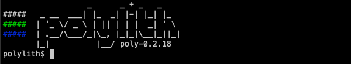
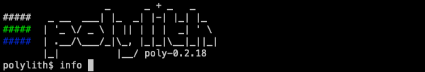
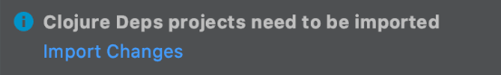
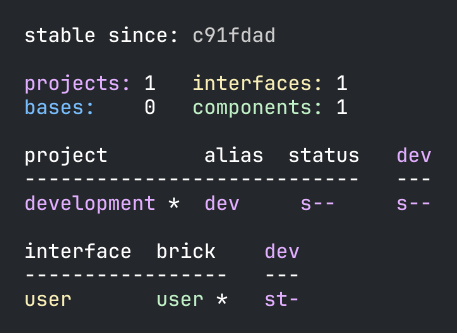
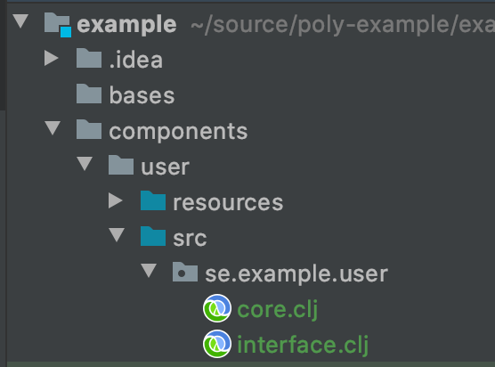

= Component

If you have been following our xref:introduction.adoc[tutorial], you should now have:

* An example xref:workspace.adoc[workspace]
* A working xref:development.adoc[development] environment

You will soon create your first component.
But before you do that, open `workspace.edn` in your editor and set `:auto-add` to `true`:

[source,clojure]
----
 :vcs {:name "git"
       :auto-add true}
----

The `:auto-add` option tells `poly` to automatically add files generated by the xref:commands.adoc#create[create] command to xref:git.adoc[git].
This behavior will be helpful in the examples that follow.

****
When `:auto-add` is `false`, you have to either:

* Manually https://git-scm.com/docs/git-add[git add] files generated by xref:commands.adoc#create[create] commands yourself.
* Or specify the `:git-add` option on `poly` xref:commands.adoc#create[create] commands.
****

== How to Execute Commands

Before you create a component, let's recap the two ways of executing `poly` commands:

1. `poly help` - the stand-alone version of the tool.
2. `clojure -M:poly help` - as a Clojure dep from the workspace directory.

Which forms are available depends on how you xref:install.adoc[installed] `poly`.

All the documentation refers to the first form, even though the other form is also valid.

A third way to execute `poly` commands is through the `poly` shell.
You start the poly shell via the xref:commands.adoc#shell[shell] command:

1. `poly shell`
2. `clojure -M:poly shell`

[[shell-is-default]]
The xref:commands.adoc#shell[shell] command is the default command:

1. `poly`
2. `clojure -M:poly`

From the poly shell, it's enough to enter the name of the command, e.g.:

In most cases, the poly shell is the most convenient way to execute commands.
It gives you instant feedback, history, and autocomplete.
Feel free to use the xref:shell.adoc[shell] from now on.
It will make you more productive and enhance your development experience!

TIP: Type xref:shell.adoc#quit[`quit`] to end your `poly` shell session.

[[create-component]]
== Creating a Component

Let's continue with our example by executing the xref:commands.adoc#create-component[create component] command:

[source,shell]
----
poly create component name:user
----

Your workspace directory structure will now look like this:

[source,shell]
----
example
├── bases
├── components
│   └── user # <1>
│       ├── deps.edn
│       ├── resources
│       │   └── user
│       ├── src
│       │   └── se
│       │       └── example
│       │           └── user
│       │               └── interface.clj
│       └── test
│           └── se
│               └── example
│                   └── user
│                       └── interface_test.clj
├── deps.edn
├── development
│   └── src
│       └── dev
│           └── lisa.clj
├── logo.png
├── projects
├── readme.md
└── workspace.edn
----
<1> new `user` component

You'll notice the command also printed out this message:

[source,shell]
----
  Remember to add :local/root dependencies to dev and project 'deps.edn' files.
----

This is a reminder to add the component to your `./deps.edn` file.
If you don't, tools.deps and the development environment will not recognize your newly created component, which would be a pity!

The `poly` tool leaves this task to you as a developer.
Our philosophy is to leave the editing of files to you.
While we are happy to generate files for you, we want to give you complete control over changing your files.

[[add-to-deps-edn]]
Let's listen to the helpful reminder.
Add the `user` component to your `./deps.edn`:

[source,clojure]
----
{:aliases  {:dev {:extra-paths ["development/src"]

                  :extra-deps {poly/user {:local/root "components/user"} ;; <1>

                               org.clojure/clojure {:mvn/version "1.11.1"}}}

            :test {:extra-paths ["components/user/test"]}}} ;; <2>
----
<1> Add the `user` component as a dependency
<2> Add the `user` component tests

All dependency keys must be unique.
A good pattern is to prefix them with `poly/` followed by the brick name, e.g., `poly/user` as in this example.

[[expose-code-outside-workspace]]
WARNING: If you expose your code outside your workspace, e.g. as a xref:artifacts.adoc[library], then you should use a more unique prefix, e.g. `maven-group-id.workspace-name/`, see for example how https://github.com/imrekoszo/polylith-kaocha/blob/master/projects/example/deps.edn#L14[these] components are configured in the Kaocha test runner (You don't need to include `.bases` and `.components` in the prefix, polylith-kaocha/kaocha-resource-config-loader` should be enough, because components and bases can't share the same name).

NOTE: Most IDEs now support adding components as a `:local/root` dependency, but if you are not using Cider, Calva, or a current version of Cursive, please review <<ide-local-root>>.

[TIP]
====
Cursive users: After creating a component, you may need to refresh your IDE by clicking the `Import Changes` link:

====

[[generated-deps-edn]]
The component has its own `deps.edn` file that looks like:

[source,clojure]
----
{:paths ["src" "resources"]
 :deps {}
 :aliases {:test {:extra-paths ["test"]
                  :extra-deps {}}}}
----

It specifies a `src`, `resources`, and `test` directory.

The xref:commands.adoc#create-component[create component] command created the user component `resources` directory:

[source,shell]
----
example
├── components
│   └── user
│       ├── resources
│       │   └── user
----

This directory contains a `user` directory, which is the name of the component's xref:interface.adoc[interface] and is where you put your resources, e.g.:

[source,shell]
----
example
├── components
│   └── user
│       ├── resources
│       │   └── user
│       │       └── myimage.png
----

The reason you should put `myimage.png` under `resources/user` and not directly under `resources` is that you want to avoid name clashes.
This would happen if the same filename existed in more than one component in a xref:project.adoc[project].

If you don't need the `resources` directory, you can delete it and remove it from the corresponding component `deps.edn` file.
That said, you should consider keeping it around.
It offers a deliberately clash-resistant naming convention for any resources you or your team might add in the future.

Let's continue by executing the xref:commands.adoc#info[info] command:

[source,shell]
----
poly info
----

The output tells you you have one `development` project, one `user` component, and one `user` xref:interface.adoc[interface] but no xref:base.adoc[base] (yet).
We refer to components and bases as _bricks_ (we will soon explain what a base is).
The cryptic `s--` and `st-` will be described in the xref:flags.adoc[flags] section.

TIP: If your `poly` output does not look as nice and colorful, see xref:colors.adoc[colors].

== Add an Implementation

Now, let's add the `core` namespace to `user`:

...and change it to:

// scripts/sections/component/user-core.clj
[source,clojure]
----
(ns se.example.user.core)

(defn hello [name]
  (str "Hello " name "!"))
----

...and update the `interface` to:

// scripts/sections/component/user-interface.clj
[source,clojure]
----
(ns se.example.user.interface
  (:require [se.example.user.core :as core]))

(defn hello [name]
  (core/hello name))
----

The `interface` delegates the incoming call to the implementing `core` namespace, which is the most common way of structuring components in Polylith.

In this example, we had you put all your implementing code in one single namespace.
As a codebase grows, more namespaces can be added to the component as needed.
There is no rule that the implementing namespace must be named `core`, but this is what the xref:commands.adoc#create-component[create component] command generates, and we stuck with this default for this example.

[[ide-local-root]]
== IDE Support for `:local/root`
https://github.com/clojure-emacs/cider[Cider], https://marketplace.visualstudio.com/items?itemName=betterthantomorrow.calva[Calva], and https://cursive-ide.com/[Cursive (v1.13.0 and later)] all include support `:local/root` dependencies.

If your IDE doesn't include support for `:local/root` dependencies, and you are unable to switch to an IDE that has this support, then you have to add your components as `:extra-paths` instead of `:extra-deps` in your `./deps.edn`:

[source,clojure]
----
{:aliases {:dev {:extra-paths ["development/src"
                               "components/user/src"  ;; <1>
                               "components/user/resources"]} ;; <2>

           :test {:extra-paths ["components/user/test"]}}}
----
<1> `user` component `src` added as a path
<2> `user` component `resources` added as a path

If at all possible, we recommend you add xref:#add-to-deps-edn[components as dependencies] instead of paths for these reasons:

* It's more readable.

* It's consistent with how xref:project.adoc[projects] are specified.

* You won't have to duplicate the bricks library dependencies in your `./deps.edn`.

* You can add or remove the `resources` directory from a brick without having to remember to update your `./deps.edn`.

If you want to compare the difference, take a look at how `article` was elegantly added as a single https://github.com/furkan3ayraktar/clojure-polylith-realworld-example-app/blob/5b6df23d63500a4540b75308379e06dfdeb8b767/deps.edn#L7[dependency] versus adding it as two https://github.com/furkan3ayraktar/clojure-polylith-realworld-example-app/blob/e6f7f200bc46e4e2595e123947eec442ad91c9ab/deps.edn#L7-L8[paths] in the RealWorld example app.
