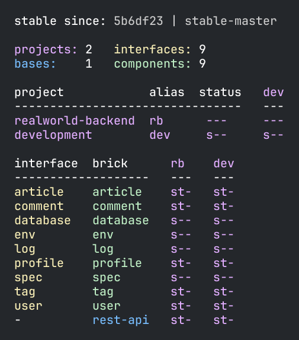
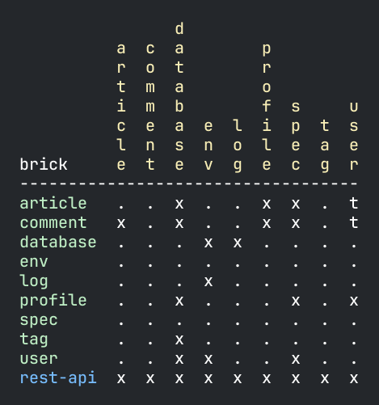

= Dependencies

If you are looking for library dependencies, then visit the xref:libraries.adoc[Libraries] section.

To explain dependencies, we will use the
https://github.com/furkan3ayraktar/clojure-polylith-realworld-example-app[RealWorld example app].

Start by cloning the project by executing these commands from outside the example workspace,
e.g. the parent folder of our example workspace:

[source,shell]
----
clone-from-here
├── example
└── clojure-polylith-realworld-example-app
----

[source,shell]
----
git clone git@github.com:furkan3ayraktar/clojure-polylith-realworld-example-app.git
cd clojure-polylith-realworld-example-app
----

Before we continue, it may be worth mentioning that most commands,
except the xref:commands.adoc#test[test] and xref:commands.adoc#create[create] commands,
can be executed from other workspaces by giving `ws-dir`, e.g.:

[source,shell]
----
poly check ws-dir:../example
----

Another way of giving the `ws-dir` is to pass in `::`
which will set it to the first parent directory that contains a `workspace.edn` file, e.g.:

[source,shell]
----
cd projects/realworld-backend
poly info ::
----

...which in this case is the same as:

[source,shell]
----
poly info ws-dir:../..
----

Now let's have a look at the workspace:

[source,shell]
----
cd ../..
poly info
----

Now we have some bricks to play with!

Let's list all dependencies by executing the xref:commands.adoc#deps[deps] command:

[source,shell]
----
poly deps
----

This lists all dependencies in the workspace. Notice the yellow color in the headers.
They are yellow because components and bases normally only depend on interfaces.
Each `x` is a `src` dependency, while a `t` means it only exists in the `test` context.

If we read the diagram horizontally,
we can see that the `article` component uses the `database`, `profile`, and `spec` interfaces.
If we read it vertically, we can see that the `article` is used by the `comment` and `rest-api` bricks.

This is also what is shown if we specify article as brick:

[source,shell]
----
poly deps brick:article
----

image::images/dependencies/deps-brick.png[width=350]

To list the component dependencies, we need to specify a project:

[source,shell]
----
poly deps project:rb
----

image::images/dependencies/deps-project.png[width=350]

Now, all the headers are green,
and that is because all the implementing components are known within the selected project.
The `+` signs mark indirect dependencies, while `-` signs mark indirect test dependencies (not present here).
An example is the `article` component that uses `log` indirectly: `article` > `database` > `log`.

[#compact-view]
If we have many libraries, they can be viewed in a more compact format:

[source,shell]
----
poly deps project:rb :compact
----

image::images/dependencies/deps-project-compact.png[width=300]

This can be set permanently by setting `:compact-views #{"deps"}` in `workspace.edn`.

We can also show dependencies for a specific brick within a project:

[source,shell]
----
poly deps project:rb brick:article
----

image::images/dependencies/deps-brick-project.png[width=350]

== Namespace access restrictions

In Polylith there are restrictions on how we can access namespaces of other bricks:

|===
| Entity | Restrictions from `:src` context | Restrictions from `:test` context

| Component | Can only access xref:interface.adoc[interface] namespaces, but no other `brick` namespace. |
Can access any _brick_ namespace.
| Base | Can access xref:interface.adoc[interface] namespaces, but no other component namespaces.
Can access any `base` namespace. | Can access any `brick` namespace.
| Project | Can access any namespace. | Can access any namespace.
|===

Allowing deployable projects to have their own `src` directory and put code there is discouraged.
One reason is that it violates the whole LEGO idea,
and the other is that the `poly` tool doesn't force us to only use interfaces from project code (this may change in the future).

An exception could be if we want to migrate services to Polylith.
Then the code can start in the project and then gradually move out to bricks,
but in that case it's probably better to put everything in a single base instead,
as suggested in https://polylith.gitbook.io/polylith/conclusion/should-you-convert-your-system[Transitioning to Polylith]
in the high-level documentation.

====
CAUTION: Allowing other bricks to access a component's test code will make it harder to replace that component,
as the new component must implement the same set of test functions. +
A better strategy is to put the shared code in a separate test helper component,
and depend on that component's interface.
====

== Circular dependencies

The `poly` tool is checking for circular dependencies.
If we have a dependency chain like `A` > `B` > `A`, or `A` > `B` > `C` > `A`,
then we will get an "Error 104 - Circular dependencies".
To read more about this and other errors, we can execute the xref:commands.adoc#check[check] command.
