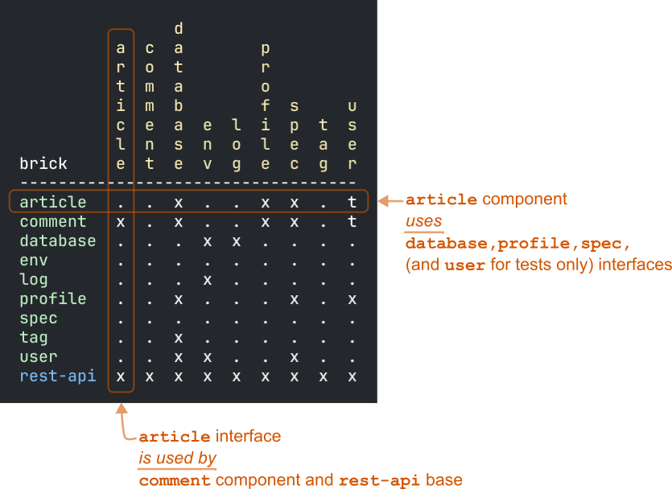

= Dependencies
:toc:

When we talk about `poly` dependencies, we refer to dependencies between bricks (xref:component.adoc[components] and xref:base.adoc[bases]).
For 3rd-party library dependencies, see xref:libraries.adoc[Libraries].

== Setup for Tutorial

We'll switch from our `example` xref:introduction.adoc[tutorial] to the https://github.com/furkan3ayraktar/clojure-polylith-realworld-example-app[RealWorld example app] to explore dependencies.

If you've been following our ongoing `example` tutorial, first take a moment to ensure you aren't currently in the `example` workspace directory.
Change directory, e.g., to the parent folder of your example workspace:

[source,shell]
----
clone-from-here
├── example
└── clojure-polylith-realworld-example-app
----

Then run:
[source,shell]
----
git clone https://github.com/furkan3ayraktar/clojure-polylith-realworld-example-app.git
cd clojure-polylith-realworld-example-app
----

== Digging In

Have a look at the Realworld example app workspace:

[source,shell]
----
poly info
----

Look at all those lovely bricks we have to play with!

List all `poly` dependencies by running the xref:commands.adoc#deps[deps] command:

[source,shell]
----
poly deps
----

This is a summary of all brick dependencies in the workspace.
xref:interface.adoc[Interfaces] are shown in yellow, xref:component.adoc[components] in green, and xref:base.adoc[bases] in blue.

Notice the headers across the top are yellow (interfaces).

Each `x` is a `src` dependency, `t` is a `test` only dependency (code that lives in any of the directories specified in `:aliases > :test > :extra-paths`).

Reading the `article` component row, left to right, we see it _uses_ `database`, `profile`, and `spec` interfaces (and the `user` interface, but only for testing).
Reading the `article` interface column, top to bottom, we see it _is used by_ the `comment` component and `rest-api` base.

NOTE: Our example here does not show it, but xref:base.adoc[bases] can also depend on other bases.

You can ask poly to hone in on the dependencies for a single brick.
Ask `poly` to report on the `article` brick:

[source,shell]
----
poly deps brick:article
----

We've looked at brick ⇔ interface dependencies.
To examine brick ⇔ brick dependencies, you need to specify a project:

[source,shell]
----
poly deps project:rb
----

The header across the top is now green (components) instead of yellow (interfaces).
This component reporting is possible because `poly` is aware of all the implementing components within the selected project.

This report has extra symbols.
The `+` sign indicates an indirect dependency, and the `-` sign indicates indirect test dependencies (not present in our example output).
An example is the `article` component using the `log` component indirectly: `article` uses `database`, and `database` uses `log`.

[#compact-view]

If you have many brick dependencies, you might prefer the compact format:

[source,shell]
----
poly deps project:rb :compact
----

****
You tell `poly` to always use the compact format for `deps` for your workspace by setting `:compact-views #{"deps"}` in your xref:workspace.adoc#workspace-edn[workspace.edn].
****

We can also show brick ⇔ brick dependencies for a specific brick within a project:

[source,shell]
----
poly deps project:rb brick:article
----

== Accessability

The `poly` tool restricts what can access what:

[cols="15,25,25,40"]
|===
| Entity | From the `:src` context | From the `:test` context | Caution

| xref:component.adoc[Component]
a| Can **only** access:

* xref:interface.adoc[interface] namespaces.
| Can access any namespace.
| If component `x` test code accesses test code from component `y`, it is harder to swap out (replace) component `x`; you must also implement all component `y` tests for the replacement. +
A better strategy is to put any shared test code in a separate test helper component and depend on that component's interface.

| xref:base.adoc[Base]
a| Can **only** access:

* xref:interface.adoc[interface] namespaces
* any xref:base.adoc[base] namespace
| Can access any namespace.
|

| xref:project.adoc[Project]
| Can access any namespace.
| Can access any namespace.
| While tests are fine, we recommend against including `src` for deployable `./projects`; the `poly` tool does no checks on deployable project source code.

|===

== Circular dependencies

The `poly` tool reports on circular brick dependencies.
If you have a dependency chain like A > B > A, or A > B > C > A, then `poly` will show `Error 104 - Circular dependencies`.
To read more about this and other errors, see the xref:commands.adoc#check[check] command.
