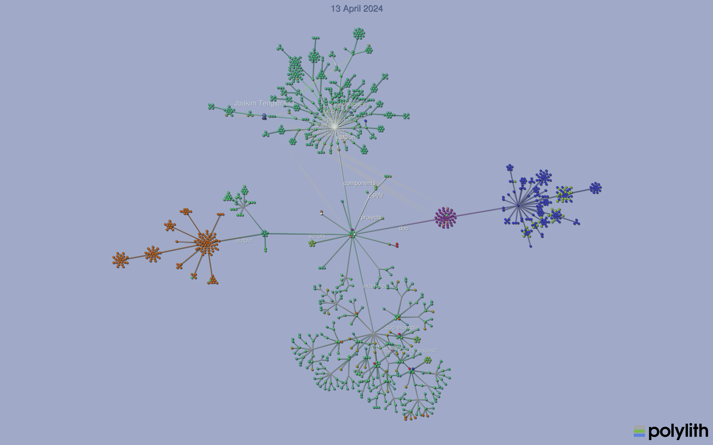

= Developing poly
:toc:

The curious are most welcome, but we wrote this document for folks who are (or want to) contribute to the development `poly` itself.

== Contributing

We very much appreciate contributions from the community.

=== Issues First Please

If you have an idea or a fix, please do raise a GitHub issue before investing in any coding effort.
That way, we can discuss first.
Writing code is the easy part; maintaining it forever is the hard part!

That said, if you notice a simple typo, a PR without an issue is fine.

TIP: We are also happy to chat about your idea or fix on the Clojurians https://clojurians.slack.com/messages/C013B7MQHJQ[polylith] channel.

=== Include Tests and Docs

We expect you to include/update tests for your change.

You've probably gotten the sense that providing good docs for our users is important to us.
When your change affects our docs or needs to be described for our users, we expect you to do so.

Add a brief line summarizing your change to link:/next-release.adoc[next-release.adoc].
The `poly` core team moves the content in this file to the changelog for each stable https://github.com/polyfy/polylith/releases[release].

=== Submitting a Pull Request

Please never force push on your PR, as this makes reviewing incremental changes impossible for us.
When we merge your PR, we'll usually squash it, so that will clean up any rambling work-in-progress.

== Special `poly` Arguments

Some `poly` arguments are special-case or `poly` developer-focused.
For this reason, the xref:commands.adoc#shell[shell] will not include these arguments in its autocomplete suggestions xref:#all-shell[by default].

Most special arguments tweak the output of the various `poly` commands.

[[all-shell]]
=== `all` - `shell`
By default, the xref:commands.adoc#shell[shell] does not suggest special `poly` arguments because they are irrelevant and inappropriate for typical users of `poly`.
If you are developing `poly` itself, suggesting special `poly` arguments can be appropriate and meaningful.
To start a shell with autocomplete suggestions enabled for all `poly` arguments:

[source,shell]
----
poly :all
----

=== `changed-files`

Have `poly` react as if specified files have changed.
We use this to support testing `poly` itself.

[source,shell]
----
poly info changed-files:components/file/src/polylith/clj/core/file/core.clj
----

More than one file can be faked as changed by separating them with colons.

****
Although multiple files are supported, the `shell` autocomplete support works only for the first file.
****

Specify a brick or project path with a trailing forward slash, and `poly` will treat the brick or project as changed:

[source,shell]
----
poly info changed-files:bases/mybase/:components/mycomponent/:projects/myproject/
----

=== `fake-sha`

Fake the Git `sha` output by the xref:commands.adoc#info[info] command.
We use this to generate consistent `info` output and screenshots for our documentation.

[source,shell]
----
poly info fake-sha:c91fdad
----

=== `fake-tag`

Fake the Git `tag` for output by the xref:commands.adoc#info[info] command.
We sometimes use this to generate consistent `info` output and screenshots for our documentation.

[source,shell]
----
poly info fake-tag:stable-lisa
----

If you want no Git `tag` to be shown in `info` output:

[source,shell]
----
poly info fake-tag:
----

=== `fake-poly`

Fake that you are using a stable production release of `poly` when you might actually be using a `SNAPSHOT` release, `polyx`, or both.

[source,shell]
----
poly help :fake-poly # <1>
polyx :fake-poly # <2>
----
<1> Excludes `-SNAPSHOT` from the version at the top of the help output
<2> Shows `poly` instead of `polyx` and excludes `-SNAPSHOT` from the Polylith ASCII art logo

This can be handy when capturing output for docs.

=== `hide-lib-size`

If `:hide-lib-size` is given to the xref:commands.adoc#libs[libs] command, values in the `KB` column appear as `-`:

[source,shell]
----
poly libs :hide-lib-size # <1>
----

This is used in tests to guarantee that the output will look the same, regardless if a library has been downloaded or not.

=== `latest-sha`

Populate the `latest-sha` from your Git repository in your workspace structure (by default, `poly` does not populate this value).

[source,shell]
----
poly ws get:settings:vcs:polylith:latest-sha :latest-sha
----

=== `no-changes`

Fake that there are no changes to your workspace since the last xref:tagging.adoc[stable point in time]; can be useful when generating output for docs.

[source,shell]
----
# Returns no rows:
poly diff :no-changes
# Gets rid of the * characters:
poly info :no-changes
# ...has the same effect as:
poly info changed-files:
----

=== `no-exit`

By default, `poly` explicitly exits via `System/exit` .
If executing `poly` from a REPL, this will also exit the REPL, which probably isn't what you want.
To avoid that, specify `:no-exit`.

See link:/bases/poly-cli/src/polylith/clj/core/poly_cli/core.clj[poly-cli source] `comment` block for plenty of examples.

****
Outside of REPL support, `:no-exit` has little use.
If you run, e.g.:
[source,shell]
----
poly info :no-exit
----
You'll have to press kbd:[Ctrl+C] to exit!
****

=== `replace`

Manipulate output from the xref:commands.adoc#ws[ws] command.

You can tell the `ws` command to search for strings (using regular expressions) and replace the occurrences with another string.

[source,shell]
----
poly ws get:settings:user-home
----
On Joakim's system, output is:
[source,text]
----
"/Users/joakimtengstrand"
----

But maybe we want some repeatable output for test or documentation purposes, regardless of which user is running the `ws`.
Assuming that your `HOME` environment variable is set appropriately and that you are running from your OS shell (not poly's `shell`):

**An example:**
[source,shell]
----
poly ws get:settings:user-home replace:$HOME:MY-HOME
----
Outputs a user-generic:
[source,text]
----
"MY-HOME"
----

**Another example:**
[source,shell]
----
poly ws get:settings:user-config-filename replace:$HOME:MY-HOME
----
Outputs a user-generic:
[source,text]
----
"MY-HOME/.polylith/config.edn"
----

**An example with multiple replacements:**
[source,shell]
----
poly ws get:settings:user-config-filename replace:$HOME:MY-HOME:config.edn:USER-CONFIG
----
Outputs:
[source,text]
----
"MY-HOME/.polylith/USER-CONFIG"
----

**Sometimes you need to deal with your OS shell escaping rules and add, for example, `""`.**
[source,shell]
----
poly ws get:settings:vcs:stable-since:sha replace:"[0-9]+":"*"
----
The output will vary because git shas are unique, but on Joakim's system once:
[source,text]
----
"*e*d*b*cee*fb*e*ff*fafcf"
----

== Documentation

We strive to write great documentation for our Polylith users.

https://asciidoctor.org/docs/what-is-asciidoc/#what-is-asciidoc[AsciiDoc] is thoughtfully designed for writing articles; we like that, so all of our articles are written in AsciiDoc.

Some conventions we have found helpful are:

* Write one sentence per line.
Among other https://asciidoctor.org/docs/asciidoc-recommended-practices/#one-sentence-per-line[things], this helps us to avoid run-on sentences.
* These particular docs cover an implementation of a Polylith tool, so use the concrete `poly` instead of the abstract "Polylith tool".
* For command-line `poly create workspace top-ns:my-ns branch:my-branch :commit` refer to:
** `create workspace` as a command
** `top-ns:my-ns`, `branch:my-branch` and `:commit` as arguments
* Link to referenced commands and concepts to make it easier for readers to explore and dig into details.
* Use the https://docs.asciidoctor.org/asciidoc/latest/macros/keyboard-macro/[AsciiDoc keyboard macro] for keyboard shortcuts.
For an example usage, see xref:shell.adoc#quit[Shell page].
* Use "we" when talking from the Polylith core team and "you" when directing the reader through some steps or a tutorial.
* Try to maintain a casual and friendly tone.

=== Diagrams

We create our diagrams with the ever-so-awesome https://inkscape.org/[Inkscape].
Inkscape's native format is `.svg`.
We export to `.png` for use in our documentation.
We keep the source `.svg` beside the exported `.png` in our GitHub repo.

We store doc images under `./doc/images/`, for example for the overview diagram in xref:/doc/doc.adoc[./doc/doc.adoc] doc:

* Inkscape source: link:/doc/images/doc/doc-overview.svg[./doc/images/doc/doc-overview.svg]
* Exported png: link:/doc/images/doc/doc-overview.png[./doc/images/doc/doc-overview.png]

Generated images (currently from `bb create-example` via `polyx`) are grouped with their related images but are prefixed with an `output` dir.
This strategy helps us distinguish hand-crafted images from generated ones and reminds us not to edit images in the `output` dirs.

Sometimes, we'll annotate a generated image.
We do so via an Inkscape SVG file and link (rather than embed) the generated image.
As of this writing, if any of these images change, the `.svg` will have to be manually re-exported to its `.png`.

Tips:

* Use a transparent background.
* We host our docs on https://cljdoc.org[cljdoc], which uses a light theme.
Folks viewing our docs on GitHub might have opted for a dark theme, so choose colors that will also be dark-theme friendly.
* Choose cross-platform-friendly fonts.
`Courier New` and `Arial` seem to be what existing diagrams use.
If you are a Linux user, you can install these as part of Microsoft's fonts.

=== Cljdoc

We host our docs on https://cljdoc.org/d/polylith/clj-poly[cljdoc], which generates docs for our:

* API by analyzing our source code from our release jar
* pages (which cljdoc calls "articles") which cljdoc finds under link:/doc[doc], and whose layout is defined by link:/doc/cljdoc.edn[doc/cljdoc.edn].

We have cljdoc build our docs each time we release to clojars.
This includes `SNAPSHOT` releases, which we create for every successful push to `master`.
See xref:polylith-ci-setup.adoc#releases[Polylith CI Setup] for more details.

[[local-cljdoc]]
=== Previewing Cljdoc Locally

When making changes to docs, you can preview what they will look like on https://cljdoc.org[cljdoc].
If you have not already done so, clone the https://github.com/polyfy/polylith[polylith] repository:

[source,shell]
----
git clone git@github.com:polyfy/polylith.git
----

Take a look at the help for our babashka `doc-preview` task:

[source,shell]
----
$ cd polylith
$ bb doc-preview help

Commands:
 start   Start docker containers supporting cljdoc preview
 ingest  Locally publishes poly for cljdoc preview
 view    Opens cljdoc preview in your default browser
 stop    Stops docker containers supporting cljdoc preview
 status  Status of docker containers supporting cljdoc preview
 help    Show this help
----

Start the server and publish the documentation locally (the first `start` will take some time to download the cljdoc docker image, and `ingest` is on the slow side):

[source,shell]
----
$ bb doc-preview start
$ bb doc-preview ingest
----

TIP: Commit and push all your changes before you `ingest`.

Bring the docs up in your web browser with:
----
bb doc-preview view
----

[[local]]
=== Poly Shell and Local Cljdoc

If you are in the `polylith` workspace root directory (which is also the git repo root dir), you can start a xref:commands.adoc#shell[shell] specifying the `:local` argument to tell the xref:commands.adoc#doc[doc] command to open pages on `\https://localhost:8000` instead of `\https://cljdoc.org`.

[source,shell]
----
clojure -M:poly :local
----

Now docs open in your browser against the xref:#local-cljdoc[locally running cljdoc]:
[source,shell]
----
polylith$ doc page:component
----

=== Refreshing Local Cljdoc Preview

From time to time, there is a new release of cljdoc.
To pick it up:

[source,shell]
----
bb doc-preview stop
bb doc-preview start
----

When you've changed the polylith codebase, you need to run `ingest` again (no need to `stop` and `start`):

[source,shell]
----
bb doc-preview ingest
----

Examples of when you might want to `ingest` are when you have:

* Switched to a different git branch.
* Pulled changes down with `git pull`.
* Pushed commits with `git push`.
You must commit and push your changes for `ingest` to function; doing so from a branch is fine.

=== Open Page Source in GitHub

Fire up a xref:commands.adoc#shell[shell]:
[source,shell]
----
clojure -M:poly :local
----

****
In addition to xref:#local[opening pages locally instead of on cljdoc.org], the `:local` argument also enables, for convenience, `shell` autocompletion for the `:github` argument.
Feel free to also specify xref:#all-shell[:all].
****

Specify the `:github` argument to bring up the page in your web browser on GitHub:
[source,shell]
----
polylith$ doc page:component :github
----

If you started your shell from the `polylith` repository (not a fork), then pages will automatically be opened in your current working branch; otherwise, pages will open on the `master` branch.

To choose a specific `branch`:
[source,shell]
----
polylith$ doc page:component branch:issue-318 :github
----

If you aren't running cljdoc locally, you may want to always open pages on GitHub instead of cljdoc; specify the `:github` argument when starting a shell:

[source,shell]
----
clojure -M:poly :github
polylith$ doc page:component
----

== Referencing a Local `poly`

So long as you've cloned the `polylith` workspace locally, you can access it from other workspaces.
This can be convenient when testing another workspace but wanting to use a local `polylith` that has some work in progress.

Let's say you have cloned the https://github.com/furkan3ayraktar/clojure-polylith-realworld-example-app[Realworld example app] as a sibling to the `polylith` repo in your directory tree.

You could then replace the `:poly` alias in `clojure-polylith-realworld-example-app/deps.edn`:

[source,clojure]
----
    ...
    :poly {:main-opts ["-m" "polylith.clj.core.poly-cli.core"]
           :extra-deps {polylith/clj-poly {:local/root "../polylith/projects/poly"}}} ;; <1>

----
<1> Notice the `..` relative path to `poly`

And now, from the `clojure-polylith-realworld-example-app` dir, you can launch local `poly` via, e.g.:

[source,shell]
----
clojure -M:poly
----

== SNAPSHOT Releases & Caching

https://github.com/clojure/tools.deps[Clojure tools.deps] only checks for updates once per day by default.

This caching behavior means users referencing a specific `SNAPSHOT` will be more likely to temporarily be on an older release if you frequently release under the same `SNAPSHOT` version.

Users can https://clojure.org/reference/deps_and_cli#_classpath_caching[-Sforce] a check for an update, but most probably won't think to do that.

[#visualize-repo]
== Visualize the repo

You can use https://gource.io[Gource] to visualize how the code has evolved over time.

Here is an example animation:

=== Install

[source,shell]
----
brew install gource
brew install ffmpeg
----

=== Generate

This will generate a `polylith.mp4` file:

[source,shell]
----
gource --seconds-per-day 0.2 --auto-skip-seconds 1 --max-file-lag 0.1 --background 9dabcb --logo doc/images/developing-polylith/logo.png --disable-bloom --font-size 18 --font-colour 566ca1 --hide filenames --date-format "%d %B %Y" --dir-colour eeeeee --dir-name-depth 2 --caption-colour ff0000 --dir-font-size 12 -o - | ffmpeg -y -r 60 -f image2pipe -vcodec ppm -i - -vcodec libx264 -preset ultrafast -pix_fmt yuv420p -crf 1 -threads 0 -bf 0 polylith2.mp4
----

You can also experiment without generating a file:

[source,shell]
----
gource --seconds-per-day 0.2 \
       --auto-skip-seconds 1 \
       --max-file-lag 0.1 \
       --background 9dabcb \
       --logo doc/images/developing-polylith/logo.png \
       --disable-bloom \
       --font-size 18 \
       --font-colour 566ca1 \
       --hide filenames \
       --date-format "%d %B %Y" \
       --dir-colour eeeeee \
       --dir-name-depth 2 \
       --caption-colour ff0000 \
       --dir-font-size 12
----

See how to tweak the animation https://github.com/acaudwell/Gource/wiki/Controls[here]. All the options are listed https://github.com/acaudwell/Gource/blob/master/README.md#using-gource[here], or execute `gource --help`.
