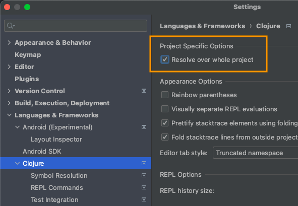
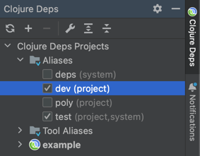
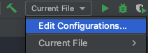
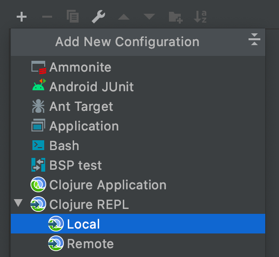
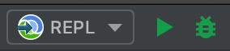
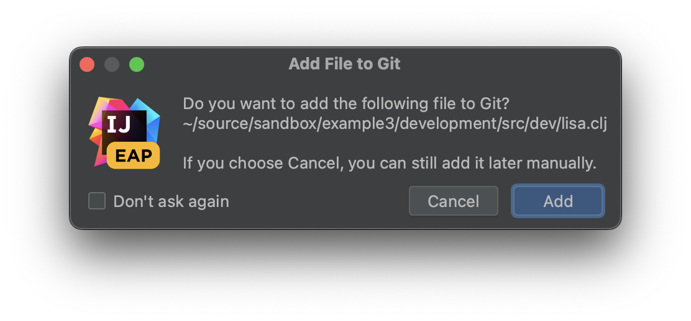
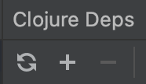

= Development

When working with a Polylith codebase, you are free to choose any editor/IDE you like, for example:

* https://www.gnu.org/software/emacs/[Emacs] with https://cider.mx/[Cider]

* https://code.visualstudio.com/[VSCode] with https://marketplace.visualstudio.com/items?itemName=betterthantomorrow.calva[Calva]

* https://www.jetbrains.com/idea/[IntelliJ IDEA] with https://cursive-ide.com/[Cursive]

== IntelliJ IDEA with Cursive Setup

Here, we share some specific setup instructions when using Cursive.

=== Cursive Setup
First, make sure you have https://cursive-ide.com/userguide/deps.html[tools.deps] configured correctly.

To import a Polylith xref:workspace.adoc[workspace] as a project:

. Select `File > New > Project from Existing Sources...` from the menu.
. A wizard will guide you through the import:
.. Start with selecting the workspace `deps.edn` file
.. When asked, choose your desired version of the Java SDK
.. Otherwise, hit `Next` and finally `Create`.

If you are using Cursive `1.13.0` or later, you must enable `Resolve over whole project` under +
`File > Settings... > Languages & Frameworks > Clojure > Project Specific Options`:

From the `Clojure Deps` tab (by default, it's on the far right), enable `dev` under `Aliases`, then press the icon with two arrows to refresh:

To create a REPL, select `Current File > Edit Configurations...`:

Then click the `+` sign and select `Clojure REPL > Local`:

Configure like so: 

* `Name:` type `REPL`
* `Which type of REPL to run` choose `nREPL`
* `How to run it` choose `Run with Deps`
** `Options:` type `-A:dev:test`
* `Common Options > Module:` select your Polylith workspace directory, e.g., `example`

Press `OK`. Now start the REPL in debug mode by clicking the bug icon:

Under the `REPL` view, you should soon see something like:

[source,shell]
----
Clojure 1.11.1
nREPL server started on port 56855 on host localhost - nrepl://localhost:56855
----

You have configured everything https://github.com/clojure/tools.deps[tools.deps] needs and are ready to write some Clojure code!

=== Trying Out Your Development Environment

Look at the xref:workspace.adoc[workspace] generated `deps.edn` file.
Notice that it already includes `development/src` on the path under the `:dev` alias:

[source,shell]
----
 :aliases  {:dev {:extra-paths ["development/src"]
----

(You might remember we had you enable the `dev` alias above under `Clojure Deps` and for the REPL via `-A:dev:test`.)

To get started, create a dev namespace.
We suggest you use `dev` as a top namespace here, not your xref:workspace.adoc[workspace] top namespace.
This strategy keeps your production code entirely separate from your development code.

One way to structure dev code is to give each developer their own namespace under `dev`.
Following this pattern, create the namespace `dev.lisa`: +
Right-click on the `development/src` directory, select `New > Clojure Namespace`, and type `dev.lisa`.

A dialog will pop up and ask you if you want to add the file to git:

Check `Don't ask again` and click the `Add` button.

If the namespace is not recognized, you may need to click the icon with two arrows under the `Clojure Deps` tab to refresh: 

Now you can write some code in `lisa.clj`:

[source,clojure]
----
(ns dev.lisa)

(+ 1 2 3)
----

Load the namespace by sending `(ns dev.lisa)` to the REPL.

Send `(+ 1 2 3)` to the REPL.
You should see `6` in the REPL view.

Congratulations, you now have a working development environment!
