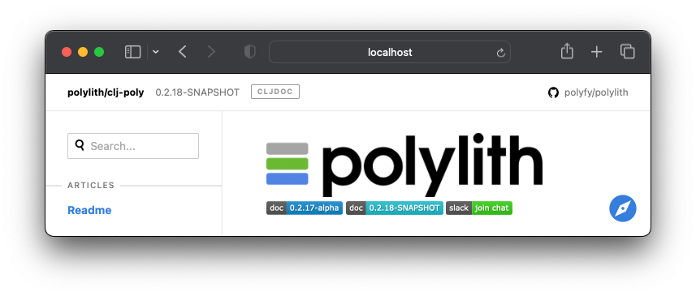
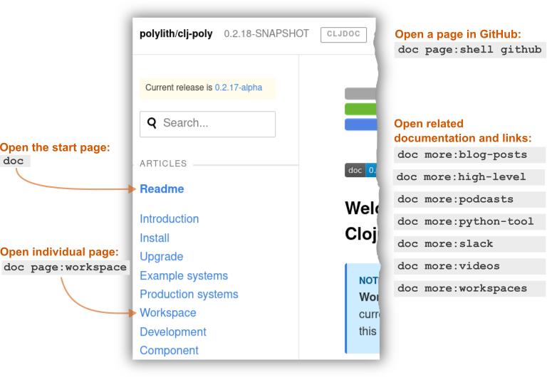
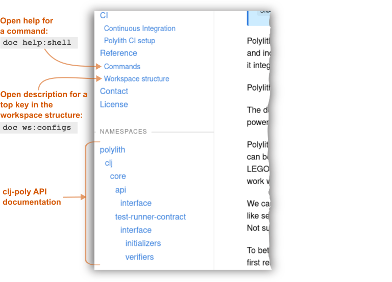

= Doc
:toc:

The `poly` tool includes a xref:commands.adoc#doc[doc] command to open web-based documentation.
The xref:shell.adoc[shell]'s autocompletion support makes listing and accessing different parts of the documentation a breeze, so go ahead and xref:shell.adoc#launch[start one up]:

[source,shell]
----
poly
----

Run the `doc` command to open the start page of the `poly` tool documentation:

[source,text]
----
example$ doc
----

TIP: The `example$` prompt shows that we are working from our xref:introduction.adoc[tutorial] `example` xref:workspace.adoc[workspace], but you can experiment with the `doc` command from any workspace.

You should see the page open in your web browser:

The page has some helpful links:

[cols="20,80"]
|===
| Link | Links to:

| 
| This documentation.

| image:images/doc/clj-poly-doc.png[] +
(the version of this documentation)
| A page listing all the https://cljdoc.org/versions/polylith/clj-poly[different versions] of this documentation.
NOTE: Useful documentation starts at version `0.2.18`.

| 
| The https://cljdoc.org/[cljdoc] home page.
Cljdoc is a central hub that hosts documentation for many Clojure libraries and tools (including clj-poly!).

| 
| The https://github.com/polyfy/polylith[polylith GitHub repo].

| 
| Documentation for the current https://github.com/polyfy/polylith/releases[release].

| 
| Documentation for the current `SNAPSHOT` release.

| 
| The https://clojurians.slack.com/messages/C013B7MQHJQ[#polylith] channel on http://clojurians.net/[Clojurians Slack].

|===

[NOTE]
====
We automatically build a `SNAPSHOT` release and its associated documentation for every commit to the https://github.com/polyfy/polylith[master] branch; see xref:polylith-ci-setup.adoc#releases[releases] for more details.

When you use a `SNAPSHOT` release via a xref:install.adoc#github-dependency[GitHub dependency], you'll be referring to its associated `SNAPSHOT` documentation.
====

Use the search box or the left menu to navigate to pages and explore API docs:

And if you scroll down to the bottom of the left menu:

Return to the poly shell to explore, then open other available docs at any time.

From the poly shell, type `doc` followed by a space to see the different help categories:

[source,text]
----
example$ doc
help   more   page   ws
----

Doc categories:

* <<page>> - web pages constitute the `poly` tool user manual, which you are reading a page of right now!
* <<help>> - `poly` xref:commands.adoc[commands] docs
* <<ws>> - xref:workspace-structure.adoc[workspace structure] docs
* <<more>> - various other information: conceptual docs, blog posts, videos, podcasts, example workspaces, and other links

Let's dig into these categories.

[[page]]
== page

Use the `page` argument to open a specific `poly` tool documentation page in your web browser.
Notice that the shell lists all pages:

[source,text]
----
example$ doc page:
artifacts                git-hooks                source-code
base                     git                      state
build                    install                  tagging
colors                   interface                tap
component                introduction             templates
configuration            libraries                test-runners
contact                  license                  testing
continuous-integration   naming                   tools-deps
dependencies             polylith-ci-setup        upgrade
developing-poly          polyx                    validations
development              production-systems       versions
doc                      profile                  visualize-the-repo
example-systems          project                  workspace
explore-the-workspace    readme
flags                    shell
----

These are the same pages you see listed in the left menu in your web browser.

When you select a page, `poly` will open it in your web browser.
To open the `flags` page:

[source,text]
----
doc page:flags
----

[[help]]
== help

The `help` argument takes you to the `poly` xref:commands.adoc[commands] documentation:

[source,text]
----
example$ doc help
----

Ask the shell to list all command help with:

[source,text]
----
example$ doc help:
check                deps-project         shell
create-base          deps-workspace       switch-ws
create-component     deps                 tap
create-project       diff                 test
create-workspace     doc                  version
create               info                 ws
deps-brick           libs
deps-project-brick   overview
----

To open the `check` command:

[source,text]
----
example$ doc help:check
----

The `poly` tool will open help for the xref:commands.adoc#check[check] command in your web browser.

[TIP]
====
You can get the same help at your terminal via:

[source,text]
----
example$ help check
----
====

[[ws]]
== ws

The `ws` argument takes you to the xref:workspace-structure.adoc[Workspace structure] documentation:

[source,text]
----
example$ doc ws
----

List all top keys via:

[source,text]
----
example$ doc ws:
bases          old            ws-dialects
changes        paths          ws-dir
components     profiles       ws-local-dir
configs        projects       ws-reader
interfaces     settings       ws-type
messages       user-input
name           version
----

Open the description for a specific top key in your web browser:

[source,text]
----
example$ doc ws:configs
----

[[more]]
== more

The `more` argument covers all other documentation and links that are not specifically about the `poly` tool:

[source,text]
----
example$ doc more:
blog-posts    python-tool
high-level    slack
in-japanese   videos
podcasts      workspaces
----

Let's dig into the different categories:

[#blog-posts]
=== blog posts

Open blog posts via:

[source,text]
----
example$ doc more:blog-posts:
a-fresh-take-on-monorepos-in-python
how-polylith-came-to-life
leveraging-polylith-to-improve-consistency-reduce-complexity-and-increase-changeability
tetris-playing-ai-the-polylith-way-1
the-micro-monolith-architecture
the-monorepos-polylith-series
the-origin-of-complexity
understanding-polylith-through-the-lens-of-hexagonal-architecture
----

[%autowidth]
|===
| Blog post | What | Published

[[leveraging-polylith]]
| https://tengstrand.github.io/blog/2025-12-28-tetris-playing-ai-the-polylith-way-1.html[Tetris-playing AI using Polylith - Part 1]
| https://github.com/tengstrand[Joakim Tengstrand] Joakim implements a Tetris playing "AI" in Clojure and Python while reflecting on the differences between the languages. Part 1 of a blog series."
| 2025

| https://medium.com/qantas-engineering-blog/leveraging-polylith-to-improve-consistency-reduce-complexity-and-increase-changeability-2031dd3d5f3d[leveraging-polylith-to-improve-consistency-reduce-complexity-and-increase-changeability]
| https://github.com/xlfe[Felix Barbalet] explains how Poilylith helps reduce complexity in an existing production system.
| 2024

| https://tengstrand.github.io/blog/2023-11-01-understanding-polylith-through-the-lens-of-hexagonal-architecture.html[understanding-polylith-through-the-lens-of-hexagonal-architecture]
| https://github.com/tengstrand[Joakim Tengstrand] explains the differences between the Hexagonal architecture and Polylith.
| 2023

| https://davidvujic.blogspot.com/2022/02/a-fresh-take-on-monorepos-in-python.html[a-fresh-take-on-monorepos-in-python]
| https://github.com/DavidVujic[David Vujic] explains what would happen if they had Polylith in the Python community.
| 2022

| https://corfield.org/blog/2021/04/21/deps-edn-monorepo-2/[the-monorepos-polylith-series]
| https://github.com/seancorfield[Sean Corfield] describes his experience migrating a big production system to Polylith in a series of blog posts.
| 2021-2023

| https://tengstrand.github.io/blog/2019-09-14-the-origin-of-complexity.html[the-origin-of-complexity]
| https://github.com/tengstrand[Joakim Tengstrand] explains the foundational concepts that Polylith is built upon.
| 2019

| https://tengstrand.github.io/blog/2018-10-02-how-polylith-came-to-life.html[how-polylith-came-to-life]
| https://github.com/tengstrand[Joakim Tengstrand] explains how the Polylith architecture came to life.
| 2018

| https://tengstrand.github.io/blog/2016-12-28-the-micro-monolith-architecture.html[the-micro-monolith-architecture]
| https://github.com/tengstrand[Joakim Tengstrand] explains the ideas behind Micro Monolith, a predecessor to Polylith.
| 2016

|===

[#high-level]
=== high-level

Open https://polylith.gitbook.io/polylith[conceptual, high-level] documentation:

[source,shell]
----
example$ doc more:high-level
----

You can list all pages in the left menu with:

[source,shell]
----
example$ doc more:high-level:
advantages-of-polylith
base
bring-it-all-together
component
current-architectures
development-project
faq
polylith-in-a-nutshell
production-systems
project
sharing-code
simplicity
testing-incrementally
tool
transitioning-to-polylith
videos
who-made-this
why-the-name-polylith
workspace
----

Open a specific page, for example, the https://polylith.gitbook.io/polylith/conclusion/faq[FAQ] page, via:

[source,shell]
----
example$ doc more:high-level:faq
----

=== in japanese

https://x.com/shinseitaro[Shinsei Taro] (しんせいたろう) has translated and reworked version 0.2.19 of the `poly` tool in Japanese, https://zenn.dev/shinseitaro/books/clojure-polylith[here].

=== podcasts

You can open the https://podcasts.apple.com/se/podcast/s4-e21-polylith-with-joakim-james-and-furkan-part-1/id1461500416?i=1000505948894[first episode] of the only podcast we have with:

[source,shell]
----
example$ doc more:podcasts:polylith-with-joakim-james-and-furkan:part1
----

[%autowidth]
|===
| Podcast | What | Published

| https://podcasts.apple.com/se/podcast/s4-e21-polylith-with-joakim-james-and-furkan-part-1/id1461500416?i=1000505948894&l=en[polylith-with-joakim-james-and-furkan:part1]
| https://github.com/jacekschae[Jacek Schae] discusses the Polylith architecture with the https://polylith.gitbook.io/polylith/conclusion/who-made-polylith[Polylith team] where they explain the ideas behind Polylith.
| 2021

| https://podcasts.apple.com/se/podcast/s4-e22-polylith-with-joakim-james-and-furkan-part-2/id1461500416?i=1000507542984[polylith-with-joakim-james-and-furkan:part2]
| The same people go deeper into the Polylith concepts, its benefits, and how it differs from other ways of working with code.
| 2021

|===

=== python tool

https://github.com/DavidVujic[David Vujic] has created https://davidvujic.github.io/python-polylith-docs[Polylith tools for Python]:

[source,shell]
----
example$ doc more:python-tool
----

=== slack

Reach out to the https://polylith.gitbook.io/polylith/conclusion/who-made-polylith[Polylith team]
in the https://clojurians.slack.com/archives/C013B7MQHJQ[#polylith] channel
in the Clojurians Slack:

[source,shell]
----
example$ doc more:slack
----

[#videos]
=== videos

You can list available videos with:

[source,shell]
----
example$ doc more:videos:
a-fresh-take-on-monorepos-in-python
collaborative-learning-polylith
developer-tooling-for-speed-and-productivity-in-2024
how-the-polylith-repo-has-evolved-over-time
polylith-in-a-nutshell
polylith–a-software-architecture-based-on-lego-like-blocks
the-gentle-monorepo
the-last-architecture-you-will-ever-need
----

[%autowidth]
|===
| Video | What | Published

| https://www.youtube.com/watch?v=k49496sH9aw[the-gentle-monorepo]
| https://www.linkedin.com/in/gerbendekker/[Gerben Dekker] explains how you can ship faster and collaborate better, using Polylith and other tools (in Python).
He starts talking about Polylith at 9:20.
| 2025

| https://youtu.be/pVvuyaRDA58?si=rBFMEyGtspdmGV29&t=1333[developer-tooling-for-speed-and-productivity-in-2024]
| A talk by https://github.com/vedang[Vedang Manerikar] from the https://inclojure.org[IN/Clojure] 2024 conference, where he talks about the advantages of Polylith.
The speaker notes can be found https://vedang.me/clojure-developer-tooling-for-speed-and-productivity/#h:ABCDF299-13C8-4091-AB6B-CBFC852B3497[here].
| 2024

| https://www.youtube.com/watch?v=cfVzy9iPpLg[how-the-polylith-repo-has-evolved-over-time]
| An animation that visualizes the evolution of the Polylith repository from its inception in 2020 to mid-2024. Generated in https://gource.io[Gource].
| 2024

| https://www.youtube.com/watch?v=HU61vjZPPfQ[a-fresh-take-on-monorepos-in-python]
| https://github.com/DavidVujic[David Vujic] explains how Polylith can be used in https://en.wikipedia.org/wiki/Python_(programming_language)[Python].
| 2023

| https://www.youtube.com/watch?v=_tpNKAv4fro[collaborative-learning-polylith]
| Sean Corfield is interviewed by the https://www.youtube.com/@losangelesclojureusersgrou5432[Los Angeles Clojure Users Group] about his experience with Polylith and how he uses the `poly` tool in production at https://polylith.gitbook.io/polylith/conclusion/production-systems#world-singles-networks[World Singles Network].
| 2022

| https://www.youtube.com/watch?v=pebwHmibla4[the-last-architecture-you-will-ever-need]
| https://github.com/tengstrand[Joakim Tengstrand] and link:https://github.com/furkan3ayraktar[Furkan Bayraktar] try to convince people why Polylith is the last architecture they will ever need!
| 2020

| https://www.youtube.com/watch?v=Xz8slbpGvnk[polylith-in-a-nutshell]
| https://www.linkedin.com/in/james-trunk/[James Trunk] explains the basic concepts of the Polylith architecture.
| 2019

| https://www.youtube.com/watch?v=wy4LZykQBkY[polylith–a-software-architecture-based-on-lego-like-blocks]
| https://github.com/tengstrand[Joakim Tengstrand] explains how Polylith is like building with LEGO bricks, at https://www.youtube.com/playlist?list=PLaSn8eiZ631nv68lHjZIfrSXOLIDsf726[ClojureD 2019].
| 2019

|===

=== workspaces

List example poly workspace with:

[source,shell]
----
example$ doc more:workspaces:
demo-rama-electric
game-of-life
integrant-system
polylith
realworld
usermanager
----

[%autowidth]
|===
| Workspace | What

| https://github.com/jeans11/demo-rama-electric[demo-rama-electric]
| A demo web app to show the use of Rama and Electric together, created by https://github.com/jeans11[Jean Boudet].

| https://github.com/tengstrand/game-of-life[game-of-life]
| A tiny workspace that implements https://en.wikipedia.org/wiki/Conway%27s_Game_of_Life[Game of Life], created by https://github.com/tengstrand[Joakim Tengstrand].

| link:/examples/integrant-system[integrant-system]
| A small example system to show how you can use https://github.com/weavejester/integrant[Integrant] in Polylith, created by https://github.com/marksto[Mark Sto].

| https://github.com/polyfy/polylith[polylith]
| The Polylith workspace, from which this `poly` tool itself is built, mainly maintained by https://github.com/tengstrand[Joakim Tengstrand].

| https://github.com/furkan3ayraktar/clojure-polylith-realworld-example-app/tree/cljs-frontend[realworld]
| A full-fledged https://github.com/gothinkster/realworld[RealWorld] full-stack application (CRUD, auth, advanced patterns, etc) built with Clojure, Polylith, Ring for the backend API, and ClojureScript, Polylith, Re-frame for the frontend, including CRUD operations, authentication, routing, pagination, and more.
Created and maintained by link:https://github.com/furkan3ayraktar[Furkan Bayraktar].

| https://github.com/seancorfield/usermanager-example/tree/polylith[usermanager]
| A simple web application using Component, Ring, Compojure, and Selmer connected to a local SQLite database.
Created and maintained by https://github.com/seancorfield[Sean Corfield].

|===
