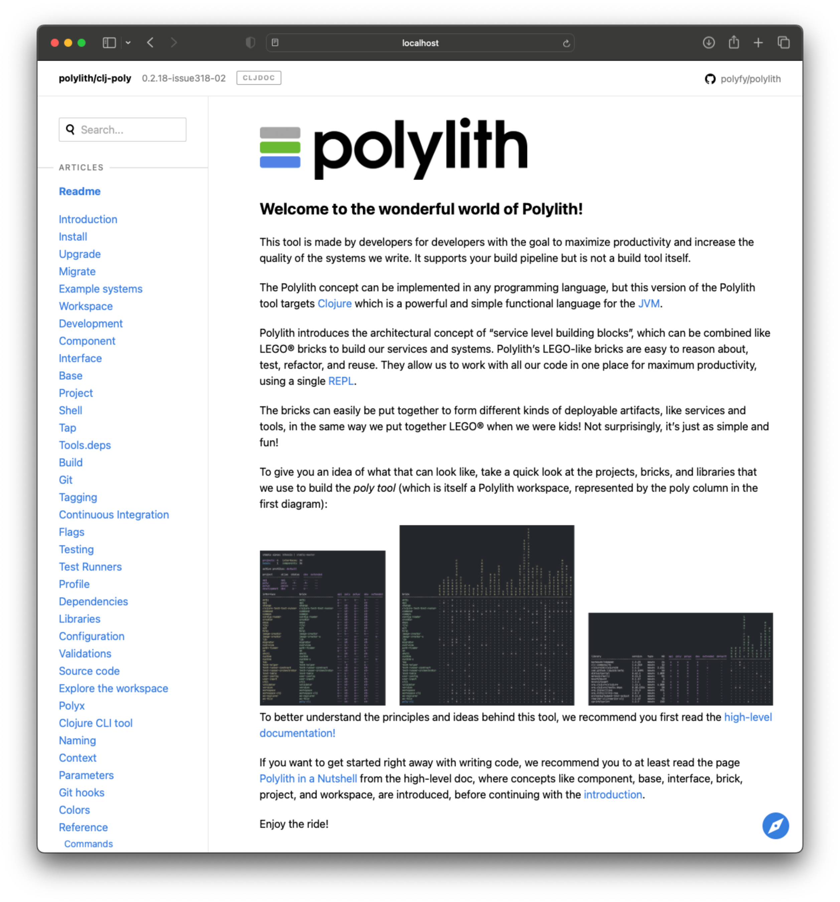
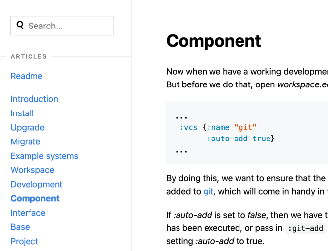

= Doc
:toc:

The poly tool comes with a xref:commands.adoc#doc[doc] command that helps us access the web based documentation, e.g.:

[source,shell]
----
poly doc
----

This opens this tool's readme file in a browser:

// Todo: explain the different parts of the page

By using the xref:commands.adoc#doc[doc] command, we can open different pages listed in the left menu by giving a page, e.g.:

[source,shell]
----
poly doc page:component
----

We can improve the user experience by starting a xref:commands.adoc#shell[shell]
and letting the tool guide us to different help pages:

[source,shell]
----
poly
----

Now we can type `doc` followed by a space, from the shell, to list the different help categories:

[source,shell]
----
example$ doc
help   more   page   ws
----

Let's dig into these.

== page

The `page` parameter is used to navigate the _poly_ tool documentation.
Notice that we have to end `page` with a `:` to list the pages:

[source,shell]
----
example$ doc page:
base                     flags                    project
build                    git-hooks                readme
clojure-cli-tool         git                      shell
colors                   install                  source-code
component                interface                tagging
configuration            introduction             tap
context                  libraries                test-runners
continuous-integration   migrate                  testing
dependencies             naming                   tools-deps
development              parameters               upgrade
example-systems          polyx                    validations
explore-the-workspace    profile                  workspace
----

This lists all the pages of the _poly_ tool documentation, and is the same as the items in the left menu.

If we select a page, it will be opened in a browser on your machine, e.g.:

[source,shell]
----
doc page:component
----

== help

The `help` parameter takes us to the xref:commands.adoc[commands] help:

[source,shell]
----
example$ doc help
----

We can list all help commands like this:

[source,shell]
----
example$ doc help:
check                deps-project         overview
create-base          deps-workspace       shell
create-component     deps                 switch-ws
create-project       diff                 tap
create-workspace     doc                  test
create               info                 ws
deps-brick           libs
deps-project-brick   migrate
----

..and select a command:

[source,shell]
----
example$ doc help:check
----

...which take us to the web based help for the xref:commands.adoc#check[check] command.
The content of this help is taken from the output of the help of that command:

[source,shell]
----
poly help check
----

== ws

The `ws` parameter takes us to the xref:workspace-structure.adoc[Workspace structure] documentation:

[source,shell]
----
example$ doc ws
----

We can list all top keys with:

[source,shell]
----
example$ doc ws:
bases          name           version
changes        old            ws-dir
components     paths          ws-local-dir
configs        projects       ws-reader
interfaces     settings       ws-type
messages       user-input
----

...and then go to the description for one of the keys, e.g.:

[source,shell]
----
example$ doc ws:configs
----

== more

The _more_ parameter stores all other documentation that is not exclusively about the _poly_ tool:

[source,shell]
----
example$ doc more:
blog-posts    python-tool   workspaces
high-level    slack
podcasts      videos
----

Let's dig into the different types of documentation.

=== blog posts

[source,shell]
----
example$ doc more:blog-posts:
a-fresh-take-on-monorepos-in-python
how-polylith-came-to-life
the-micro-monolith-architecture
the-monorepos-polylith-series
the-origin-of-complexity
----

[%autowidth]
|===
| Blog post | What | Published

| https://davidvujic.blogspot.com/2022/02/a-fresh-take-on-monorepos-in-python.html[a-fresh-take-on-monorepos-in-python] |
https://github.com/DavidVujic[David Vujic] explains what would happen if they had Polylith in the Python community. | 2022

| https://medium.com/@joakimtengstrand/the-polylith-architecture-1eec55c5ebce[how-polylith-came-to-life] |
https://github.com/tengstrand[Joakim Tengstrand] explains how the Polylith architecture came to life. | 2018

| https://medium.com/@joakimtengstrand/the-micro-monolith-architecture-d135d9cafbe[the-micro-monolith-architecture] |
https://github.com/tengstrand[Joakim Tengstrand] explains the ideas behind Micro Monolith, which is a predecessor to Polylith. | 2016

| https://corfield.org/blog/2021/04/21/deps-edn-monorepo-2/[the-monorepos-polylith-series] |
https://github.com/seancorfield[Sean Corfield] describes his experience with migrating a big production system to Polylith, in a series of blog posts. | 2021-2023

| https://itnext.io/the-origin-of-complexity-8ecb39130fc[the-origin-of-complexity] |
https://github.com/tengstrand[Joakim Tengstrand] explains the foundational concepts that Polylith is built upon. | 2019
|===

=== high-level

The high-level documentation can be accessed with:

[source,shell]
----
example$ doc more:high-level
----

We can list all pages in the left menu with:

[source,shell]
----
example$ doc more:high-level:
advantages-of-polylith      faq                         transitioning-to-polylith
base                        polylith-in-a-nutshell      videos
bring-it-all-together       production-systems          who-made-this
component                   project                     why-the-name-polylith
current-architectures       simplicity                  workspace
development-project         tool
----

.. and e.g. open the FAQ page:

[source,shell]
----
example$ doc more:high-level:faq
----

=== podcasts

[%autowidth]
|===
| Podcast | What | Published

| https://podcasts.apple.com/se/podcast/s4-e21-polylith-with-joakim-james-and-furkan-part-1/id1461500416?i=1000505948894&l=en[polylith-with-joakim-james-and-furkan:part1] |
https://github.com/jacekschae[Jacek Schae] discuss the Polylith architecture with the https://polylith.gitbook.io/polylith/conclusion/who-made-polylith[Polylith team]
where they try to explain the ideas behind Polylith. | 2021

| https://podcasts.apple.com/se/podcast/s4-e22-polylith-with-joakim-james-and-furkan-part-2/id1461500416?i=1000507542984[polylith-with-joakim-james-and-furkan:part2] |
The same people goes deeper into the Polylith concepts, the benefits of using it, and how it differs from other ways of working with code. | 2021
|===

=== python tool

David Vujic has created Polylith tools for Python, that can be accessed https://davidvujic.github.io/python-polylith-docs[here].

[source,shell]
----
example$ doc more:python-tool
----

=== slack

Reach out to the https://polylith.gitbook.io/polylith/conclusion/who-made-polylith[Polylith team]
in the https://clojurians.slack.com/archives/C013B7MQHJQ[#polylith] channel
in the clojurians workspace in Slack.

[source,shell]
----
example$ doc more:slack
----

=== videos

There are a number of videos:

[source,shell]
----
example$ doc more:videos:
a-fresh-take-on-monorepos-in-python
collaborative-learning-polylith
polylith-in-a-nutshell
polylith–a-software-architecture-based-on-lego-like-blocks
the-last-architecture-you-will-ever-need
----

[%autowidth]
|===
| Video | What | Published

| https://www.youtube.com/watch?v=HU61vjZPPfQ[a-fresh-take-on-monorepos-in-python] |
https://github.com/DavidVujic[David Vujic] explains how Polylith can be used in Python. | 2023

| https://www.youtube.com/watch?v=_tpNKAv4fro[collaborative-learning-polylith] | 2022
Sean Corfield is interviewed by the Los Angeles Clojure Users Group
about how he uses Polylith and the _poly_ tool in production at
https://polylith.gitbook.io/polylith/conclusion/production-systems#world-singles-networks[World Singles Network]. | 2022

| https://www.youtube.com/watch?v=Xz8slbpGvnk[polylith-in-a-nutshell] |
https://www.linkedin.com/in/james-trunk/[James Trunk] explains the basic concepts of the Polylith architecture | 2019
| https://www.youtube.com/watch?v=wy4LZykQBkY[polylith–a-software-architecture-based-on-lego-like-blocks] |
https://github.com/tengstrand[Joakim Tengstrand] explains how Polylith is like building with LEGO bricks,
at https://www.youtube.com/playlist?list=PLaSn8eiZ631nv68lHjZIfrSXOLIDsf726[ClojureD 2019]. | 2019
| https://www.youtube.com/watch?v=pebwHmibla4[the-last-architecture-you-will-ever-need] |
https://github.com/tengstrand[Joakim Tengstrand] and link:https://github.com/furkan3ayraktar[Furkan Bayraktar] tries to convince people why Polylith is the last architecture you will ever need! | 2020
|===

=== workspaces

Example workspaces can be listed with:

[source,shell]
----
example$ doc more:workspaces:
game-of-life
polylith
realworld
usermanager
----

[%autowidth]
|===
| Workspace | What

| https://github.com/tengstrand/game-of-life[game-of-life] |
A tiny workspace that implements Game of Life,
created by https://github.com/tengstrand[Joakim Tengstrand].

| https://github.com/polyfy/polylith[polylith] |
The Polylith workspace, from which this _poly_ tool itself is built,
created by https://github.com/tengstrand[Joakim Tengstrand] and link:https://github.com/furkan3ayraktar[Furkan Bayraktar].

| https://github.com/furkan3ayraktar/clojure-polylith-realworld-example-app/tree/master[realworld] |
A full-fledged RealWorld server, built with Clojure, Polylith,
and Ring, including CRUD operations, authentication, routing, pagination, and more.
Created by link:https://github.com/furkan3ayraktar[Furkan Bayraktar].

| https://github.com/seancorfield/usermanager-example/tree/polylith[usermanager] |
A simple web application using Component, Ring, Compojure, and Selmer connected to a local SQLite database.
Created by https://github.com/seancorfield[Sean Corfield].
|===
