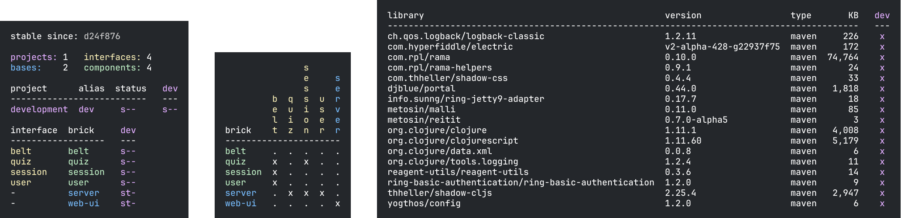

= Example Systems

If you are curious about what a full-blown system looks like in Polylith, look at the examples listed here.

TIP: The `info`, `deps`, and `libs` reports on this page were generated with xref:polyx.adoc[polyx] and its xref:commands.adoc#overview[overview] command.
We cover `polyx` and these reports later in the documentation.

== RealWorld

image:images/example-systems/realworld.png[link="images/example-systems/realworld.png"]

https://github.com/furkan3ayraktar[Furkan Bayraktar] has made a full-blown https://github.com/furkan3ayraktar/clojure-polylith-realworld-example-app[RealWorld] web application, which can be compared with https://github.com/gothinkster/realworld[implementations made in other languages].

== Usermanager

image::images/example-systems/user-manager.png[link="images/example-systems/user-manager.png"]

https://github.com/seancorfield[Sean Corfield] has made a full-blown https://github.com/seancorfield/usermanager-example/tree/polylith[usermanager] web application, which can be compared with non-Polylith systems living in other branches of the repository.

== Demo Rama Electric

https://github.com/jeans11[Jean Boudet] has made a https://github.com/jeans11/demo-rama-electric[demo web app] to show the use of Rama and Electric together.

== Game of Life

image::images/example-systems/game-of-life.png[link="images/example-systems/game-of-life.png"]

https://github.com/tengstrand[Joakim Tengstrand] has made a small Game of life https://github.com/tengstrand/game-of-life[example app] to show what a tiny Polylith system can look like.
