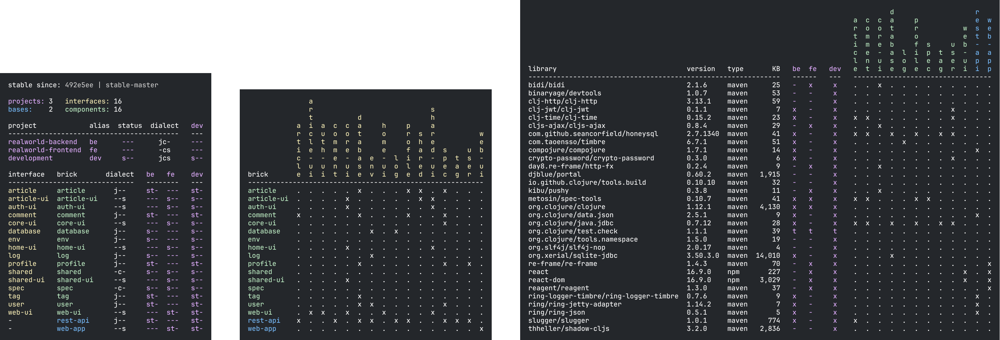

= Example systems

If you want to start by seeing how a full-blown system looks like in Polylith, then have a look at the systems listed here.

== RealWorld

https://github.com/furkan3ayraktar[Furkan Bayraktar] has made a full-blown
https://github.com/furkan3ayraktar/clojure-polylith-realworld-example-app[RealWorld] web application,
which can be compared with https://github.com/gothinkster/realworld[implementations made in other languages].

== Usermanager

image::images/example-systems/user-manager.png[link="images/example-systems/user-manager.png"]

https://github.com/seancorfield[Sean Corfield] has made a full-blown
https://github.com/seancorfield/usermanager-example/tree/polylith[usermanager] web application,
which can be compared with non-Polylith systems living in other branches of the repository.

== Polylith

image::images/example-systems/polylith.png[link="images/example-systems/polylith.png"]

The Polylith https://github.com/polyfy/polylith[codebase] itself is structured as a Polylith xref:workspace.adoc[workspace],
and yes, we are https://en.wikipedia.org/wiki/Eating_your_own_dog_food[dogfooding] and it tastes delicious 😃!

== Game of life

image::images/example-systems/game-of-life.png[link="images/example-systems/game-of-life.png"]

https://github.com/tengstrand[Joakim Tengstrand] has made a small Game of life
https://github.com/tengstrand/game-of-life[example app] to show how a tiny Polylith system could look like.
