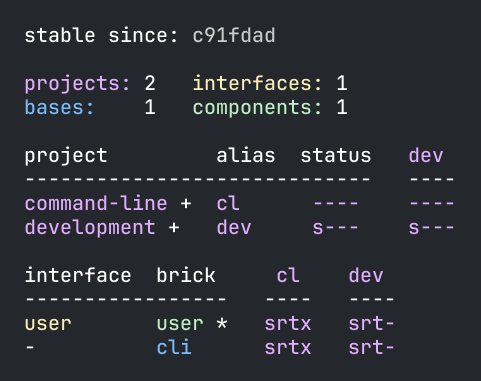

= Flags

We have one more thing to cover regarding the xref:commands.adoc#info[info] command,
and that is what the `-`, `s`, `t` and `x` flags mean:

image::images/flags/projects.png[width=350]

The status column has a different meaning:

[%autowidth]
|===
| status | Explanation

| s-- | The project has a `src` directory
| -t- | The project has a `test` directory
| --x | Run the tests for this project
|===

If the "to be tested" flag `--x` is marked for a project under the `status` column,
it means that the tests for that project will be executed from at least one project,
which often is the project itself and/or the `development` project.

Under the `status` column, the `---` means we have a `projects/command-line` directory
but no `src` or `test` directories in it and that no tests will be executed for this project.

Under the `status` column, the `s--` means we have a `development/src` directory
but no `development/test` directory and that no tests will be executed for this project.

Each flag under `dev` has a slightly different meaning, where project refers to `development`:

[%autowidth]
|===
| status | Explanation

| s-- | The `src` directory is included in the development project
| -t- | The `test` directory is included in the development project
| --x | Run the tests for this brick from the `development` project
|===

Under the `dev` column, the `---` means that neither `projects/command-line/src` or `projects/command-line/test`
is added to `./deps.edn` and that no tests in `projects/command-line/test` will be executed from the `development` project.

Under the `dev` column, the `s--` means that `development/src` is added to `./deps.edn`
but not `development/test` and that no tests in `development/test` will be executed from the `development` project.

We also have this section:

image::images/flags/bricks.png[width=300]

Here the flags have a slightly different meaning:

[%autowidth]
|===
| status | Explanation

| s-- | The brick's `src` directory is included in this project
| -t- | The brick's `test` directory is included in this project
| --x | Run the tests for this brick from this project
|===

The `st-` for the `user` component under the `dev` column tells that both
`components/user/src` and `components/user/test` are included in the `development` projects,
and that no brick tests will be executed.

The `./deps.edn` looks like this:

[source,clojure]
----
 :aliases  {:dev {:extra-paths [...
                                "components/user/src"
                                "components/user/resources"
  ...
            :test {:extra-paths ["components/user/test"
----

The `st-` for the `user` component under the `cl` column tells that `user` is included in the `command-line` project
and that `user` has both a `src` and `test` directory specified in its `deps.edn`
(probably indirectly included via a `:local/root` statement) and that no brick tests will be executed.

The bricks for the `command-line` project is configured in `projects/command-line/deps.edn`:

[source,clojure]
----
{:deps {poly/remote {:local/root "../../components/user"}
        poly/cli    {:local/root "../../bases/cli"}
----

...where the `src`, `resources`, and `test` folders for the bricks
are specified in `components/user/deps.edn` and `bases/cli/deps.edn` where both have this content:

[source,clojure]
----
{:paths ["src" "resources"]
 :deps {}
 :aliases {:test {:extra-paths ["test"]
                  :extra-deps {}}}}
----

The `st-` for the `cli` base follows the same pattern as for the `user` component but for the `bases/cli` directory.

If we execute `poly info :resources` (or the shorter `poly info :r`):

...then the resources directory is also included, where `r` stands for resources.
