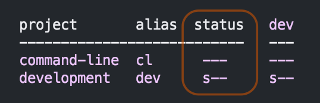
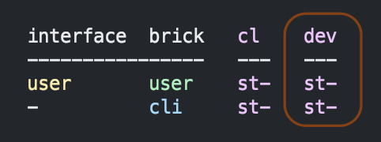

= Flags
:toc:

You've seen output from the xref:commands.adoc#info[info] command, but we haven't explained flags:

There are four possible flags:

[%autowidth]
|===
| Flag | Description

a| `s`
| Relates to source code

a| `r`
| Relates to resources xref:#r-flag[and is only shown when requested]

a| `t`
| Relates to tests

a| `x`
a| Indicates `poly` will e**x**ecute tests

|===

Fun flag facts:

* Flags are booleans, `poly` shows:
** the flag when `true`.
** the `-` (dash) character when `false`.
* Flags always appear in order: `srtx`.
* The `r` flag isn't included by default.
* The specific meaning of a flag depends on where it appears.

We'll cover the `x` flag in more detail when we get to xref:testing.adoc[Testing].

NOTE: For the sake of simplicity, we'll describe the presence of sources as a single `src` directory and the presence of tests as a single `test` directory.
In reality, projects and bricks can choose to have multiple or different source and test paths.

== Project Flags

From our example above:

image::images/flags/projects.png[width=299]

The `info` command outputs a table summarizing xref:project.adoc[projects].
There is one row for each project and a `status` and `dev` column for flags.

=== Projects `status` Column Flags

[%autowidth]
|===
| Flag | Description

a| `s`
a| The project has a `src` directory.
a| `t`
a| The project has a `test` directory.
a| `x`
a| The `poly test` command will run tests for this project

|===

From our example above:

The `status` flags `---` for `command-line` means `poly` sees:

. a `./projects/command-line` directory
. no `./projects/command-line/src` directory
. no `./projects/command-line/test` directory
. no reason to run tests for this project

The `status` flags `s--` for `development` means `poly` sees:

. a `./development/src` directory
. no `./development/test` directory
. no reasons to run tests for this project

=== Projects `dev` Column Flags

[%autowidth]
|===
| Flag | Description

a| `s`
a| The `src` directory of the project is referenced by the `development` project

a| `t`
a| The `test` directory of the project is referenced by the `development` project

a| `x`
a| The `poly test` command will run tests for the project from the `development` project

|===

From our example above:

The `dev` flags `---` for `command-line` means `poly` sees:

. `./projects/command-line/src` isn't referenced in `./deps.edn`
. `./projects/command-line/test` isn't referenced in `./deps.edn`
. no reason to run tests for the `command-line` project from the `development` project

The `dev` flags `s---` for `development` means `poly` sees:

. `./development/src` is referenced in `./deps.edn`
. `./development/test` isn't referenced in `./deps.edn`
. no reason to run tests for the `development` project

[TIP]
====
You might wonder about the `development` row intersecting with the `dev` column:

. Isn't that talking about the `development` project referencing the `development` project?
Yes.
. So wouldn't `status` be the same as `dev` for the `development` row? Also, yes.
====

TIP: The `development` project exists to support development.
It would be unusual for it to have tests of its own.

== Brick Flags

From our example above:

image::images/flags/bricks.png[width=299]

The `info` command outputs a table summarizing bricks (xref:component.adoc[components] and xref:base.adoc[bases]).
There is one row for each brick and one column for each xref:project.adoc[project].
You'll see one column for each deployable project and a `dev` column for the `development` project.
Our `example` workspace only has the `command-line` deployable project, xref:project.adoc#project-alias[which you'll remember you aliased as cl].

[%autowidth]
|===
| Flag | Description

a| `s`
a| The brick's `src` directory is referenced by the project in this column

a| `t`
a| The brick's `test` directory is referenced by the project in this column

a| `x`
a| The `poly test` command will run tests for this brick from the project in this column

|===

=== Bricks Deployable Projects Columns

From our example above:

We have a single deployable `command-line` project aliased as `cl`.

The `cl` flags `st-` for the `user` component means `poly` sees:

. the `command-line` project references the `user` component, and the `user` component has:
.. a `src` directory specified in its `deps.edn`
.. a `test` directory specified in its `deps.edn`
. no reason to run tests for the `user` component for the `command-line` project

The `cl` flags `st-` for the `cli` base follow the same pattern.

****
A reminder of relevant `projects/command-line/deps.edn` configuration:

[source,clojure]
----
{:deps {poly/remote {:local/root "../../components/user"}
        poly/cli    {:local/root "../../bases/cli"}
----

And, in turn, the relevant `components/user/deps.edn` and `bases/cli/deps.edn` configuration:

[source,clojure]
----
{:paths ["src" "resources"]
 :deps {}
 :aliases {:test {:extra-paths ["test"]
                  :extra-deps {}}}}
----
****

=== Bricks `dev` Project Column

From our example above:

The `dev` flags `st-` for the `user` component means `poly` sees:

. `./components/user/src` is referenced by the `development` project
. `./components/user/test` is referenced by the `development` project
. no reason to run tests for this brick for this project

****
To remind you of how `src` and `test` are referenced, the relevant portion of our `./deps.edn`:

[source,clojure]
----
 :aliases  {:dev {:extra-deps {poly/user {:local/root "components/user"} ;; <1>
  ...
            :test {:extra-paths ["components/user/test" ;; <2>
----
<1> Development project referencing user component src via `:local/root` dep
<2> Development project referencing user component test via `:extra-paths`
****

[[r-flag]]
== The optional `r` flag

If you execute `poly info :resources` (or the shorter `poly info :r`):

Notice that `poly` has included the `r` (resources) flag.

