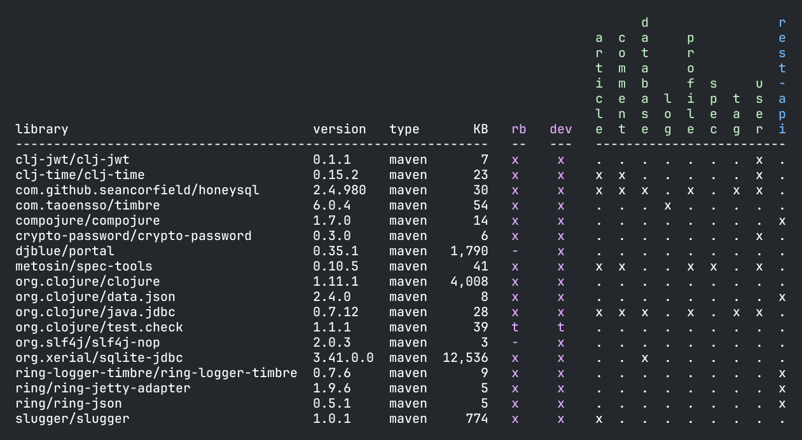
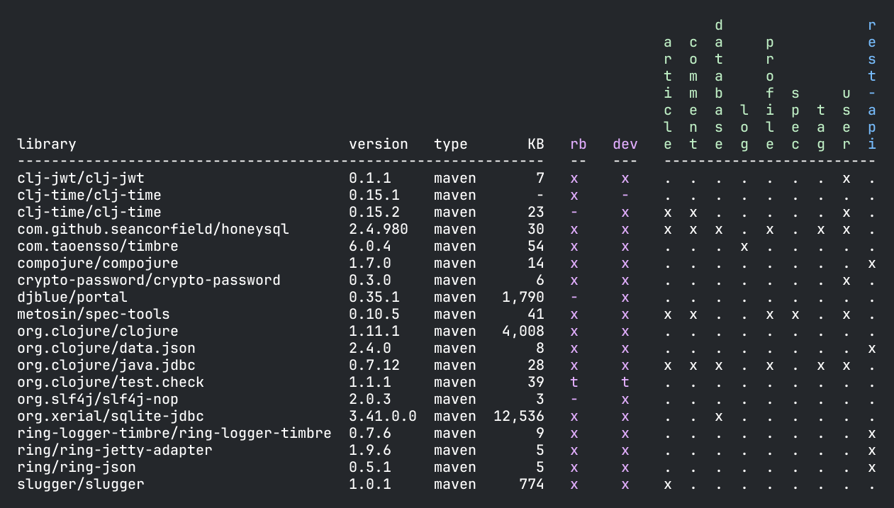

= Libraries

Libraries are specified in `deps.edn` for each component, base, and project:

[%autowidth]
|===
| Entity | Scope | Location

| Components | src | `components/COMPONENT-DIR > deps.edn > :deps`
| | test | `components/COMPONENT-DIR > deps.edn > :aliases > :test > :extra-deps`
| Bases | src | `bases/BASE-DIR > deps.edn > :deps`
| | test | `bases/BASE-DIR > deps.edn > :aliases > :test > :extra-deps`
| Dev project | src | `./deps.edn > :aliases > :dev > :extra-deps`
| | test | `./deps.edn > :aliases > :test > :extra-deps`
| Other projects | src | `projects/PROJECT-DIR > deps.edn > :deps`
| | test | `projects/PROJECT-DIR > deps.edn > :deps`
|===

The `poly` tool parses each `deps.edn` file and looks for library dependencies, which are then used by the xref:commands.adoc#libs[libs] and xref:commands.adoc#test[test] commands.

[source,shell]
----
poly libs
----

An  `x` means that the library is added to the `src` context, while `t` means that it's only used from the `test` context.

We can list the outdated libraries by passing in `:outdated`:

[source,shell]
----
poly libs :outdated
----

image::images/libraries/libs-outdated.png[]

{nbsp} +

[#update]
We can also tell the tool to update all libraries to the latest version, in all `deps.edn` files for all bricks and projects:

[source,shell]
----
poly libs :update
----

We can ignore updating libraries for a brick or project by adding the `:keep-lib-versions` in `workspace.edn`:

[source,clojure]
----
{...
 :bricks {"article" {:keep-lib-versions [djblue/portal]}}}
 :projects {"realworld-backend" {:alias "rb"
                                 :keep-lib-versions [clj-jwt/clj-jwt clj-time/clj-time]}
----

Libraries can be specified in three different ways in tools.deps:

[%autowidth]
|===
| Type | Description

| Maven | As a Maven dependency.
Example: `clj-time/clj-time {:mvn/version "0.15.2"}` where the key is the Maven `groupId/artifactId`.
Those dependencies are stored locally in the `~/.m2/repositories` directory (but can be changed in `~/.config/polylith/config.edn`, property `m2-dir`).
| Local | As a local dependency.
Example: `clj-time {:local/root "/local-libs/clj-time-0.15.2.jar"}` where the key is an arbitrary identifier.
A local dependency is a path to a locally stored file.
| Git | As a Git dependency.
Example: `clj-time/clj-time {:git/url "https://github.com/clj-time/clj-time.git",
:sha "d9ed4e46c6b42271af69daa1d07a6da2df455fab"}`
where the key must match the path for the library in `~/.gitlibs/libs` (to be able to calculate the KB column).
|===

The `KB` column shows the size of each library in kilobytes.
If you get the key path wrong or if the library hasn't been downloaded yet, then it will appear as `-`.
One way to solve this is to force dependencies to be downloaded by executing something like this from the workspace root:

[source,shell]
----
clojure -A:dev:test -P
----

In the tools.deps CLI tool, when a dependency is included using `:local/root`, only `:src` dependencies will be inherited while the `:test` dependencies will be ignored.
The `poly` tool builds upon tools.deps but has its own xref:test-runners.adoc[test runner] that is accessed via the xref:commands.adoc#test[test] command.
A difference between tools.deps CLI and the `poly` tool is that the latter also inherits dependencies from the test context.

If you want to run the tests directly from a project using the tools.deps CLI tool, then you also have to duplicate test dependencies from the bricks to the project's `deps.edn` file under `:aliases > :test > :extra-deps`.
As long as you run the tests with the built-in xref:commands.adoc#test[test] command you don't have to worry about this.

==== Brick libraries

The brick columns are marked with an `x` if the library is used by the `src` code and with a `t` if it's only used by the `test` code.

==== Project libraries

The project columns are marked with an `x` if the library is used by the `src` code and with a `t` if it's only used by the `test` code.

The dependencies for a project are the sum of all dependencies that are indirectly included via its bricks, together with dependencies declared by the project itself.
If different versions of the same dependency exist, then the latest version will be used for the project.

An exception is if a dependency is overridden with `:override-deps` in a project's `deps.edn` file, e.g. `projects/realworld-backend/deps.edn`:

[source,clojure]
----
{...
 :deps {poly/article  {:local/root "../../components/article"}
        poly/comment  {:local/root "../../components/comment"}
        poly/database {:local/root "../../components/database"}
        ...

 :override-deps {clj-time/clj-time {:mvn/version "0.15.1"}}
 ...
}
----

If we now run the libs command:

...we will have two versions of `clj-time` where the `realworld-backend` project uses `0.15.1` and the components use `0.15.2`.

Here are all the places where libraries can be overridden:

[%autowidth]
|===
| Entity | Scope | Location

| Development project | src | `./deps.edn > :aliases > :dev > :override-deps`
|  | test | `./deps.edn > :aliases > :test > :override-deps`
| Other projects | src | `projects/PROJECT-DIR > deps.edn > :override-deps`
|  | test | `projects/PROJECT-DIR > deps.edn > :aliases > :test > :override-deps`
|===

If a library is overridden in the `src` scope it will also affect the `test` scope.
If a library is overridden in the `test` scope it will only affect the `test` scope.

=== Compact view
[#compact-view]

If we have a lot of libraries, we can choose a more compact format by setting `:compact-views` to `#{"libs"}` in `./workspace.edn` or by passing in `:compact`:

[source,shell]
----
poly libs :compact
----

image::images/libraries/libs-compact.png[]
