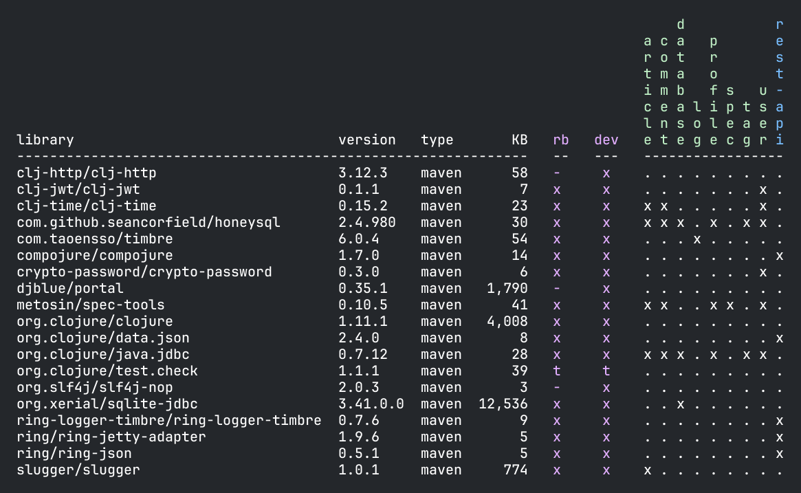
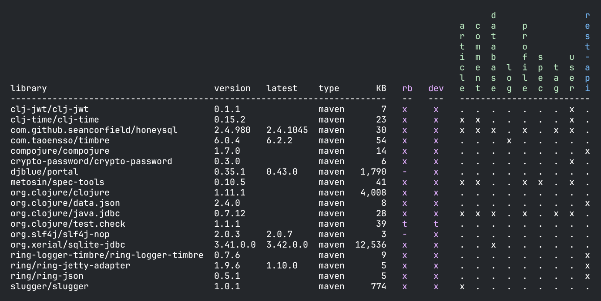
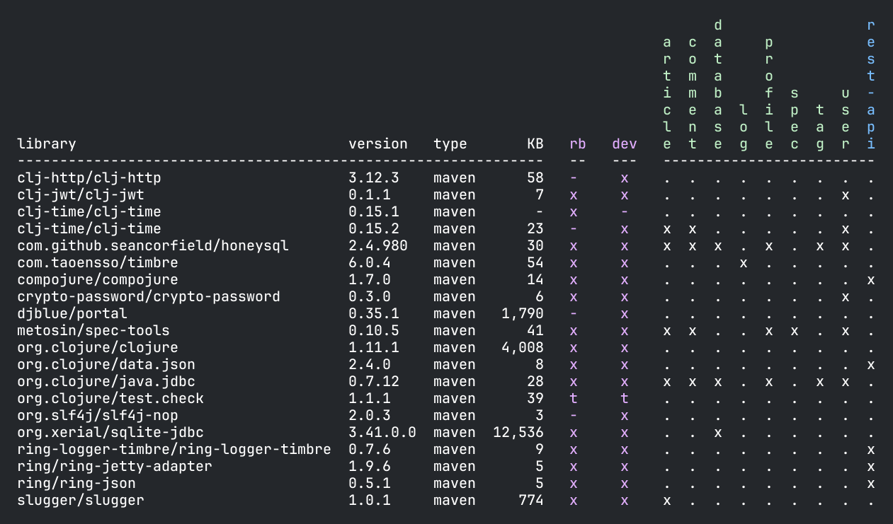

= Libraries
:toc:

When we talk about `poly` libraries, we refer to 3rd-party library dependencies used by xref:component.adoc[components], xref:base.adoc[bases], and xref:project.adoc[projects].
For `poly` brick dependencies, see xref:dependencies.adoc[Dependencies].

The `poly` tool parses `deps.edn` files throughout your workspace to resolve 3rd-party library dependencies, which it uses for the xref:commands.adoc#libs[libs] and xref:commands.adoc#test[test] commands.

== Tutorial Setup

We explored xref:dependencies.adoc#setup[brick dependencies using the Realworld example app]; we'll continue with the same workspace to explore `libraries`.

[[reporting]]
== Reporting

Ask `poly` to report on 3rd-party libraries:

[source,shell]
----
poly libs
----

Notice that `poly` has reported on library usage across all:

* xref:project.adoc[projects] in purple - `rb` is the alias for the `realworld-backend` project, and `dev` is the alias for the `development` project.
The dependencies for a project also include the dependencies for its bricks.
If different versions of a library are referenced, `poly` will use the latest version of that library.
* xref:component.adoc[components] in green
* xref:base.adoc[bases] in blue

An `x` means that the library is used from the `src` context, and `t` means that it's only used from the `test` context.

The `type` column describes where the library is hosted. See <<lib-dep-types>>.

The `KB` column shows the size of each library in kilobytes.
A `-` means `poly` could not calculate the library size because either:

* the library has not been downloaded yet
* its xref:#key-path[key path is wrong]

****
One way to force libraries to download is to run the following from your workspace root:

[source,shell]
----
clojure -A:dev:test -P
----
****

[#compact-view]
If your workspace has many bricks, you may prefer a more compact report format.
You can either set `:compact-views` to `#{"libs"}` in your xref:workspace.adoc#workspace.edn [workspace.edn] or specify the `:compact` argument:

[source,shell]
----
poly libs :compact
----

== Updating

You can list outdated libraries:

[source,shell]
----
poly libs :outdated
----

Your output will differ.
Here's an example output where some libraries were out of date:

[#update]
You can ask `poly` to update all libraries to the `latest` version in all `deps.edn` for all bricks and projects via:

[source,shell]
----
poly libs :update
----

To update specific `libraries:`

[source,shell]
----
poly libs :update libraries:djblue/portal:com.taoensso/timbre
----

TIP: When using the xref:shell.adoc[shell], `poly` will, after a short pause, offer autocomplete suggestions for `libraries`!

[[keep-lib-versions]]
To skip updating specific libraries, specify `:keep-lib-versions` in your brick and project config files, e.g.:

../components/article/config.edn
[source,clojure]
----
{:keep-lib-versions [djblue/portal]}
----

../projects/realworld-backend/config.edn
[source,clojure]
----
{:alias "rb"
 :keep-lib-versions [clj-jwt/clj-jwt clj-time/clj-time]}
----

[[lib-dep-types]]
== Library Dependency Types
You can specify libraries in three ways in xref:tools-deps.adoc[tools.deps] `deps.edn` files:

[%autowidth]
|===
| Type | Description

| Maven
a| As a Maven dependency, e.g.:
[source,clojure]
----
clj-time/clj-time {:mvn/version "0.15.2"}
----
The key is the Maven `groupId/artifactId`.
Maven artifacts are stored by default under `~/.m2/repositories/` (xref:configuration.adoc#user[configured] via `:m2-dir`).

| Local
a| As a local dependency, e.g.:
[source,clojure]
----
clj-time {:local/root "/local-libs/clj-time-0.15.2.jar"}
----
The key is an arbitrary identifier.
A local dependency is a path to a local jar file or directory.

See also: <<local-deps>>.

| Git
a| As a Git dependency, e.g.:
[source,clojure]
----
clj-time/clj-time {:git/url "https://github.com/clj-time/clj-time.git",
                   :sha "d9ed4e46c6b42271af69daa1d07a6da2df455fab"}
----
[[key-path]]
The `poly` tool will calculate the `KB` column for a Git dependency, only if the key path matches the path for the libary under `~/.gitlibs/libs` (the Git owner and repo from the `:git/url`).
|===

== Configuration

3rd-party library dependencies are specified in `deps.edn` for each component, base, and project:

[%autowidth]
|===
| Entity | File | Scope | Location in File

.2+| Components
.2+| [nowrap]`components/_COMPONENT-DIR_/deps.edn`
| src
| `:deps`
| test
| [nowrap]`:aliases > :test > :extra-deps`

.2+| Bases
.2+| [nowrap]`bases/_BASE-DIR_/deps.edn`
| src
| `:deps`
| test
| [nowrap]`:aliases > :test > :extra-deps`

.2+| Deployable projects
.2+| [nowrap]`projects/_PROJECT-DIR_/deps.edn`
| src
| `:deps`
| test
| [nowrap]`:aliases > :test > :extra-deps`

.2+| Development project
.2+| `./deps.edn`
| src
| [nowrap]`:aliases > :dev > :extra-deps`
| test
| [nowrap]`:aliases > :test > :extra-deps`

|===

[[local-deps]]
=== Local Dependencies

==== Distinguishing from Bricks
You'll remember that you also specify bricks and projects as `:local/root` dependencies.
The `poly` tool distinguishes brick dependencies from local 3rd-party library dependencies by their paths.
The `poly` tool understands that when a `:local/root` path starts with:

* `../../bases/` or `../../components/` for deployable projects
* or `bases/` or `components/` for the development project

that it is a `poly` brick xref:depencencies.adoc[dependency]; otherwise, it is considered a 3rd-party library dependency.

==== Differences from Tools.deps

When using the xref:tools-deps.adoc[tools.deps] CLI (i.e. `clojure` or `clj`), `:local/root` dependencies only inherit `:src` dependencies; `:test` dependencies are ignored.
The `poly` tool builds upon tools.deps but has its own xref:test-runners.adoc[test runner] that it invokes for the xref:commands.adoc#test[test] command.
Unlike the tools.deps CLI, the `poly` also inherits dependencies from the test context for `:local/root` dependencies.

If you want to run your tests directly from a project using the tools.deps CLI tool, you must duplicate test library dependencies from the bricks to the project's `deps.edn` file under `:aliases > :test > :extra-deps`.
If you only run tests with the built-in xref:commands.adoc#test[test] command, you don't have to worry about this.

=== Project Library Dependencies

The library dependencies for a project are the sum of all library dependencies that are indirectly included via its bricks, together with dependencies declared by the project itself.
If different versions of the same library dependency exist, then `poly` will use the latest version.

You can override the library version used for a project in its `deps.edn` file.
For example:

../projects/realworld-backend/deps.edn
[source,clojure]
----
{...
 :deps {poly/article  {:local/root "../../components/article"}
        poly/comment  {:local/root "../../components/comment"}
        poly/database {:local/root "../../components/database"}
        ...

 :override-deps {clj-time/clj-time {:mvn/version "0.15.1"}} ;; <1>
 ...
}
----
<1> Override version of `clj-time/clj-time` for this project

If you re-run the libs command:

Notice that two versions of `clj-time` are listed and that the `realworld-backend` project now uses version `0.15.1`.

You can override project library dependencies for xref:project.adoc[projects] via `:override-deps` in the following places:

[%autowidth]
|===
| Entity | File | Scope | Location in File

.2+| Deployable projects
.2+|[nowrap]`projects/_PROJECT-DIR_/deps.edn`
| src
| `:override-deps`
| test
| [nowrap]`:aliases > :test > :override-deps`

.2+| Development project
.2+| `./deps.edn`
| src
| [nowrap]`:aliases > :dev > :override-deps`
| test
| [nowrap]`:aliases > :test > :override-deps`

|===

Overriding a library in the `src` scope will also affect the `test` scope.
If you override a library in the `test` scope, it will only affect the `test` scope.

