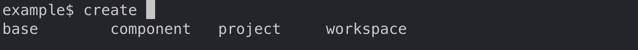

= Parameters

There are a few parameters that are either rarely used or added to simplify maintenance work with the Polylith codebase.
For these reasons, they are not suggested by the autocomplete when in a shell.
What most of them have in common is that they are used to control the output of the different _poly_ commands.

The internal help for these parameters can be access by executing `poly help`.

=== all

We can pass in _:all_  when starting a shell:

[source,shell]
----
poly :all
----

This will give us access to all available parameters, even those that are rarely used (which are often just in the way)
and parameters that only make sense when developing the _poly_ tool itself.
For example, _workspace_ will be available when using the _create_ command.

The reason it's not included by default is that we seldom want to create another workspace within the current workspace:

Examples of other parameters that will also be available for some commands:
_changed-files_, _color-mode_, _:compact_, _:no-changes_, _out_, _skip_, _+_.

=== changed-files

This parameter is used to fake changes of files, and is used for testing purposes when developing the _poly_ tool itself, e.g:

[source,shell]
----
poly info changed-files:components/file/polylith/clj/core/user_input/core.clj
----

More than one file can be marked as changed by separating them with colons (the autocomplete only works for the first file at the moment).

it's enough to include the brick or project name plus a slash, and the tool will treat the brick/project as changed, e.g.:

[source,shell]
----
poly info changed-files:bases/mybase/:components/mycomponent/:projects/myproject/
----

=== commit

This parameter is only suggested if we are outside a git repository.
The _:auto-add_ parameter in the _:vcs_ section in _workspace.edn_,
can be set to true to automatically add files to git when executing the _create_ command (we normally want to set it to _false_).
If set to _false_, we can pass in _:commit_ to get the same effect, e.g.:

[source,shell]
----
poly create component name:mycomp :commit
----

=== fake-sha

This parameter can be passed in to fake a _sha_ when executing the _info_ command,
which is used when taking screenshots for this documentation.

[source,shell]
----
poly info fake-sha:c91fdad
----

=== fake-tag

This parameter can be passed in to fake a _tag_ when executing the _info_ command,
which sometimes is used when taking screenshots for this documentation, e.g.:

[source,shell]
----
poly info fake-tag:stable-lisa
----

The tag can be removed with:

[source,shell]
----
poly info fake-tag:
----

=== fake-poly

This parameter is used to fake that we are running the _poly_ tool,
when we actually run the _polyx_ tool. Only used by the help command:

[source,shell]
----
poly help :fake-poly
----

=== latest-sha

This parameter is used to tell the tool to fetch the latest sha from the git repo (otherwise it's not populated), e.g.:

[source,shell]
----
poly ws get:settings:vcs:polylith:latest-sha :latest-sha
----

=== no-changes

This parameter can be used to fake that no changes have been made since the last stable point in time,
and can be used when taking a screenshot of the _info_ command without getting the * characters.

* `poly diff :no-changes` Returns no rows.
* `poly info :no-changes` Gets rid of the * characters.

Has the same effect as:

[source,shell]
----
poly info changed-files:
----

=== no-exit

When the _poly_ command is executed, it exits with _System/exit_ internally, see poly-cli.
If executing the _poly_ tool from a REPL, this will also exit the REPL.
To avoid that, we can pass in
https://github.com/polyfy/polylith/blob/9053b190d5f3b0680ac4fe5c5f1851f7c0d40830/bases/poly-cli/src/polylith/clj/core/poly_cli/core.clj#L31-L32[:no-exit].

If we execute `poly info :no-exit` we have to press _Ctrl+C_ to exit, which is not so useful!

=== replace

This parameter is used to manipulate the output from the xref:commands.adoc#ws[ws] command.
When we execute `poly ws get:settings:user-home` it will return something like "/Users/joakimtengstrand".
We can tell the _ws_ command to search for strings (using regular expressions) and replace the occurrences with another string,
e.g. (assumes that $HOME is set):

* `poly ws get:settings:user-home replace:$HOME:MY-HOME` Outputs: "MY-HOME".

* `poly ws get:settings:user-config-filename replace:$HOME:MY-HOME` Outputs: "MY-HOME/.polylith/config.edn".

* `poly ws get:settings:user-config-filename replace:$HOME:MY-HOME:config.edn:USER-CONFIG` Outputs: "MY-HOME/.polylith/USER-CONFIG".

* `poly ws get:settings:vcs:stable-since:sha replace:"[0-9]+":"*"` Outputs "*e*d*b*cee*fb*e*ff*fafcf".
Here we need to surround the regular expressions with "" for the terminal to ignore the special characters.
