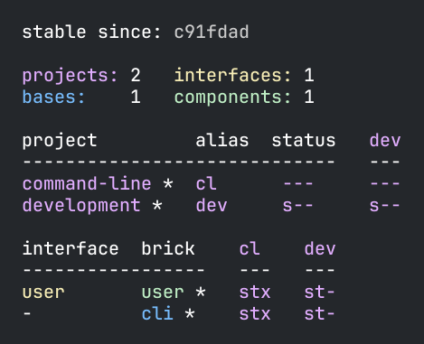
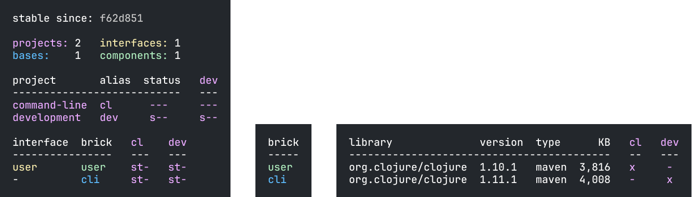

= Polyx

Since version 0.2.18, we have the new _polyx_ tool which can do everything that _poly_ can,
plus create images from different commands.
One more difference is that it's not released as an AOT compiled, stand-alone tool, as _poly_ is.

If we want to use _polyx_, then we need to add it as an alias to _./deps.edn_:

[source,clojure]
----
:polyx {:main-opts ["-m" "polylith.clj.core.poly-cli.core"]
        :extra-deps {polyfy/polylith
                     {:git/url   "https://github.com/polyfy/polylith"
                      :sha       "155b55ab9e51ecd5ee0622a82a87468dac00bba3"
                      :deps/root "projects/polyx"}}}}}
----

Now let's start a shell, using the _polyx_ tool, by executing this from the workspace root:

[source,shell]
----
clojure -M:polyx
----

Let's create an image by running the xref:commands.adoc#info[info] command
(xref:commands.adoc#[deps] and xref:commands.adoc#libs[libs] are also supported):

[source,shell]
----
example$ info out:info.png
----

This will create the _info.png_ image containing the output from the info command.
If the file ends with any of the file formats listed
https://clojure2d.github.io/clojure2d/docs/codox/clojure2d.core.html#var-img-writer-formats[here]
then an image will be created in the specified format, but if it ends with _.txt_ then a text file is created:

[source,shell]
----
poly info out:info.txt
----

[source,shell]
----
  stable since: c91fdad

  projects: 2   interfaces: 1
  bases:    1   components: 1

  project         alias  status   dev
  -----------------------------   ---
  command-line *  cl      ---     ---
  development *   dev     s--     s--

  interface  brick    cl    dev
  -----------------   ---   ---
  user       user *   stx   st-
  -          cli *    stx   st-
----

This can be "printed" by executing `cat info.txt`:

The colors can be removed if we want:

[source,shell]
----
poly info out:info.txt color-mode:none
----

[source,shell]
----
  stable since: c91fdad

  projects: 2   interfaces: 1
  bases:    1   components: 1

  project         alias  status   dev
  -----------------------------   ---
  command-line *  cl      ---     ---
  development *   dev     s--     s--

  interface  brick    cl    dev
  -----------------   ---   ---
  user       user *   stx   st-
  -          cli *    stx   st-
----

The _polyx_ tool also includes the new xref:commands.adoc#overview[overview] command:

[source,shell]
----
example$ overview out:overview.png :no-changes
----

The generated image looks like this:

This image can be used in our documentation to get an overview of the workspace.

====
NOTE: There are issues reported for Apple silicon when using
https://en.wikipedia.org/wiki/Abstract_Window_Toolkit[Java AWT]
(used by the underlying https://github.com/Clojure2D/clojure2d[clojure2d] library)
which is one of the reasons we don't include support for creating images in the _poly_ tool.
Another source of trouble may be that _polyx_ starts a Java process: +
image:images/polyx/java.png[]
====

[Caution]
====
CAUTION: The polyx tool may be converted to a custom command in the future, when we have support for that,
and when that happens the polyx project will be deleted.
This means that image creation may be configured in a different way in the future.
====
