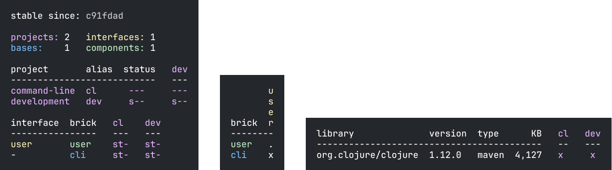

= Polyx
:toc:
:toclevels: 3

The `polyx` tool is the same as `poly` with one extra trick: it can output images for some commands.

[CAUTION]
====
The features and interface of this tool are subject to change.
A future release may expose its functionality in some different way.
====

[NOTE]
====
We created the `polyx` tool separate from `poly` because:

.  There have been reports of issues with Apple Silicon when using https://en.wikipedia.org/wiki/Abstract_Window_Toolkit[Java AWT] used by the underlying https://github.com/Clojure2D/clojure2d[Clojure2d] library used by `polyx` to output images.
.  Java AWT starts a Java process:
+
image:images/polyx/java.png[] +
+
which is not ideal for a command line tool.
====

== Install via `:polyx` alias
Unlike `poly`, we have no AOT-compiled `polyx` jar for you to download.
If you want to use `polyx`, add it as an alias to your `./deps.edn` file:

[source,clojure]
----
:polyx {:main-opts ["-m" "polylith.clj.core.poly-cli.core"]
        :extra-deps {polyfy/polylith
                     {:git/url   "https://github.com/polyfy/polylith"
                      :sha       "9e79264981b0c5be6e6cb70c93a540a82c489510" ;; <1>
                      :deps/root "projects/polyx"}}}}}
----
<1> Choose the revision via a Git SHA

=== Finding your Git SHA

==== Stable

For the `sha` of the latest stable release, navigate to https://github.com/polyfy/polylith/releases/latest (versions will differ from images below, but the page layout should be the same):

. click on the tag: +

. click on commits: +

. and finally copy the full sha: +

==== SNAPSHOT

For the latest `SNAPSHOT` release, navigate to https://github.com/polyfy/polylith:

. click on commits (as above)
. and copy the full sha (as above)

==== From Command Line

Or, if you prefer the command line, this should give you the data you need:
[source,shell]
----
git ls-remote --tags --refs --sort=-version:refname \
    https://github.com/polyfy/polylith.git
----

== Using

Start a xref:shell.adoc[shell] from the `example` workspace root dir:

[source,shell]
----
clojure -M:polyx
----

The `polyx` tool can create output images for xref:commands.adoc#info[info], xref:commands.adoc#deps[deps] and xref:commands.adoc#libs[libs] commands.
Let's create an output image from `info`:

[source,shell]
----
example$ info out:info.png
----

NOTE: The `polyx` tool always uses a dark-themed terminal style for image output.

Most people typically create `.png` images, but you can choose https://clojure2d.github.io/clojure2d/docs/codox/clojure2d.core.html#var-img-writer-formats[any image format Clojure2d supports].

If you choose any other filename extension, e.g., `.txt`, `polyx` will output text:

[source,shell]
----
example$ poly info out:info.txt
----

The output contains ANSI escape codes to colorize the text.
If you `cat info.txt` you'll see colorful output:

ANSI escape codes are not appropriate for some usages.
Specify `color-mode:none` for plaintext output:

[source,shell]
----
example$ info out:info.txt color-mode:none
----

[source,shell]
----
  stable since: c91fdad

  projects: 2   interfaces: 1
  bases:    1   components: 1

  project         alias  status   dev
  -----------------------------   ---
  command-line *  cl      ---     ---
  development *   dev     s--     s--

  interface  brick    cl    dev
  -----------------   ---   ---
  user       user *   stx   st-
  -          cli *    stx   st-
----

=== The `overview` Command

The `polyx` tool includes an xref:commands.adoc#overview[overview] command:

[source,shell]
----
example$ overview out:overview.png :no-changes
----

Generates:

For some real world examples of overview images see xref:example-systems.adoc[Example Systems] and xref:production-systems.adoc[Production Systems].

