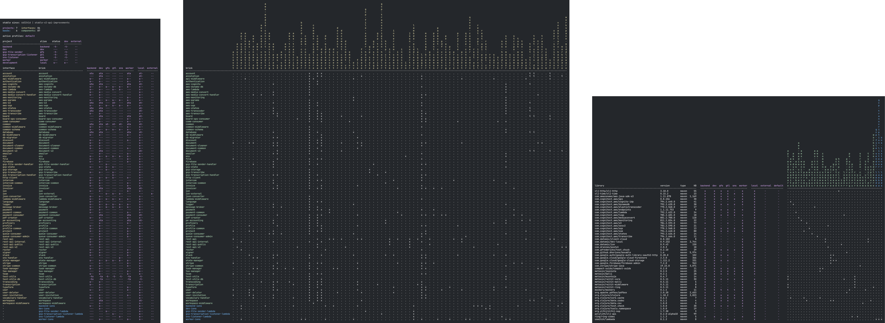
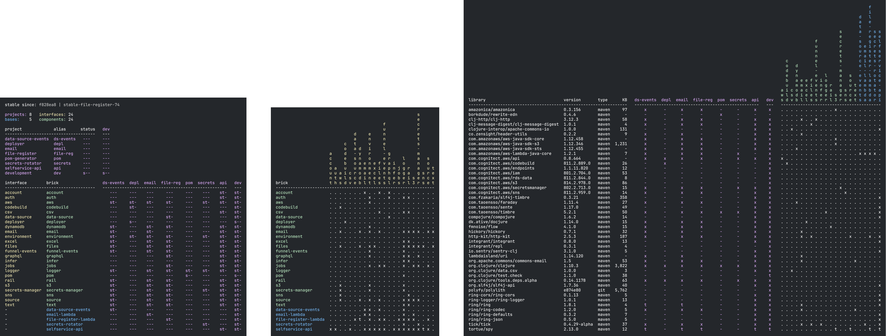

= Production systems

Here we list some of the companies that use Polylith in production.

== Scrintal

http://scrintal.com[Scrintal's] first commit dates back to April 2019 and the workspace has used Polylith since day one.
Polylith enabled us to experiment fast locally and ship features easily.
The complete buy-in to Polylith paid off when we started pivoting our product at the end of 2020,
as even though we are changing it to a completely new product,
most bricks can be shared and reused across all our products.

== Funnel

https://funnel.io/[Funnel] helps companies collect, prepare and analyze all their marketing data with ease.
The company was founded in 2014, has 1000+ customers, and integrates with 500+ marketing apps and platforms.
The tech stack differs from team to team. Python, Typescript, Rust, and Clojure are all languages in use.
The Clojure adopters chose Polylith in order to get a smooth development experience and to be able to
separate how services are deployed and run from how functionality is developed and re-used.

== World Singles Networks

image::images/production-systems/world-singles-networks.png[link="images/production-systems/world-singles-networks.png"]

Connecting hearts all over the world.

https://worldsinglesnetworks.com[World Singles Networks] have helped make 4.9 million human connections,
on more than 100 web properties, in every country on the planet.
The entire back end of our online dating platform is built with Clojure and we've been using it in production for over a decade.

Our migration to Polylith started in April, 2021 and completed in December, 2022.
Our codebase is 136K lines of Clojure. Polylith has enabled us to increase modularity, reduce coupling, improve testability,
and focus more on the importance of naming -- making it easier to find existing code and to decide where new code should live.

The concept of "swappable implementations" for component interfaces has allowed us to
more easily share code between a variety of applications that need to run in difference contexts,
such as running without a database, or on older JVMs.

== Polylith

image::images/example-systems/polylith.png[link="images/example-systems/polylith.png"]

The https://github.com/polyfy/polylith[polylith] codebase itself is structured as a Polylith workspace.
The initial commit was made in June 9, 2019. The Polylith way of working gives us a range of benefits,
such as decoupled building blocks that are easy to find,
understand, change, and reuse. They are then combined into the `poly` and `polyx` command line tools,
and the `clj-poly` library.

== How to be added

Feel free to contact us if you can't find your company here!

To be added, create an overview image with  the xref:polyx.adoc[polyx] command (from the workspace root):

[source,shell]
----
clojure -M:polyx overview out:yourcompanyname.png :no-changes
----

...or export the workspace to a file:

[source,shell]
----
clojure -M:poly ws out:yourcompanyname.edn :no-changes
----

Then email the file to joakim.tengstrand(at)gmail.com along with a brief description of your experience with Polylith and a link to the company.
