= Profile

When working with a Polylith system, we want to keep everything as simple as possible and maximize our productivity.
The Lego-like way of organising code into bricks, helps us with both of these goals.

One problem we normally have when developing software without using Polylith,
is that the production environment and the development environment has a 1:1 relationship.
This happens because we use the production codebase for development, so if we create a new service in production,
it will automatically "turn up" in the development project.

In Polylith we avoid this problem by separating the development project from production.
Thanks to components, we can create any project we want by putting the bricks we need into one place.
This allows us to optimize the development environment for productivity while in production,
we can focus on fulfilling non-functional requirements like performance or uptime.

Right now, our _development_ project mirrors the _command-line_ project:

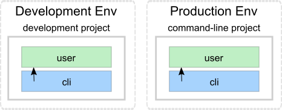

Let's pretend we get performance problems in the _user_ component and that we think distributing the load,
by delegating to a new service, could solve the problem:

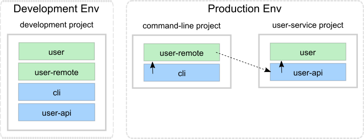

The production environment now looks good, but how about the _development_ environment?
The problem here is that it contains two components that share the same _user_ interface.
This will confuse both the classloader (if we start a REPL) and the IDE,
because we now have two components using the same _se.example.user_ namespace in the path, which is not a desirable situation.

The solution is to use profiles:

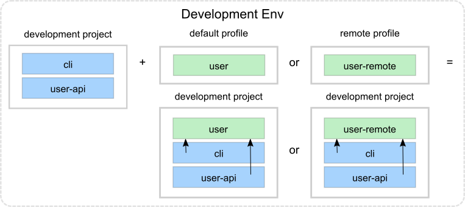

By leaving out any component that implements the _user_ interface from the _development_ project
and combining it with one of the two possible profiles we get a complete _development_ project.
This allows us to work with the code from a single place, but still be able to mimic the various projects we have.

The default profile (if exists) is automatically merged into the _development_ project,
if no other profiles are selected.
The name _default_ is set by _:default-profile-name_ in _workspace.edn_ and can be changed,
but here we will leave it as it is.

Now let's try to move from this design:

...to this:

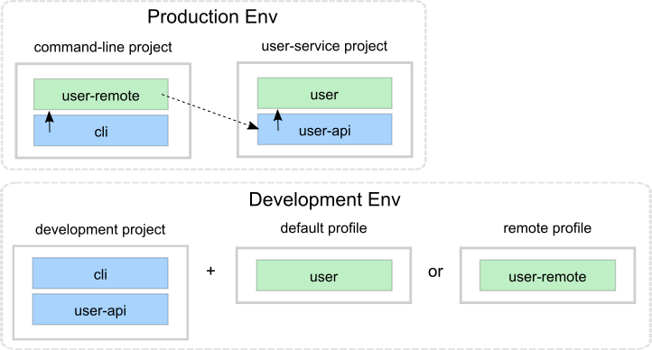

First we need to decide how the _command-line_ tool should communicate with _user-service_ over the wire.
After some searching, we found this
https://github.com/sunng87/slacker[slacker] library
that allows us to use
https://en.wikipedia.org/wiki/Remote_procedure_call[remote procedure calls]
in a simple way.

Let's create a checklist that will take us there:

1. Create the user-api base.
2. Create the user-remote component.
3. Switch from user to user-remote in deps.edn for the command-line project.
4. Create the user-service project.
5. Build user-service.

Let's go through the list.

=== 1. Create the user-api base

- Create the base.
- Add the slacker library to the base.
- Add the base to ./deps.edn.
- Implement the server for user-api:

Execute this statement:

[source,clojure]
----
poly create base name:user-api
----

Add the slacker library to _bases/user-api/deps.edn_:

[source,clojure]
----
 ...
 :deps {slacker/slacker {:mvn/version "0.17.0"}}
----

Add _user-api_ to _./deps.edn_:

[source,clojure]
----
 :aliases  {:dev {:extra-deps [...
                               poly/user-api {:local/root "bases/user-api"}
                               ...]

            :test {:extra-paths [...
                                 "bases/user-api/test"
----

Create the _api_ namespace:

[source,shell]
----
example
├── bases
│   └── user-api
│       └── src
│           ├── se.example.user_api.api.clj
│           └── se.example.user_api.core.clj
----

...with this content:

[source,clojure]
----
(ns se.example.user-api.api
  (:require [se.example.user.interface :as user]))

(defn hello-remote [name]
  (user/hello (str name " - from the server")))
----

...and update the _core_ namespace:

[source,clojure]
----
(ns se.example.user-api.core
  (:require [se.example.user-api.api]
            [slacker.server :as server])
  (:gen-class))

(defn -main [& args]
  (server/start-slacker-server [(the-ns 'se.example.user-api.api)] 2104)
  (println "server started: http://127.0.0.1:2104"))
----

=== 2. Create the user-remote component

- Create the component.
- Add the slacker library to the component.
- Remove user from ./deps.edn.
- Create the default and remote profiles.
- Activate the remote profile in the IDE.
- Activate the default profile in the REPL configuration.
- Implement the component.

Create the component:

[source,shell]
----
poly create component name:user-remote interface:user
----

Add the _slacker_ library to _components/user-remote/deps.edn_:

[source,clojure]
----
 ...
 :deps {slacker/slacker {:mvn/version "0.17.0"}}
----

Remove user from ./deps.edn:

[source,clojure]
----
{:aliases  {:dev {...
                  :extra-deps {poly/cli  {:local/root "bases/cli"}
                               poly/user-api {:local/root "bases/user-api"}

                               org.clojure/clojure {:mvn/version "1.11.1"}}}

            :test {:extra-paths ["bases/cli/test"
                                 "bases/user-api/test"]}
----

Add the _default_ and _remote_ profiles to _./deps.edn_:

[source,clojure]
----
:aliases  {...

           :+default {:extra-deps {poly/user {:local/root "components/user"}}
                      :extra-paths ["components/user/test"]}

           :+remote {:extra-deps {poly/user-remote {:local/root "components/user-remote"}}
                     :extra-paths ["components/user-remote/test"]}
----

Notice here that the profiles contain both _src_ and _test_ directories.
This works as profiles are only used from the development project.

The next step is to activate the _remote_ profile in our IDE:

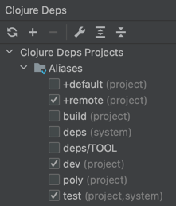

Create the core namespace:

[source,shell]
----
example
├── components
│   └── user-remote
│       └── src
│           ├── se.example.user_remote.core.clj
│           └── se.example.user_remote.interface.clj
----

...with this content:

[source,clojure]
----
(ns se.example.user.core
  (:require [slacker.client :as client]))

(declare hello-remote)

(defn hello [name]
  (let [connection (client/slackerc "localhost:2104")
        _ (client/defn-remote connection se.example.user-api.api/hello-remote)]
    (hello-remote name)))
----

...and update the interface namespace:

[source,clojure]
----
(ns se.example.user.interface
  (:require [se.example.user.core :as core]))

(defn hello [name]
  (core/hello name))
----

Edit the REPL configuration:

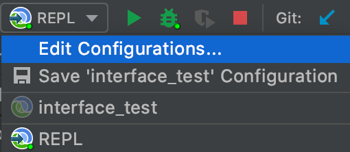

...and add the default profile to Options: _--A:dev:test:build:+default_

The reason we have to do this, is because we removed the _user_ component
from _./deps.edn_ and now we have to add it via a profile instead.
We need access to the source code for the _se.example.user.interface_ namespace,
and we have two alternatives, the _user_ or the _user-remote_ component that both use this interface.
The _user_ component is a better default because it's simpler
and only communicates via direct function calls without hitting the wire.

For the changes to take affect we now need to restart the REPL. Normally we don't have to do that, but when adding profiles it's necessary.

=== 3. Switch from user to user-remote in deps.edn for the command-line project

- Replace user with user-remote for the command-line project.
- Add the log4j library to deps.edn for command-line.
- Create a command-line uberjar.

Update the configuration file for the command-line project:

[source,shell]
----
example
├── projects
│   └── command-line
│       └── deps.edn
----

Replace _user_ with _user-remote_, and add the _log4j_ library (to get rid of warnings)
in _projects/command-line/deps.edn_
(it's okay to keep _poly/user name_, because it's also the name of the interface that both _user_ and _user-remote_ share):

[source,clojure]
----
{:deps {poly/user {:local/root "../../components/user-remote"}
        ...

        org.apache.logging.log4j/log4j-core {:mvn/version "2.13.3"}
        org.apache.logging.log4j/log4j-slf4j-impl {:mvn/version "2.13.3"}}
----

Create an uberjar by executing:

[source,shell]
----
clojure -A:deps -T:build uberjar :project command-line
----

=== 4. Create the user-service project

* Create the project.
* Update its deps.edn:
  - Add dependency to the user component.
  - Add dependency to the user-api base.
  - Add the uberjar alias.
* Add the cl alias for the user-service in workspace.edn.

Create the project:

[source,shell]
----
poly create project name:user-service
----

Set the content of projects/user-service/deps.edn to this:

[source,clojure]
----
{:deps {poly/user     {:local/root "../../components/user"}
        poly/user-api {:local/root "../../bases/user-api"}

        org.clojure/clojure {:mvn/version "1.11.1"}
        org.apache.logging.log4j/log4j-core {:mvn/version "2.13.3"}
        org.apache.logging.log4j/log4j-slf4j-impl {:mvn/version "2.13.3"}}

 :aliases {:test {:extra-paths []
                  :extra-deps  {}}

           :uberjar {:main se.example.user-api.core}}}
----

Add the _user-s_ alias for the _user-service_ in _workspace.edn_:

[source,clojure]
----
 :projects {"development" {:alias "dev"}
            "command-line" {:alias "cl"}
            "user-service" {:alias "user-s"}}}
----

=== 5. Build user-service

Create an uberjar for the _user-service_:

[source,shell]
----
clojure -A:deps -T:build uberjar :project user-service
----

Puhh, that should be it! Now let's test if it works.

Execute this from the workspace root in a separate terminal:

[source,shell]
----
cd projects/user-service/target
java -jar user-service.jar
----

Now when we have a running service, we could test if we can call it from the REPL.
We activated the remote profile in our IDE earlier, which made the _user-remote_ component active.
Note that this only instructs the IDE to treat _user-remote_ as source code:

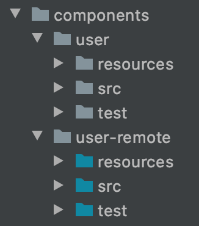

...but it _doesn't_ load its source code into the REPL!

We can verify this by adding this code to _development/src/dev/lisa.clj_:

[source,clojure]
----
(ns dev.lisa
  (:require [se.example.user.interface :as user]))

(user/hello "Lisa")
----

...and if we execute the hello function, we still get:

[source,clojure]
----
"Hello Lisa!!"
----

Remember that we set the REPL configuration to _-A:test:dev:build:+default_
which loads the _user_ component into the REPL every time we start or restart the REPL.
This is the recommended way of configuring the default REPL,
by selecting the "simple" components that communicate with each other using direct function calls.
Because of this, we should keep the _-A:test:dev:build:+default_ configuration as it is.

Let's create a REPL that includes the remote profile:

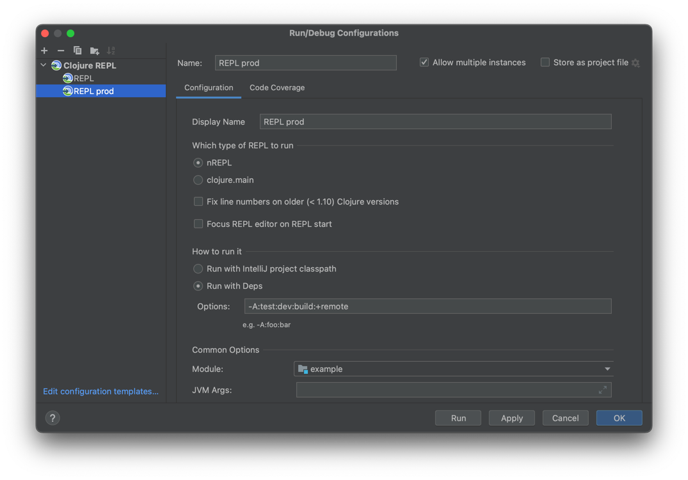

This REPL will use the _user-remote_ component and can be used to "emulate" a production like environment.

But let's continue with the REPL that is already running and see if we can switch to _user-remote_ without restarting it.

Open the _core_ namespace of the _user-remote_ component and select _Tools > REPL > Load file in REPL_.
This will replace the _user_ implementation with the _user-remote_ component,
which works because both live in the same _se.example.user_ namespace, which is also their interface (user).

If we execute the _hello_ function agan from _dev.lisa_, we should get:

[source,text]
----
Hello Lisa - from the server!!
----

Now, let's continue with our example. Execute this from the other terminal (the one that we didn't start the server from):

[source,text]
----
cd ../../command-line/target
java -jar command-line.jar Lisa
----

[source,text]
----
Hello Lisa - from the server!!
----

Wow, that worked too! The complete code can be found
https://github.com/polyfy/polylith/tree/master/examples/doc-example[here].

Now execute the _info_ command (_+_ inactivates all profiles, and makes the _default_ profile visible):

[source,text]
----
cd ../../..
poly info +
----

...and compare it with the target design:

// compare-with-target-design.png is manually created by putting all-aliases.png and target-design.png side by side.

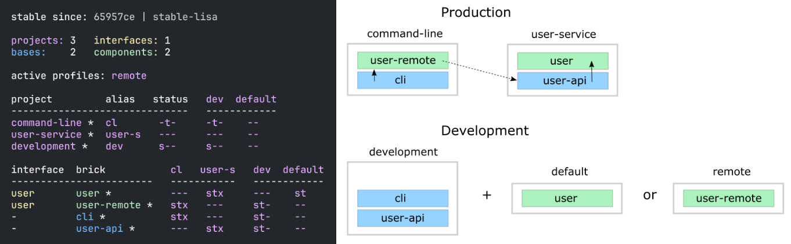

Looks like we got everything right!

The profile flags, _st_, follow the same pattern as for bricks and projects
except that the last "Run the tests" flag is omitted.

This example was quite simple, but if our project is more complicated,
we may want to manage state during development with a tool like
https://github.com/tolitius/mount[Mount],
https://github.com/stuartsierra/component[Component], or
https://github.com/weavejester/integrant[Integrant],
or we could create our own helper functions that we put in the _dev.lisa_ namespace,
which can help us switch profiles by using a library like
https://github.com/clojure/tools.namespace[tools.namespace].

If we want to switch profile when running a command, we need to pass them in, e.g.:

[source,text]
----
poly info +remote
----

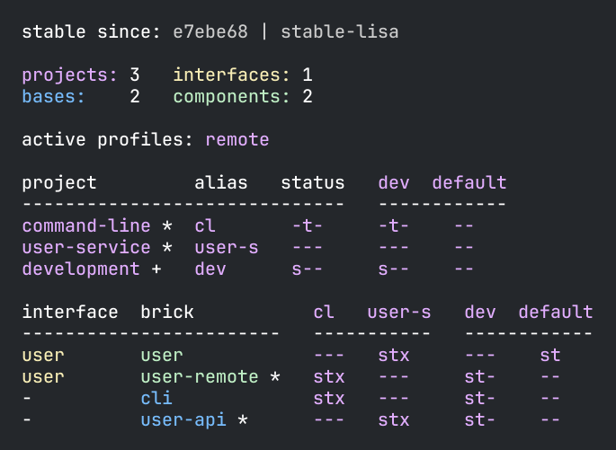

Now the _remote_ profile is included in the _development_ project and listed after active profiles.

It's possible to give more than one profile:

[source,text]
----
poly info +default +remote
----

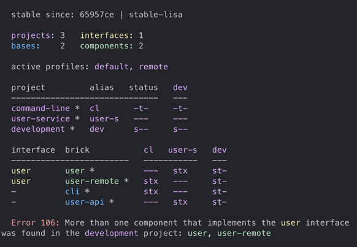

The tool complains and doesn't like that we just included both _user_ and _user-remote_ in the _development_ project!

The profiles can also contain libraries and paths to projects,
but right now we have no such paths and therefore all profiles are marked with _--_ in the project section.

Now when we are finished with our example system,
it could be interesting to see how many lines of code each brick and project consists of.
This can be done by passing in _:loc_:

[source,text]
----
poly info :loc
----

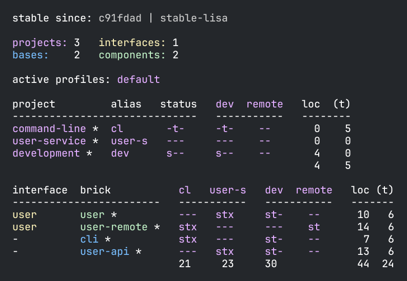

Each project summarises the number of lines of code for each brick it contains.
The _loc_ column counts the number of lines of codes under the _src_ directory,
while _(t)_ counts for the test directory.

Our projects are still quite small, but they will eventually reach 1000 lines of code,
and when that happens we may want to change the thousand delimiter in _~/.polylith/config.edn_
which is set to _,_ by default.

Let's run all the tests to see if everything works:

[source,text]
----
poly test :project
----

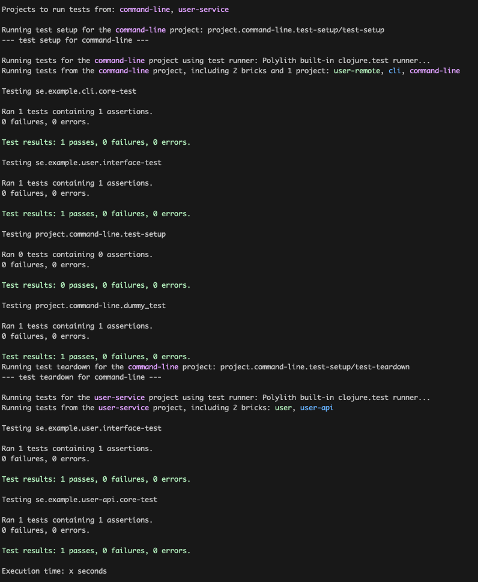

It worked!
