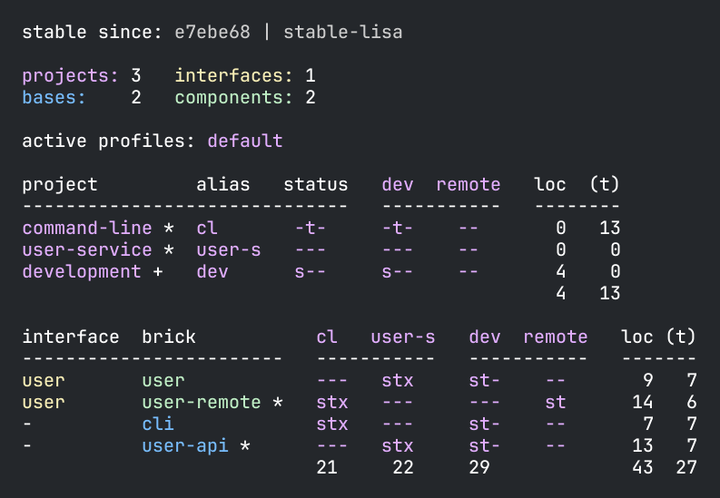

= Profile
:toc:

In production, your deployable xref:project.adoc[projects], by their nature, run in separate processes.
In development, you are running from a single REPL process, which can lead to classpath issues you will never encounter in production.
Profiles allow you to work on all your projects from the `development` project without classpath issues.

TIP: You likely don't need profiles if your xref:workspace.adoc[workspace] does not xref:interface.adoc#one-interface-in-multiple-components[re-specify one interface].

== An Example Scenario

In our ongoing xref:introduction.adoc[tutorial], we last left off exploring xref:testing.adoc[testing].
If you've been following along, your `development` project currently mirrors the `command-line` project:

image::images/profile/prod-mirrors-dev.png[]

The `cli` xref:base.adoc[base] references the `user` xref:component.adoc[component] in both xref:project.adoc[projects].
Let's pretend that we have discovered performance problems in the `user` component and have learned that distributing the load by delegating to a new service should solve the problem:

image::images/profile/new-service-in-prod.png[]

The `cli` base now references a new `user-remote` component, which calls a new `user-api` base in a new `user-service` project, which references our original `user` component.

The production environment looks good, but how about the `development` environment?
We have a problem.
The `user` and `user-remote` components both specify the `user` xref:interface.adoc#one-interface-in-multiple-components[interface], resulting in two `se.example.user.interface` namespaces on the classpath.
Duplicate items on the classpath will confuse classloaders and IDEs.

[NOTE]
====
Classloader issues are only a `development` project concern.
We don't have classloader issues:

* in production because `command-line` and `user-service` projects naturally run in separate processes.
* when xref:testing.adoc[testing] via `poly` because xref:test-runners.adoc[test-runners] provide classpath isolation at the project level.
====

== Profiles to the Rescue

The `poly` solution is to use profiles:

image::images/profile/profiles-in-dev.png[]

We can add `default` and `remote` profiles to avoid duplication on the classpath, allowing us to develop all our code and projects from a single place without issues.

If no other profiles are selected, `poly` automatically merges the `default` profile into the `development` project.

****
The name `default` is specified by `:default-profile-name` in xref:workspace.adoc#workspace-edn[workspace.edn].
****

== Planning a Solution

Let's move from our current design:

image::images/profile/prod-mirrors-dev.png[]

...to our new one:

image::images/profile/target-design.png[]

== Implementation

Let's continue with our xref:introduction.adoc[tutorial] `example` workspace; we last left off exploring xref:testing.adoc[testing].

First, we need some mechanism for the `command-line` tool to communicate over the wire with the `user-service`.
After some searching, we found the https://github.com/sunng87/slacker[slacker] library.
It supports simple https://en.wikipedia.org/wiki/Remote_procedure_call[remote procedure calls].
Perfect for our tutorial.

Here's a checklist to implement our design:

<<create-user-api-base>> +
<<create-user-remote-component>> +
<<adjust-command-line-project>> +
<<create-user-service-project>> +
<<build-user-service>>

[[create-user-api-base]]
=== 1. Create the `user-api` base

<<create-user-api-base2>> +
<<add-slacker-library-to-user-api>>  +
<<add-user-api-to-dev-deps>> +
<<implement-user-api>> +

[[create-user-api-base2]]
==== a. Create the `user-api` base

Run:

[source,clojure]
----
poly create base name:user-api
----

[[add-slacker-library-to-user-api]]
==== b. Add the `slacker` library to the `user-api` base

Edit `user-api` base `deps.edn`:

../bases/user-api/deps.edn
[source,clojure]
----
{:paths ["src" "resources"]
 :deps {slacker/slacker {:mvn/version "0.17.0"}} ;; <1>
 :aliases {:test {:extra-paths ["test"]
                  :extra-deps {}}}}
----
<1> Add `slacker` library dependency for server-side communication support

[[add-user-api-to-dev-deps]]
==== c. Add  `user-api` base to `./deps.edn`:

Adjust `./deps.edn` like so:

../deps.edn
[source,clojure]
----
 :aliases  {:dev {:extra-deps [...
                               poly/user-api {:local/root "bases/user-api"} ;; <1>
                               ...]

            :test {:extra-paths [...
                                 "bases/user-api/test" ;; <2>
----
<1> Add `user-api` source dep under `:dev` alias
<2> Add `user-api` test path under `:test` alias

[[implement-user-api]]
==== d. Implement the server for the `user-api` base

Create the `api` namespace in the `user-api` base:

[source,shell]
----
example
├── bases
│   └── user-api
│       └── src
│           ├── se.example.user_api.api.clj # <1>
│           └── se.example.user_api.core.clj
----
<1> Create the new `api.clj` file

Set the content of `api.clj` to:

../bases/user-api/src/se/example/user_api/api.clj
// scripts/sections/profile/user-api-api.clj
[source,clojure]
----
(ns se.example.user-api.api
  (:require [se.example.user.interface :as user]))

(defn hello-remote [name]
  (user/hello (str name " - from the server")))
----

Update `core.clj` to:

../bases/user-api/src/se/example/user_api/core.clj
// scripts/sections/profile/user-api-core.clj
[source,clojure]
----
(ns se.example.user-api.core
  (:require [se.example.user-api.api]
            [slacker.server :as server])
  (:gen-class))

(defn -main [& args]
  (server/start-slacker-server [(the-ns 'se.example.user-api.api)] 2104)
  (println "server started: http://127.0.0.1:2104"))
----

[[create-user-remote-component]]
=== 2. Create the `user-remote` component

<<create-user-remote-component2>> +
<<add-slacker-library-to-user-remote>> +
<<remove-user-from-dev-deps>> +
<<add-profiles-to-dev-deps>> +
<<activate-remote-profile-in-ide>> +
<<implement-user-remote>> +
<<activate-default-profile>>

[[create-user-remote-component2]]
==== a. Create the `user-remote` component

Run:

[source,shell]
----
poly create component name:user-remote interface:user
----

[[add-slacker-library-to-user-remote]]
==== b. Add the `slacker` library to `user-remote` component

Edit `user-remote` component `deps.edn`:

../components/user-remote/deps.edn
[source,clojure]
----
{:paths ["src" "resources"]
 :deps {slacker/slacker {:mvn/version "0.17.0"}} ;; <1>
 :aliases {:test {:extra-paths ["test"]
                  :extra-deps {}}}}
----
<1> Add `slacker` lib dependency for client-side communication support

[[remove-user-from-dev-deps]]
==== c. Remove the `user` component from `./deps.edn`:

../deps.edn
[source,clojure]
----
{:aliases  {:dev {...
                  :extra-deps {poly/user {:local/root "components/user"} ;; <1>
                               poly/cli  {:local/root "bases/cli"}
                               poly/user-api {:local/root "bases/user-api"}

                               org.clojure/clojure {:mvn/version "1.12.0"}}}

            :test {:extra-paths ["components/user/test" ;; <2>
                                 "bases/cli/test"
                                 "projects/command-line/test"
                                 "bases/user-api/test"]}
----
<1> Delete `poly/user {:local/root "components/user"}`
<2> Delete `"components/user/test"`

[[add-profiles-to-dev-deps]]
==== d. Add the `default` and `remote` profiles to `./deps.edn`:

../deps.edn
[source,clojure]
----
:aliases  {...

           :+default {:extra-deps {poly/user {:local/root "components/user"}} ;; <1>
                      :extra-paths ["components/user/test"]}

           :+remote {:extra-deps {poly/user-remote {:local/root "components/user-remote"}} ;; <2>
                     :extra-paths ["components/user-remote/test"]}
----
<1> Respecify your deleted `user` component under the `default` profile alias
<2> Specify your new `user-remote` component under the `remote` profile alias

Notice that profile aliases are prefixed with a `+`.

[[activate-remote-profile-in-ide]]
==== e. Activate the `remote` profile in your IDE

NOTE: At the time of this writing, we only have instructions for Cursive.

[TIP]
====
*Cursive users*: Activate the `remote` profile in your IDE:

image::images/profile/activate-remote-profile.png[width=200]
====

[[implement-user-remote]]
==== f. Implement `user-remote`
Create the `core` namespace in the `user-remote` component:

[source,shell]
----
example
├── components
│   └── user-remote
│       └── src
│           ├── se.example.user.core.clj ;; <1>
│           └── se.example.user.interface.clj
----
<1> Create new `core.clj` file

Set `core.clj` content to:

../components/user-remote/src/se/example/user/core.clj
// scripts/sections/profile/user-remote-core.clj
[source,clojure]
----
(ns se.example.user.core
  (:require [slacker.client :as client]))

(declare hello-remote)

(defn hello [name]
  (let [connection (client/slackerc "localhost:2104")
        _ (client/defn-remote connection se.example.user-api.api/hello-remote)]
    (hello-remote name)))
----

And update the `interface.clj` content to:

../components/user-remote/src/se/example/user/interface.clj
// scripts/sections/profile/user-remote-interface.clj
[source,clojure]
----
(ns se.example.user.interface
  (:require [se.example.user.core :as core]))

(defn hello [name]
  (core/hello name))
----

[[activate-default-profile]]
==== g. Activate the `default` profile in your IDE

NOTE: At the time of this writing, we only have instructions for Cursive users.

[TIP]
====
*Cursive users*: Edit the REPL configuration:

image::images/profile/edit-repl-config.png[width=250]

...and add the `default` profile to Options: `-A:dev:test:build:+default`

****
We had you add `-A:dev:test` xref:development.adoc#idea-cursive[during initial setup].
Alternatively, you could have initially added [nowrap]`-A:dev:test:build:+default`.
Tools.deps ignores unused aliases.
The extra alias, while unused (until now), would have been harmless.
****

We now need to include the `+default` alias because we moved the `user` component from a default xref:tools-deps.adoc[tools.deps] dependency to a `default` polylith dependency.

We have segregated the two components that specify a `user` interface via profiles.
You might wonder why we chose the `user` component to be in the `default` profile and `user-remote` in the `remote` profile.
Our rationale is that we wanted something simple by default.
The `user` component only communicates in-process, whereas the `user-remote` component communicates out-of-process over-the-wire.

For the changes to take effect, you need to restart the REPL.
Normally, a REPL restart is not required, but when adding profiles, it's necessary.
====

[[adjust-command-line-project]]
=== 3. Switch from `user` to `user-remote` in the `command-line` project

<<replace-user-with-user-remote-in-command-line>> +
<<create-command-line-uberjar>>

[[replace-user-with-user-remote-in-command-line]]
==== a. Replace `user` with `user-remote` in `command-line` project

Make the following changes to the `command-line` project `deps.edn`:

../projects/command-line/deps.edn
[source,clojure]
----
{:deps {poly/user {:local/root "../../components/user-remote"} ;; <1>
        poly/cli  {:local/root "../../bases/cli"}

        org.clojure/clojure {:mvn/version "1.12.0"}
        org.slf4j/slf4j-nop {:mvn/version "2.0.9"}} ;; <2>

 :aliases {:test {:extra-paths ["test"]
                  :extra-deps  {}}

           :uberjar {:main se.example.cli.core}}}
----
<1> Rename `components/user` to `components/user-remote`.
It's okay to leave `poly/user` as is; it's unique within the project.
<2> Add logging library (slacker lib does some logging that we'll ignore)

[[create-command-line-uberjar]]
==== b. Create `command-line` uberjar

Run:

[source,shell]
----
clojure -A:deps -T:build uberjar :project command-line
----

[[create-user-service-project]]
=== 4. Create the `user-service` project

<<create-user-service-project2>> +
<<configure-user-service>> +
<<add-user-service-project-alias>>

[[create-user-service-project2]]
==== a. Create the `user-service` project:

Run:

[source,shell]
----
poly create project name:user-service
----

[[configure-user-service]]
==== b. Configure the `user-service`

Set the `user-service` project `deps.edn` content to:

../projects/user-service/deps.edn
// scripts/sections/profile/user-service-deps.edn
[source,clojure]
----
{:deps {poly/user {:local/root "../../components/user"} ;; <1>
        poly/user-api {:local/root "../../bases/user-api"} ;; <2>

        org.clojure/clojure {:mvn/version "1.12.0"}
        org.slf4j/slf4j-nop {:mvn/version "2.0.9"}} ;; <3>

 :aliases {:test {:extra-paths []
                  :extra-deps  {}}

           :uberjar {:main se.example.user-api.core}}} ;; <4>
----
<1> Add `user` component
<2> Add `user-api` base
<3> Add logging library (slacker lib does some logging that we'll ignore)
<4> Specify main for uberjar artifact

[[add-user-service-project-alias]]
==== c. Add a `poly` alias for the `user-service`

../workspace.edn
[source,clojure]
----
 :projects {"development" {:alias "dev"}
            "command-line" {:alias "cl"}
            "user-service" {:alias "user-s"}}} ;; <1>
----
<1> Add `user-s` alias for your new `user-service`

[[build-user-service]]
=== 5. Build the `user-service`

Create an uberjar for the `user-service`:

[source,shell]
----
clojure -A:deps -T:build uberjar :project user-service
----

== Verifying our Work

Phew, that should be it!
Now, let's test if it works.

From a separate terminal, launch the `user-service`:

[source,shell]
----
cd projects/user-service/target
java -jar user-service.jar
----

You should see the following output:
[source,text]
----
server started: http://127.0.0.1:2104
----

[TIP]
====
**Cursive users:**
Now that you have a running service, you can test if you can call it from the REPL.
You activated the remote profile in your IDE earlier, which made the `user-remote` component active.

Note that this only instructs the IDE to treat `user-remote` as source code:

image::images/profile/user-and-user-remote.png[width=200]

...but it *doesn't* automatically load its source code into the REPL!

You can verify this by adding this code to `development/src/dev/lisa.clj`:

[source,clojure]
----
(ns dev.lisa
  (:require [se.example.user.interface :as user]))

(user/hello "Lisa")
----

...and if you execute the `hello` function, you will see that the loaded `user` component is called (not the `user-remote` component):

[source,clojure]
----
"Hello Lisa!!"
----

Remember, xref:#activate-default-profile[you set your REPL configuration] to include the `default` profile.
Because xref:#add-profiles-to-dev-deps[you configured] the `user` component to be in the `default` profile, it will get loaded every time you start or restart your REPL.
As mentioned earlier, we typically recommend placing your simpler component in the `default` profile.

Let's create a REPL configuration that includes the remote profile:

image::images/profile/prod-repl.png[width=600]

This REPL will use the `user-remote` component and can be used to emulate a production-like environment.

But let's continue with the REPL that is already running and see if we can switch to `user-remote` without restarting the REPL.

Open the `core` namespace of the `user-remote` component and select `Tools > REPL > Load file in REPL`.
You have just replaced the `user` component implementation with `user-remote`, which works because both share the same `se.example.user.core` and `se.example.user.interface` namespaces.

If you execute the `hello` function again from `dev.lisa`, you should see:

[source,text]
----
Hello Lisa - from the server!!
----
====

Now, let's continue with our example.
From another terminal (not the one from which you started the `user-service`) from your `example` workspace root dir:

[source,text]
----
cd projects/command-line/target
java -jar command-line.jar Lisa
----

You should see:

[source,text]
----
Hello Lisa - from the server!!
----

If your output matches, congratulations, you've successfully exercised `poly` profiles!

TIP: You can find the complete tutorial code link:/examples/doc-example[here].

Now execute the xref:commands.adoc#info[info] command (`+` deactivates all profiles, and makes the `default` profile visible):

[source,text]
----
cd ../../.. # <1>
poly info +
----
<1> Navigate back to the workspace root dir

...and compare the `info` output with our target design:

image::images/profile/compare-with-target-design-annotated.png[]

Great! Reality now matches our plan!

Notice that profile flags only include the `st` xref:flags.adoc[flags] and never the `x` flag.
Whether or not to run tests is not tied to profiles.

[TIP]
====
This example was quite simple, but if your project is more complicated, you may want to manage state during development with a tool like https://github.com/tolitius/mount[Mount], https://github.com/stuartsierra/component[Component], or https://github.com/weavejester/integrant[Integrant].
You could also create your own helper functions in your development project namespace (`dev.lisa`, in our xref:development.adoc[tutorial]) to help you switch profiles with a library like https://github.com/clojure/tools.namespace[tools.namespace].
====

== Exploring with `poly info`

By default, the `default` profile is active:

[source,text]
----
poly info
----

image::images/profile/info-after-adding-profiles-annotated.png[width=500]

Notice:

* `default` is listed for `active profiles`
* the `dev` project column:
** includes the `user` brick (which is in the `default` profile)
** **doesn't** include the `user-remote` brick (which is in the `remote` profile)
* columns for the inactive `remote` profile are shown

NOTE: Profiles can also contain dependencies and paths to projects, but we've done no such thing in our example; therefore, you'll see all profile flags as `--` in the project section.

You can override the default profile by specifying a profile:

[source,text]
----
poly info +remote
----

image::images/profile/info-with-remote-profile-annotated.png[width=500]

Notice:

* `remote` is listed for `active profiles`
* that the `dev` project column:
** **doesn't** include the `user` brick (which is in the `default` profile)
** includes the `user-remote` brick (which is in the `remote` profile)
* columns for the inactive `default` profile are shown

You can specify more than one profile:

[source,text]
----
poly info +default +remote
----

// NOTE: we don't generate this image with polyx from create_image.clj because we want to include the error in the screenshot
image::images/profile/info-multiple-profiles-annotated.png[width=600]

Notice:

* `default` and `remote` are listed as `active profiles`
* that the `dev` project column:
** includes the `user` brick (which is in the `default` profile)
** includes the `user-remote` brick (which is in the `remote` profile)
* no inactive profile columns are shown
* `poly` tells us that it does not like that we included both `user` and `user-remote` in the `development` project

Let's see how many lines of code we have by specifying the `:loc` argument:

[source,text]
----
poly info :loc
----

Under bricks, each project column tallies the lines of code for its bricks `src` code.
The `loc` column counts the number of lines of codes for `src` directories, while `(t)` counts for the `test` directories.

****
Our tutorial `example` is small, but your real-world systems will likely reach thousands of lines of code.
When that happens, you may want to xref:configuration.adoc#user[reconfigure the thousand delimiter], which is `,` by default.
****

== Testing with `poly test`

Let's run all the tests to verify that everything works:

[source,text]
----
poly test :project
----

// only info command supports export to png at this time, so this output needs to be captured manually as necessary
image::images/profile/test.png[]

If your output matches, all that green is a very good sign; pat yourself on the back!
