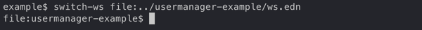

= Shell

The goal of the shell is to make us more productive and to have more fun!

The shell uses https://github.com/jline/jline3[jline3] under the hood which supports the following operating systems:
Mac OS X, Linux, FreeBSD, Solaris, and Windows.

Let's start a shell by typing _poly_ from the workspace root:

image::images/shell/shell-start.png[alt=Start a shell,width=600]

The prompt is set to the workspace name. From here we can execute different commands and get instant feedback.

We can list all available commands by pressing the _<tab>_ key:

image::images/shell/shell-all-commands.png[alt=List all available commands,width=600]

If we type i, it will show all commands starting with ‘i’:

image::images/shell/shell-i.png[alt=i,width=600]

If we press _<tab>_, it will complete the info command and suggest available parameters:

image::images/shell/shell-info.png[alt=info,width=600]

Most parameters starting with a colon (:) can be selected by typing their name, e.g. _l_ for _:loc_:

image::images/shell/shell-info-loc.png[alt=info l,width=600]

Press _<tab>_ to select _:loc_:

image::images/shell/shell-info-loc-tab.png[alt=info :loc,width=600]

We mentioned that parameters starting with a colon can be selected by their name.
he exception is _:project_ which has to start with _:p_ to distinguish it from _project_:

image::images/shell/shell-info-loc-p.png[alt=info :loc :p,width=600]

Complete with _<tab>_ and type p and press _<tab>_ again to list all available projects in the workspace:

image::images/shell/shell-info-loc-project.png[alt=info :loc :project project:,width=600]

When we have only one candidate, then it can be selected by pressing _<tab>_:

image::images/shell/shell-one-candidate.png[alt=info :loc :project:development:,width=600]

The trailing colon indicates that this is a multi-select parameter (more than one project can be selected).
We can leave the multi-select input mode by pressing <space> to remove the trailing colon:

image::images/shell/shell-leave-multi-select.png[alt=info :loc :project :project:develoment,width=600]

An alternative way of selecting a candidate is by pressing _<tab>_ twice, and using the arrow keys to move the "cursor" around, e.g:

image::images/shell/shell-move-cursor.png[alt=info :loc :project project:development :resources,width=600]

Press <enter> to make a choice:

image::images/shell/shell-move-cursor-and-select.png[alt=info :loc :project project:development :resources,width=600]

The brick parameter lists all bricks, including "no brick" represented by a dash (if _-_ is chosen,
then no bricks will be selected for testing):

image::images/shell/shell-info-brick.png[alt=info brick:,width=600]

A command that really benefits from being executed from the shell is the _ws_ command.
Instead of trying to remember all the different attributes, we get them suggested for us:

image::images/shell/shell-ws-get.png[alt=ws get:,width=600]

From here we can dig deeper into the structure.
Sometimes we encounter two words that start the same, where one of them is an exact match:

image::images/shell/shell-ws-get-components-user.png[alt=ws get:components:user,width=600]

We can select user in this case, by typing _:_:

image::images/shell/shell-ws-get-components-user-colon.png[alt=ws get:components:user:,width=600]

We can continue browsing the workspace structure and view the information we are interested in, e.g.:

image::images/shell/shell-ws-get-browse.png[alt=ws get:components:user:namespaces:src:core:namespace,width=600]

== Switching workspace

When starting a shell from a workspace directory (where the _workspace.edn_ file lives)
we can execute all available commands from that directory.
It's also possible to switch workspace without leaving the shell,
but then the xref:commands.adoc#create[create] and xref:commands.adoc#test[test] commands will not work
(or show up in the autocomplete).

Let's say we have cloned the
https://github.com/furkan3ayraktar/clojure-polylith-realworld-example-app[realworld-example-app].
We can now switch to that workspace using the _switch-ws_ command in combination with the _dir_ parameter:

image::images/shell/shell-switch-dir.png[alt=switch-ws dir:,width=600]

This will list all directories and files ending with _.edn_ in the current directory.

We can select the clojure-polylith-realworld-example-app directory by typing _._ followed by _<tab>_
to select _.._ and then typing _clo_ (or something long enough) followed by _<tab>_ to select the workspace:

image::images/shell/shell-switch-dir-realworld.png[alt=switch-ws dir:../clojure-polylith-realworld-example-app/,width=600]

Switch workspace by pressing <enter>:

image::images/shell/shell-switched-dir.png[alt=switch-ws dir:../clojure-polylith-realworld-example-app,width=600]

The _dir:_ prefix indicates that commands will be executed from the selected workspace,
and not from the current directory. We can go back to the workspace directory by executing _switch-ws_:

image::images/shell/shell-switch-ws.png[alt=switch-ws,width=600]

If a workspace has been exported to a file using something like ws out:ws.edn then we can switch to that workspace.
Here we use the usermanager project as an example (make sure to switch to the _polylith_ branch):

The promt name is picked from the _:name_ attribute in the file and is prefixed with _file:_
to indicate that it has been imported from a file.

The "trick" the shell does is to append _ws-dir:DIR_ or _ws-file:FILE_
to the command for us before the command is executed
(if we have switched workspace using the _dir:DIR_ or _file:FILE_ parameters).

== Autocomplete

The autocomplete helps us execute different commands with correct parameters:

* Available commands can be suggested when we first select a command.

* Available parameters are suggested for the current command.

* The file system can be browsed when selecting files and directories.

* The workspace structure can be browsed via the ws command.

* Tag patterns defined in workspace.edn are suggested when using the _since:X_ parameter.

* Remote git branches are suggested when using the _branch:X_ parameter.

* Relevant bricks and projects are suggested when using the _brick:X_ and _project:X_ parameters:
- If a _project:X_ parameter is selected from the info or test command,
only projects that are marked for testing will be suggested (we don't need to select already filtered out projects).
- If a brick has been selected from the _deps_ command, only projects that contain that brick will be suggested.
- If a project has been selected from the _deps_ command, only bricks from that project will be suggested.

When browsing the file system from a _dir:PATH_ parameter, there are a couple of things worth mentioning:

* If we want to go to the user home directory we have to type _~/_ and not just _~_
(this is a problem with the underlying https://github.com/jline/jline3[jline3] integration).

* When a file or directory contains spaces, it will be surrounded with quotes, e.g. "My path".
To select such a path we need to include the first " in the path for the autocomplete to work.

Rarely used parameters are sometimes not suggested, e.g. _color-mode_.
Another example is the create workspace command that we normally only execute outside of a repository
and is therefore not suggested when inside an existing workspace.

If we are outside a workspace, then the autocomplete will work for the _create workspace_ command, e.g.:

image::images/shell/shell-create-workspace.png[alt=create workspace name:myws,width=600]

To quit the shell, type _exit_ or _quit_ or press _<ctrl>+C_ or _<ctrl>+D_.
