= Shell
:toc:
:poly-version: 0.3.32

Not only does the `shell` make you more productive, but it's also fun to use!
It takes full advantage of https://github.com/jline/jline3[jline3] under the hood, which supports macOS, Linux, FreeBSD, Solaris, and Windows.

Let's explore some shell features.

TIP: Our examples assume you are exploring from our ongoing xref:introduction.adoc[tutorial] `example` xref:workspace.adoc[workspace].

[[launch]]
== Launching

Start a shell by typing `poly` from your workspace root directory (xref:component.adoc#shell-is-default[shell is the default command]):

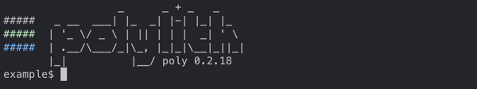

Notice that the `example$` prompt includes your current workspace name.
From here, you can run commands and get instant feedback.

[[quit]]
== Quitting

To quit the shell, type `exit` or `quit` or press either of:

* kbd:[Ctrl+C]
* kbd:[Ctrl+D] (if not on Windows)

== Let's Play

xref:#launch[Launch a poly shell] and play along.

Press kbd:[Tab] to see all available commands:

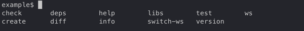

Type `i` to match all commands starting with the letter `i`:

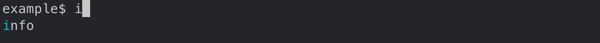

Press kbd:[Tab] to autocomplete the xref:commands.adoc#info[info] command and list valid arguments:

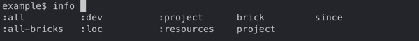

You can usually skip the leading colon character; for example, type `l` to match `:loc`.

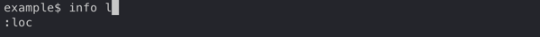

Press kbd:[Tab] to autocomplete `:loc`:

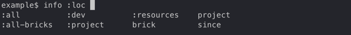

To distinguish `:project` from `project`, type the leading `:` (colon character):

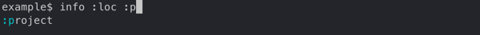

Complete `:project` by pressing kbd:[Tab].
Type `p` then press kbd:[Tab] to autocomplete `project:`, and kbd:[Tab] again, to list all projects in the workspace:

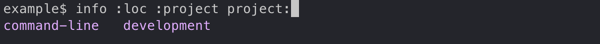

When you have only one candidate, select it by pressing kbd:[Tab]:

image::images/shell/shell-one-candidate.png[width=600]

The trailing `:` (colon character) indicates a multi-select argument (you can select more than one project).
You can leave the multi-select input mode by pressing kbd:[Space]; this removes the trailing colon:

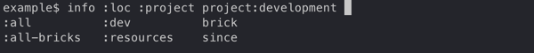

An alternative way of selecting a listed candidate is to press kbd:[Tab] twice and use the arrow keys to move the selection cursor around (kbd:[Tab] and kbd:[Shift+Tab] also work):

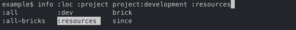

Press kbd:[Enter] to choose the item at the cursor:

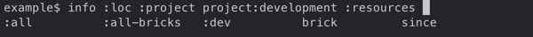

== The Dash Item

The `brick` argument shows you all available bricks.
Selecting the `-` (the dash character) tells `poly` you want no bricks selected (e.g., for testing):

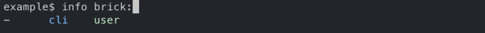

== Using Autocomplete to Explore

Autocomplete really shines when there are many available suggestions.
The xref:commands.adoc#ws[ws] command offers a good example.
Instead of trying to remember all the different `get:` arguments, the `shell` lists them for you:

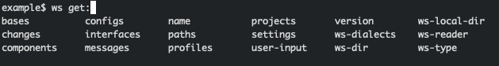

After you select `components`, the `shell` lists valid arguments.
Sometimes, you encounter multiple matching suggestions.
When one of them is an exact match for what you have typed:

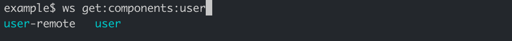

You can select it by typing `:` (the colon character):

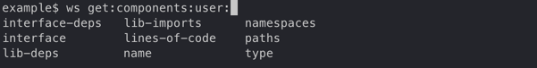

You can continue navigating down into the workspace structure to find the information you are interested in:

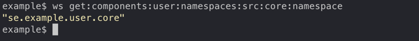

== Switching Workspace

When you start a shell from a workspace root directory (where the `workspace.edn` file lives), the workspace is automatically loaded, and you can execute all available commands against it.

You can switch to a different workspace without leaving the poly shell.

NOTE: The xref:commands.adoc#create[create] and xref:commands.adoc#test[test] commands don't work on workspaces you have switched to.

****
If you want to play along, exit the shell, then clone https://github.com/furkan3ayraktar/clojure-polylith-realworld-example-app[clojure-polylith-realworld-example-app] under the same parent directory as your `example` workspace:

[source,shell]
----
cd ..
git clone https://github.com/furkan3ayraktar/clojure-polylith-realworld-example-app.git
----
And relaunch the poly shell:
[source,shell]
----
cd example
poly
----
****

You can switch to another workspace using the xref:commands.adoc#switch-ws[switch-ws] command in combination with its `dir` argument:

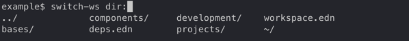

The `shell` lists all directories and `.edn` files under the current directory.

Select the `clojure-polylith-realworld-example-app` directory by typing `.` followed by kbd:[Tab] to select `..` and then type `clo` (or something long enough) followed by kbd:[Tab] to select the workspace directory:

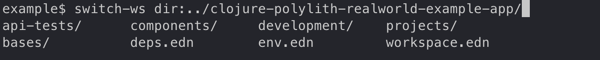

Switch workspace by pressing kbd:[Enter]:

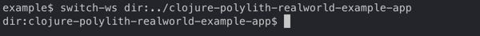

Notice the prompt has changed to show the currently selected workspace (by dir).
All commands will be run against this selected workspace.

You can go back to the `example` workspace by invoking `switch-ws` without arguments:

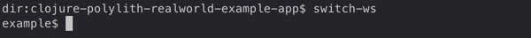

[[refresh-ws]]
If you invoke `switch-ws` again when you are already on the root, this will read the workspace from disk again, which can be useful in some situations.

=== Switching to an Exported Workspace

You can switch to an exported workspace.

NOTE: You can export a workspace to a `.edn` file, e.g. via `poly ws out:usermanager.edn`.

****
If you want to play along, exit the shell, then clone the `polylith` branch of https://github.com/seancorfield/usermanager-example/tree/polylith[usermanager-example] project under the same parent directory as your `example` workspace, and export its workspace:

[source,shell]
----
cd ..
git clone --branch polylith https://github.com/seancorfield/usermanager-example.git
cd usermanager-example
poly ws out:usermanager.edn
----

And relaunch the poly shell:
[source,shell]
----
cd ../example
poly
----
****

Switch to the exported workspace using the `file` argument:

[source,text]
----
example$ switch-ws file:../usermanager-example/usermanager.edn
file:usermanager-example$
----

Notice that the prompt has changed to show the currently selected workspace (by export file).

[[read-old-workspace]]
NOTE: The `poly` tool supports reading old exported files, with older xref:versions.adoc[versions] of the workspace structure, which are automatically migrated to the current version.
This is also true when reading an older version of a workspace, e.g. if you go back in the git history with git https://git-scm.com/docs/git-checkout[checkout] or https://git-scm.com/docs/git-switch[switch].

[[switch-workspace]]
=== Switching workspace by name ===

If you have workspaces xref:workspace.adoc#sub-workspaces[within] your workspace, other cloned workspaces, or  workspaces exported to file, there is a convenient way to access these from the shell.

First you need to configure these in the xref:configuration.adoc#ws-shortcuts[:ws-shortcuts] key in your xref:configuration.adoc#user[user config] file (`~/.config/polylith/config.edn`).
A workspace that lives in a directory is specified with `:dir`, while exported workspaces are specified with `:file`. They are accessed by the name of the directory/file, or `:name` if given.

This example assumes that you have cloned the repos https://github.com/polyfy/polylith[polylith] and https://github.com/furkan3ayraktar/clojure-polylith-realworld-example-app[clojure-polylith-realworld-example-app], and that you have xref:explore-the-workspace.adoc#export-workspace[exported] "another-ws" to a file, e.g.:

[source,text]
----
{...
 :ws-shortcuts {:root-dir "/Users/joakimtengstrand/source/polylith"
                :paths [{:dir "examples/doc-example"}
                        {:dir "../clojure-polylith-realworld-example-app" :name "realworld"}
                        {:file "../sandbox/another-ws.edn"}]}
}
----

The value of `:root-dir` is added to each path to get a full path.

Now we can switch workspace from the xref:shell.adoc[shell] with `via:NAME`
where NAME is the name of the directory/file:

[source,text]
----
polylith$ switch-ws via:
another-ws                (../sandbox/another-ws.edn)
backend       (examples/multiple-workspaces2/backend)
doc-example                    (examples/doc-example)
realworld (../clojure-polylith-realworld-example-app)
----

If we type `d` and press kbd:[Tab] followed by kbd:[Enter] we switch to the `examples/doc-example` workspace directory:

[source,text]
----
polylith$ switch-ws via:doc
dir:doc-example$
----

We can always switch back to the root workspace with:
[source,text]
----
dir:backend$ switch-ws
polylith$
----

A workspace that has been exported to a file, e.g. `poly ws out:another-ws.edn`, can be selected with:

[source,text]
----
polylith$ switch-ws via:another-ws
file:another-ws
----

This is equivalent to `switch-ws file:../sandbox/another-ws.edn`.

=== Switch at Launch

You can launch a shell and immediately switch to a workspace:

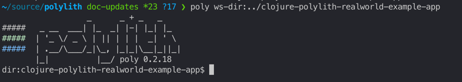

...or load a workspace from an export file, e.g.:

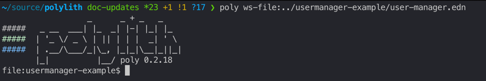

=== Workspace Switch Mechanics

Knowing how the shell supports workspace switching can be helpful.
It is pretty simple:

* After switching to workspace dir `D`, the shell silently appends `ws-dir:D` to each command before it runs it.
* After switching to workspace export file `F`, the shell silently appends `ws-file:F` to each command before it runs it.

== Autocomplete Examples

Autocomplete helps you execute different commands with the correct arguments:

* All valid sub-commands are suggested for a command:
+
[source,text]
----
example$ create
base        component   project
----
* All valid arguments are suggested for a command:
+
[source,text]
----
example$ test
:all          :all-bricks   :dev          :loc          :project      :verbose
brick         project       since
----
* Browse your file system when selecting files and directories:
+
[source,text]
----
example$ switch-ws dir:
../             bases/          components/     deps.edn        development/
projects/       workspace.edn   ~/
----
* Filter specific libraries via the xref:commands.adoc#libs[libs] command:
+
[source,text]
----
example$ libs library:
org.clojure/clojure   org.slf4j/slf4j-nop   zprint/zprint
----
* Browse your workspace structure via the xref:commands.adoc#ws[ws] command:
+
[source,text]
----
example$ ws get:interfaces:user:
definitions               implementing-components   name                      type
----
* Browse documentation with the xref:commands.adoc#doc[doc] command:
+
[source,text]
----
example$ doc help:
check                deps-project         shell
create-base          deps-workspace       switch-ws
create-component     deps                 tap
create-project       diff                 test
create-workspace     doc                  version
create               info                 ws
deps-brick           libs
deps-project-brick   overview
----
* Tag patterns defined in `workspace.edn` are suggested for the `since:` argument:
+
[source,text]
----
example$ info since:
previous-release   previous-stable    release            stable
----
* Remote git branches are suggested for some commands for the `branch:` argument (for autocomplete to work here, you need to start your shell with xref:developing-poly.adoc#all-shell[:all] e.g., `poly :all`):
+
[source,text]
----
usermanager-example$ ws branch:
develop    master     polylith
----
* Only relevant bricks and projects are suggested for the `brick` and `project` arguments:
** The shell only suggests projects marked for testing for the xref:commands.adoc#info[info] and xref:commands.adoc#test[test] commands:
+
[source,text]
----
usermanager-example$ test project:
development   usermanager
----
** After you select a brick from the xref:commands.adoc#deps[deps] command, only projects that contain that brick will be suggested:
+
[source,text]
----
usermanager-example$ deps brick:database project:
development   usermanager
----
** After you select a project from the xref:commands.adoc#deps[deps] command, only bricks from that project will be suggested:
+
[source,text]
----
usermanager-example$ deps project:usermanager brick:
app-state        department       schema-fixture   web
database         schema           user             web-server
----

== Limitations

=== Browsing Directories

When browsing the file system from the `dir:` argument, there are a couple of things worth mentioning:

* To go to the user home directory, you must type the full `~/` and not just `~` (this reflects a limitation in the underlying https://github.com/jline/jline3[jline3] integration):
+
[source,text]
----
example$ switch-ws dir:~/
Public/                      Desktop/                     Templates/
proj/                        Documents/                   Videos/
Downloads/                   Dropbox/                     bin/
Music/                       Pictures/
----
* To navigate to a directory containing spaces, you must type the leading `"`.
+
Notice directory `"foo bar baz"`:
+
[source,text]
----
example$ switch-ws dir:
"foo bar baz"/   bases/           deps.edn         projects/        ~/
../              components/      development/     workspace.edn
----
+
To match it type the leading `"`:
+
[source,text]
----
example$ switch-ws dir:"
"foo bar baz"/
----

=== Creating a Workspace

The poly shell will not suggest `workspace` for the xref:commands.adoc#create[create] command when already associated with a workspace:
[source,text]
----
example$ create
base        component   project
----

You'll typically run xref:commands#create-workspace[create workspace] from your terminal shell (bash, PowerShell, zsh, etc) and then use the poly shell on that workspace:
[source,text]
----
$ poly create workspace name:myws top-ns:com.example
$ cd myws
$ poly
----

If you prefer to use the shell to create a workspace, run the poly shell outside of any workspace directory:

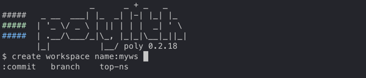

Notice the lack of a workspace name in the prompt.
After you create your workspace, exit the shell and relaunch it from the new workspace directory.