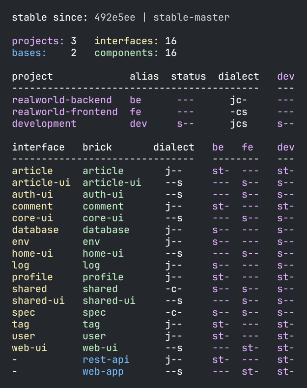

= Source code
:toc:

== Paths

In all our examples thus far, we've shown source code stored in two directories: `src` and `test`.
xref:tools-deps.adoc[Tools.deps] supports splitting source and test code into several directories, as does `poly`.

We've only shown `.clj` files in our examples, but `poly` also recognizes `.cljc` files, which you can use to share code between Clojure and ClojureScript.

We'll contrive an example of splitting source code over multiple directories by exploring two ways of storing `.clj` and `.cljc` files.
Imagine a `company` component that contains both `.clj` and `.cljc` files.
You can choose to store both types of files in the same `src` directory:

[source,shell]
----
├── components
│   ├── company
│   │   ├── src
----

For this strategy, you'd configure the component's `deps.edn` file like so:

[source,clojure]
----
{:paths ["src"]
 ....
----

An alternative is to store the source code in two separate directories:

[source,shell]
----
├── components
│   ├── company
│   │   ├── clj
│   │   ├── cljc
----

And configure `:paths` in the component's `deps.edn` file as:

[source,clojure]
----
{:paths ["clj" "cljc"]
 ....
----

Some prefer this scheme, as it clearly shows where all the `.cljc` code resides.
We are not recommending one strategy over the other.
Our focus is to illustrate splitting source code over multiple paths.

== Resources

The `resources` directory stores non-source files, e.g., images or data, and lives in bricks and, optionally, projects.
To keep resource paths unique on the classpath, `poly` creates a sub-directory under `resources` when creating a brick.
For xref:component.adoc[components], the sub-directory name is the component's xref:interface.adoc[interface] name, and for xref:base.asdoc[bases], it's the base name, e.g.:

[source,shell]
----
├── bases
│   ├── worker
│   │   ├── resources
│   │   │   └── worker
│   │   │       └── mydata.edn
├── components
│   ├── creator
│   │   ├── resources
│   │   │   └── creator ;; <1>
│   │   │       └── logo.png
----
<1> By default, the interface names match component names

If you have resource files that are only used in the test context, then they can be put in a `test-resources` directory.

== ClojureScript
[[clojure-script]]

Starting with version 0.3.0, the poly tool also supports ClojureScript.
To have the tool read `.cljs` files, add "cljs" to the `:dialects` vector in workspace.edn:

[%autowidth]
|===
| Dialects | Description

a| `#{"clj"}`
a| The tool reads files ending with `.clj` + `.cljc`.

a| `#{"cljs"}`
a| The tool reads files ending with `.cljs` and `.cljc`.

a| `#{"clj" "cljs"}`
a| The tool reads files ending with `.clj`, `.cljc`, and `.cljs`.
|===

To list the dialects used in bricks and projects (including their bricks), provide the `:dialect` argument to the xref:commands.adoc#info[info] command:

[source,shell]
----
poly info :dialect
----

This example was taken from the RealWorld https://github.com/furkan3ayraktar/clojure-polylith-realworld-example-app/tree/cljs-frontend[example app], `cljs-frontend` branch, that mixes Clojure and ClojureScript.
