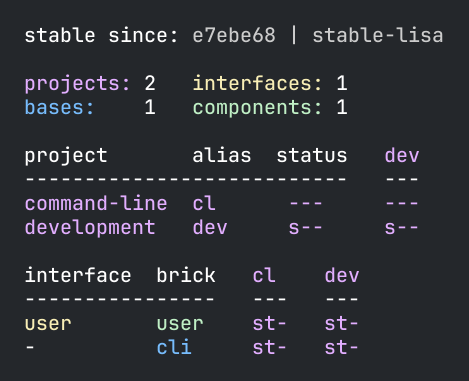
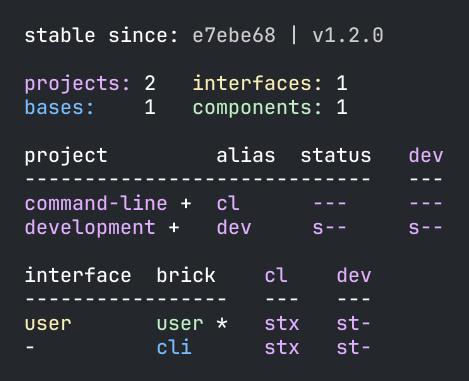
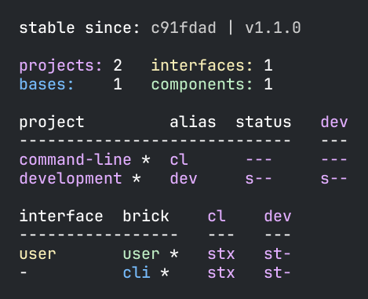

= Tagging

We touched on the concept of a _stable point in time_ in our xref:git.adoc[Git] docs.
Now, we'll show how we use git tagging to mark and move a workspace's _stable point in time_.

We consider a workspace stable when the whole workspace is in a valid state.
For example, when all code compiles, all tests pass, and the xref:commands.adoc#check[check] command executes without error.

The xref:commands.adoc[test] command leverages the concept of stability to support running tests incrementally.
It can reduce a test run to only those tests affected by changes since the last known _stable point in time_.
As you can imagine, skipping unnecessary tests can significantly reduce test run times!

To mark a _stable point in time_, we use a https://git-scm.com/book/en/v2/Git-Basics-Tagging[git tag].

Let's continue with our xref:introduction.adoc[tutorial].
We last left off by xref:git.adoc#add-and-commit[adding and committing your workspace files to git].

Mark your `example` workspace as stable by tagging it with git:

[source,shell]
----
git tag -f stable-lisa # <1>
----
<1> `-f` tells git to move the tag if it already exists

Run `git log --pretty=format'%h %d%n %s`, you'll see something like:

[source,shell]
----
e7ebe68  (HEAD -> main, tag: stable-lisa)  # <1>
 Created the user and cli bricks.
c91fdad
 Workspace created.
----
<1> Notice the `stable-lisa` tag you added is on the second commit.

NOTE: We used `git log --pretty=format'%h %d%n %s` for compact documentation-friendly output.
Feel free to use `git log --pretty=oneline` or even `git log`.

Rerun the `poly xref:commands.adoc#info[info]` command, and you'll see something like this:

****
Remember that git hashes (SHAs and short-SHAs) are globally unique.
Yours will differ from our `e7ebe68` and `c91fdad`.
****

Notice that:

* The `stable since` line shows:
** A short-SHA `e7ebe68` that matches the second commit.
** The `stable-lisa` tag.
* All the `*` (asterisk) markers xref:git.adoc#info-all-changed-example[you saw in the previous info output] are gone because no brick (component or base) or project has changed since our new _stable point in time_.

Run `poly diff`; you'll see no output because nothing has changed.

Our example uses the git tag `stable-lisa`, but `poly` recognizes any tag that starts with `stable-` as a _stable point in time_.
We chose `stable-lisa` because Lisa is our name (let's pretend, at least!).
This convention allows every developer to have their own unique _stable point in time_.

Your continuous integration (CI) build should use its own unique git tag pattern to mark successful builds (and, therefore, stable workspaces).
A convention like `stable-` plus branch name or `stable-` plus build number can work nicely.

We recommend that you start with `stable-` tags created by your CI server and add developer-specific `stable-` tags when needed.

We think that git tags that start with `stable-` is a magnificent naming convention, but if you really prefer something different, you can override this default in your `workspace.edn` file:

[source,clojure]
----
 :tag-patterns {:stable "stable-*" ;; <1>
                :release "v[0-9]*"}
----
<1> Override the default `stable-*` regular expression to your own convention, if you wish

****
Internally, `poly` finds the _stable point in time_ commit via:

[source,shell]
----
git log --pretty=format:'%H %d'
----

For our current example, this outputs:
[source,shell]
----
e7ebe683a775ec28b7c2b5d77e01e79d48149d13 (HEAD -> master, tag: stable-lisa)
c91fdad4a34927d9aacfe4b04ea2f304f3303282
----

The `poly` tool parses the output for the first line that matches the `:stable` tag pattern (by default `stable-*`).
If it finds no matches, the first commit in the git repository is the _stable point in time_ commit.
****

You've seen the `info` command xref:git.adoc#info-all-changed-example[output when all bricks and projects have changed] since the _stable point in time_; all bricks and projects showed a trailing `*` (asterisk).

[[make-a-change]]
What happens if only some bricks have changed?
Let's find out.
Add a comment to the `user.core` namespace by editing `./components/user/src/se/example/user/core.clj`:

// scripts/sections/tagging/user-core-change.clj
[source,clojure]
----
(ns se.example.user.core)

; hi! ;; <1>
(defn hello [name]
  (str "Hello " name "!"))
----
<1> Add a comment line

Run `poly xref:commands.adoc#info[info]` again:

image::images/tagging/output/info-02.png[width=400]

As expected, the `user` component now shows a trailing `*`.
// I was having trouble getting `+` to render so used `&#43;` instead.
Notice that both `command-line` and `development` projects show a trailing `&#43;`.
The `&#43;` indicates the projects have no changes, but at least one of their bricks has changed.

== Release

When you release, we recommend your CI server git tag the release.
But here, we'll have you experiment from your command line shell.

Run `git log --pretty=format'%h %d%n %s` to look at your current commit history and tags:

[source, shell]
----
e7ebe68  (HEAD -> master, tag: stable-lisa)
 Created the user and cli bricks.
c91fdad
 Workspace created.
----

Tag the first commit as `v1.1.0` and the second as `v1.2.0`:

[source,shell]
----
git tag v1.1.0 c91fdad # <1>
git tag v1.2.0
----
<1> replace `c91fdad` with your corresponding SHA for your first commit

Rerun `git log --pretty=format'%h %d%n %s` to verify your new tags:
[source, shell]
----
e7ebe68  (HEAD -> master, tag: v1.2.0, tag: stable-lisa)
 Created the user and cli bricks.
c91fdad  (tag: v1.1.0)
 Workspace created.
----

Now run `poly info` against your latest release:

[source,shell]
----
poly info since:release
----

If you execute `poly info` against the previous release:

[source,shell]
----
poly info since:previous-release
----

The `poly` tool has picked up the second latest release tag.

The `poly` tool matches release tags as defined by your `workspace.edn`:

[source,clojure]
----
 :tag-patterns {:stable "stable-*"
                :release "v[0-9]*"} ;; <1>
----
<1> Default regular expression for git `:release` tags is `v[0-9]*`.

You can use the `since` argument on your CI server to run only the necessary tests since the previous release.
Unaffected code does not need to be retested.

[source,shell]
----
poly test since:previous-release
----

[TIP]
====
You'll use:

* `since:previous-release` if your release process adds a release tag before your build.
* `since:release` if it adds a release tag after your build
====

TIP: If the `since` argument is not specified, `since:stable` is used by default. +
Other variants, like `since:e7ebe68v`, `since:head`, and `since:head~1` are also valid.
