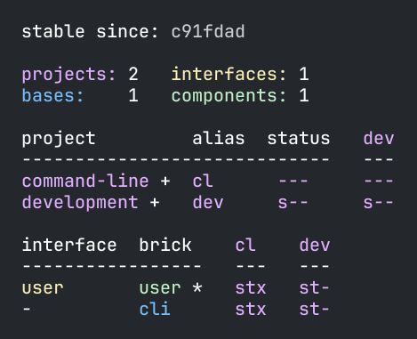
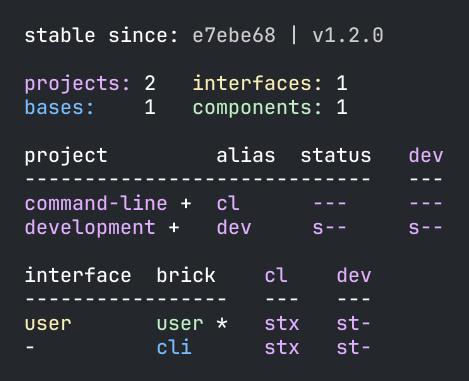
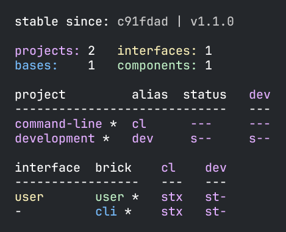

= Tagging

Tags are used in Polylith to mark points in time when we consider the whole codebase (workspace)
to be in a valid state, for example that everything compiles
and that all the tests and the xref:commands.adoc#check[check] command executes without errors.
This is then used by the xref:commands.adoc#test[test] command to run the tests incrementally,
by only executing the affected tests, which substantially speeds up the tests.

The way we mark a stable point in time is to tag it with git (`-f` tells git to reuse the tag if already exists):

[source,shell]
----
git tag -f stable-lisa
----

image::images/tagging/info-01.png[width=400]

If we now run `git log --pretty=oneline` again:

[source,shell]
----
e7ebe683a775ec28b7c2b5d77e01e79d48149d13 (HEAD -> main, tag: stable-lisa) Created the user and cli bricks.
c91fdad4a34927d9aacfe4b04ea2f304f3303282 Workspace created.
----

...we can see that the second commit has been tagged with `stable-lisa`.
Note that your hash tags will be different and when we refer to e.g. `c91fdad` in the following examples,
you should instead give your own corresponding hash code.

If we execute the xref:commands.adoc#info[info] command:

image::images/tagging/info-01.png[width=400]

...the `stable since` hash has been updated and is now tagged with `stable-lisa`.
All the `*` signs are gone because no component, base or project has yet changed since the second commit
(which can be verified by running `poly diff` again).

We added the tag `stable-lisa` but we could have named the tag with anything that starts with `stable-`.
We choose `stable-lisa` because Lisa is our name (let's pretend that at least!).
The idea is that every developer could use their own unique tag name that doesn't conflict with other developers.

The CI build should also use its own pattern, like `stable-` plus branch name or build number,
to mark successful builds. It may be enough to only use the stable points that the CI server creates.
That is at least a good way to start out and only add custom tags per developer when needed.

The pattern is configured in `workspace.edn` and can be changed if we prefer something else:

[source,clojure]
----
 :tag-patterns {:stable "stable-*"
                :release "v[0-9]*"}
----

The way the tool finds the latest tag is to execute this command internally:

[source,shell]
----
git log --pretty=format:'%H %d'
----

Then it uses the first line of the output that matches the regular expression (e.g. `stable-*`)
or if no match was found, the first commit in the repository.

Earlier when we changed a project by editing its `deps.edn` file, it got a trailing `*` to indicate that it was changed.
But what happens if only some of its bricks have changed? Let's try that by adding a comment to the `user.core` namespace:

// scripts/sections/tagging/user-core-change.clj
[source,clojure]
----
(ns se.example.user.core)

; hi!
(defn hello [name]
      (str "Hello " name "!"))
----

...and execute the xref:commands.adoc#info[info] command again:

Now the two projects are marked with a `+` which indicates that the projects themselves are unchanged
but that at least one of their bricks has changed.

== Release

When we release, we probably want the CI server to tag the release.
Here we tag the first commit as `v1.1.0` and the second as `v1.2.0`
(make sure you replace `c91fdad` with your corresponding sha):

[source,shell]
----
git tag v1.1.0 c91fdad
git tag v1.2.0
----

If we execute:

[source,shell]
----
poly info since:release
----

...it picks the latest release tag that follows the pattern defined in `workspace.edn`:

[source,clojure]
----
 :tag-patterns {...
                :release "v[0-9]*"}
----

If we execute:

[source,shell]
----
poly info since:previous-release
----

...it picks the second latest release tag.

By executing `git log --pretty=oneline` we can verify that the tags are correctly set:

[source,shell]
----
e7ebe683a775ec28b7c2b5d77e01e79d48149d13 (HEAD -> main, tag: v1.2.0, tag: stable-lisa) Created the user and cli bricks.
c91fdad4a34927d9aacfe4b04ea2f304f3303282 (tag: v1.1.0) Workspace created.
----

The `since` parameter is used by the CI server to run all tests since the previous release, e.g.:

[source,shell]
----
poly test since:previous-release
----

Depending on whether we tag before or after the build, we will choose `release` or `previous-release`.
If `since` is not given, `stable` will be used by default.

Some other variants, like `since:e7ebe68v`, `since:head`, or `since:head~1` are also valid.
