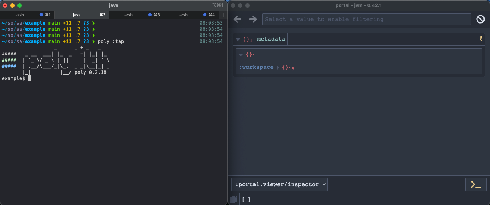
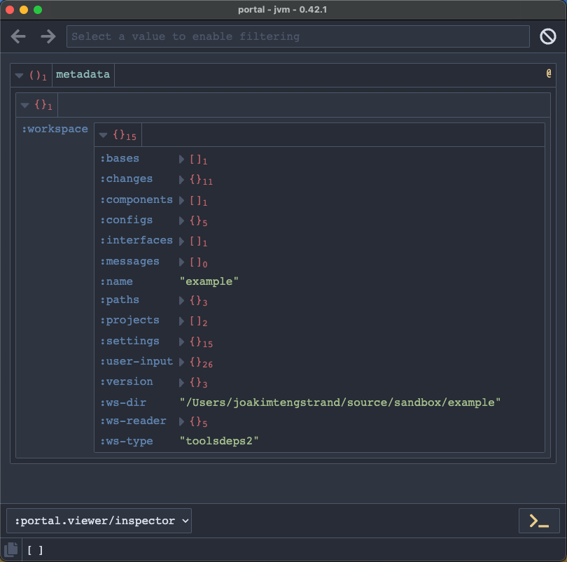

= Tap

The `tap` command is mainly for `poly` tool development,
but can also be used to browse the internal xref:workspace-structure.adoc[workspace structure].

We can open a https://github.com/djblue/portal[portal] window by passing in `:tap` when starting a shell,
e.g. `poly :tap` or by executing the xref:commands.adoc#tap[tap] command from a xref:shell[shell]:

We can dig into the
https://app.gitbook.com/o/-LAhrWK-mSHRqiTNUTDP/s/-Mj2L4VeP3frziYOoQWC/~/changes/124/workspace-structure[workspace structure]
by clicking the `:workspace` key:

The portal window outputs data from https://clojuredocs.org/clojure.core/tap%3E[tap>]
statements produced by the `poly` tool itself. With start from version `0.2.18`,
there will be only one `tap>` statement, which outputs the workspace structure.
