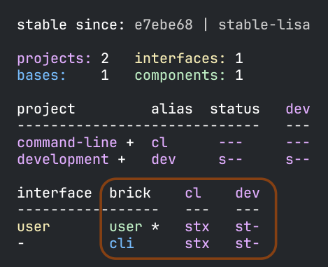
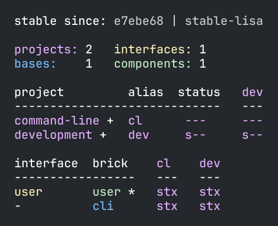
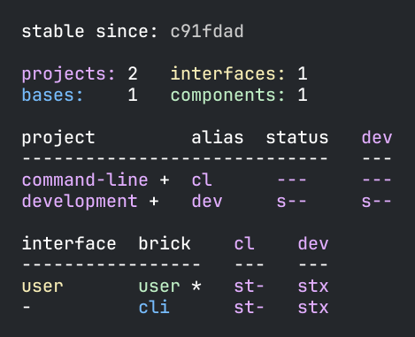
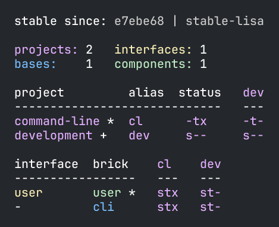
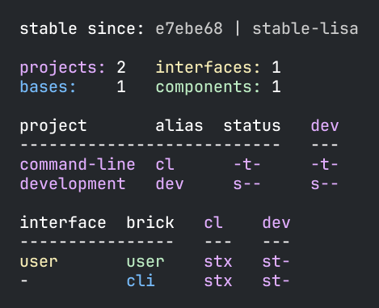
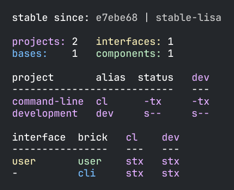

= Testing
:toc:

Polylith encourages a test-centric approach when working with code.
New brick tests are easy to write,
and mocking can be avoided in most cases as we have access to all components from the projects they live in.

Let's go back to our example and run the xref:commands.adoc#info[info] command:

...we can see that the `user` component is marked with an asterisk, `*`.
That is because its `core` namespace has been changed (remember that we added a "hi" comment to its
xref:../scripts/sections/tagging/user-core-change.clj[core] namespace).

If we look carefully we will also notice that the status flags `stx`
under the `cl` column now has an `x` in its last position.
As we already know, this means that the tests for `user` and `cli` will be executed from the `command-line` project
if we execute the xref:commands.adoc#test[test] command.

But why is `cli` marked to be tested?
The reason is that even though `cli` itself hasn't changed,
it depends on something that has, namely the `user` component.

The columns under the `development` project are all marked as `st-`.
The reason the `development` project is not marked to be tested
is that the `development` project's tests are not included by default.

But before we run the xref:commands.adoc#test[test] command,
we should first add a test by editing the `interface-test` namespace in the `user` component:

// scripts/sections/testing/user-interface-test.clj
[source,clojure]
----
(ns se.example.user.interface-test
  (:require [clojure.test :refer :all]
            [se.example.user.interface :as user]))

(deftest hello--when-called-with-a-name--then-return-hello-phrase
  (is (= "Hello Lisa!"
         (user/hello "Lisa"))))
----

To demonstrate how the tool handles failing tests, let's change the `core` namespace in the `user` component:

// scripts/sections/testing/user-core.clj
[source,clojure]
----
(ns se.example.user.core)

(defn hello [name]
  (str "Hello " name "!!"))
----

====
NOTE: If you are a Cursive user and the test doesn't run at all, you may need to manually set the module to
the root module (`example` in this case). This is reported to Cursive as issue https://github.com/cursive-ide/cursive/issues/2828[2828].
====

Now we can run the test from the IDE:

* Make sure the namespace is loaded, e.g. via the menu (or keyboard shortcuts) `Tools` > `REPL` > `Load File in REPL`.

* Or, place the cursor under the test and run: `Tools` > `REPL` > `Run Test under carret in REPL`

image::images/testing/failing-test.png[]

And if we run the xref:commands.adoc#test[test] command, it fails too:

[source,shell]
----
poly test
----

// scripts/output/testing-test-failing.txt
[source,shell]
----
Projects to run tests from: command-line

Running tests for the command-line project using test runner: Polylith built-in clojure.test runner...
Running tests from the command-line project, including 2 bricks: user, cli

Testing se.example.cli.core-test

Ran 1 tests containing 1 assertions.
0 failures, 0 errors.

Test results: 1 passes, 0 failures, 0 errors.

Testing se.example.user.interface-test

FAIL in (hello--when-called-with-a-name--then-return-hello-phrase) (interface_test.clj:6)
expected: (= "Hello Lisa!" (user/hello "Lisa"))
  actual: (not (= "Hello Lisa!" "Hello Lisa!!"))

Ran 1 tests containing 1 assertions.
1 failures, 0 errors.

Test results: 0 passes, 1 failures, 0 errors.
exit code: 1
----

Because we added an extra `!`, we now need to update the corresponding test accordingly:

// scripts/sections/testing/user-interface-test2.clj
[source,clojure]
----
(ns se.example.user.interface-test
  (:require [clojure.test :refer :all]
            [se.example.user.interface :as user]))

(deftest hello--when-called-with-a-name--then-return-hello-phrase
  (is (= "Hello Lisa!!"
         (user/hello "Lisa"))))
----

If we run the test again from the REPL, it will now turn to green:

image::images/testing/successful-test.png[]

...and the test command will pass too:

// scripts/output/testing-test-ok.txt
[source,shell]
----
Projects to run tests from: command-line

Running tests for the command-line project using test runner: Polylith built-in clojure.test runner...
Running tests from the command-line project, including 2 bricks: user, cli

Testing se.example.cli.core-test

Ran 1 tests containing 1 assertions.
0 failures, 0 errors.

Test results: 1 passes, 0 failures, 0 errors.

Testing se.example.user.interface-test

Ran 1 tests containing 1 assertions.
0 failures, 0 errors.

Test results: 1 passes, 0 failures, 0 errors.

Execution time: x seconds
exit code: 0
----

We have already mentioned that the brick tests will not be executed from the `development` project
when we run the `test` command. But there is a way to do that, and that is to pass in `:dev`.

Let's try it out with the xref:commands.adoc#info[info] command first:

[source,shell]
----
poly info :dev
----

Now both the `command-line` and the `development` project is marked for test execution.

== Test Filters

=== Filter on projects

We can narrow the number of projects we want to test by passing in e.g. `project:dev` or `project:cl:dev`
(both project alias and name can be used).

If only `:dev` is given, then only the `development` project will be included:

[source,shell]
----
poly info project:dev
----

But if we want to get the same behaviour as `poly info :dev` we need to list all projects + `development`:

[source,shell]
----
poly info project:cl:dev
----

image::images/testing/info-project-cl-dev.png[width=400]

=== Filter on bricks

It's not just possible to filter which projects to run our tests from, but also which bricks to include.

Right now our workspace looks like this:

[source,shell]
----
poly info
----

image::images/testing/info-filter-on-bricks.png[width=400]

Both bricks in the `cl` project are marked to be tested.

If we select the `cli` brick:

[source,shell]
----
poly info brick:cli
----

image::images/testing/info-brick-cli.png[width=400]

...now only that brick is marked to be tested.

Let's pretend that no bricks were marked to be tested:

image::images/testing/info-no-changes.png[width=400]

If we run the same command again:

image::images/testing/info-brick-cli-no-changes.png[width=400]

...we get the same result, and that's because the `brick:cli` parameter is just a filter
that is applied after the other status calculations have been performed.

If we want to force the cli tests to be executed,
we need to pass in `:all-bricks` (or `:all` if we also want to execute the project tests):

[source,shell]
----
poly info brick:cli :all-bricks
----

image::images/testing/info-brick-cli-no-changes-all-bricks.png[width=400]

Finally, the `cli` brick is now marked to be tested!

It's also possible to give more than one brick, e.g. `brick:cli:user`.
Another trick we can do is to exclude all bricks with `brick:-`
which can be useful in combination with `:project` or `:all` to execute only the project tests.

== Project tests

Before we execute any tests, let's add a project test for the `command-line` project.

Begin by adding a `test` directory for the `command-line` project:

[source,shell]
----
example
├── projects
│   └── command-line
│       └── test
----

Then add the "test" path to `projects/command-line/deps.edn`:

[source,clojure]
----
 :aliases {:test {:extra-paths ["test"]
                  :extra-deps  {}}
----

...and to `./deps.edn`:

[source,clojure]
----
            :test {:extra-paths ["components/user/test"
                                 "bases/cli/test"
                                 "projects/command-line/test"]}
----

Now add the `project.command-line.dummy-test` namespace to the `command-line` project:

[source,shell]
----
example
├── projects
│   └── command-line
│       └── test
│           └── project
│               └──command_line
│                  └──dummy_test.clj
----

// scripts/sections/testing/dummy_test.clj
[source,clojure]
----
(ns project.command-line.dummy_test
  (:require [clojure.test :refer :all]))

(deftest dummy-test
  (is (= 1 1)))
----

We could have chosen another top namespace, e.g., `se.example.project.command-line`,
as long as we don't have any brick with the name `project`.
But because we don't want to get into any name conflicts with bricks and also because each project is executed in isolation,
the choice of namespace is less important and here we choose the `project.command-line` top namespace to keep it simple.

Normally, we are forced to put our tests in the same namespace as the code we want to test,
to get proper access, but in Polylith the encapsulation is guaranteed by the `poly` tool
and all code can therefore be declared public, which allows us to put the test code wherever we want.

If we execute the xref:commands.adoc#info[info] command:

...the `command-line` project is marked as changed and flagged as `-t-` telling us that it now has a `test` directory.
The `-t-` in the `dev` column says that it has been added to the `development` project.
The reason it's not tagged as `-tx` is that project tests are not marked to be executed
without explicitly telling them to, by passing in `:project`.

[source,shell]
----
poly info :project
----

Now the `command-line` project is also marked to be tested. Let's verify that by running the tests:

[source,shell]
----
poly test :project
----

// scripts/output/testing-test-project.txt
[source,shell]
----
Projects to run tests from: command-line

Running tests for the command-line project using test runner: Polylith built-in clojure.test runner...
Running tests from the command-line project, including 2 bricks and 1 project: user, cli, command-line

Testing se.example.cli.core-test

Ran 1 tests containing 1 assertions.
0 failures, 0 errors.

Test results: 1 passes, 0 failures, 0 errors.

Testing se.example.user.interface-test

Ran 1 tests containing 1 assertions.
0 failures, 0 errors.

Test results: 1 passes, 0 failures, 0 errors.

Testing project.command-line.dummy_test

Ran 1 tests containing 1 assertions.
0 failures, 0 errors.

Test results: 1 passes, 0 failures, 0 errors.

Execution time: 2 seconds
exit code: 0
----

They passed!

== Test approaches

As you have just seen, with Polylith we can add tests at two different levels: brick and project.

The _project_ tests should be used for our slow tests, e.g. tests that take more than 100 milliseconds to execute,
or whatever we draw the line. The project tests also give us a way to write tailor-made tests that are unique per project.

The second category is the _brick_ tests.
To keep the feedback loop short, we should only put fast-running tests in our bricks.
This will give us a faster feedback loop,
because the brick tests are the ones that are executed when we run `poly test` while the project tests are not.

But does that mean we are only allowed to put unit tests in our bricks?
No. As long as the tests are fast (by e.g. using in-memory databases) they should be put in the bricks they belong to.

Before we continue, let's commit what we have done so far and mark the workspace as stable:

[source,shell]
----
git add --all
git commit -m "Added tests"
git tag -f stable-lisa
----

If we execute the xref:commands.adoc#info[info] command again:

image::images/testing/info-added-tests.png[width=400]

...the `*` signs are now gone and nothing is marked to be tested.

The tool only executes tests if a brick is directly or indirectly changed.
A way to force it to test all bricks is to pass in `:all-bricks`:

[source,shell]
----
poly info :all-bricks
----

Now all the brick tests are marked to be executed, except for the `development` project.
To include it, also add `:dev`:

To include all brick and project tests (except `development`) we can type:

[source,shell]
----
poly info :all
----

image::images/testing/info-all.png[width=400]

...to also include `development`, type:

[source,shell]
----
poly info :all :dev
----

Running the brick tests from the `development` projects are something we normally only want to do
in the beginning, before any production projects have been added.

Now let's see if it actually works:

[source,shell]
----
poly test :all :dev
----

// scripts/output/testing-test-all-dev.txt
[source,shell]
----
Projects to run tests from: command-line, development

Running tests for the command-line project using test runner: Polylith built-in clojure.test runner...
Running tests from the command-line project, including 2 bricks and 1 project: user, cli, command-line

Testing se.example.cli.core-test

Ran 1 tests containing 1 assertions.
0 failures, 0 errors.

Test results: 1 passes, 0 failures, 0 errors.

Testing se.example.user.interface-test

Ran 1 tests containing 1 assertions.
0 failures, 0 errors.

Test results: 1 passes, 0 failures, 0 errors.

Testing project.command-line.dummy_test

Ran 1 tests containing 1 assertions.
0 failures, 0 errors.

Test results: 1 passes, 0 failures, 0 errors.
Running tests for the development project using test runner: Polylith built-in clojure.test runner...
Running tests from the development project, including 2 bricks and 1 project: user, cli, command-line

Testing se.example.cli.core-test

Ran 1 tests containing 1 assertions.
0 failures, 0 errors.

Test results: 1 passes, 0 failures, 0 errors.

Testing se.example.user.interface-test

Ran 1 tests containing 1 assertions.
0 failures, 0 errors.

Test results: 1 passes, 0 failures, 0 errors.

Execution time: x seconds
exit code: 0
----

Looks like it worked!

[#setup-and-teardown]
== Test setup and teardown

Sometimes we need to perform some test setup/teardown before and after we execute the tests for a project.

If any code is used by more than one project, we can put it in a separate component,
but in this case we should put it in the `command-line` project's `test` directory because it's not used by any other project.

Let's create a `test-setup` namespace in the project's test directory and add two functions to it:

[source,shell]
----
example
├── projects
│   └── command-line
│       └── test
│           └── project
│               └──command_line
│                  └──test_setup.clj
----

// scripts/sections/testing/command-line-test-setup.clj
[source,clojure]
----
(ns project.command-line.test-setup
  (:require [clojure.test :refer :all]))

(defn test-setup [project-name]
  (println (str "--- test setup for " project-name " ---")))

(defn test-teardown [project-name]
  (println (str "--- test teardown for " project-name " ---")))
----

We need to keep two things in mind:

* Make sure the source code which contains our function, is accessible from the project it's executed from
(the `command-line` project in this case).
Here the project's own test directory was already added earlier by the
xref:commands.adoc#create-project[create project] command, so we are fine.

* Make sure the functions take exactly one parameter, the project name.

We also need to specify the two functions in `workspace.edn`:

[source,clojure]
----
 ...
 :projects {"development" {:alias "dev"}
            "command-line" {:alias "cl"
                            :test {:setup-fn project.command-line.test-setup/setup
                                   :teardown-fn project.command-line.test-setup/teardown}}}}
----

If we don't need the tear-down function, we can leave it out.

Let's run our tests:

[source,shell]
----
poly test :all
----

// scripts/output/testing-test-all.txt
[source,text]
----
Projects to run tests from: command-line

Running test setup for the command-line project: project.command-line.test-setup/test-setup
--- test setup for command-line ---

Running tests for the command-line project using test runner: Polylith built-in clojure.test runner...
Running tests from the command-line project, including 2 bricks and 1 project: user, cli, command-line

Testing se.example.cli.core-test

Ran 1 tests containing 1 assertions.
0 failures, 0 errors.

Test results: 1 passes, 0 failures, 0 errors.

Testing se.example.user.interface-test

Ran 1 tests containing 1 assertions.
0 failures, 0 errors.

Test results: 1 passes, 0 failures, 0 errors.

Testing project.command-line.test-setup

Ran 0 tests containing 0 assertions.
0 failures, 0 errors.

Test results: 0 passes, 0 failures, 0 errors.

Testing project.command-line.dummy_test

Ran 1 tests containing 1 assertions.
0 failures, 0 errors.

Test results: 1 passes, 0 failures, 0 errors.
Running test teardown for the command-line project: project.command-line.test-setup/test-teardown
--- test teardown for command-line ---

Execution time: 2 seconds
exit code: 0
----

Nice, it worked!

== Include and exclude bricks

There is a way to restrict what test code to run for a project,
by giving a list of bricks to include and/or exclude in `workspace.edn`, e.g.:

[#include-exclude]
[source,clojure]
----
{...
 :projects {"mytool" {:alias "t"
                      :test {:include []}}
            "myservice" {:alias "s"
                         :test {:exclude ["cli" "user"]}}
            ...
----

The old shorter syntax for including bricks is also valid:

[source,clojure]
----
{...
  :projects {"command-line" {:alias "cl", :test []}
             ....
----

You may wonder when this could be useful.
A good example is the polylith codebase itself, where `workspace.edn` looks similar to this:

[source,clojure]
----
...
  :projects {"poly" {:alias "poly"}
             "polyx" {:alias "polyx" :test []}
             "development" {:alias "dev"}
             ...
----

Here the tests are only executed from the `poly` project
(the `development` project is not included anyway, unless we explicitly ask for it).
The idea here is to speed up the test execution time.
This is only a good idea if we are pretty sure that our bricks behave the same in all our projects,
which is true in this case.

Note that if a brick is excluded by using `:include` or `:exclude`,
it will never be tested from that project even if we pass in `:project` or `:all` to the command.

== Summary

Let's summarise the different ways to run the tests.
The brick tests are executed from all projects they belong to except for the `development` project
(if `:dev` is not passed in):

[%autowidth]
|===
| Command | Tests to execute

| `poly test` | All brick tests that are directly or indirectly changed.
| `poly test :project` | All brick tests that are directly or indirectly changed + tests for changed projects.
| `poly test :all‑bricks` | All brick tests.
| `poly test :all` | All brick tests + all project tests (except `development`), executed from all projects.
|===

To also execute the brick tests from the `development` project, we can pass in `:dev`:

[%autowidth]
|===
| Command | Tests to execute

| `poly test :dev` | All brick tests that are directly or indirectly changed, executed from all projects (`development` included).
| `poly test :project :dev` | All brick tests that are directly or indirectly changed, executed from all projects (`development` included).
| `poly test :all‑bricks :dev` | All brick tests, executed from all projects (`development` included).
| `poly test :all :dev` | All brick tests, executed from all projects (`development` included) + all project tests (`development` included).
|===

Projects can also be explicitly selected with e.g. `project:proj1` or `project:proj1:proj2`.

We can also filter which bricks to run the tests for with e.g. `brick:b1` or `brick:b1:b2`.

Remember that executing the xref:commands.adoc#info[info] command is a good way to get an overview of what tests will be run.

== How tests are executed

Let's start with the `development` project.
The main purpose of this project is to allow us to work with our code from an IDE using a single REPL.
When doing that, the project must be set up in a way that it's 100% compatible with tool.deps and the IDE integration.
This is also the reason we have to add the test paths explicitly in `./deps.edn`
which gives us access to the tests from the REPL.

The `./deps.edn` config file sets up all our paths and dependencies, and when we include the `:dev` and `:test` aliases
(and sometimes xref:profile.adoc[profile] aliases)
we inform tools.deps what source code and libraries should be accessible from our IDE and REPL.
When this is set up correctly, we are also able to run our tests from the REPL,
which will have access to all `test` and `src` code.
Libraries that are defined in the `src` context will therefore automatically be accessible when running the tests.
Additional libraries that are only used from the tests should be defined in the `test` context.

When we run the `test` command, the tool will detect which components, bases and projects
have been affected since the _last stable point in time_.
Based on this information, it will go through all the affected projects, one at a time,
and run the component, base, and project tests that are included in each project.

This set of tests will be executed in isolation from its own classloader which will speed up the test execution
and make it more reliable. Libraries from both the `src` and `test` context
(and libraries that they depend on) will be used when the tests are executed.
The `development` project can also be used to run tests, but that's not its main purpose.

If the projects A, B, C and D are included in the test run and if a test in B fails (or a project test setup or teardown)
then the whole test run will stop, and no tests are executed for C or D.

The libraries to use in each project when running the `poly test` command
is the sum of all library dependencies that are defined in all the components and bases
(either indirectly via `:local/root` or directly by using `:deps/extra-deps`).
If a library is defined more than once in the set of bricks and projects,
then the latest version of that library will be used, if not overridden by `:override-deps` in the project.

At the project level we only need to define the libraries that are not defined in the included bricks
(specified by its `:deps` key) which can be libraries like clojure itself, `org.clojure/clojure`,
that we don't want to repeat in all our bricks.

If we have a brick like `datomic-ions`, we can specify which repository it needs, like
https://github.com/polyfy/polylith/blob/edaef89207c2852010132e863ae87ebba5bedc5b/examples/local-dep/components/datomic-ions/deps.edn#L1[this].
We can verify that the repo is picked up by the brick by executing `poly ws get:components:datomic-ions:maven-repos`:

[source,clojure]
----
{"datomic-cloud" {:url "s3://datomic-releases-1fc2183a/maven/releases"}}
----

...and that it's used by the `invoicing` project by executing `poly ws get:projects:invoicing:maven-repos`:

[source,clojure]
----
{"central" {:url "https://repo1.maven.org/maven2/"},
 "clojars" {:url "https://repo.clojars.org/"},
 "datomic-cloud" {:url "s3://datomic-releases-1fc2183a/maven/releases"}}
----

Every project that uses the _datomic-ions_ brick will now also include the `datomic-cloud` repository.

== Troubleshooting

If our tests don't work properly for some reason,
we can pass in `:verbose` to see what configuration and paths that is used when executing the tests:

[source,shell]
----
poly test :verbose
----

[source,clojure]
----
# config:
{:mvn/repos {"central" {:url "https://repo1.maven.org/maven2/"}, ...
# paths:
["bases/cli/resources" "bases/cli/src" "components/user-remote/resources" ...
----

== Long living shell sessions

If you let the same xref:shell[shell] session live for a long time, you may get `classloader` errors
after a while, when running the xref:testing.adoc[test] command.
The solution is to restart the shell or to only run the tests outside the shell, e.g. `poly test`.
Another solution can be to switch to a more isolated test runner.
