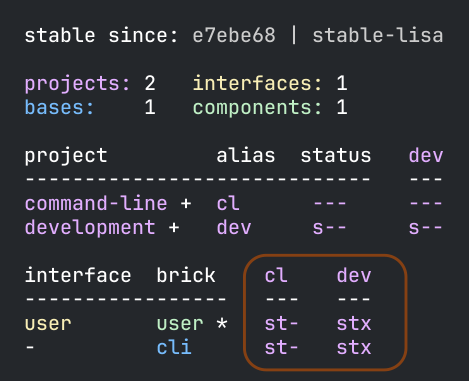
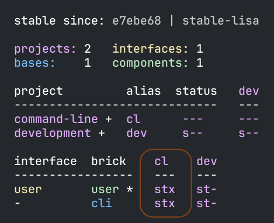

= Testing
:toc:

Polylith encourages a test-centric approach when working with code.
New tests are easy to write, and you can avoid mocking in most cases because you can access all xref:component.adoc[components] from your xref:workspace.adoc[workspace].

You write tests for your bricks (xref:base.adoc[bases] and xref:component.adoc[components]) and xref:project.adoc[deployable projects].
The `poly` tool always runs brick tests from the context of the deployable projects that reference them.
This convention verifies that the bricks tests pass using the classpath formulated from the project and all its referenced bricks.

The `development` project offers a way to run tests from your REPL and a temporary home (and test vehicle) for new bricks that aren't yet part of any deployable project.

Let's continue with our xref:introduction.adoc[tutorial], we last left off exploring xref:tagging.adoc[tagging].

The xref:commands.adoc#info[info] command provides a great way to see what tests `poly` will run.
Rerun `poly info`:

TIP: See the xref:flags.adoc[Flags] doc for a general description of flags.

Notice that `poly` has marked the `user` component with `*` (asterisk) because as part of our tutorial, xref:tagging.adoc#make-a-change[you changed its core namespace].

Notice the `stx` flags under the `cl` column for both the `user` and `cli` bricks.
The `x` flags mean `poly xref:commands.adoc#test[test]` will run tests for these bricks from the `command-line` project.

There is no `*` after the `cli` brick, so why is it marked to be tested with the `x` flag?
Well, even though the `cli` brick hasn't changed, it depends on the `user` brick, which has changed, so `poly` needs to retest it.

Notice the absence of the `x` flag in the `st-` flags under the `dev` column for both the `user` and `cli` bricks.
Bricks are not tested from the `development` by default.

Before you run the xref:commands.adoc#test[test] command, edit the `interface-test` namespace in the `user` component.
Replace the `dummy-test` with a real test:

// scripts/sections/testing/user-interface-test.clj
.components/user/test/se/example/user/interface_test.clj
[source,clojure]
----
(ns se.example.user.interface-test
  (:require [clojure.test :refer :all]
            [se.example.user.interface :as user]))

(deftest hello--when-called-with-a-name--then-return-hello-phrase
  (is (= "Hello Lisa!"
         (user/hello "Lisa"))))
----

To explore how `poly` handles a failing test, change the `core` namespace in the `user` component:

// scripts/sections/testing/user-core.clj
.components/user/src/se/example/user/core.clj
[source,clojure]
----
(ns se.example.user.core)

(defn hello [name]
  (str "Hello " name "!!")) ;; <1>
----
<1> Add an extra `!`

[TIP]
====
*Cursive users*:
You can run the test from your IDE:

* Make sure the namespace is loaded, e.g. via the menu (or keyboard shortcuts) `Tools > REPL > Load File in REPL`.

* Or, place the cursor under the test and run: `Tools > REPL > Run Test under carret in REPL`

image::images/testing/failing-test.png[]
====

[TIP]
====
*Cursive users*:

If you haven't already, you need to instruct Cursive to run tests from the root module, see instructions https://cursive-ide.com/userguide/polylith.html[here].

====

[NOTE]
====
In some of the examples that follow, the `poly` exit code is relevant.
In those cases, at the end of the output, we'll show the exit code like so:

[source,shell]
----
# Exit code: 0
----

This line is not part of the actual `poly` output and is only a convention to convey the process exit code to you.
As is the standard convention, an exit code of `0` conveys success.
====

Run the xref:commands.adoc#test[test] command:

[source,shell]
----
poly test
----

You should see output like this:

// scripts/output/testing-test-failing.txt
[source,shell]
----
Projects to run tests from: command-line

Running tests for the command-line project using test runner: Polylith built-in clojure.test runner... ;; <1>
Running tests from the command-line project, including 2 bricks: user, cli ;; <2>

Testing se.example.cli.core-test

Ran 1 tests containing 1 assertions.
0 failures, 0 errors.

Test results: 1 passes, 0 failures, 0 errors.

Testing se.example.user.interface-test

FAIL in (hello--when-called-with-a-name--then-return-hello-phrase) (interface_test.clj:6) # <3>
expected: (= "Hello Lisa!" (user/hello "Lisa"))
  actual: (not (= "Hello Lisa!" "Hello Lisa!!"))

Ran 1 tests containing 1 assertions.
1 failures, 0 errors. # <3>

Test results: 0 passes, 1 failures, 0 errors. # <3>

# Exit code: 1 # <3>
----
<1> The `poly` tool runs tests in the context of each project.
<2> The referenced bricks are tested within the context of the project.
<3> Notice evidence of the failing test

Adapt your test to match the new behavior:

// scripts/sections/testing/user-interface-test2.clj
.components/user/test/se/example/user/interface_test.clj
[source,clojure]
----
(ns se.example.user.interface-test
  (:require [clojure.test :refer :all]
            [se.example.user.interface :as user]))

(deftest hello--when-called-with-a-name--then-return-hello-phrase
  (is (= "Hello Lisa!!" ;; <1>
         (user/hello "Lisa"))))
----
<1> Edit to expect the extra `!` so the test will pass

[TIP]
====
*Cursive users*:
If you rerun the test from the REPL, it will now turn green:

image::images/testing/successful-test.png[]
====

Rerun `test` with poly:

[source,shell]
----
poly test
----

You should see output like this:

// scripts/output/testing-test-ok.txt
[source,shell]
----
Projects to run tests from: command-line

Running tests for the command-line project using test runner: Polylith built-in clojure.test runner...
Running tests from the command-line project, including 2 bricks: user, cli

Testing se.example.cli.core-test

Ran 1 tests containing 1 assertions.
0 failures, 0 errors.

Test results: 1 passes, 0 failures, 0 errors.

Testing se.example.user.interface-test

Ran 1 tests containing 1 assertions.
0 failures, 0 errors. # <1>

Test results: 1 passes, 0 failures, 0 errors. # <1>

Execution time: 1 seconds

# Exit code: 0 # <1>
----
<1> Notice evidence of the now-passing test

TIP: From the build pipeline there is an option to return an error code if there are no tests to run: `poly test :fail-if-nothing-to-test`.

Brick tests are not evaluated for execution from the `development` project by default.
Specify the `:dev` argument to include the `development` project.

Try it out with the xref:commands.adoc#info[info] command to see the impact of what will be tested:

[source,shell]
----
poly info :dev
----

Notice under the `dev` column, `poly` marked both the `user` and the `cli` bricks for test execution with the `x` flag.

TIP: You don't need to bring in `dev` for test execution when your projects reference all your bricks.
But sometimes, you'll create a brick before a project.
In this case, you can include the brick for testing from `dev`.

TIP: When a brick is marked for testing from multiple projects, `poly` will run its tests in the context of each of those projects.

== Test Filters

[[filter-projects]]
=== Filter on Projects

You can narrow the number of projects to test by specifying, e.g., `project:dev` or `project:cl:dev`.

****
You can use full project names or aliases:

* `project:development` is equivalent to `project:dev`
* `project:command-line:development` is the same as `project:cl:dev`
****

If you only specify `project:dev`, then `poly` only includes the `development` project:

[source,shell]
----
poly info project:dev
----

Notice:

* the absence of `x` in the `st-` flags under the `cl` column
* the presence of `x` in the `stx` flags under the `dev` column.

You can consider `poly info :dev` as a shorthand for selecting all projects.
The equivalent, when specifying the `project` argument, requires specifying all projects:

[source,shell]
----
poly info project:cl:dev
----

TIP: We'll show later that the `project` argument also applies to xref:#project-tests[project tests].

[[filter-bricks]]
=== Filter on Bricks

You can also filter which bricks to include for test execution.
If you've been following the tutorial, your workspace looks like this:

[source,shell]
----
poly info
----

The `x` flags under the `cl` column mean `poly` will test both bricks from the `command-line` project.

If you filter on the `cli` brick:

[source,shell]
----
poly info brick:cli
----

Notice that `poly` has marked only the `cli` brick for testing.

Let's pretend that no bricks are marked by `poly` for testing:

Rerunning `poly info brick:cli` again gives the exact same result:

The `poly` tool applies the `brick:cli` filter argument after it has evaluated `cli` for test execution.

If you want to force the `cli` brick tests to run, you need to pass in `:all-bricks` (or `:all`, if you also want to execute the project tests):

[source,shell]
----
poly info brick:cli :all-bricks
----

Notice the `x` in `stx` flags; you have forced `poly` to mark the `cli` brick for testing.

You can specify multiple bricks, e.g., `brick:cli:user`.

You can exclude all bricks with the `brick:-` argument, which can be useful when combined with `:project` or `:all` to execute only the project tests.

[[project-tests]]
== Project Tests

Before we proceed, let's add a test to the `command-line` project.

Add a `test` directory to the `command-line` project:

[source,shell]
----
example
├── projects
│   └── command-line
│       └── test
----

Then add the `test` path to `projects/command-line/deps.edn`:

[source,clojure]
----
 :aliases {:test {:extra-paths ["test"] ;; <1>
                  :extra-deps  {}}
----
<1> Add `test` path

Now add this same path to your `./deps.edn`:

[source,clojure]
----
            :test {:extra-paths ["components/user/test"
                                 "bases/cli/test"
                                 "projects/command-line/test"]} ;; <1>
----
<1> Add `projects/command-line/test` path

Finally, add a `project.command-line.dummy-test` namespace to the `command-line` project:

[source,shell]
----
example
├── projects
│   └── command-line
│       └── test
│           └── project
│               └──command_line
│                  └──dummy_test.clj
----

// scripts/sections/testing/dummy_test.clj
[source,clojure]
----
(ns project.command-line.dummy_test ;; <1>
  (:require [clojure.test :refer :all]))

(deftest dummy-test
  (is (= 1 1)))
----
<1> If you've been following our tutorial, you might notice we did not begin with our top namespace `se.example`.
We could have chosen `se.example.project.command-line`, but note that this would conflict if we also had `project` brick.
To avoid conflicts with bricks and keep things short and simple, we've opted for `project.command-line` here.
Also, because `poly` executes each project in isolation, the choice of namespace is less critical.

NOTE: Normally, when you write tests in Clojure, you match the test namespace to the namespace it is testing.
This strategy gives your tests access to private vars in the tested namespace.
The `poly` tool guarantees encapsulation, which makes the usage of private vars unnecessary, allowing for more flexibility in test namespace choices.
See xref:interface.adoc[Interface] for more details.

Rerun `poly xref:commands.adoc#info[info]`:

Notice `poly` has marked the `command-line` project as changed with a `*`:

* `status` flags of `-t-` to tell us that the project now has a `test` directory.
* `dev` flags of `-t-` mean the project is referenced by the `development` project

But why no `x` flag?
Well, `poly` doesn't execute project tests to by default.
You must specify `:project` (or `:all`) to also include projects:

[source,shell]
----
poly info :project
----

Notice the `x` in the `-tx` flags under the `status` column; this means `poly` has marked the `command-line` project for testing.
Let's verify by running the tests:

[source,shell]
----
poly test :project
----

You should see output like this:

// scripts/output/testing-test-project.txt
[source,shell]
----
Projects to run tests from: command-line

Running tests for the command-line project using test runner: Polylith built-in clojure.test runner...
Running tests from the command-line project, including 2 bricks and 1 project: user, cli, command-line # <1>

Testing se.example.cli.core-test

Ran 1 tests containing 1 assertions.
0 failures, 0 errors.

Test results: 1 passes, 0 failures, 0 errors.

Testing se.example.user.interface-test

Ran 1 tests containing 1 assertions.
0 failures, 0 errors.

Test results: 1 passes, 0 failures, 0 errors.

Testing project.command-line.dummy_test # <2>

Ran 1 tests containing 1 assertions.
0 failures, 0 errors.

Test results: 1 passes, 0 failures, 0 errors.

Execution time: 2 seconds

# Exit code: 0
----
<1> Notice `and 1 project`
<2> Our `command-line` project tests are included!

They passed!

== Test approaches

As you have just seen, you can add tests at two levels: the brick and the project.

We recommend project tests for:

* Slower tests. Tests that take over 100 milliseconds (or whatever threshold you choose) are good candidates.
* Tailor-made tests that are unique per project.

Brick tests are for faster tests.
Fast-running brick tests keep your feedback loop short during development.
Remember, `poly test` only runs brick tests, not project tests.

But does that mean we recommend only putting unit tests in your bricks?
No.
As long as the tests are fast (e.g., by using in-memory databases), you should put them in the bricks they belong to.

Before we continue, let's commit the work we have done so far and mark our `example` workspace as xref:tagging.adoc[stable]:

[source,shell]
----
git add --all
git commit -m "Added tests"
git tag -f stable-lisa
----

Rerun `poly xref:commands.adoc#info[info]`, you should see output like:

The `*` signs are gone, and no `x` flags means `poly` has marked nothing for testing.

The `poly` tool only executes tests for a brick if it has directly or indirectly changed.
A way to force it to test all bricks is to pass in `:all-bricks`:

[source,shell]
----
poly info :all-bricks
----

Notice that `poly` has marked all the bricks for testing under deployable project `cl`.

To also run brick tests from the `development` project, specify `:dev`:

[source,shell]
----
poly info :all-bricks :dev
----

TIP: This is for demonstration purposes only.
The `poly` tool has already marked all of your bricks for testing under the `command-line` (alias `cl`) project.
Retesting your bricks the `development` (alias `dev`) project is questionable.

To include all brick and project tests (except `development`) you can type:

[source,shell]
----
poly info :all
----

To also include `development`, type:

[source,shell]
----
poly info :all :dev
----

TIP: Because projects and bricks were already marked for testing, adding `:dev` in this case is questionable.
You'll typically use the `development` project to test new bricks you've not yet added to any deployable project.

Now let's see if it actually all works:

[source,shell]
----
poly test :all :dev
----

// scripts/output/testing-test-all-dev.txt
[source,shell]
----
Projects to run tests from: command-line, development

Running tests for the command-line project using test runner: Polylith built-in clojure.test runner... # <1>
Running tests from the command-line project, including 2 bricks and 1 project: user, cli, command-line

Testing se.example.cli.core-test

Ran 1 tests containing 1 assertions.
0 failures, 0 errors.

Test results: 1 passes, 0 failures, 0 errors.

Testing se.example.user.interface-test

Ran 1 tests containing 1 assertions.
0 failures, 0 errors.

Test results: 1 passes, 0 failures, 0 errors.

Testing project.command-line.dummy_test

Ran 1 tests containing 1 assertions.
0 failures, 0 errors.

Test results: 1 passes, 0 failures, 0 errors.
Running tests for the development project using test runner: Polylith built-in clojure.test runner... # <2>
Running tests from the development project, including 2 bricks and 1 project: user, cli, command-line

Testing se.example.cli.core-test

Ran 1 tests containing 1 assertions.
0 failures, 0 errors.

Test results: 1 passes, 0 failures, 0 errors.

Testing se.example.user.interface-test

Ran 1 tests containing 1 assertions.
0 failures, 0 errors.

Test results: 1 passes, 0 failures, 0 errors.

Execution time: 1 seconds

# Exit code: 0
----
<1> Tests run from `command-line` project
<2> And rerun from `development` project (notice absence of command-line project tests when run from `development`)

Looks like it worked!

[#setup-and-teardown]
== Test Setup and Teardown

Sometimes, tests require some setup before being run and some teardown (or cleanup) after being run.

****
If multiple projects needed the same test setup/teardown, you'd put this support in a component to make it shareable.
We only have one project, so we'll put the test setup/teardown in the `command-line` project.
****

Let's create a `test-setup` namespace in the `command-line` project's test directory and add `setup` and `teardown` functions:

[source,shell]
----
example
├── projects
│   └── command-line
│       └── test
│           └── project
│               └──command_line
│                  └──test_setup.clj
----

// scripts/sections/testing/command-line-test-setup.clj
[source,clojure]
----
(ns project.command-line.test-setup
  (:require [clojure.test :refer :all]))

(defn setup [project-name]
  (println (str "--- test setup for " project-name " ---")))

(defn teardown [project-name]
  (println (str "--- test teardown for " project-name " ---")))
----

You need to keep two things in mind:

* Make sure your functions are accessible (in this case, from the `command-line` project)
* Make sure the functions take exactly one argument, the project name

Specify your new functions in `./workspace.edn` for the `command-line` project:

[source,clojure]
----
 ...
 :projects {"development" {:alias "dev"}
            "command-line" {:alias "cl"
                            :test {:setup-fn project.command-line.test-setup/setup
                                   :teardown-fn project.command-line.test-setup/teardown}}}}
----

TIP: In practice, if you don't need a `:teardown-fn`, you can omit it.

Rerun your tests:

[source,shell]
----
poly test :all
----

// scripts/output/testing-test-all.txt
[source,text]
----
Projects to run tests from: command-line

Running test setup for the command-line project: project.command-line.test-setup/test-setup
--- test setup for command-line --- # <1>

Running tests for the command-line project using test runner: Polylith built-in clojure.test runner...
Running tests from the command-line project, including 2 bricks and 1 project: user, cli, command-line

Testing se.example.cli.core-test

Ran 1 tests containing 1 assertions.
0 failures, 0 errors.

Test results: 1 passes, 0 failures, 0 errors.

Testing se.example.user.interface-test

Ran 1 tests containing 1 assertions.
0 failures, 0 errors.

Test results: 1 passes, 0 failures, 0 errors.

Testing project.command-line.test-setup

Ran 0 tests containing 0 assertions.
0 failures, 0 errors.

Test results: 0 passes, 0 failures, 0 errors.

Testing project.command-line.dummy_test

Ran 1 tests containing 1 assertions.
0 failures, 0 errors.

Test results: 1 passes, 0 failures, 0 errors.
Running test teardown for the command-line project: project.command-line.test-setup/test-teardown
--- test teardown for command-line --- # <2>

Execution time: 2 seconds

# Exit code: 0
----
<1> The setup
<2> The teardown

Nice, it worked!

[[include-exclude]]
== Include and Exclude Bricks by Configuration

There is a way to restrict what tests to run for a project by giving a list of bricks to include and/or exclude in `workspace.edn`, e.g.:

[#include-exclude]
[source,clojure]
----
{...
 :projects {"mytool" {:alias "t"
                      :test {:include []}}
            "myservice" {:alias "s"
                         :test {:exclude ["cli" "user"]}}
            ...
----

This configuration tells `poly` to include no brick tests for project `mytool` and exclude `cli` and `user` brick tests for project `myservice`.

TIP: The `:include` keyword is optional and assumed.

You may wonder when this could be useful.
A good example is the polylith codebase itself, where the `workspace.edn` looks similar to this:

[source,clojure]
----
...
  :projects {"poly" {:alias "poly"} ;; <1>
             "polyx" {:alias "polyx" :test []} ;; <2>
             "development" {:alias "dev"} ;; <3>
             ...
----
<1> all brick tests for deployable projects are included by default
<2> all brick tests excluded via `:test []`
<3> no tests are included for the `development` project by default

Our motivation is to speed up the test execution time.
We felt comfortable with this strategy because:

* `poly` brick tests give full brick coverage
* `polyx` uses these bricks in the same way `poly` does

IMPORTANT: When you exclude a brick via configuration, `poly` will never include it for testing, even when you specify `:project` or `:all` arguments.

== Summary

Let's summarise the different ways to run the tests.

By default, `poly test` runs tests for each deployable project's bricks.

[cols="30,25,25,25"]
|===
| Command | Brick tests? (once for each deployable project) | Deployable project tests? | Selection

| `poly test`
| yes
| no
| only brick tests impacted by change

| `poly test :project`
| yes
| yes
| only brick and project tests impacted by change

| `poly test :all‑bricks`
| yes
| no
| forces all brick tests

| `poly test :all`
| yes
| yes
| forces all brick and project tests

|===

By specifying the `:dev` argument, you can also tell `poly` to include brick tests from the `development` project.

[cols="30,25,25,25"]
|===
| Command | Brick tests? (once for each project including the `development` project) | Project tests? (including the `development` project xref:#dev-project-tests[^1^]) | Selection

| `poly test :dev`
| yes
| no
| only brick tests impacted by change

| `poly test :project :dev`
| yes
| yes
| only brick and project tests impacted by change

| `poly test :all‑bricks :dev`
| yes
| no
| forces all brick tests

| `poly test :all :dev`
| yes
| yes
| forces all brick and project tests

|===

Table notes:

[[dev-project-tests]]
1. The development project does not typically include any tests

You can explicitly xref:#filter-projects[select projects] via e.g, `project:proj1` or `project:proj1:proj2`.

You can xref:#filter-bricks[filter bricks] to run the tests for with e.g., `brick:b1` or `brick:b1:b2`.

Remember that the xref:commands.adoc#info[info] command is an excellent way to get an overview of what tests `poly` will run.

== How Test Execution Works

[[from-the-repl]]
=== From the REPL

The primary purpose of the `development` project is to allow you to work with all of your code from your IDE using a single REPL.
To meet that goal, you must set up your project in a way that is compatible with xref:tools-deps.adoc[tool.deps] and your IDE integration.
One example of this compatibility setup is adding test paths explicitly in `./deps.edn` to give access to the tests from your REPL.

The `./deps.edn` config file sets up all your paths and dependencies.
The `:dev` and `:test` aliases (and sometimes xref:profile.adoc[profile] aliases) informs tools.deps what source code and libraries should be accessible from your IDE and REPL.
When you've set this up correctly, you can run your tests from your REPL, which will have access to all the `test` and `src` code.

Libraries you reference as default dependencies are automatically accessible when you run tests.
You should reference libraries you only need for testing under the `test` alias.

=== From `poly`

When you run the xref:commands.adoc#test[test] command, `poly` will detect which components, bases and projects have been affected since the last xref:tagging.adoc[stable point in time].
Based on this information, `poly` will:

* for each affected project:
** run tests for the affected bricks (components and bases) referenced by the project
** run tests belonging to the project (if you've specified `:project` or `:all`)

The `poly` tool executes this set of tests in an isolated classloader, which speeds up the test execution and reflects the production classpath.
The `test` command includes libraries (and their transitive dependencies) from both default dependencies and `:test` aliases.
You can also run tests from the `development` project, but that's not its xref:#from-the-repl[primary purpose].

Tests fail fast.
If you run tests on projects A, B, C, and D, when a test in project B fails, the whole test run stops at project B.
The `poly` tool won't run tests for projects C and D.
Failing fast also applies to xref:#setup-and-teardown[test setup and teardown], should they fail for whatever reason.

The `poly test` command uses the sum of all library dependencies for components and bases, either indirectly via `:local/root` or directly via `:deps` and `:extra-deps`.
If a library is defined more than once in the set of bricks and projects, then the latest version of that library is used if not overridden by `:override-deps` in the project.

A project does not need to respecify libraries specified by its referenced bricks.
It will typically specify dependencies common to all bricks, e.g., `org.clojure/clojure`.

Sometimes, you'll depend on libraries not hosted in the default Maven repositories.
You can specify custom maven repositories in a brick.
Everything that depends on the brick will pick up the custom Maven repositories.

For example, the `poly` tool's `datomic-ions` brick https://github.com/polyfy/polylith/blob/edaef89207c2852010132e863ae87ebba5bedc5b/examples/local-dep/components/datomic-ions/deps.edn#L1[specifies a custom Maven repository for datomic libraries].
You can verify that the brick picks up the maven repository by executing `poly ws get:components:datomic-ions:maven-repos`:

[source,clojure]
----
{"datomic-cloud" {:url "s3://datomic-releases-1fc2183a/maven/releases"}}
----

And that the `invoicing` project uses it by executing `poly ws get:projects:invoicing:maven-repos`:

[source,clojure]
----
{"central" {:url "https://repo1.maven.org/maven2/"},
 "clojars" {:url "https://repo.clojars.org/"},
 "datomic-cloud" {:url "s3://datomic-releases-1fc2183a/maven/releases"}}
----

Every project using the `datomic-ions` brick will inherit the `datomic-cloud` maven repository.

== Troubleshooting

If your tests don't work for whatever reason, you can pass in `:verbose` to see the configuration and paths `poly` uses when executing the tests:

[source,shell]
----
poly test :verbose
----

[source,clojure]
----
# config:
{:mvn/repos {"central" {:url "https://repo1.maven.org/maven2/"}, ...
# paths: ;; <1>
["bases/cli/resources" "bases/cli/src" "components/user-remote/resources" ...
----
<1> Represents the JVM classpath

== Long-Lived Shell Sessions

For long-running xref:shell.adoc[shell] sessions, after running the xref:commands.adoc#test[test] command many times, you may eventually get `classloader` errors.

Solutions:

* Quit, then restart the poly shell
* Run tests outside of the shell, e.g, `poly test`
* Switch to an external xref:test-runners.adoc[test runner].
