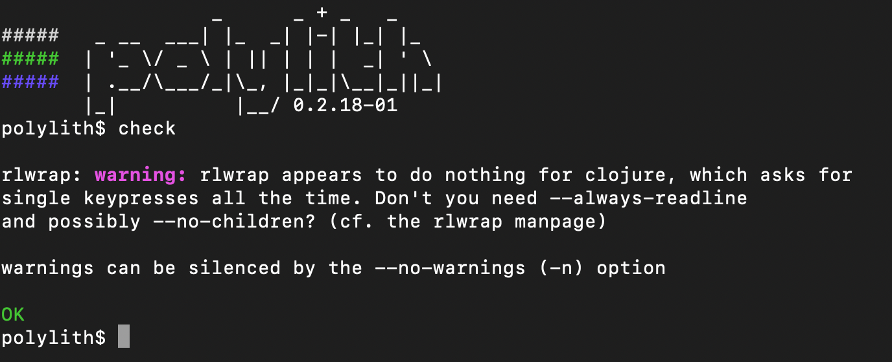

= Tools.deps

We created the `poly` tool on top of Clojure tools.deps.
If you are unfamiliar with tools.deps, we recommend that you read its https://github.com/clojure/tools.deps[documentation].

== The `poly` Alias

When you xref:workspace.adoc[create a workspace], `poly` generates a `./deps.edn` that includes a `poly` alias.
We cover details in our xref:install.adoc#use-as-dependency[install docs].

== clojure vs clj

Use `clojure` instead of `clj` when launching a `poly` xref:shell.adoc[shell] as xref:install.adoc#use-as-dependency[a clojure dependency]:

[source,shell]
----
clojure -M:poly
----

****
Why? There are two ways to run clojure:

1. `clojure` - runs clojure programs
2. `clj` - the same, but provides REPL command history support via `rlwrap`

As described by https://betweentwoparens.com/blog/what-are-the-clojure-tools/#clj%2Fclojure[a "Between Two Parens" blog post], `rlwrap` can sometimes get in the way. This is the case for the `poly` shell.

If you use `clj` instead of `clojure`, things will still work, but you will sometimes see warnings from `rlwrap`:

[source,shell]
----
clj -M:poly
----

You don't need that noise and confusion, so use `clojure` when launching a `poly` shell.
****
