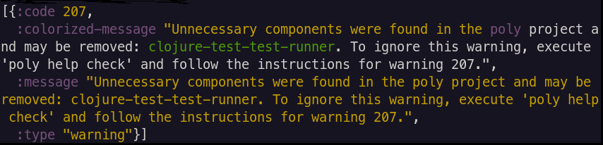

= Validations
:toc:

Each time you execute the xref:commands.adoc#check[check], xref:commands.adoc#info[info], or xref:commands.adoc#test[test] command, your workspace is validated.

For a list of validations, see the xref:commands.adoc#check[check] command.
You can show the same help at your terminal via:

[source,shell]
----
poly help check
----

The `check` command returns a non-zero exit code on errors only (not warnings).
See xref:commands.adoc#check[check] for details.

The xref:commands.adoc#test[test] command fails fast on any xref:commands.adoc#check[check] errors.
Warnings do not affect `test` outcome.

The xref:commands.adoc#info[info] command shows errors and warnings, but they do not affect its exit code.

TIP: By default, xref:commands.adoc#check[check] only runs against projects under the `projects` directory.
Specify the `:dev` argument, and `poly` will also check your `development` project.

== Viewing All Errors and Warnings

The `poly` tool stores all errors and warnings in the xref:workspace-structure.adoc[workspace structure]; you can list them via the xref:commands.adoc#ws[ws] command:

[source,shell]
----
poly ws get:messages
----

An example output:

If your workspace doesn't have any active warnings or errors, you will see an empty result:

[source,shell]
----
[]
----

[#warning207]
== Marking a Brick as Necessary to Suppress Warning 207

The xref:commands.adoc#check[check] command generates a `Warning 207 - Unnecessary components were found in project` when it finds components unused by any bricks in a project.

Suppose you get warning 207 for a project but know the component is needed (e.g., it is used dynamically but not explicitly called).
In that case, you can suppress the warning by specifying that it is `:necessary` to the project in your `workspace.edn`:

[source,clojure]
----
{...
 :projects {"poly" {:alias "poly"
                    :necessary ["api" "clojure-test-test-runner"] ;; <1>
                    :test {:setup-fn project.poly.hto/activate!}}
            "polyx" {:alias "polyx" :test [] :necessary ["clojure-test-test-runner"]} ;; <1>
            "development" {:alias "dev"}}
...}
----
<1> Example usages from the `poly` tool link:https://github.com/polyfy/polylith/blob/969d3beea27e754fcaccbf52631449774a4d7e7c/workspace.edn#L9-L13[itself]

[#error111]
== Workspace Structure Reflects Error 111

If `poly` finds that a `.clj` or `.cljc` source file is unreadable or its namespace is missing, you will see `Error 111: Unreadable namespace`.

Let's explore this error with our `example` xref:introduction.adoc[tutorial] workspace.
The `example` workspace source is link:/examples/doc-example[here] if you have not been following along.

NOTE: If you follow along, remember to revert your changes to your `example` workspace afterward.

Comment out the `se.example.user.core` namespace declaration in the `user` component:

../components/user/src/se/example/user/core.clj
[source,clojure]
----
;(ns se.example.user.core) ;; <1>

(defn hello [name]
  (str "Hello " name "!!"))
----
<1> Comment this line out

Run:
[source,shell]
----
poly check
----
You should see this error:

image::images/validations/missing-or-unreadable-namespace.png[]

Have a look at the namespace with the xref:commands.adoc#ws[ws] command:

[source,shell]
----
poly ws get:components:user:namespaces:src:core
----

Notice that `poly` has marked it as invalid:

[source,clojure]
----
{:file-path "components/user/src/se/example/user/core.clj",
 :imports [],
 :is-invalid true, ;; <1>
 :name "core",
 :namespace ""}
----
<1> Marked as invalid
