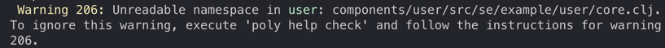

= Validations

Each time we execute the check, info, or test command, the workspace is validated. The various checks that are executed can be listed by executing the help for the check command:

[source,shell]
----
poly help check
----

The test command will not be executed if check discovers any errors.

=== Warning 206 - Missing or unreadable namespace in brick/project

If a source file (_.clj_ or _.cljc_) can't be read or if the namespace is missing, we get warning 206. If we comment out the https://github.com/polyfy/polylith/blob/master/examples/doc-example/components/user/src/se/example/user/core.clj[core] namespace for the _user_ component in the example app and execute the check command, it will show a warning:

[source,clojure]
----
;(ns se.example.user.core)

(defn hello [name]
  (str "Hello " name "!!"))
----

If we have a look at the namespace, we can see that it's marked as invalid:

[source,shell]
----
poly ws get:components:user:namespaces:src:core
----

[source,clojure]
----
{:file-path "components/user/src/se/example/user/core.clj",
 :imports [],
 :is-invalid true,
 :name "core",
 :namespace ""}
----

If we want to get rid of this warning, we can add the file name to the :ignore-files key for the user component in https://github.com/polyfy/polylith/blob/master/examples/doc-example/workspace.edn[workspace.edn]:

[source,clojure]
----
{ ...
 :bricks {"user" {:ignore-files ["core.clj"]}}
  ...
}
----

If a file is ignored, it's no longer considered as invalid.

Any path that matches the end of _components/user/src/se/example/user/core.clj_ is considered a match, e.g. "core.clj", "user/core.clj" or "example/user/core.clj", but not "ore.clj" because it will try to match "/ore.clj" (a slash is appended when comparing). If you use a dash (-) in the filename (to mimic the namespace name) it will be replaced by an underscore (_).

If we now look at the namespaces for the user component again, the core namespace will be marked as ignored:

[source,shell]
----
poly ws get:components:user:namespaces:src:core
----

[source,clojure]
----
{:file-path "components/user/src/se/example/user/core.clj",
 :imports [],
 :is-ignored true,
 :name "core",
 :namespace ""}
----

It's also possible to ignore files in bricks and projects, e.g.:

[source,clojure]
----
{ ...
 :bricks {"mybrick" {:ignore-files ["my_ns/myfile.clj" "com/my-ns/another-file.clj"}}
 :projects {...
            "command-line" {...
                            :ignore-files ["test-setup.clj"]
                            ...}
            ...}

  ...
}
----

Which will ignore all files ending with the path _/my_ns/myfile.clj_ and _/com/my_ns/another_file.clj_ (all - will be replaced by underscore) for the _mybrick_ brick + all files with the name _test_setup.clj_ in the _command-line_ project.

The https://github.com/polyfy/polylith/blob/master/examples/doc-example/projects/command-line/test/project/command_line/test_setup.clj[test-setup] namespace in the _command-line_ project will also be ignored, and the _:is-ignored_ key will be set for the namespace:

[source,shell]
----
poly ws get:projects:command-line:namespaces:test:project.command-line.test-setup
----

[source,clojure]
----
{:file-path "projects/command-line/test/project/command_line/test_setup.clj",
 :imports ["clojure.test"],
 :is-ignored true,
 :name "project.command-line.test-setup",
 :namespace "project.command-line.test-setup"}
----

=== Warning 207 - Unnecessary components were found in project

If there are any unnecessary components in a project (i.e. that are not used by any of the bricks in the project), then _check_ will return "Warning 207".

By default, _check_ only runs for projects under the projects directory. To also check the development project, we have to pass in _:dev_ when executing the _check_ command. Warning 207 will not be checked for the _info_ and _test_ commands. All other validations are performed when executing the _check_, _info_, or _test_ command.

If we get warning 207 for a project, but we know that the component is needed (e.g. used in a dynamic way, but not explicitly called) then we can add a _:necessary_ key to the project in _workspace.edn_ to get rid of the warning (this example is taken from the poly tool itself):

[source,clojure]
----
{ ...
 :projects {...
            "poly" {:alias "poly" :necessary ["clojure-test-test-runner"]}
            ...}}
}
----

All errors and warnings are also stored in the workspace structure and can be viewed by executing:

[source,shell]
----
poly ws get:messages
----

If we don't have any warnings or errors, it will return an empty result:

[source,shell]
----
[]
----
