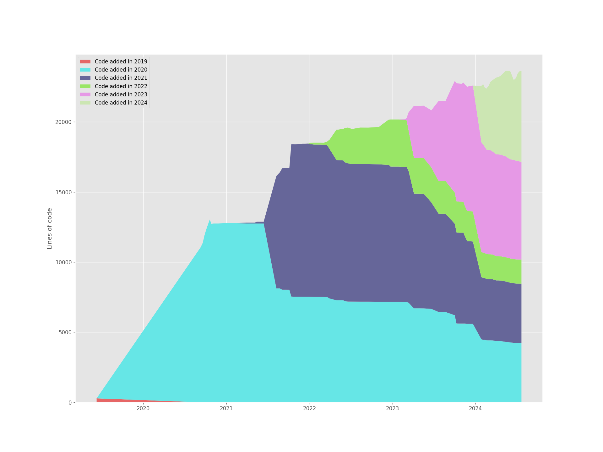
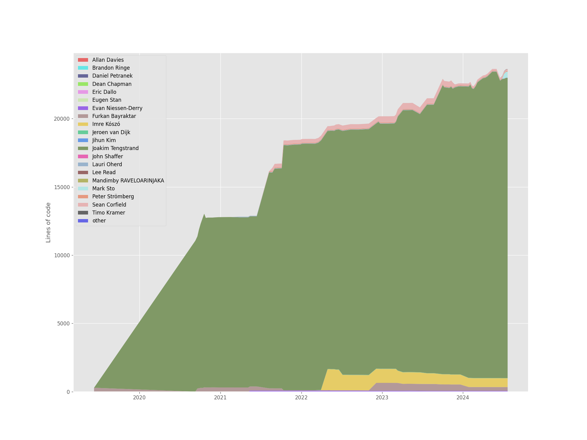
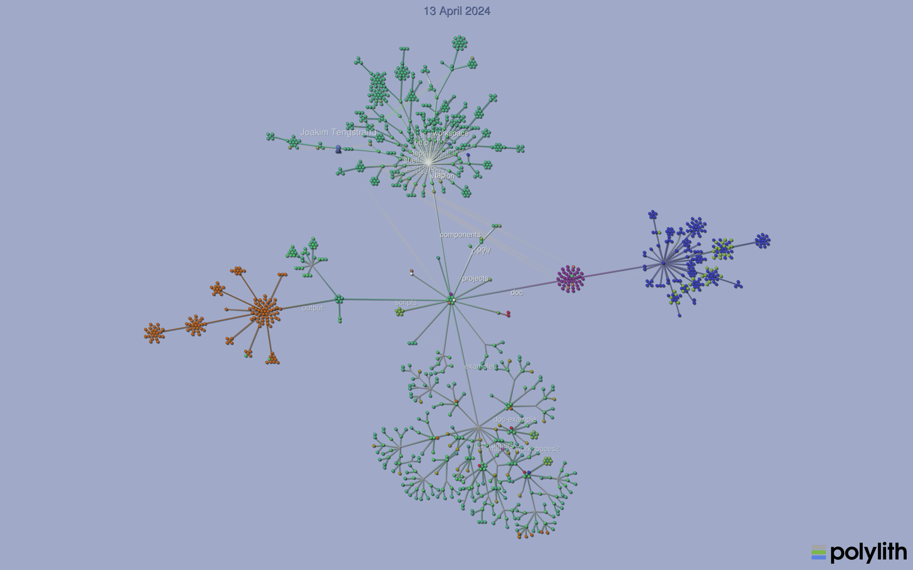

[#visualize-repo]
== Visualize the repo

=== git-of-theseus

Here we use https://github.com/erikbern/git-of-theseus[git-of-theseus] to show how the https://github.com/polyfy/polylith[polylith] codebase has evolved over time:

As you can see, the codebase has been constantly reworked to keep it in shape.

This second diagram shows how people have contributed with source code (mostly Clojure code) to the codebase.

==== Install

If you want to try it out yourself, start by cloning the polylith repo (if you haven't already):

[source,shell]
----
git clone git@github.com:polyfy/polylith.git
----

To generate these diagrams, we need to have python and pip installed.

Create Python virtual environment in e.g. a `python-venv` directory, and install git-of-theseus:

[source,shell]
----
mkdir python-venv
cd python-venv
python -m venv .venv
source .venv/bin/activate
pip install git-of-theseus
----

Now you can ask git-of-theseus to analyze the repository:

[source,shell]
----
git-of-theseus-analyze ../polylith
----

This will generate different json files that can be used by other commands to generate diagrams, e.g.:

[source,shell]
----
git-of-theseus-stack-plot cohorts.json --outfile code-over-time.png
git-of-theseus-stack-plot authors.json --outfile contribution.png
----

Show more options:

[source,shell]
----
git-of-theseus-analyze --help
git-of-theseus-stack-plot --help
----

=== Gource

https://gource.io[Gource] is another tool that can create animations to visualize how the codebase has evolved over time.

Here is an example animation (click to open):

==== Install

If you want to try it out yourself, start by installing it:

[source,shell]
----
brew install gource
brew install ffmpeg
----

==== Generate

This will generate a `polylith.mp4` file:

[source,shell]
----
gource --seconds-per-day 0.2 --auto-skip-seconds 1 --max-file-lag 0.1 --background 9dabcb --logo doc/images/visualize-the-repo/logo.png --disable-bloom --font-size 18 --font-colour 566ca1 --hide filenames --date-format "%d %B %Y" --dir-colour eeeeee --dir-name-depth 2 --caption-colour ff0000 --dir-font-size 12 -o - | ffmpeg -y -r 60 -f image2pipe -vcodec ppm -i - -vcodec libx264 -preset ultrafast -pix_fmt yuv420p -crf 1 -threads 0 -bf 0 polylith.mp4
----

You can also experiment without generating a file:

[source,shell]
----
gource --seconds-per-day 0.2 \
       --auto-skip-seconds 1 \
       --max-file-lag 0.1 \
       --background 9dabcb \
       --logo doc/images/visualize-the-repo/logo.png \
       --disable-bloom \
       --font-size 18 \
       --font-colour 566ca1 \
       --hide filenames \
       --date-format "%d %B %Y" \
       --dir-colour eeeeee \
       --dir-name-depth 2 \
       --caption-colour ff0000 \
       --dir-font-size 12
----

See how to tweak the animation https://github.com/acaudwell/Gource/wiki/Controls[here]. All the options are listed https://github.com/acaudwell/Gource/blob/master/README.md#using-gource[here], or execute `gource --help`.
