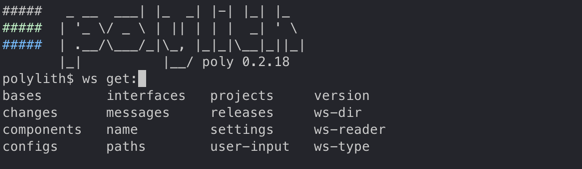

= Workspace Structure
:toc:
:poly-version: 0.3.32
:cljdoc-api-url: https://cljdoc.org/d/polylith/clj-poly/CURRENT/api

The `poly` tool gives us access to the data structure that represents the workspace, which is the same structure that all the `poly` commands operate on internally.

Here we will use the output from the https://github.com/polyfy/polylith/tree/master/examples/doc-example[example] in the documentation.

To list all the keys at the root, execute this from the `examples/doc-example` directory:

[source,shell]
----
poly ws get:keys
----

[source,shell]
----
[:bases
 :changes
 :components
 :configs
 :interfaces
 :libraries
 :messages
 :name
 :paths
 :profiles
 :projects
 :settings
 :user-input
 :version
 :ws-dialects
 :ws-dir
 :ws-local-dir
 :ws-reader
 :ws-type]
----

An even better way is to explore the workspace interactively from a xref:commands.adoc#shell[shell]:

[#bases]
== bases

[source,shell]
----
poly ws get:bases:user-api
----

[source,clojure]
----
{:base-deps {:src [], :test []},
 :interface-deps {:src ["user"], :test []},
 :lib-deps {:src {"slacker/slacker" {:size 28408,
                                     :type "maven",
                                     :version "0.17.0"}}},
 :lib-imports {:src ["se.example.user-api.api" "slacker.server"],
               :test ["clojure.test" "se.example.user-api.core"]},
 :lines-of-code {:src 13, :test 6},
 :name "user-api",
 :namespaces {:src [{:file-path "/Users/joakimtengstrand/source/polylith/examples/doc-example/bases/user-api/src/se/example/user_api/core.clj",
                     :imports ["se.example.user-api.api" "slacker.server"],
                     :name "core",
                     :namespace "se.example.user-api.core"}
                    {:file-path "/Users/joakimtengstrand/source/polylith/examples/doc-example/bases/user-api/src/se/example/user_api/api.clj",
                     :imports ["se.example.user.interface"],
                     :name "api",
                     :namespace "se.example.user-api.api"}],
              :test [{:file-path "/Users/joakimtengstrand/source/polylith/examples/doc-example/bases/user-api/test/se/example/user_api/core_test.clj",
                      :imports ["clojure.test" "se.example.user-api.core"],
                      :name "core-test",
                      :namespace "se.example.user-api.core-test"}]},
 :paths {:src ["src" "resources"], :test ["test"]},
 :source-types #{"clj"}
 :type "base"}
----

* `:base-deps` Lists the bases this base depends on.

* `:illegal-deps` A vector of illegal dependencies. Populated if the base depends on something an implementing namespace in a component (bases are allowed to depend on bases) from the :src context (:test has no restrictions).
** `:from-ns` The name of the namespace where we refer the incorrect namespace.
** `:to-brick-id` The interface name or base name we depend on.
** `:to-namespace` The namespace we depend on.
** `:to-type` Set to the type of the brick we depend on ("base" or "component").

* `:interface-deps` Lists the interfaces this base depends on.
Here it depends on the `user` interface from the `src` context.
This is because the `se.example.user-api.api` namespace imports `se.example.user.interface`.
No interfaces are imported from the test context in this example.

* `:keep-lib-versions` A vector containing the library names that should not be affected when executing `poly libs :update`. Configured in the workspace.edn under :bases.

* `:lib-deps`
** `:src` A map with the libraries that are used in this base's src context.
*** `:latest-version` Set if there is a newer version of this library, except if xref:keep-lib-versions[:keep-lib-versions] is set for this library. Calculated if `:outdated` is given for any command, or if `:update` is given for the libs command.
*** `:size` The size of this library in bytes.
*** `:type` The type of the library, "maven", "local" or "git" (`:mvn/version`, `:local/root` and `:git/url`).
*** `:version` The library version:
**** if type is `maven` then version is set to `groupId/artifactId`.
**** if type is `local` then the version key is excluded (a `-` is shown in the output from the xref:commands.adoc#libs[libs] command).
**** if type is `git` then the version is set to the first seven characters in the `sha`.
** `:test` A map with the libraries that are used in this base's test context. Follows the same structure as the `:src` context.

* `:lib-imports` The name is a bit misleading as internal namespaces for the base is also included.
** `:src` Lists all imports from the src context except component interfaces.
** `:test` Lists all imports from the test context except component interfaces.

* `:lines-of-code` The total number of lines of code for this base (all namespaces included).

* `:name` The name of the directory for this base under the `bases` directory.

* `:namespaces`
** `:src` Lists all the namespaces that live under the src directory.
*** `:file-path` The absolute path to the namespace.
*** `:imports` Lists all its namespaces.
*** `:is-invalid` Set to `true` if the namespace is missing or if the file can't be parsed.
*** `:name` The name of the namespace where top namespace + base name (`se.example` + `user-api` in this case) have been stripped away.
*** `:namespace` The full name of the namespace.
** `:test` Lists all the namespaces that live under the test directory (same keys as for the `:src`).

* `:non-top-namespace` If the base contains any non-top namespaces, they will be stored in a vector with elements like this:
** `{:non-top-ns "com.wrong", :file "bases/cli/src/com/wrong/cli/interface.clj"}`
* `:paths` The paths that are specified in its `deps.edn` file
(paths for `src` and `resources` paths + `aliases > :test > :extra-paths` for test paths).
* `:source-types` A set of source types (file suffixes) covering all used source files ("clj", "cljc", "cljs").
* `:type` Set to "base".

[#changes]
== changes

[source,shell]
----
poly ws get:changes since:b339c35
----

[source,clojure]
----
{:changed-bases ["cli" "user-api"],
 :changed-components ["user" "user-remote"],
 :changed-files ["bases/cli/deps.edn"
                 "bases/cli/resources/cli/.keep"
                 "bases/cli/src/se/example/cli/core.clj"
                 "bases/cli/test/se/example/cli/core_test.clj"
                 "bases/user-api/deps.edn"
                 "bases/user-api/resources/user-api/.keep"
                 "bases/user-api/src/se/example/user_api/api.clj"
                 "bases/user-api/src/se/example/user_api/core.clj"
                 "bases/user-api/test/se/example/user_api/core_test.clj"
                 "components/user-remote/deps.edn"
                 "components/user-remote/resources/user-remote/.keep"
                 "components/user-remote/src/se/example/user/core.clj"
                 "components/user-remote/src/se/example/user/interface.clj"
                 "components/user-remote/test/se/example/user/interface_test.clj"
                 "components/user/deps.edn"
                 "components/user/resources/user/.keep"
                 "components/user/src/se/example/user/core.clj"
                 "components/user/src/se/example/user/interface.clj"
                 "components/user/test/se/example/user/interface_test.clj"
                 "deps.edn"
                 "development/src/dev/lisa.clj"
                 "projects/command-line/deps.edn"
                 "projects/command-line/test/project/command_line/dummy_test.clj"
                 "projects/user-service/deps.edn"
                 "readme.txt"
                 "scripts/build-cli-uberjar.sh"
                 "scripts/build-uberjar.sh"
                 "scripts/build-user-service-uberjar.sh"
                 "workspace.edn"],
 :changed-or-affected-projects ["command-line" "development" "user-service"],
 :changed-projects ["command-line" "development" "user-service"],
 :git-diff-command "git diff b339c35 --name-only",
 :since "b339c35",
 :since-sha "b339c35"}
----

* `:changed-bases` Lists the changed bases since the sha `b339c35` (or last stable point in time if `:since` is not given).

* `:changed-components` Lists the changed components since the sha `b339c35` (or last stable point in time if `:since` is not given).

[#changed-files]
* `:changed-files` The same list that is returned by `poly diff since:b339c35`.
The keys `:changed-bases`, `:changed-components` and `:changed-projects` are calculated from this list.

* `:changed-or-affected-projects` Lists the projects that are directly or indirectly changed.
A project will be marked as changed if a file in its project directory has changed, or if a file in the bricks it includes has changed.

* `:changed-projects` Lists the changed projects since the sha `b339c35` (or last stable point in time if `:since` is not given).

* `:git-diff-command` The git command that was executed to calculate the `:changed-files` list.

* `:since` Set to "stable" if `since:SINCE` is not given.

* `:since-sha` The full sha if `since:SINCE` was not given, e.g. `b339c358079fa36ca20ed0163708ba010a0ffd4c`.

* `:since-tag` The name of the tag, e.g. `0.1.0-alpha9` if `since:release` was given.

[#components]
== components

[source,shell]
----
poly ws get:components:user
----

[source,clojure]
----
{:interface {:definitions [{:name "hello",
                            :arglists [{:name "name"}],
                            :type "function"}],
             :name "user"},
 :interface-deps {:src [], :test []},
 :lib-deps {},
 :lib-imports {:test ["clojure.test"]},
 :lines-of-code {:src 9, :test 7},
 :name "user",
 :namespaces {:src [{:file-path "/Users/joakimtengstrand/source/polylith/examples/doc-example/components/user/src/se/example/user/interface.clj",
                     :imports ["se.example.user.core"],
                     :name "interface",
                     :namespace "se.example.user.interface"}
                    {:file-path "/Users/joakimtengstrand/source/polylith/examples/doc-example/components/user/src/se/example/user/core.clj",
                     :imports [],
                     :name "core",
                     :namespace "se.example.user.core"}],
              :test [{:file-path "/Users/joakimtengstrand/source/polylith/examples/doc-example/components/user/test/se/example/user/interface_test.clj",
                      :imports ["clojure.test" "se.example.user.interface"],
                      :name "interface-test",
                      :namespace "se.example.user.interface-test"}]},
 :paths {:src ["src" "resources"], :test ["test"]},
 :source-types #{"clj"}
 :type "component"}
----

Component keys are the same as for the base plus the `:interfaces` key, except that it doesn't have `:base-deps`:

* `:interface`
** `:definitions` Lists all public `def`, `defn` and `defmacro` definitions in the interface namespace.
If a type hint is given, then `:type` will also be set and be part of the contract.

* `:illegal-deps` A vector of illegal dependencies. Populated if the component depends on something else than interfaces, from the :src context (:test has no restrictions).
** `:from-ns` The name of the namespace where we refer the incorrect namespace.
** `:to-brick-id` The interface name or base name we depend on.
** `:to-namespace` The namespace we depend on.
** `:to-type` Set to the type of the brick we depend on ("base" or "component").

* `:interface-deps` Lists the interfaces this base depends on.
Here it depends on the `user` interface from the `src` context.
This is because the `se.example.user-api.api` namespace imports `se.example.user.interface`. +
No interfaces are imported from the test context in this example.

* `:keep-lib-versions` A vector containing the library names that should not be affected when executing `poly libs :update`. Configured in workspace.edn under `:bricks`.

* `:lib-deps`
** `:src` A map with the libraries that are used in this component's src context.
*** `:latest-version` Set if there is a newer version of this library, except if xref:keep-lib-versions[:keep-lib-versions] is set for this library. Calculated if `:outdated` is given for any command, or if `:update` is given for the libs command.
*** `:size` The size of this library in bytes.
*** `:type` The type of the library, "maven", "local" or "git" (`:mvn/version`, `:local/root` and `:git/url`).
*** `:version` The library version:
**** if type is `maven` then version is set to `groupId/artifactId`.
**** if type is `local` then the version key is excluded (a `-` is shown in the output from the xref:commands.adoc#libs[libs] command).
**** if type is `git` then the version is set to the first seven characters in the `sha`.
** `:test` A map with the libraries that are used in this base's test context. Follows the same structure as the `:src` context.

* `:lib-imports` The name is a bit misleading as internal namespaces for the base is also included.
** `src` Lists all imports from the src context except component interfaces.
** `test` Lists all imports from the test context except component interfaces.

* `:lines-of-code` The total number of lines of code for this base (all namespaces included).

* `:name` The name of the directory for this base under the `bases` directory.

* `:namespaces`
** `:src` Lists all the namespaces that live under the src directory.
*** `:file-path` The absolute path to the namespace.
*** `:imports` Lists all its namespaces.
*** `:is-invalid` Set to `true` if the namespace is missing or if the file can't be parsed.
*** `:name` The name of the namespace where top namespace + base name (`se.example` + `user-api` in this case) have been stripped away.
*** `:namespace` The full name of the namespace.
** `:test` Lists all the namespaces that live under the test directory (same keys as for the `:src`).

* `:non-top-namespace` If the base contains any non-top namespaces, they will be stored in a vector with elements like this:
** {`:non-top-ns` "com.wrong", `:file` "bases/cli/src/com/wrong/cli/interface.clj"}
* `:paths` The paths that are specified in its `deps.edn` file (paths for `src` and `resources` paths + `aliases > :test > :extra-paths` for test paths).
* `:source-types` A set of source types (file suffixes) covering all used source files ("clj", "cljc", "cljs").
* `:type` Set to "base".

[#configs]
== configs

[source,shell]
----
poly ws get:configs
----

[source,clojure]
----
{:bases [{:deps {:aliases {:test {:extra-deps {}, :extra-paths ["test"]}},
                 :deps {},
                 :paths ["src" "resources"]},
          :name "cli",
          :type "base"}
         {:deps {:aliases {:test {:extra-deps {}, :extra-paths ["test"]}},
                 :deps {slacker/slacker {:mvn/version "0.17.0"}},
                 :paths ["src" "resources"]},
          :name "user-api",
          :type "base"}],
 :components [{:deps {:aliases {:test {:extra-deps {}, :extra-paths ["test"]}},
                      :deps {},
                      :paths ["src" "resources"]},
               :name "user",
               :type "component"}
              {:deps {:aliases {:test {:extra-deps {}, :extra-paths ["test"]}},
                      :deps {compojure/compojure {:mvn/version "1.6.2"},
                             http-kit/http-kit {:mvn/version "2.4.0"},
                             ring/ring {:mvn/version "1.8.1"},
                             slacker/slacker {:mvn/version "0.17.0"}},
                      :paths ["src" "resources"]},
               :name "user-remote",
               :type "component"}],
 :projects [{:deps {:aliases {:test {:extra-deps {}, :extra-paths ["test"]},
                              :uberjar {:main se.example.cli.core}},
                    :deps {org.apache.logging.log4j/log4j-core {:mvn/version "2.13.3"},
                           org.apache.logging.log4j/log4j-slf4j-impl {:mvn/version "2.13.3"},
                           org.clojure/clojure {:mvn/version "1.12.0"},
                           poly/cli {:local/root "../../bases/cli"},
                           poly/user-remote {:local/root "../../components/user-remote"}}},
             :name "command-line",
             :type "project"}
            {:deps {:aliases {:+default {:extra-deps {poly/user {:local/root "components/user"}},
                                         :extra-paths ["components/user/test"]},
                              :+remote {:extra-deps {poly/user-remote {:local/root "components/user-remote"}},
                                        :extra-paths ["components/user-remote/test"]},
                              :build {:deps {io.github.clojure/tools.build {:mvn/version "0.9.5"},
                                             io.github.seancorfield/build-uber-log4j2-handler {:git/sha "55fb6f6",
                                                                                               :git/tag "v0.1.5"},
                                             org.clojure/tools.deps {:mvn/version "0.16.1281"}},
                                      :ns-default build,
                                      :paths ["build/resources"]},
                              :dev {:extra-deps {org.apache.logging.log4j/log4j-core {:mvn/version "2.13.3"},
                                                 org.apache.logging.log4j/log4j-slf4j-impl {:mvn/version "2.13.3"},
                                                 org.clojure/clojure {:mvn/version "1.12.0"},
                                                 poly/cli {:local/root "bases/cli"},
                                                 poly/user-api {:local/root "bases/user-api"}},
                                    :extra-paths ["development/src"]},
                              :poly {:extra-deps {polylith/clj-poly {:mvn/version "0.2.18"}},
                                     :main-opts ["-m"
                                                 "polylith.clj.core.poly-cli.core"]},
                              :test {:extra-paths ["bases/cli/test"
                                                   "bases/user-api/test"
                                                   "projects/command-line/test"]}}},
             :name "development",
             :type "project"}
            {:deps {:aliases {:test {:extra-deps {}, :extra-paths []},
                              :uberjar {:main se.example.user-api.core}},
                    :deps {org.apache.logging.log4j/log4j-core {:mvn/version "2.13.3"},
                           org.apache.logging.log4j/log4j-slf4j-impl {:mvn/version "2.13.3"},
                           org.clojure/clojure {:mvn/version "1.12.0"},
                           poly/user {:local/root "../../components/user"},
                           poly/user-api {:local/root "../../bases/user-api"}}},
             :name "user-service",
             :type "project"}],
 :user {:color-mode "dark", :empty-character ".", :thousand-separator ","},
 :workspace {:compact-views #{},
             :default-profile-name "default",
             :dialects #{"clj"},
             :interface-ns "interface",
             :tag-patterns {:release "^v[0-9].*", :stable "^stable-.*"},
             :top-namespace "se.example",
             :vcs {:auto-add true, :name "git"}}}
----

These attributes are described in the xref:configuration.adoc[Configuration] section.

[#interfaces]
== interfaces

[source,shell]
----
poly ws get:interfaces:user
----

[source,clojure]
----
{:definitions [{:name "hello",
                :arglists [{:name "name"}],
                :type "function"}],
 :implementing-components ["user" "user-remote"],
 :name "user",
 :type "interface"}
----

* `:definitions` A list of the public `def`, `defn` and `defmacro` definitions that are part of the interface.
** `:name` the name of the `def`, `defn` or `defmacro` definition.
If it's a multi-arity function or macro, then each arity will be stored separately.
** `:arglists` Set for functions and macros.
Specifies the function/macro arguments:
*** `:name` The name of the argument.
*** `:type` If a type hint, e.g. `^String` is given, then this attribute is set.
** `:type` Set to "data", "function" or "macro".

* `:name` The name of the interface.
In this case the bricks `user` and `user-remote` share the same `user` interface and live in the `se.example.user.interface` namespace.

* `:type` Set to "interface".

[#libraries]
== libraries

[source,shell]
----
poly ws get:libraries
----

[source,clojure]
----
[{:name "babashka/fs", :size 23001, :type "maven", :version "0.5.27"}
 {:name "borkdude/edamame", :size 26378, :type "maven", :version "1.4.32"}
 {:name "borkdude/rewrite-edn", :size 11583, :type "maven", :version "0.4.9"}
 {:name "cheshire/cheshire", :size 25846, :type "maven", :version "6.1.0"}
 {:name "clj-commons/fs", :size 12822, :type "maven", :version "1.6.312"}
 {:name "clj-http/clj-http", :size 60533, :type "maven", :version "3.13.1"}
 {:name "clojure2d/clojure2d", :size 2269179, :type "maven", :version "1.4.5"}
 {:name "com.github.liquidz/antq",
  :size 56082,
  :type "maven",
  :version "2.11.1276"}
 {:name "djblue/portal", :size 1972307, :type "maven", :version "0.61.0"}
 {:name "lread/status-line", :size 65730, :type "git", :version "cf44c15"}
 {:name "metosin/malli", :size 96018, :type "maven", :version "0.19.2"}
 {:name "mvxcvi/puget", :size 16030, :type "maven", :version "1.3.4"}
 {:name "org.apache.maven/maven-artifact",
  :size 62714,
  :type "maven",
  :version "4.0.0-rc-4"}
 {:name "org.babashka/http-client",
  :size 16217,
  :type "maven",
  :version "0.4.23"}
 {:name "org.clojure/clojure", :size 4230055, :type "maven", :version "1.12.3"}
 {:name "org.clojure/tools.deps",
  :size 59726,
  :type "maven",
  :version "0.26.1553"}
 {:name "org.jline/jline", :size 1505052, :type "maven", :version "3.30.6"}
 {:name "org.slf4j/slf4j-nop", :size 4982, :type "maven", :version "2.0.17"}
 {:name "pjstadig/humane-test-output",
  :size 7948,
  :type "maven",
  :version "0.11.0"}
 {:name "rewrite-clj/rewrite-clj",
  :size 80496,
  :type "maven",
  :version "1.2.50"}
 {:name "selmer/selmer", :size 65359, :type "maven", :version "1.12.62"}
 {:name "version-clj/version-clj", :size 10680, :type "maven", :version "2.0.3"}]
----

[#messages]
== messages

[source,shell]
----
poly ws get:messages
----

[source,clojure]
----
[{:code 103,
  :message "Missing definitions in user's interface: hello[name]",
  :colorized-message "Missing definitions in user's interface: hello[name]",
  :components ["user"],
  :type "error"}]
----

To trigger this error, we commented out the hello function from the user component interface.

* `:code` The code of the error or warning.
To get a full list of existing codes, execute poly help check.

* `:message` The error message.

* `:colorized-message` The error message using colors so the text can be printed in color.

* `:components` Each error message can have extra keys/information, like affected components as in this case.

* `:type` Set to "error" or "warning".

[#name]
== name

[source,shell]
----
poly ws get:name
----

[source,clojure]
----
"doc-example"
----

The name of the workspace directory.

[#old]
== old

[source,shell]
----
poly ws get:old ws-file:ws.edn
----

[source,clojure]
----
{:user-input {:args ["ws" "out:ws.edn"],
              :cmd "ws",
              :is-all `true`,
              :is-dev false,
              :is-latest-sha false,
              :is-no-exit false,
              :is-run-all-brick-tests false,
              :is-run-project-tests false,
              :is-search-for-ws-dir false,
              :is-show-brick false,
              :is-show-loc false,
              :is-show-project false,
              :is-show-resources false,
              :is-show-workspace false,
              :is-verbose false,
              :out "ws.edn",
              :selected-profiles #{},
              :selected-projects #{},
              :unnamed-args []}}
----

If the workspace is loaded using `ws-file:WS-FILE` then the `:old` key is populated.

* `user-input` The user input from the original ws file.

* `:active-profiles` If any profiles are given, then this key is added with the value of `:active-profiles` taken from the `:settings` key from the original ws file.

[#paths]
== paths

[source,shell]
----
poly ws get:paths
----

[source,clojure]
----
{:existing ["bases/cli/resources"
            "bases/cli/src"
            "bases/cli/test"
            "bases/user-api/resources"
            "bases/user-api/src"
            "bases/user-api/test"
            "components/user-remote/resources"
            "components/user-remote/src"
            "components/user-remote/test"
            "components/user/resources"
            "components/user/src"
            "components/user/test"
            "development/src"
            "projects/command-line/test"],
 :on-disk ["bases/cli/resources"
           "bases/cli/src"
           "bases/cli/test"
           "bases/user-api/resources"
           "bases/user-api/src"
           "bases/user-api/test"
           "components/user-remote/resources"
           "components/user-remote/src"
           "components/user-remote/test"
           "components/user/resources"
           "components/user/src"
           "components/user/test"
           "projects/command-line/test"],
 :missing []}
----

* `:existing` All existing paths in the workspace that are used in bricks, projects, and profiles.

* `:on-disk` All paths to directories within the workspace.

* `:missing` All missing paths in the workspace that are used in bricks, projects, and profiles but don't exist on disk.

[#profiles]
== profiles

[source,shell]
----
poly ws get:profiles:default
----

[source,clojure]
----
{:base-names [],
 :component-names ["image-creator" "system"],
 :lib-deps {},
 :name "default",
 :paths ["components/image-creator/src" "components/system/src"],
 :project-names [],
 :type "profile"}
----

* `:base-names` The bases that are referenced from the specified paths.
* `:component-names` The components that are referenced from the specified paths.
* `:lib-deps` The library dependencies specified by the key `:extra-deps`.
* `:name` the profile name, taken from an alias name that starts with a `+` in `./deps.edn`.
* `:paths` The paths specified by the key `:extra-paths`.
* `:project-names` The projects that are referenced from the specified paths.
* `:type` Set to "profile".

[#projects]
== projects

[source,shell]
----
poly ws get:projects:user-service
----

[source,clojure]
----
{:alias "user-s",
 :base-names {:src ["user-api"], :test ["user-api"]},
 :bricks-to-test ["user" "user-api"],
 :bricks-to-test-all-sources ["user" "user-api"],
 :component-names {:src ["user"], :test ["user"]},
 :deps {"user" {:src {}, :test {}},
        "user-api" {:src {:direct ["user"]}, :test {:direct ["user"]}}},
 :deps-filename "examples/doc-example/projects/user-service/deps.edn",
 :indirect-changes {:src [], :test []},
 :is-dev false,
 :lib-deps {:src {"org.apache.logging.log4j/log4j-core" {:size 1714164,
                                                         :type "maven",
                                                         :version "2.13.3"},
                  "org.apache.logging.log4j/log4j-slf4j-impl" {:size 23590,
                                                               :type "maven",
                                                               :version "2.13.3"},
                  "org.clojure/clojure" {:size 4227052,
                                         :type "maven",
                                         :version "1.12.0"},
                  "slacker/slacker" {:size 28408,
                                     :type "maven",
                                     :version "0.17.0"}}},
 :lib-imports {:src ["se.example.user-api.api" "slacker.server"],
               :test ["clojure.test" "se.example.user-api.core"]},
 :lines-of-code {:src 0, :test 0, :total {:src 44, :test 26}},
 :maven-repos {"central" {:url "https://repo1.maven.org/maven2/"},
               "clojars" {:url "https://repo.clojars.org/"}},
 :name "user-service",
 :namespaces {},
 :paths {:src ["bases/user-api/resources"
               "bases/user-api/src"
               "components/user/resources"
               "components/user/src"],
         :test ["bases/user-api/test" "components/user/test"]},
 :project-dir "examples/doc-example/projects/user-service",
 :project-lib-deps {:src {"org.apache.logging.log4j/log4j-core" {:size 1714164,
                                                                 :type "maven",
                                                                 :version "2.13.3"},
                          "org.apache.logging.log4j/log4j-slf4j-impl" {:size 23590,
                                                                       :type "maven",
                                                                       :version "2.13.3"},
                          "org.clojure/clojure" {:size 4227052,
                                                 :type "maven",
                                                 :version "1.12.0"}},
                    :test {}},
 :projects-to-test [],
 :test {:create-test-runner [polylith.clj.core.clojure-test-test-runner.interface/create]},
 :source-types #{"clj"}
 :type "project"}
----

* `:alias` The project alias, specified in the project's config.edn file.

* `:base-names`
** `:src` The bases that are included in the project for the `src` context, either as paths or included as `:local/root`.
** `:test` The bases that are included in the project for the `test` context, either as paths or included as `:local/root`.

* `:bricks-to-test` A vector with the bricks to test from this project if executing the xref:commands.adoc#test[test] command. Only contains bricks that have `:test` paths.
* `:bricks-to-test-all-sources` Like `:bricks-to-test`, but also contains bricks that do not have `:test` paths.

* `:component-names`
** `:src` The components that are included in the project for the `src` context, either as paths or included as `:local/root`.
** `:test` The components that are included in the project for the `test` context, either as paths or included as `:local/root`.

* `:deps` A map with brick names as keys where each brick contains:
** `:src` Keeps track of the dependencies from the `:src` context.
*** `:direct` A vector with the direct dependencies, from the `:src` directory, to components (component names).
*** `:indirect` A vector with the indirect dependencies, from the `:src` directory, to components (component names).
*** `:circular` A vector with the circular dependency chain, translated to the components in the project, e.g. ["a" "b" "c" "a"] from the `:src` directory.
*** `:missing-ifc-and-bases`
**** `:direct` A vector containing missing interface and base names, that are directly accessed from the `:src` directory.
**** `:indirect` A vector containing missing interface and base names, that are indirectly accessed from the `:src` directory.
** `:test` Keeps track of the dependencies from the `:test` context, with the same set of keys as the `:src` context.

* `:deps-filename` The absolute path to the `deps.edn` config file.

* `:indirect-changes` A vector of the bricks that are indirectly changed (directly changed bricks excluded).
E.g. if components `a` and `b` are included in the project, and `a` has not changed, but `b` has changed and `a` uses `b`, then `b` will be included in this vector.

* `:is-dev` Set to `true` for the development project.

* `:keep-lib-versions` A vector containing the library names that should not be affected when executing `poly libs :update`. Configured in the project's config.edn file.

* `:lib-deps`
** `:src` Stores a map with the libraries that are used in the project for the src context. Contains libraries that are specified by the project and the included bricks.
*** `:latest-version` Set if there is a newer version of this library, except if xref:libraries.adoc#keep-lib-versions[:keep-lib-versions] is set for this library. Calculated if `:outdated` is given for any command, or if `:update` is given for the libs command.
*** `:size` The size of this library in bytes.
*** `:type` The type of the library, "maven", "local" or "git" (`:mvn/version`, `:local/root` and `:git/url`).
*** `:version` The library version:
**** if type is `maven` then version is set to `groupId/artifactId`.
**** if type is `local` then the version key is excluded (a `-` is shown in the output from the xref:commands.adoc#libs[libs] command).
**** if type is `git` then the version is set to the first seven characters in the `sha`.
** `:test` A map with the libraries that are used in the project for the test context. Follows the same structure as the `:src` context.

* `:lib-imports`
** `:src` All `:lib-imports` taken from the bricks that are included in this project for the `src` context.
** `:test` All `:lib-imports` taken from the bricks that are included in this project for the `test` context.

* `:lines-of-code`
** `:src` Number of lines of code living in the project's `src` directory.
** `:test` Number of lines of code living in the project's `test` directory.
** `:total` The total number of lines of code for all the bricks that are included in this project.

* `:maven-local-repo` The local maven repo used by this project.
If `mvn/local-repo` is specified by the project, it will be stored as `:maven-local-repo` here.

* `:maven-repos` The maven repos that are used by this project.
If `:mvn/repos` is specified by a brick that is included in this project, then it will automatically turn up in this list.

* `:name` The name of the project directory under the `projects` directory.

* `:namespaces` If the project has a `test` and/or `src` directory, then the included namespaces are listed here.
** `:src` Lists all the namespaces that live under the src directory.
*** `:file-path` The absolute path to the namespace.
*** `:imports` Lists all its namespaces.
*** `:is-invalid` Set to `true` if the namespace is missing or if the file can't be parsed.
*** `:name` The name of the namespace where top namespace + component name (`se.example` + `user` in this case) are stripped away.
*** `namespace` The full name of the namespace.
** `:test` Lists all the namespaces that live under the `test` directory (same keys as for the `:src`).

* `:necessary` If we get xref:validations.adoc#warning207[Warning 207 - Unnecessary components were found in project] and know that the brick(s) has to be included in the project, then we can add the necessary bricks(s) to a vector in the project's config.edn for this key.

* `:paths`
** `:src` Lists the paths that are either explicitly defined as paths or implicitly defined as `:local/root` bricks, for the `src` context.
** `:test` Lists the paths that are either explicitly defined as paths or implicitly defined as `:local/root` bricks, for the `test` context.
* `:project-dir` The absolute path to the project directory.

* `:project-lib-deps`
** `:src` Stores a map with the libraries that are specified by the project for the src context.
*** `:latest-version` Set if there is a newer version of this library, except if xref:keep-lib-versions[:keep-lib-versions] is set for this library. Calculated if `:outdated` is given for any command, or if `:update` is given for the libs command.
*** `:size` The size of this library in bytes.
*** `:type` The type of the library, "maven", "local" or "git" (`:mvn/version`, `:local/root` and `:git/url`).
*** `:version` The library version:
**** if type is `maven` then version is set to `groupId/artifactId`.
**** if type is `local` then the version key is excluded (a `-` is shown in the output from the xref:commands.adoc#libs[libs] command).
**** if type is `git` then the version is set to the first seven characters in the `sha`.
** `:test` A map with the libraries that are used in the project for the test context. Follows the same structure as the `:src` context.

* `:projects-to-test` A vector with the projects to test from this project if executing the xref:commands.adoc#test[test] command.

* `:test`
** `:exclude` Specifies which brick should be excluded when running the test command.
** `:include` Specifies which bricks should be included when running the test command.
Empty if no bricks, missing if all bricks.
** `:create-test-runner` A vector with one or more test runners, see xref:test-runners.adoc#create-test-runner[create test runner].
* `:source-types` A set of source types (file suffixes) covering all used source files ("clj", "cljc", "cljs").
* `:type` Set to "project".

[#settings]
== settings

[source,shell]
----
poly ws get:settings
----

[source,clojure]
----
{:active-profiles #{"default"},
 :color-mode "dark",
 :compact-views #{},
 :default-profile-name "default",
 :dialects #{"clj"},
 :empty-character ".",
 :interface-ns "interface",
 :m2-dir "/Users/joakimtengstrand/.m2",
 :tag-patterns {:release "v[0-9].*", :stable "stable-.*"},
 :thousand-separator ",",
 :top-namespace "polylith.clj.core",
 :user-config-filename "/Users/joakimtengstrand/.config/polylith/config.edn",
 :user-home "/Users/joakimtengstrand",
 :vcs {:auto-add false,
       :branch "issue-315",
       :git-root "/Users/joakimtengstrand/source/polylith",
       :is-git-repo true,
       :name "git",
       :polylith {:branch "master",
                  :repo "https://github.com/polyfy/polylith.git"},
       :stable-since {:sha "15453ebc5a86f52ee1c75ec52ebb19da4b113c30",
                      :tag "stable-master"}}}
----

* `:active-profiles` If any profiles are defined in `./deps.edn` then the active profiles(s) are listed here.

[#color-mode]
* `:color-mode` The color mode specified in `~/.config/polylith/config.edn`.

* `:compact-views` The set of views that should be shown in a more compact way, specified in `workspace.edn`.

* `:default-profile-name` The name of the default profile name, specified in `workspace.edn`.

* `:dialects` The set of dialects the tool will support, specified in `workspace.edn`. Valid values are: `"clj"`, `"cljs"`.

* `:empty-character` The character used to represent empty space in output from e.g. the libs command, specified in `workspace.edn`.

* `:interface-ns` The name of the namespace/package that is used to represent interfaces, specified in `workspace.edn`.

* `:m2-dir` Maven user root directory.
Set to "~/.m2" by default, but can be overridden in `~/.config/polylith/config.edn`.

* `:tag-patterns` The tag patterns that are specified in `workspace.edn`.

* `:test` Global test configuration used as basis for project test configuration (projects will use these settings and override it with its own settings).
** `:exclude` Specifies which brick should be excluded when running the test command.
** `:include` Specifies which bricks should be included when running the test command.
Empty if no bricks, missing if all bricks.
** `:create-test-runner` A vector with one or more test runners, see xref:test-runners.adoc#create-test-runner[create test runner].

* `:thousand-separator` Used by numbers >= 1000 (e.g. the KB column in the libs command) specified in `~/.config/polylith/config.edn`.

* `:top-namespace` The top namespace for the workspace, specified in `workspace.edn`.

* `:user-config-filename` The full path to the user config filename.

* `:user-home` The user home, specified by the user.home environment variable.

* `vcs`
** `:auto-add` Set to `true` if files and directories created by the create command should be automatically added to git.
Specified in `workspace.edn`.
** `:branch` The name of the git branch.
** `:git-root` The root of the git repository.
** `:name` Set to "git".
** `:polylith`
*** `:branch` Set to `master` or `BRANCH` if `branch:BRANCH` is given.
The branch is used when calculating the latest sha in `./deps.edn` for the key `:aliases > :poly > :extra-deps > sha`.
*** `:repo` Set to "https://github.com/polyfy/polylith.git".
** `:stable-since`
*** `:sha` The latest stable point in time.
*** `:tag` The tag for the latest stable point in time (if exists).

[#user-input]
== user-input

[source,shell]
----
poly ws get:user-input
----

[source,clojure]
----
{:args ["ws" "get:user-input"]
 :cmd "ws"
 :is-all false
 :is-commit false
 :is-compact false
 :is-dev false
 :is-fail-if-nothing-to-test false
 :is-fake-poly false
 :is-github false
 :is-hide-lib-size false
 :is-latest-sha false
 :is-local false
 :is-no-changes false
 :is-no-exit false
 :is-outdated false
 :is-run-all-brick-tests false
 :is-run-project-tests false
 :is-search-for-ws-dir false
 :is-shell false
 :is-show-brick false
 :is-show-dialect false
 :is-show-loc false
 :is-show-project false
 :is-show-resources false
 :is-show-workspace false
 :is-swap-axes false
 :is-tap false
 :is-update false
 :is-verbose false
 :selected-profiles #{}
 :selected-projects #{}
 :unnamed-args []}
----

We also have a number of arguments that are only populated if they are passed in as an argument:

[source,clojure]
----
{:branch "master"
 :changed-files ["images/doc.png" "workspace.edn"]
 :color-mode "none"
 :dialect "cljs"
 :dialects ["clj" "cljs"]
 :help "info"
 :dir "../clojure-polylith-realworld-example-app"
 :fake-sha "c91fdad"
 :fake-tag "stable-lisa"
 :file "usermanager.edn"
 :get "user-input"
 :interface "user"
 :is-git-add true
 :libraries ["org.clojure/clojure"]
 :more ["blog-posts" "how-polylith-came-to-life"]
 :out "example.edn"
 :page "naming"
 :replace [{:from "this", :to "that"}]
 :selected-bricks ["user"]
 :since "previous-release"
 :skip ["dev"]
 :top-ns "se.example"
 :with ["default"]
 :ws "settings"
 :ws-dir "examples/doc-example"
 :ws-file "realworld.edn"
}
----

* `:args` The arguments to the `poly` tool where the first argument is the command.

* `:branch` Used in the xref:commands.adoc#create-workspace[create workspace] command to give the branch, otherwise the workspace will be created in the `main` branch.

* `:changed-files` Overrides the real xref:changed-files[changed-files] that is retrieved from a git.

* `:cmd` The first argument to the `poly` tool.

* `:color-mode` Overrides the xref:color-mode[color-mode].

* `:dialect` Used in the xref:commands.adoc#create[create] component, base, and project commands.
If `cljs` is set as value, a `./package.json` file will also be created.

* `:dialects` Used in the xref:commands.adoc#create-workspace[create workspace] command to set the `:dialects` value in `workspace.edn`.
If `cljs` is included as value, a `./package.json` file will also be created.

* `:dir` Used by the xref:commands.adoc#switch-ws[switch-ws] command.

* `:fake-sha` Overrides the "stable since" `sha` in the output from the xref:commands.adoc#info[info] command.
Used when taking screenshots for this documentation.

* `:fake-tag` Sets the tag (or clears it if "") used by the xref:commands.adoc#info[info] command.
Sometimes used when taking screenshots for this documentation.

* `:file` Used by the xref:commands.adoc#switch-ws[switch-ws] command.

* `:get` Used by the xref:commands.adoc#ws[ws] command.

* `:help` Used by the xref:commands.adoc#doc[doc] command.

* `:interface` Used by the xref:commands.adoc#create-component[create component] command.

* `:is-all` Set to `true` if `:all` is provided.

* `:is-commit` Set to `true` if `:commit` is provided.

* `:is-compact` Set to `true` if `:compact` is provided.
Used in combination with the `libs` and `deps` commands.

* `:is-dev` Set to `true` if `:dev` is provided.

* `:is-fail-if-nothing-to-test` Set to `true` if `:fail-if-nothing-to-test` is provided.
Instructs the xref:commands.adoc#test[test] command to return a non-zero exit code (1) if there are no tests to run.
Only suggested by the xref:commands.adoc#shell[shell] if started with e.g. `poly :all`.

* `:is-fake-poly` Set to `true` if `:fake-poly` is provided.
Used when using the `polyx` tool with the `help` command,
and when starting a `shell` with `poly shell :fake-poly` where the latter will show e.g. "poly {poly-version}" as version, instead of e.g. "polyx {poly-version}-SNAPSHOT".

* `:is-git-add` Used by the xref:commands.adoc#create-component[create component], xref:commands.adoc#create-base[create base] and xref:commands.adoc#create-project[create project] commands to add created files to git.
Has the same effect for current command as if `:vcs > :auto-add` was set to `true` in `workspace.edn`.

* `:is-github` Set to `true` if `:github` is provided.
Used by the xref:commands.adoc#doc[doc] command to open the corresponding page on GitHub.

* `:is-hide-lib-size` Set to `true` if `:is-hide-lib-size` is provided. Used by the tests to show `-` instead the of size of the libraries in the `libs` command, to protect tests from failing if a library hasn't been downloaded yet.

* `:is-latest-sha` Set to `true` if `:latest-sha` is provided.

* `:is-local` Set to `true` if `:local` is provided.
If set, the xref:commands.adoc#doc[doc] command will use `localhost` instead of `cljdoc.org`, when opening cljdoc pages.
The `:local` argument can also be passed in when starting a xref:commands.adoc#shell[shell].

* `:is-no-changes` Set to `true` if `:no-changes` is provided.
Used to fake that no changes have been made since the last stable point in time.

* `:is-no-exit` Set to `true` if `:no-exit` is provided.
This will prevent the `poly` tool from exiting with `System/exit`.

* `:is-outdated` Set to `true` if `:outdated` is provided.

* `:is-run-all-brick-tests` Set to `true` if `:all` or `:all-bricks are given`.

* `:is-run-project-tests` Set to `true` if `:all` or `:project` are given.

* `:is-shell` Set to `true` if a shell has been started with the shell command.

* `:is-search-for-ws-dir` Set to `true` if `::` is provided.

* `:is-show-brick` Set to `true` if `:brick` is provided.
Used by poly help deps `:brick` to show help for the deps command when `brick:BRICK` is provided.

* `:is-show-dialect` Set to `true` if `:dialect` is provided.
Used by the xref:info[info] command to include the `dialect` column.
Also used by xref:create-component[create component], xref:create-base[create base], xref:create-project[create project] to instruct these commands to create a `package.json`.

* `:is-show-loc` Set to `true` if `:loc` is provided.
If given, then the `info` command will show the number of lines of code.

* `:is-show-project` Set to `true` if `:project` is provided.
Used by poly help deps `:project` to show help for the deps command when `project:PROJECT` is provided.

* `:is-show-resources` Set to `true` if `:r` or `:resources` is provided.
This will tell the `info` command to show the `r` status flag.

* `:is-show-workspace` Set to `true` if `:workspace` is provided.
Used by `poly help deps :workspace` to show help for the deps command when `workspace:WORKSPACE` is provided.

* `:is-swap-axes` Set to `true` if `:swap-axes` is provided.
Used by `poly deps :swap-axes` to swap the x and y axes.

* `:is-tap` Set to `true` if `:tap` is provided.

* `:is-update` Set to `true` if `:update` is provided. Used by the xref:commands.adoc#libs[libs] command.

* `:is-verbose` Used in combination with the `test` command to show extra information.

* `:out` Mainly used by the xref:commands.adoc#ws[ws] command, but can also be passed in to the xref:commands.adoc#info[info], xref:commands.adoc#deps[deps], and xref:commands.adoc#libs[libs] commands to generate a text file from the output.
This is also available in the xref:commands.adoc#overview[overview] command if using the xref:polyx.adoc[polyx] tool.

* `:libraries` Used by the xref:commands.adoc#libs[libs] command.

* `:replace` Used in tests when maintaining the `poly` tool itself, to make the output more stable.
Set to e.g. `[{:from "this", :to "that"}]` if `replace:this:that` is provided.
More than one pair of values can be passed in, separated with :.

* `:selected-bricks` A vector of bricks.
The key is only populated if `bricks:` is provided.
Used by the xref:commands.adoc#info[info] and xref:commands.adoc#test[test] commands.

* `:selected-profiles` A vector of profiles, e.g. `["default" "extra"]`, if `poly info +default +extra` is executed.
Used by the xref:commands.adoc#info[info] and xref:commands.adoc#test[test] commands.

* `:selected-projects` A vector of projects.
Used by the xref:commands.adoc#info[info] and xref:commands.adoc#test[test] commands.

* `:since` Finds the corresponding key in `:tag-patterns` in `workspace.edn` and uses that regex to find the latest matching tag/sha in the git repository, which is _the latest stable point in time_ used by various commands.

* `:skip` Used to skip projects, as if they never existed.
Often used to skip the development project, in e.g. the xref:commands.adoc#ws[ws] commands.

* `:top-ns` The top namespace, used by the xref:commands.adoc#create-workspace[create workspace] command.

* `:unnamed-args` All given arguments that don't contain a `:`.
So if we type `poly ws get:user-input:unnamed-args :flag arg xx:123` it will return `["arg"]` but not `xx`.

* `:update` Used by the xref:commands.adoc#libs[libs] command.

* `via` Used by xref:shell#switch-workspace[switch-ws].

* `:with` Used by the xref:commands.adoc#test[test] command to merge snippets of configuaration into the `:test` key in workspace.edn.

* `:ws` Used by the xref:commands.adoc#doc[doc] command.

* `:ws-dir` If set, holds the workspace directory we have switched to.
Can either be explicitly passed in together with the `poly` command,
or implicitly set by the xref:commands.adoc#switch-ws command, using the `dir` argument.

* `:ws-file` If set, holds the filename of the exported workspace we have switched to.
Can either be explicitly passed in together with the `poly` command, or implicitly set by the xref:commands.adoc#switch-ws, using the `file` argument.

[#version]
== version

[source,shell]
----
poly ws get:version
----

[source,clojure]
----
{:api {:breaking 1
       :non-breaking 0}
 :release {:date "2023-07-24"
           :major 0
           :minor 2
           :name "0.2.18-SNAPSHOT"
           :patch 18
           :revision "SNAPSHOT"
           :snapshot 1
           :tool "poly"}
 :test-runner-api {:breaking 1
                   :non-breaking 0}
 :ws {:breaking 3
      :non-breaking 0}}
----

There are four areas that are version controlled in Polylith:

[%autowidth]
|===
| Key | Description

a| `:api`
a| The `clj-poly` library {cljdoc-api-url}/polylith[API]

a| `:release`
a| link:/releases[Releases]

a| `:test-runner-api`
a| The xref:test-runners.adoc[test runner API]

a| `:ws`
a| The xref:workspace-structure.adoc[workspace structure]
|===

* `:api`
** `:breaking` Increased by one if introducing a non-backward compatible change of the {cljdoc-api-url}/polylith[API].
** `:non-breaking` Increased by one when a non-breaking change is made to the {cljdoc-api-url}/polylith[API].
* `:release`
** `:date` The date of the release in the format `yyyy-mm-dd`.
** `:major` The major version, set to zero.
** `:minor` Increased by one if any breaking changes.
** `:name` The full name of the release.
** `:patch` Increased by one for each release within a given `major.minor`.
** `:revision` What comes after `major.minor.path`.
Has the value "" if a final release, or "SNAPSHOT" if a snapshot release (older releases can have other values here).
** `:snapshot` Only set if a snapshot release, otherwise 0.
The first snapshot release will have the value of 1.
Each subsequent snapshot release will increase this value by one.
** `:tool` Set to "poly" if the `poly` tool, or "polyx" if the extended xref:polyx.adoc[polyx] tool.
* `:test-runner-api` Versioning of the test runner API:
** `:breaking` Increased by one if introducing a non-backward compatible change of the {cljdoc-api-url}/polylith.clj.core.test-runner-contract.interface[test runner API].
** `:non-breaking` Increased by one when a non-breaking change is made to the {cljdoc-api-url}/polylith.clj.core.test-runner-contract.interface[test runner API].
* `:ws` Versioning of the internal workspace format, returned by `poly ws`.
** `:breaking` Increased by one if introducing a non-backward compatible change of the workspace format:
*** If an attribute has changed name.
*** If an attribute has been deleted.
*** If the data format of an attribute has changed.
** `:non-breaking` Increased by one when a non-breaking change is made to the workspace format.

* `:from` Set to the value of `:version` if the workspace is read from a file, produced by a different version than the current version of the `poly` tool, or if the workspace is read from a directory that has not been migrated from `:toolsdeps1` to `:toolsdeps2`.
** `:release-name` The version of the `poly` tool from which this ws file was created.
** `:ws`
*** `:breaking` The breaking version of the original `ws` format.
*** `:non-breaking` The non-breaking version of the original `ws` format.

Changes to the xref:workspace-structure.adoc[workspace structure] is documented in the xref:versions.adoc[versions] page.

[#ws-dialects]
== ws-dialects

[source,shell]
----
poly ws get:ws-dialects
----

[source,clojure]
----
#{"clj"}
----

The set of Clojure dialects that is read by this workspace. Calculated from `:dialects` in `workspace.edn`, and if not set, `#{"clj"}` is used as default.

[#ws-dir]
== ws-dir

[source,shell]
----
poly ws get:ws-dir
----

[source,clojure]
----
"/Users/joakimtengstrand/source/polylith/examples/doc-example"
----

The absolute path of the workspace directory.

[#ws-local-dir]
== ws-local-dir

[source,shell]
----
poly ws get:ws-local-dir
----

[source,clojure]
----
"examples/doc-example"
----

If the workspace lives at the same level as the git root, which will be the case if we create a workspace outside a git repository, or within an existing without giving a name, then this attribute is not set.
If the workspace lives inside the git root as a directory or subdirectory, which will be the case if we create the workspace inside an existing repository and giving it a name, then it is set to the relative path to the git root.

[#ws-reader]
== ws-reader

[source,shell]
----
poly ws get:ws-reader
----

[source,clojure]
----
{:file-extensions ["clj" "cljs" "cljc"],
 :language "Clojure",
 :name "polylith-clj",
 :project-url "https://github.com/polyfy/polylith",
 :type-position "postfix"}
----

This structure explains different aspects of the tool that created this xref:workspace-structure.adoc[workspace structure] (the `poly` tool in this case) and the idea is that new tooling could support the `workspace format` and populate this structure so that it can be used by external tooling.

* `:file-extensions` Lists the supported file extensions.

* `:language` The name of the supported language.

* `:name` The name of the workspace reader.

* `:project-url` The URL to the workspace reader tool.

* `:type-position` Set to `postfix` because types (type hints) come before the arguments, in Clojure, e.g. `^String arg`.
In some other languages like Scala, the types come after the arguments.

[#ws-type]
== ws-type

[source,shell]
----
poly ws get:ws-type
----

Outputs the type of workspace:

* With start from version https://github.com/polyfy/polylith/releases/tag/v0.2.0-alpha10[0.2.10-alpha] we store `deps.edn` files in each brick, see https://github.com/polyfy/polylith/issues/66[issue 66].
These workspaces will have `ws-type` set to `:toolsdeps2`.

* All older versions (https://github.com/polyfy/polylith/releases/tag/v0.1.0-alpha9[0.1.0-alpha9] and older) will have `ws-type` set to `:toolsdeps1`.
