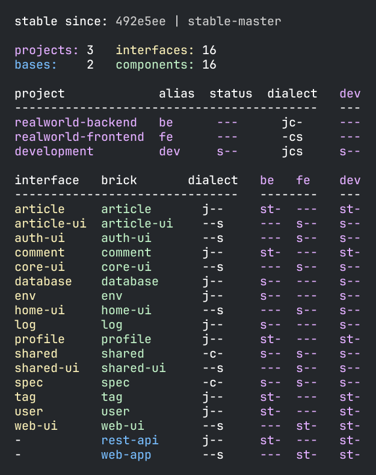

## Included since 0.2.22

The biggest change in 0.3.0 is support for ClojureScript.
The poly tool now handles ClojureScript (.cljs) source files as well as _package.json_ configuration files!

> For existing workspaces:
> - Set `:dialects` in _workspace.edn_ (see example [here](https://github.com/polyfy/polylith/blob/b400ab9c648ecedfbe2ba387e7874978783cd9f8/workspace.edn#L7)) to `["clj"]` or `["clj" "cljs"]` to instruct the `poly` tool which type of source files to read (Clojure and/or Clojure/ClojureScript).
> - Set `:template-data` in `workspace.edn` to e.g. `{:clojure-ver "1.12.2", :shadow-cljs-ver "^3.2.0"}`.
    More custom key/value pairs can be added, to be used in Selmer templates by the `create` command. 
> - Add `:jvm-opts ["--enable-native-access=ALL-UNNAMED"]` to your `:poly` alias in `./deps.edn` to remove warnings when starting a shell with `clojure -M:poly`.
> - To support ClojureScript:
>   - Create a `package.json` file to your workspace root as well as to projects, components, and bases, see the RealWorld [example app](https://github.com/furkan3ayraktar/clojure-polylith-realworld-example-app/tree/cljs-frontend) as an example.
>   - Ensure to use the latest versions of the [External](https://github.com/seancorfield/polylith-external-test-runner) and [Kaocha](https://github.com/imrekoszo/polylith-kaocha) test runners (if you use any of these), see example [here](https://cljdoc.org/d/polylith/clj-poly/0.3.0-SNAPSHOT/doc/test-runners#custom-test-runner).

Main changes:

- The `create workspace` command:
  - If `dialects:DIALECTS` is provided, it will be used to set `:dialects` in workspace.edn to `DIALECTS`, e.g. `["clj"]` or `["clj" "cljs"]`.
    - Only the dialects selected (Clojure/ClojureScript) will be read from disk.
    - If no dialect is specified, `["clj"]` will be used.
    - If any of the values are set to `"cljs"` (`["cljs"]` or `["clj" cljs"]`) a `package.json` file will be created. 
- The `create component`, `create base`, and `create project` commands:
  - If `DIALECT` in `dialect:DIALECT` is set to `cljs`, a `package.json` file will be created.
  - Suggests the `dialect` argument in the shell, if `cljs` is listed among the `:dialects` in workspace.edn.
  - If `dialect` is not specified, `clj` will be used.
  - The new attribute `:template-data` is set to the initial value `{:clojure-ver "1.12.2", :shadow-cljs-ver "^3.2.0"}`.
    You can add your own set of custom key/value pairs or update the existing, which are then used by Selmer when creating files.
- The `libs` command:
  - NPM dependencies are now included in the list of library dependencies (read from `package.json` files).
  - The `:outdated` parameter also checks for outdated npm dependencies.
  - The `:update` parameter also updates npm dependencies in _package.json_ files.
    - `:keep-lib-versions` also works for npm dependencies.
    - The `libraries:LIBS` filtering works as expected (outdated npm libraries are suggested when run from a shell).
- The `info` command:
  - If the `:dialect` argument is provided, a _dialect_ column is added to the table, showing which source types are used by the bricks and projects (and their bricks),
    where `j--"` = clj (Clojure), `-c-` = cljc (Clojure Common), `--s` = cljs (ClojureScript).
    The pattern here is that the last letter of the file extension is used, for example `j` for `clj`.
  
    
- Changes to the workspace structure:
  - `:ws-dialects` shows supported dialects, e.g. `#{"clj"}` or `#{"clj" "cljs"}`, and can be retrieved by `ws get:ws-dilects`.
  - Configuration from _package.json_ files are stored in the workspace structure and can be retrieved by `ws get:configs:ENTITY:NAME:package` where `ENTITY` is `workspace`, `projects`, `components`, or `bases`, and `NAME` is the name of the workspace/project/component/base.
  - The source types used ("clj", "cljc", and "cljs") by components, bases, and projects, are stored in ENTITIES:ENTITY:source-types.

### Other changes:
- Ensure exported workspaces with symbols (e.g. a test runner namespace) are readable when used by `ws-file:FILE` (or `switch-ws` in a shell).
- Suppress warning "WARNING: A restricted method in java.lang.System has been called" when starting a shell.

### Issues and PRs:
- Add support for ClojureScript, issue [482](https://github.com/polyfy/polylith/issues/481)
- Fix typo in the documentation, PR [560](https://github.com/polyfy/polylith/pull/560)

### Doc updates
- Changed the sha for Sean's External test runner to `c97747aa2b1fdf03c46c7e435cca7c2608740a2a` in [this](https://cljdoc.org/d/polylith/clj-poly/0.3.0/doc/test-runners#_use_a_custom_test_runner) section.
  This version ignores cljs namespaces, which would otherwise have caused errors when running the `test` command.
- Mention that tests should be run with Deps [here](https://cljdoc.org/d/polylith/clj-poly/0.3.0/doc/testing#cursive-users).
- Updated links to use the [cljs-frontend](https://github.com/furkan3ayraktar/clojure-polylith-realworld-example-app/tree/cljs-frontend) branch of the Realworld example app.
- Added [Clojure Script](doc/source-code.adoc#clojure-script) section to the Source Code page.
