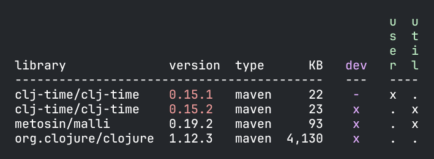

## Included since 0.3.0

This release introduces two new features; the ability to filter by library name in the `libs` command, and support for detecting inconsistent library versions in the `check` command.
Libraries that use different versions are highlighted in yellow (warnings) or red (errors), see documentation [here](http://localhost:8000/d/polylith/clj-poly/0.3.30-SNAPSHOT/doc/libraries#validate):

> For existing workspaces:
> - Set `:validations` in _workspace.edn_, see example [here](http://localhost:8000/d/polylith/clj-poly/0.3.30-SNAPSHOT/doc/libraries#_validate).
> - Make sure to use the latest `0.7.0` version of the https://github.com/seancorfield/polylith-external-test-runner (if you use it).

### Changes:
- The `:libraries` attributes has been added to the workspace structure, and the version has been bumped to `5.1`.
  See [versions](https://cljdoc.org/d/polylith/clj-poly/0.3.30-SNAPSHOT/doc/versions) for details.
- The `:workspaces` key is no longer mandatory in the workspace root _package.json_ file. 
- Warnings are no longer shown when starting a shell with the stand-alone `poly` command (update to the latest version to get this fix).
- The [set](https://cljdoc.org/d/polylith/clj-poly/0.3.30-SNAPSHOT/doc/developing-poly#set) argument is introduced to simplify creation of images with the `polyx` command.

### Issues and PRs:
- Filter on libraries in the libs command, issue [558](https://github.com/polyfy/polylith/issues/558)
- Report libraries using different versions in the workspace, issue [562](https://github.com/polyfy/polylith/issues/562)
- Use configuration passed in by -Sdeps, issue [574](https://github.com/polyfy/polylith/issues/574)

### Doc updates
