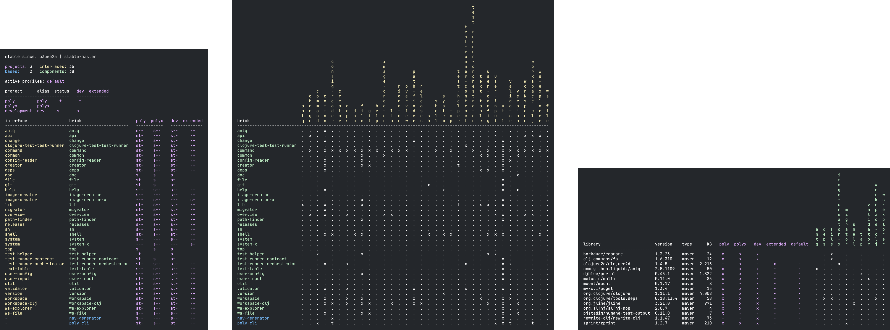

image::doc/images/logo.png[width=400]
:cljdoc-doc-url: https://cljdoc.org/d/polylith/clj-poly/CURRENT/doc

//https://cljdoc.org/d/polylith/clj-poly/CURRENT[image:https://cljdoc.org/badge/polylith/clj-poly[cljdoc]]

https://polylith.gitbook.io/poly[image:https://badgen.net/badge/gitbook/0.2.17-alpha/blue[]]
https://cljdoc.org/d/polylith/clj-poly/0.2.18-SNAPSHOT[image:https://badgen.net/badge/cljdoc/0.2.18-SNAPSHOT/cyan[]]
https://clojurians.slack.com/messages/C013B7MQHJQ[image:https://badgen.net/badge/slack/join chat/green[]]

== Welcome to the wonderful world of Polylith!

This tool is made by developers for developers with the goal to maximize productivity and increase the quality of the systems we write.
It supports your build pipeline but is not a build tool itself.

The Polylith concept can be implemented in any programming language, but this version of the Polylith tool targets
https://clojure.org/[Clojure] which is a powerful and simple functional language for the
https://www.google.com/url?sa=t&rct=j&q=&esrc=s&source=web&cd=&cad=rja&uact=8&ved=2ahUKEwiB88eLxansAhUyi8MKHd6jDPEQFjAAegQIBRAC&url=https%3A%2F%2Fen.wikipedia.org%2Fwiki%2FJava_virtual_machine&usg=AOvVaw0YtnMyoG7GQIhUPeLulbfr[JVM].

Polylith introduces the architectural concept of “service level building blocks”, which can be combined like LEGO® bricks
to build our services and systems. Polylith’s LEGO-like bricks are easy to reason about, test, refactor, and reuse.
They allow us to work with all our code in one place for maximum productivity, using a single
https://en.wikipedia.org/wiki/Read%E2%80%93eval%E2%80%93print_loop[REPL].

The bricks can easily be put together to form different kinds of deployable artifacts, like services and tools, in the same way
we put together LEGO® when we were kids! Not surprisingly, it's just as simple and fun!

To give you an idea of what that can look like, take a quick look at the projects, bricks, and libraries that we use
to build the _poly tool_ (which is itself a Polylith workspace, represented by the poly column in the first diagram):

To better understand the principles and ideas behind this tool, we recommend you first read the
https://polylith.gitbook.io[high-level documentation!]

If you want to get started right away with writing code, we recommend you to at least read the page
https://polylith.gitbook.io/polylith/introduction/polylith-in-a-nutshell[Polylith in a Nutshell]
from the high-level doc, where concepts like interface, component, base, brick, project, and workspace, are introduced,
ifdef::env-cljdoc[]
before continuing with the xref:doc/introduction.adoc[introduction].
endif::[]
ifndef::env-cljdoc[]
before continuing with the {cljdoc-doc-url}/introduction[introduction].
endif::[]

Enjoy the ride!

== Sponsor Polylith

Please https://github.com/sponsors/polyfy[sponsor] the important work of Polylith! ❤️

Iron, Bronze, Silver, Gold, and Platinum sponsors will also be listed on the
https://polylith.gitbook.io/polylith[first page] of the high-level documentation.

=== Bronze Sponsors

image::doc/images/sponsors/scrintal.png[link=https://www.scrintal.com,alt=scrintal.com,width=200]

=== Iron Sponsors

image::doc/images/sponsors/adgoji.png[link=https://www.adgoji.com,alt=adgoji.com,width=200]

=== Polylith Super Fans

image::https://avatars.githubusercontent.com/u/59614667[link=https://github.com/fluent-development,alt=Multiply,width=40]

=== Polylith Fans

image::https://avatars.githubusercontent.com/u/18068051[link=https://github.com/yyna,alt=Jungin Kwon,width=32]

=== Polylith Friends

image:https://avatars.githubusercontent.com/u/43875[link=https://github.com/seancorfield,alt=Sean Corfield,width=32,role="left"]
image:https://avatars.githubusercontent.com/u/243097[link=https://github.com/namenu,alt=Hyunwoo Nam,width=32,role="left"]
