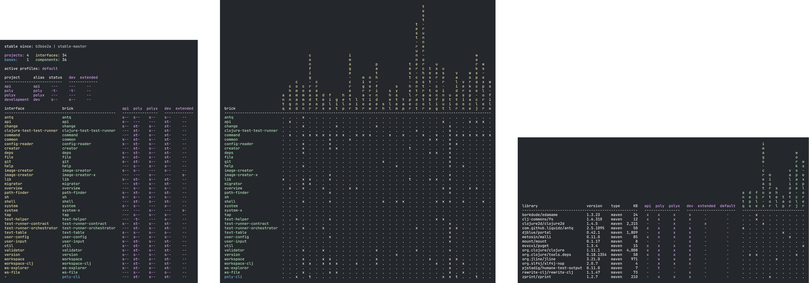

image::images/logo.png[]

== Welcome to the wonderful world of Polylith!

This tool is made by developers for developers with the goal to maximize productivity and increase the quality of the systems we write. It supports your build pipeline but is not a build tool itself.

The Polylith concept can be implemented in any programming language, but this version of the Polylith tool targets Clojure which is a powerful and simple functional language for the JVM.

Polylith introduces the architectural concept of “service level building blocks”, which can be combined like LEGO® bricks to build our services and systems. Polylith’s LEGO-like bricks are easy to reason about, test, refactor, and reuse. They allow us to work with all our code in one place for maximum productivity, using a single REPL

The bricks can easily be put together to form different kinds of deployable artifacts, like services, tools,  and libraries, in the same way we put together LEGO® when we were kids! Not surprisingly, it's just as simple and fun!

To give you an idea of what that can look like, take a quick look at the bricks and libraries that we use to build the Polylith tool (which is itself a Polylith workspace, represented by the poly column in the first diagram and from now on we will call it the poly tool):

To better understand the principles and ideas behind this tool, we recommend you first read the https://polylith.gitbook.io[high-level documentation!]

If you want to get started right away with writing code, we recommend you to at least read the page https://polylith.gitbook.io/polylith/introduction/polylith-in-a-nutshell[Polylith in a Nutshell] from the high-level doc, where concepts like component, base, interface, brick, project, and workspace, are introduced.

Enjoy the ride!

= Introduction

This documentation aims to be a practical guide to this tool with lots of code examples. We encourage you to follow the code examples and try it out yourself. We will guide you through the steps of creating a workspace with projects composed of components, bases, and libraries and how to work with them from the development environment.

We will give a short introduction to tools.deps and how to use tools.build to create deployable artifacts. We will show how git is used to tag the code and how it enables us to test and release the code incrementally.

We will show how profiles will help us work from a single development environment for maximum efficiency and how dependencies and library usage can be displayed.

We will explain the value of components and how they bring context to our development experience, which will help us build decoupled and scalable systems from day one.

Happy coding!

= Sponsor Polylith

Please https://github.com/sponsors/polyfy[sponsor] the important work of Polylith! ❤️

Iron, Bronze, Silver, Gold, and Platinum sponsors will also be listed on the https://polylith.gitbook.io/polylith[first page] of the high-level documentation.

=== Bronze Sponsors

image::images/logos/scrintal.png[link=https://www.scrintal.com,alt=scrintal.com,width=200]

=== Iron Sponsors

image::images/logos/adgoji.png[link=https://www.adgoji.com,alt=adgoji.com,width=200]

=== Polylith Super Fans

image::https://avatars.githubusercontent.com/u/59614667[link=https://github.com/fluent-development,alt=Multiply,width=40]

=== Polylith Fans

image::https://avatars.githubusercontent.com/u/18068051[link=https://github.com/yyna,alt=Jungin Kwon,width=32]

=== Polylith Friends

image::https://avatars.githubusercontent.com/u/43875[link=https://github.com/seancorfield,alt=Sean Corfield,width=32]
