# 
A tool used to develop Polylith based architectures in Clojure.

---------

> **_UNDER CONSTRUCTION_**<br>
> This new tools.deps based tool hasn't been released yet.<br>
> Please use the old lein-polylith based tool in the meantime:<br>
> https://github.com/tengstrand/lein-polylith

Welcome to the wonderful world of Polylith!

This tool is made by developers for developers with the goal to maximise productivity and 
increase the quality of the systems we write. Polylith can support any programming language, but here
we target [Clojure](https://clojure.org) which is a powerful and simple functional language.

A Polylith system is made up by simple building blocks that can be combined like Lego bricks.
The main building blocks are the components. You can think of them as libraries that can be used everywhere.
If libraries are frozen code, then components are non-frozen libraries.

Those Lego-like bricks are easy to reason about and can can be combined into a single development 
environment, which allow us to work with all the code from one place.
They can also be put together into deployable artifacts, like services, in endless ways and in almost no time.

To better understand the principles and ideas behind this 
[open source](https://www.eclipse.org/legal/epl-v10.html) tool, we recommend you first read the Polylith 
[documentation](https://polylith.gitbook.io).

Enjoy the ride!

## Leiningen version

The old [lein-polylith](https://github.com/tengstrand/lein-polylith) tool has reached its end of lifetime.  
If you have any old Leiningen based projects to migrated, follow the instructions [here](https://github.com/tengstrand/lein-polylith/blob/migrate/migrate/migrate.md).

Some of the Polylith [documentation](https://polylith.gitbook.io) is still mentioning how things worked
in the old Leiningen version of the tool, for example the empty `workspace interfaces` and the use of
`symbolic links`. 
In some of the videos, we still use `system` instead of `service` which are now seen as different kinds 
of deployable `environments`.
Except from that, pretty much everything is the same, except that it's now based on 
[tools.deps](https://github.com/clojure/tools.deps.alpha) instead of [Leiningen](https://leiningen.org/)
which gives us a more pleasant development experience.

## Table of Contents

- [Installation](#installation)
- [Windows](#windows)
- [Content](#content)
- [Realworld Example](#realworld-example)
- [Workspace](#workspace)
- [Development](#development)
- [Component](#component)
- [Interface](#interface)
- [Base](#base)
- [Environment](#environment)
- [Tools.deps](#toolsdeps)
- [Build](#build)
- [Git](#git)
- [Tagging](#tagging)
- [Flags](#flags)
- [Testing](#testing)
- [Profile](#profile)
- [Dependencies](#dependencies)
- [Libraries](#libraries)
- [Context](#context)
- [Naming](#naming)
- [Mix languages](#mix-languages)
- [Configuration](#configuration)
- [Commands](#commands)
- [Colors](#colors)
- [Contact](#contact)
- [License](#license)

## Installation

All examples are written for Linux/Unix users, including how to install the tool.  
How to install on Windows is described in the [Windows](#windows) section below.

To use the Polylith tool and to get access to all the features in tools.deps, make sure you have
the [CLI tools](https://clojure.org/guides/getting_started) and
[git](https://git-scm.com/book/en/v2/Getting-Started-Installing-Git) installed, and don't forget
to set the [user](https://docs.github.com/en/github/using-git/setting-your-username-in-git)
name and email in git.

The next thing we want to do is to download and install the `poly` command line tool.

> Work in progress...

## Windows

The old Leiningen based tool used [symbolic links](https://en.wikipedia.org/wiki/Symbolic_link) 
which made life harder for Windows users. In this version the symbolic links are gone and 
Windows is fully supported.

> Work in progress...

## Content

This documentation aims to be a practical guide to this tool with lots of code examples. 
We encourage you to follow the code examples and try it out yourself. 
We will guide you through the steps of creating a workspace with environments composed of 
components, bases and libraries and how to work with them from the development environment.

We will give a short introduction to tools.deps and how to use build scripts to create
depolyable artifacts. We will show how git is used to tag code and releases
and how it enables us to test and release the code incrementally.

We will explain the value of components and how they bring context to our development experience, 
which will help us build decoupled and scalable systems from day one.

Finally, we hope this will bring more happiness to the world!

## Realworld Example

If you want to have a look at a full-blown system, go to the [RealWorld](https://github.com/furkan3ayraktar/clojure-polylith-realworld-example-app) project where you can compare it with [implementations made in other languages](https://github.com/gothinkster/realworld).

## Workspace

The workspace directory is the place where all our code and configuration lives.

Let’s start by creating the `example` workspace with the top namespace `se.example` by using the [create w](#create-w) command:
```sh
poly create w name:example top-ns:se.example
``` 

The workspace directory structure will end up like this:
```sh
example            # workspace dir
├── .git           # git repository dir
├── bases          # bases dir (empty)
├── components     # components dir (empty)
├── deps.edn       # development + workspace config file
├── development
│   └── src        # development specific code
├── environments   # environments dir (empty)
├── logo.png       # polylith logo
└── readme.md      # documentation
```

The directory structure makes it easier to find things and helps us reason about the system at a higher level. 
Each top directory is responsible for its own part of a Polylith system.
A `base` exposes a public API. A `component` is responsible for a specific domain 
or part of the system. 
An `environment` specifies our deployable artifacts and what components, bases and libraries they contain.
Finally, we have the `development` environment (`development` + `deps.edn`)
that are used to work with the code.

A workspace is always initialized to use [git](https://git-scm.com/), but more on that later.

The `bases`, `components` and `environments` directories also contain a .keep file, and they are put there to prevent git from
removing the empty directories which could otherwise happen if the workspace is clones before any files are added.
 
The `deps.edn` file looks like this:

```clojure
{:polylith {:vcs "git"
            :top-namespace "se.example"
            :interface-ns "interface"
            :default-profile-name "default"
            :compact-views #{}
            :build-tag-pattern "v[0-9]*"
            :stable-since-tag-pattern "stable-*"
            :env-to-alias {"development" "dev"}
            :ns-to-lib {}}

 :aliases  {:dev {:extra-paths ["development/src"]
                  :extra-deps {org.clojure/clojure {:mvn/version "1.10.1"}
                               org.clojure/tools.deps.alpha {:mvn/version "0.8.695"}}}

            :test {:extra-paths []}

            :poly {:main-opts ["-m" "polylith.clj.core.poly_cli.poly"]
                   :extra-deps {polyfy/polylith
                                {:git/url   "https://github.com/polyfy/polylith"
                                 :sha       "78b2c77c56d1b41109d68b451069affac935200e"
                                 :deps/root "environments/poly"}}}}}
```

We will cover what all the different settings mean and how to use them.

## Development

When working with a Polylith codebase, we are free to choose any editor/IDE we like, for example
[Emacs](https://www.gnu.org/software/emacs/)/[Cider](https://github.com/clojure-emacs/cider), 
[VSCode](https://code.visualstudio.com/)/[Calva](https://marketplace.visualstudio.com/items?itemName=betterthantomorrow.calva) or
[IDEA](https://www.jetbrains.com/idea/)/[Cursive](https://cursive-ide.com). Here we will use Cursive.

Let's get started by creating a project. From the menu, select `File > New > Project from existing source`.
Select the `deps.edn` file, the desired version of SDK and finish the wizard.

Make sure to activate the `:dev` alias (and press the "two arrows" icon to refresh):<br>


Let's create a REPL by clicking `Add Configuration`:<br>


Click the `+` sign and select `Clojure REPL > Local`:<br>


Fill in:
- Name: REPL
- Which type of REPL to run: nREPL
- Run with Deps: (select)
- Aliases: test,dev

Now start the REPL in debug mode, by clicking the bug icon:<br>


When this turns up:
```
nREPL server started on port 53536 on host localhost - nrepl://localhost:53536
Clojure 1.10.1
```
...we are ready to go!

If we look at the `deps.edn` file again, we can see that _"development/src"_ was already added to the path:
```
 :aliases  {:dev {:extra-paths ["development/src"]
```

This gives us access to the `developent/src` directory so that we can work 
with the code. Right now there is only one directory here, but every time we create a new component or base,
they normally end up here too.


The "development/src" path belongs to the `dev` alias which we activated previously and also added to the REPL
by selecting the "dev,test" aliases.
This means that we have configured everything that [tools.deps](https://github.com/clojure/tools.deps.alpha)
needs and that we are ready to write some Clojure code!

To do that we first need to create a namespace. We suggest that you use `dev` as a top namespace here and not 
the workspace top namespace `se.example`.
The reason is that we don't want to mix the code we put here with production code.

One way of structuring the code is to give every developer their own namespace under the `dev` top namespace.
Let's follow that pattern and create the namespace `dev.lisa`.

Right click on the `development/src` directory and select `New > Clojure Namespace` and type "dev.lisa":<br>


Now let's write some code:
```clojure
(ns dev.lisa)

(+ 1 2 3)
```
If we send `(+ 1 2 3)` to the REPL we should get `6` back, and if we do,
it means that we now have a working development environment!

# Component

Now when we have a working development environment, let's continue by creating our first component,
by executing the [create c](#create-c) command:
```sh
cd example
poly create c name:user
```


Our workspace will now look like this:
```sh
example
├── bases
├── components
│   └── user
│       ├── resources
│       │   └── user
│       │       └── .keep
│       ├── src
│       │   └── se
│       │       └── example
│       │           └── user
│       │               └── interface.clj
│       └── test
│           └── se
│               └── example
│                   └── user
│                       └── interface_test.clj
├── deps.edn
├── development
│   └── src
│       └── dev
│           └── lisa.clj
├── environments
├── logo.png
└── readme.md
```

The command also printed out this message:
```
  Remember to add src, resources and test directories to 'deps.edn' files.
```

This was a reminder for us to add source directories to `deps.edn`.
If we don't, then tools.deps and the development environment will not recognise our newly created component,
which would be a pity!

Let's continue by adding the component's `src`, `resources` and `test` directory to `deps.edn`:
```clojure
 :aliases  {:dev {:extra-paths ["development/src"
                                "components/user/src"
                                "components/user/resources"]
  ...
            :test {:extra-paths ["components/user/test"]}
```

Now we may need to refresh our IDE, by clicking this link, or the icon we used before:<br>


Now execute the [info](#info) command:<br>
```sh
poly info
```
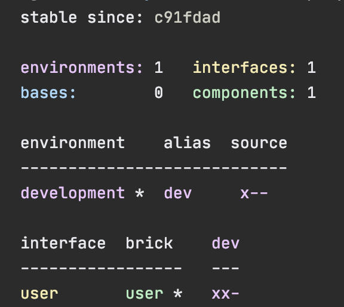

This tells us that we have one `development` environment, one `user` component and
one `user`interface but no `base` (yet).

If you want to adjust the colors or your system, then visit the [colors](#colors) section.

Now, let's add the `core` namespace to `user`:<br>
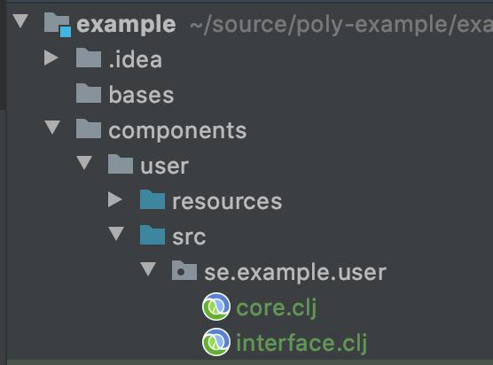

...and change it to:
```clojure
(ns se.example.user.core)

(defn hello [name]
  (str "Hello " name "!"))
```

...and update the `interface` to:
```clojure
(ns se.example.user.interface
  (:require [se.example.user.core :as core]))

(defn hello [name]
  (core/hello name))
``` 
Here we delegate the incoming call to the implementing `core` namespace,
which is the recommended way to structure the code in Polylith.
Here we put all our implementing code in one single namespace, but as the codebase grows, 
more namespaces can be added to the component.


## Interface

Interfaces are great in many ways:
- _Single point of access_. Components can only be accessed through their interface, which makes them
   easy to find, use and reason about.
- _Encapsulation_. All the implementing namespaces for a component can be changed without breaking the interface contract.
- _Composability_. Components are decopled building blocks and can be replaced with other components that share the same interface.


When we created the `user` component, the `user` interface was also created.


So what is an `interface` and what is it good for?

An interface in the Polylith world is a namespace named `interface` that often lives in one but 
sometimes several namespaces within a component. It defines a number of `def`, `defn` or `defmacro`
statements which forms the contract that it exposes to other components and bases.

If more than one component uses the same interface, then all these components must define the exact same set of 
`def`, `defn` and `defmacro` definitions, which is something the tool will help us with.

We often choose to have just a single `interface` namespace in a component, but it is also possible to 
divide the interface into several namespaces.
To do so we first create an `interface` package (directory) with the name `interface` at the root
and then we put the sub namaspaces in there.

We can find an example where the Polylith tool does that, by dividing its 
[util](https://github.com/polyfy/polylith/tree/master/components/util/src/polylith/clj/core/util/interface)
interface into several sub namespaces:
```sh
util
└── interface
    ├── color.clj
    ├── exception.clj
    ├── os.clj
    ├── str.clj
    └── time.clj
```

This can be handy if we want to group the functions and not put everyone into one place.
Every time we think of splitting up the interface, keep in mind that it can be an indicator
that it's time to split it up into smaller components!

Here is an example of some code that uses such an interface:
```clojure
(ns dev.lisa
  (:require [se.example.util.interface.time :as time-util]))

(time-util/current-time)
```
### Interface definitions

So far, we have only used functions in the interface. Polylith also supports having `def`
and `defmacro` statements in the interface.
There are no magic here, just include the definitions you want, like this:
```clojure
(def a-value 123)
```
Now it can be used as a normal definition from any other component or base.

A `defmacro` definition can look like this:
```clojure
(ns se.example.logger.interface
  (:require [logger.core :as core]))

(defmacro info [& args]
  `(core/info ~args))
```

...which deletages to:
```clojure
(ns se.example.core
  (:require [taoensso.timbre :as timbre]))

(defmacro info [args]
  `(timbre/log! :info :p ~args))
``` 

Here are some additional tips on how to work with interfaces:
- Functions can be sorted in alphabetical order in the interface, while we can freely arrange them in the implementation namespace(s).
- The interface can expose the name of the entity, e.g. `sell [car]`, while the implementing function can do the
  destructuring, e.g. `sell [{:keys [model type color]}]` which sometimes can improve the readability.
- If we have a [multi-arity function](http://clojure-doc.org/articles/language/functions.html#multi-arity-functions)
  in the interface, a simplification can sometimes be to have a single arity function in the implementing
  namespace that allows some parameters to be passed in as `nil`.
- If using [variadic functions](http://clojure-doc.org/articles/language/functions.html#variadic-functions)
  in the interface, a simplification is to pass in what comes after `&` as a `list` to the implementing function.
- Testing is simplified by allowing access to implementing namespaces from the `test` directory.
  Only the code under the `src` directory is restricted to only access the `interface` namespace.
  The check is performed when running the `check` or `info` command or via the `githook`
  if that is enabled.
- All functions can be declared public. This improves testability and the debugging experience.
  When stopping at a breakpoint to evaluate a function, we don't need to use any special syntax to access it, 
  because it's not private.
- If using a `function` in two components that implement the same interface,
  all definitions must be `function`. The same goes for `macros`. The reason for this restriction is that 
  functions are composable, but macros are not, which could otherwise cause problems.

Finally, if we have really good reasons to, the `interface` namespace name can be changed in `:interface-ns` in `./deps.edn`.

## Base

A `base` is similar to a `component` except for two things:
- It doesn't have an `interface`.
- It exposes a public API to the outside world.


The lack of an `interface` makes bases less composable compared to components. This is not a problem,
because they solve a different problem and that is to be a bridge between the real world and the components.
This is done by taking the incomming call and delegate them to various components.

Let's create the `cli` base to see how it works, by executing the [create b](#create-b) command:
```sh
poly create b name:cli
```

Our workspace should now look like this:
```sh
example
├── bases
│   └── cli
│       ├── resources
│       │   └── cli
│       ├── src
│       │   └── se
│       │       └── example
│       │           └── cli
│       │               └── core.clj
│       └── test
│           └── se
│               └── example
│                   └── cli
│                       └── core_test.clj
├── components
│   └── user
│       ├── resources
│       │   └── user
│       ├── src
│       │   └── se
│       │       └── example
│       │           └── user
│       │               ├── core.clj
│       │               └── interface.clj
│       └── test
│           └── se
│               └── example
│                   └── user
│                       └── interface_test.clj
├── deps.edn
├── development
│   └── src
│       └── dev
│           └── lisa.clj
├── environments
├── logo.png
└── readme.md
```

Now we need to update `deps.edn` with our newly created base:
```clojure
 :aliases  {:dev {:extra-paths ["development/src"
                                "components/user/src"
                                "components/user/resources"
                                "bases/cli/src"
                                "bases/cli/resources"]
                  :extra-deps {org.clojure/clojure {:mvn/version "1.10.1"}
                               org.clojure/tools.deps.alpha {:mvn/version "0.8.695"}}}

            :test {:extra-paths ["components/user/test"
                                 "bases/cli/test"]}
```

...and add some code to it:
```clojure
(ns se.example.cli.core
  (:require [se.example.user.interface :as user])
  (:gen-class))

(defn -main [& args]
  (println (user/hello (first args)))
  (System/exit 0))
```

Here we added the `-main` function that later will be called from the command line.
The `(:gen-class)` statement tells the compiler to generate a Java class for us
when the code is compiled.

The next thing we want to do is to build an artifact that will turn the code into something useful, a command line tool.
To do that, we need to start by creating an environment.

## Environment

There are two kind of environments.


1. The `development` environment:
   - This is where we work with the code, often via a REPL. 
   - It contains all libraries, components and bases in the workspace, which is specified in `./deps.edn`.
   - Any extra code, that is not part of a component or base, lives under the `development` folder.
2. Any `deployable` environment:
   - Used to build deployable artifacts, e.g.: lambda functions, REST API's, libraries, command line tools, ...and more.
   - Lives under the `environments` directory where each environment has its own directory.
   - Has a `deps.edn` config file that specifies which libraries, component and bases that are included.
   - Can optionally have a `resources` directory. 
   - If it has any tests of its own, they will live in the `test` directory, e.g. `environments/my-env/test`. 
   - It's discouraged to have a `src` directory since all production code should normally only live in components and bases.

Let's create an environment, by executing the [create e](#create-e) command:
```sh
poly create e name:command-line
```
 
Our workspace should now look like this:
```sh
example
├── bases
│   └── cli
│       ├── resources
│       │   └── cli
│       ├── src
│       │   └── se
│       │       └── example
│       │           └── cli
│       │               └── core.clj
│       └── test
│           └── se
│               └── example
│                   └── cli
│                       └── core_test.clj
├── components
│   └── user
│       ├── resources
│       │   └── user
│       ├── src
│       │   └── se
│       │       └── example
│       │           └── user
│       │               ├── core.clj
│       │               └── interface.clj
│       └── test
│           └── se
│               └── example
│                   └── user
│                       └── interface_test.clj
├── deps.edn
├── development
│   └── src
│       └── dev
│           └── lisa.clj
├── environments
│   └── command-line
│       └── deps.edn
├── logo.png
└── readme.md
```
 
The tool also reminded us of this:
```sh
  It's recommended to add an alias to :env-to-alias in ./deps.edn for the command-line environment.
```

If we don't add the alias to ./deps.edn, it will be shown up as a `?` when we execute the `info` command:
```clojure
{:polylith {...
            :env-to-alias {"development" "dev"
                           "command-line" "cl"}
```

Now add `user` and `cli` to `deps.edn` in `environments/command-line`:
```clojure
{:paths ["../../components/user/src"
         "../../components/user/resources"
         "../../bases/cli/src"
         "../../bases/cli/resources"]
 ...

 :aliases {:test {:extra-paths ["../../components/user/test"
                                "../../bases/cli/test"]
                  ... }}}
```

Note:
- We didn't add "development/src".
- The src paths and the test paths are configured at different levels, `:paths` and `extra-paths`.
- All paths begin with "../../".

The reson we didn't add "development/src" is because it contains code that should only be used
from the development environment.

All environments under the `environments` directory have their source paths defined in `:paths`
instead of inside the `:dev` alias, as for the `development` environment.
The deployable environments are simpler than `development` and uses the "standard way" of 
configuring environments by puting things in `:paths`.

The reason all paths begin with "../../" is that `components` and `bases` live two levels up 
compared to `environments/command-line` and not at the root as with the `development` environment.

If we add a missing path here, then we will get a warning when we execute the [check](#check) or [info](#info) command, e.g.:


## Tools.deps

This Polylith tool is built on top of _tools.deps_. To get the most out of it, we recommend 
you to read the [documentation](https://github.com/clojure/tools.deps.alpha).

To make it easier to follow the examples in the next `build` section, we will show some examples
on how to use the `clj` command (the `clojure` command will also work in these examples).

Let's start by compiling the `command-line` environment:
```
cd environments/command-line
mkdir -p classes
clj -e "(compile,'se.example.cli.core)"
```
This will AOT compile the `command-line` environment.
The command needs the `classes` directory, so we had to create it first.

If we add this `alias` to `command-line/deps.edn` (which we will do in the next section):
```clojure
 :aliases {:aot     {:extra-paths ["classes"]
                     :main-opts   ["-e" "(compile,'se.example.cli.core)"]}
           ...
```

...we can compile the environment by giving the `aot` alias:
```sh
clj -A:aot
```

To build an uberjar, out of the compiled classes, we need to add this alias:
```clojure
           :uberjar {:extra-deps {uberdeps {:mvn/version "0.1.10"}}
                     :main-opts  ["-m" "uberdeps.uberjar"
                                  "--aliases" "aot"
                                  "--main-class" "se.example.cli.core"]}
           ...
```

...and execute:
```
clj -A:uberjar
```

When we created the workspace with the [create w](#create-w) command, the `poly` alias was also added to `./deps.edn`:
```clojure
            :poly {:main-opts ["-m" "polylith.clj.core.poly_cli.poly"]
                   :extra-deps {polyfy/polylith
                                {:git/url   "https://github.com/polyfy/polylith.git"
                                 :sha       "78b2c77c56d1b41109d68b451069affac935200e"
                                 :deps/root "environments/poly"}}}
```

This alias can be used to execute the `poly` tool from the workspace root, e.g.:
```
clj -A:poly info
```

It takes longer to execute the `poly` command this way, because it needs to compile the Clojure code 
first, but it also allow us to execute older or newer versions of the tool by
selecting another `sha` from an existing [commit](https://github.com/polyfy/polylith/commits).

## Build

This tool doesn't include any `build` command. To build an artifact out of an environment, we should instead 
use scripts and maybe a build tool, or create our own build functions that we access via tools.deps.
We think they will do a better job and give us the level of control, flexibility and power we need.

Let's say we want to create an executable jar file out of the `command-line` environment.  
First, we create a `scripts`directory at the workspace root and copy this [build-uberjar.sh](https://github.com/polyfy/polylith/blob/master/scripts/build-uberjar.sh)
to it:
```sh
example
├── scipts
│   └── build-uberjar.sh
```

Create `build-cli-uberjar.sh`:
```sh
example
├── scipts
│   ├── build-uberjar.sh
│   └── build-cli-uberjar.sh
```

...with this content:
```sh
#!/usr/bin/env bash
./build-uberjar.sh command-line
```

...and make sure both are executable:
```sh
chmod +x scripts/build-uberjar.sh
chmod +x scripts/build-cli-uberjar.sh
```

Now add the `aot` and `uberjar` aliases to `deps.edn` in `environments/command-line`:
```clojure
{:paths ["../../components/user/src"
         "../../components/user/resources"
         "../../bases/cli/src"
         "../../bases/cli/resources"]

 :deps {org.clojure/clojure {:mvn/version "1.10.1"}
        org.clojure/tools.deps.alpha {:mvn/version "0.8.695"}}

 :aliases {:test {:extra-paths ["../../components/user/test"
                                "../../bases/cli/test"]
                  :extra-deps  {}}

           :aot     {:extra-paths ["classes"]
                     :main-opts   ["-e" "(compile,'se.example.cli.core)"]}

           :uberjar {:extra-deps {uberdeps {:mvn/version "0.1.10"}}
                     :main-opts  ["-m" "uberdeps.uberjar"
                                  "--aliases" "aot"
                                  "--main-class" "se.example.cli.core"]}}}

```

The `aot` alias points to the `se.example.cli.core` namespace, which is where our `-main` function lives.
The `uberjar` alias is used to create a callable uberjar (you can read more about uberjars [here](https://github.com/tonsky/uberdeps)).

Let's try to build the `command-line` tool:
```sh
cd scripts
./build-cli-uberjar.sh
```

The end of the output should say something like:
```
[uberdeps] Packaged ./target/command-line.jar in 3052 ms
Uberjar created.
```

Let's execute it:
```sh
cd ../environments/command-line/target
java -jar command-line.jar Lisa  
```

```
Hello Lisa!
```

It worked! 

## Git

We have already used the [info](#info) command a couple of times without explaining everything in its output.

Let's execute the `info` command again to see the current state of the workspace:<br>


At the top we have the line `stable since: c91fdad`. 
To explain what this is, let's take it from the beginning.

When a Polylith workspace is created, these `git` commands are executed:
```
git init
git add .
git commit -m "Workspace created."
``` 

If we run `git log` from the workspace root, it returns something like this:
```sh
commit c91fdad4a34927d9aacfe4b04ea2f304f3303282 (HEAD -> master)
Author: lisa <lisa@gmail.com>
Date:   Thu Sep 3 06:11:23 2020 +0200

    Workspace created.
```

This is the first and so far only commit of this repository.
This is also the first `stable point in time` of this workspace which the tool uses when it calculates what changes have
been made (up till now). Notice that the first letters of the hash correspond to `stable since: c91fdad`
and this is because it refers to this SHA-1 hash in git.
 
The `command-line` and `development` environments and the `user` and `cli` bricks (components and bases are
also called `bricks`) are all marked with an asterisk, `*`. The way the tool calculates changes is to ask
`git` by running this command internally:
```sh
git diff c91fdad4a34927d9aacfe4b04ea2f304f3303282 --name-only
```

We can also run the [diff](#diff) command, which will execute the same git statement internally:
```clojure
poly diff
```

The output is the same:
```
bases/cli/resources/cli/.keep
bases/cli/src/se/example/cli/core.clj
bases/cli/test/se/example/cli/core_test.clj
components/user/resources/user/.keep
components/user/src/se/example/user/core.clj
components/user/src/se/example/user/interface.clj
components/user/test/se/example/user/interface_test.clj
deps.edn
development/src/dev/lisa.clj
environments/command-line/deps.edn
scripts/build-cli-uberjar.sh
scripts/build-uberjar.sh
```

Here we have the answer to were the `*` signs came from. The paths that starts with `environments/command-line/`, 
`development/`, `components/user/` and `bases/cli/` makes the tool understand that `command-line`, `development`,
`user` and `cli` are changed.

When we created the workspace, a [.gitignore](https://git-scm.com/docs/gitignore) file was also created for us.  
Now is a good time to add more rows here if needed:
```sh
**/classes
**/target
```

Let's add and commit the changed files:
```
git add --all
git commit -m "Created the user and cli bricks."
```

Let's have a look at our workspace repository again:
```sh
git log --pretty=oneline
```

```sh
e7ebe683a775ec28b7c2b5d77e01e79d48149d13 (HEAD -> master) Created the user and cli bricks.
c91fdad4a34927d9aacfe4b04ea2f304f3303282 Workspace created.
```

If we run the `info` command again, it will return the same result as before, and the reason is that we
haven't told git to move the `stable point in time` to our second commit.

# Tagging

The way we mark a `stable point in time` is to tag it with git (-f tells git to reuse the tag if already exists):
```sh
git tag -f stable-lisa
```

If we now run `git log --pretty=oneline` again:
```sh
e7ebe683a775ec28b7c2b5d77e01e79d48149d13 (HEAD -> master, tag: stable-lisa) Created the user and cli bricks.
c91fdad4a34927d9aacfe4b04ea2f304f3303282 Workspace created.
```

...we can see that the second commit has been tagged with `stable-lisa`.
 
If we execute the `info` command:

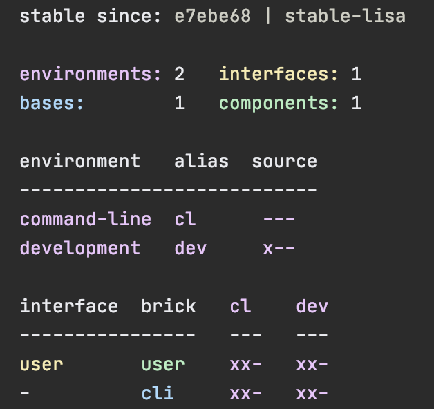

...the `stable since` hash has been updated and is now tagged with `stable-lisa`.
All the `*` signs are gone because no `component`, `base` or `environment` 
has yet changed since the second commit (which can be verified by running `poly diff` again).

We added the tag `stable-lisa` but we could have named the tag with anything that starts with `stable-`.
We choose `stable-lisa` because Lisa is our name (let's pretend that at least!). The idea is that every developer could use
their own unique tag name that doesn't conflict with other developers. 

The CI build should also use its own pattern, like `stable-` plus branch name or build number, to mark successful builds.
It may be enough to only use the stable points that the CI server creates. That is at least a good way to start
and only add custom tags per developer when needed.

The pattern is configured in `deps.edn` and can be changed if we prefer something else:
```clojure
            :stable-since-tag-pattern "stable-*"
```

It's possible to move back to an earlier `stable point` in time by passing in a hash (the first few letters i enough
as long as it's unique):
```sh
git tag -f stable-lisa c91fdad
```

The way the tool finds the latest tag is to execute this command internally:
```
git tag --sort=committerdate -l 'stable-*'
``` 

Then it uses the last line of the output, or if no match was found, the first commit in the repository.

## Flags

We have one more thing to cover regarding the `info` command, and that is what the `x` and `-` flags mean:
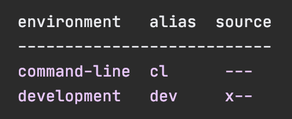

Each flag under _source_ has a different meaning:<br>


The `---` for the `command-line` environment means we have an `environments/command-line`
directory but no `src` or `test` directories in it and that no tests will be executed for this environment.

The `x--` for the `development` environment means we have a `development/src` directory
but no `development/test` directory and that no tests will be executed for this environment.

We also have this section:<br>


Here the flags have a slightly different meaning:<br>


The `xx-` for the `user` component tells that both `components/user/src` and `components/user/test` 
are included in the `command-line` and `development` environments and that no brick tests will be executed.

The `xx-` for the `cli` base follows the same pattern as for the `user` component but for the
`bases/cli` directory.

The bricks for the `command-line` environment is configured in `environments/command-line/deps.edn`:
```clojure
{:paths ["../../components/user/src"
         "../../bases/cli/src"
         "../../bases/cli/resources"]

 ...
 :aliases {:test {:extra-paths ["../../components/user/test"
```

The bricks for the `development` environment is configured in `./deps.edn`:
```clojure
 :aliases  {:dev {:extra-paths [...
                                "components/user/src"
                                "components/user/resources"
  ...
            :test {:extra-paths ["components/user/test"
```

If we execute `poly info :r` (or the longer `poly info :resources`):<br>


...then the `resources` directory is also shown:<br>


## Testing

Polylith encourages a test-centric approach when working with code. New brick tests are easy to 
write, and mocking can be avoided in most cases as we have access to all components from the 
environments they live in.

Let's go back to our example.

Nothing is marked to be tested at the moment, but if we change the `core` namespace in the `user` component
by adding an extra `!`, that should do the trick:
```clojure
(ns se.example.user.core)

(defn hello [name]
  (str "Hello " name "!!"))
```

We can verify that the tool recognises the change by running the `diff` command, which will give us this output:
```
components/user/src/se/example/user/core.clj
```

...and if we run the `info` command again:<br>


...the `user` component is now marked with an asterisk, `*`. If we look carefully we will also notice that 
the status flags `xxx` under the `cl` column now have an `x` in its last position. As we already know, 
this means that the tests for `user` and `cli` will be executed from the `command-line` environment
if we execute the `test` command.

But why is `cli` marked to be tested? The reason is that even though `cli` itself hasn't
change, it depends on something that has, namely the `user` component.
  
The columns under the `development` environment are all marked as `xx-`. The reason the `development`
environment is not marked to be tested is that the `development` environment's tests are 
not included by default.

But before we run the test command, we should first add a test by editing the `interface-test` 
namespace in the `user` component:
```clojure
(ns se.example.user.interface-test
  (:require [clojure.test :refer :all]
            [se.example.user.interface :as user]))

(deftest hello--when-called-with-a-name--then-return-hello-phrase
  (is (= "Hello Lisa!"
         (user/hello "Lisa"))))
```

Now let's run the [test](#test) command:
```sh
poly test
```

```
Environments to run tests from: command-line

Running tests from the command-line environment, including 2 bricks: user, cli

Testing se.example.cli.core-test

Ran 0 tests containing 0 assertions.
0 failures, 0 errors.

Test results: 0 passes, 0 failures, 0 errors.

Testing se.example.user.interface-test

FAIL in (hello--when-called-with-a-name--then-return-hello-phrase) (interface_test.clj:6)
expected: (= "Hello Lisa!" (user/hello "Lisa"))
  actual: (not (= "Hello Lisa!" "Hello Lisa!!"))

Ran 1 tests containing 1 assertions.
1 failures, 0 errors.
```


Oops, the test failed!
Remember that we added an extra `!` so now we need to update the 
corresponding test accordingly:
```clojure
(ns se.example.user.interface-test
  (:require [clojure.test :refer :all]
            [se.example.user.interface :as user]))

(deftest hello--when-called-with-a-name--then-return-hello-phrase
  (is (= "Hello Lisa!!"
         (user/hello "Lisa"))))
```

If we run the `test` command again, it will now pass:
```
Environments to run tests from: command-line

Running tests from the command-line environment, including 2 bricks: user, cli

Testing se.example.cli.core-test

Ran 0 tests containing 0 assertions.
0 failures, 0 errors.

Test results: 0 passes, 0 failures, 0 errors.

Testing se.example.user.interface-test

Ran 1 tests containing 1 assertions.
0 failures, 0 errors.

Test results: 1 passes, 0 failures, 0 errors.
Execution time: 1 seconds
```


We have already mentioned that the brick tests will not be executed from the `development` environment
when we run the `test` command.
But there is a way to do that, and that is to pass in `:dev` or `env:dev`.  

Let's try it out with the `info` command first:
```sh
poly info :dev
```


And yes, now the tests for the `development` environment are included. When we give an environment 
using `env` (`:dev` is a shortcut for `env:dev`) only that environment will be included. 
One way to test both the `development` environment and the `command-line` environment is to 
select both:
```
poly info env:cl:dev
```


Now both the `development` and the `command-line` environment is marked for test execution.
Here we used the environment aliases `cl` and `dev` but we could also have passed in the environment 
names or a mix of the two, e.g. `poly info env:command-line:dev`.  

### Environment tests

Before we execute any tests, let's add an environment test for the `command-line` environment.

Begin by adding a `test` directory for the `command-line` environment:
```sh
example
├── environments
│   └── command-line
│       └── test
``` 

Then add the path to `environments/command-line/deps.edn`:
```clojure
            :test {:extra-paths ["../../components/user/test"
                                 "../../bases/cli/test"
                                 "test"]}
```

...and to `./deps.edn`:
```clojure
            :test {:extra-paths ["components/user/test"
                                 "bases/cli/test"
                                 "environments/command-line/test"]}
```

Now add the `env.dummy-test` namespace to the `command-line` environment:
```sh
example
├── environments
│   └── command-line
│       └── test
│           └── env
│               └──dummy-test.clj

```
```clojure
(ns env.dummy-test
  (:require [clojure.test :refer :all]))

(deftest dummy-test
  (is (= 1 1)))
```

We could have choosen another top namespace, e.g., `se.example.env.command-line`, as long as 
we don't have any brick with the name `env`. But because we don't want to get into any name
conflicts with bricks and also because each environment is executed in isolation, the choice of 
namespace is less important and here we choose the `env` top namespace to keep it simple. 

If we execute the `info` command:<br>
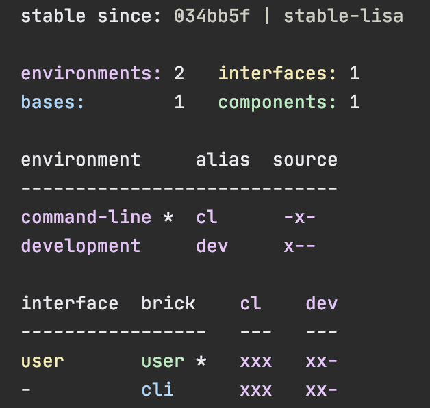

...the `command-line` is marked as changed and flagged as `-x-` telling us that 
it now has a `test` directory.  
The reason it is not tagged as `-xx` is that environment tests 
are not included in the tests without explicitly telling it to, by passing in `:env`.

```sh
poly info :env
```


Now the `command-line` environment is also marked to be tested.
Let's verify that by running the tests:
```sh
poly test :env
```

```
Environments to run tests from: command-line

Runing tests from the command-line environment, including 2 bricks and 1 environment: user-remote, cli, command-line

Testing se.example.cli.core-test

Ran 0 tests containing 0 assertions.
0 failures, 0 errors.

Test results: 0 passes, 0 failures, 0 errors.

Testing se.example.user.interface-test

Ran 1 tests containing 1 assertions.
0 failures, 0 errors.

Test results: 1 passes, 0 failures, 0 errors.

Testing env.dummy-test

Ran 1 tests containing 1 assertions.
0 failures, 0 errors.

Test results: 1 passes, 0 failures, 0 errors.
Execution time: 2 seconds
```

They passed!

### Test approaches

We have tests at two different levels, brick and environment tests.

The environment tests should be used for our slow tests. They also give us a way to write 
tailor-made tests that are unique per environment.
To keep the feedback loop short, we should only put fast running tests in our bricks.
This will give us a faster feedback loop, because the brick tests are the ones
that are executed when we run `poly test` while the environment tests are not.

But does that mean we are only allowed to put unit tests in our bricks?  
No. As long as the tests are fast (by e.g. using in-memory databases)
they should be put in the bricks they belong to

An extra bonus of using Polylith is that we can avoid most of the mocking,
because we run the tests from environments where we have access to real components.

Before we continue, let's commit what we have done so far and mark the workspace as stable:
```sh
git add --all
git commit -m "Added tests"  
git tag -f stable-lisa
```
If we execute the `info` command:<br>


...the `*` signs are now gone and nothing is marked to be tested.

The tool only execute tests if a brick is directly or indirectly changed.  
A way to force it to test all bricks is to pass in `:all-bricks`:
```sh
poly info :all-bricks
```


Now all the brick tests are marked to be executed, except for the `development` environment.  
To include dev, also add `:dev`:
```sh
poly info :all-bricks :dev
```


To include all brick and environment tests (except `dev`) we can type:
```sh
poly info :all
```
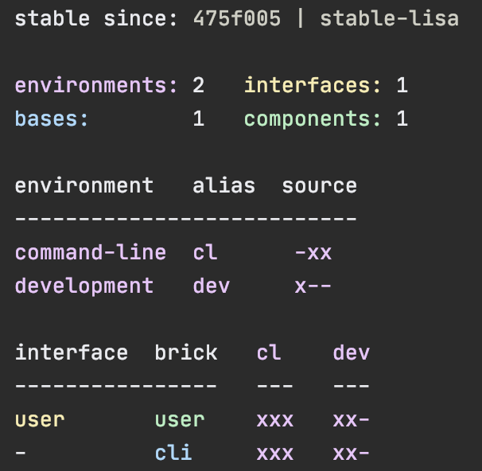

...to also include dev, type:
```
poly info :all :dev
```
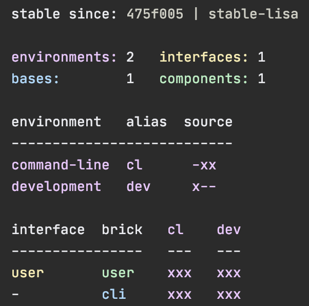

To run the brick tests from the `development` environments is something we normally don't need to do,
but it's good to know that the possibility exists.

Now let's see if it actually works:
```sh
poly test :all :dev
```
```
Environments to run tests from: development, command-line

Running tests from the command-line environment, including 2 bricks and 1 environment: user, cli, command-line

Testing se.example.cli.core-test

Ran 0 tests containing 0 assertions.
0 failures, 0 errors.

Test results: 0 passes, 0 failures, 0 errors.

Testing se.example.user.interface-test

Ran 1 tests containing 1 assertions.
0 failures, 0 errors.

Test results: 1 passes, 0 failures, 0 errors.

Testing env.dummy-test

Ran 1 tests containing 1 assertions.
0 failures, 0 errors.

Test results: 1 passes, 0 failures, 0 errors.
Running tests from the development environment, including 2 bricks and 1 environment: user, cli, command-line

Testing se.example.cli.core-test

Ran 0 tests containing 0 assertions.
0 failures, 0 errors.

Test results: 0 passes, 0 failures, 0 errors.

Testing se.example.user.interface-test

Ran 1 tests containing 1 assertions.
0 failures, 0 errors.

Test results: 1 passes, 0 failures, 0 errors.
Execution time: 3 seconds
```

Looks like it worked!

Let's summarize the different ways to run the tests. 
The brick tests are executed from all environments they belong to except for the development environment
(if not `:dev` is passed in):

| Command                    | Tests to execute                                                                             |
|:---------------------------|:---------------------------------------------------------------------------------------------|
| poly test                  | All brick tests that are directly or indirectly changed. |
| poly test :env             | All brick tests that are directly or indirectly changed + tests for changed environments. |
| poly&nbsp;test&nbsp;:all&#8209;bricks | All brick tests. |
| poly test :all             | All brick tests + all environment tests (except development). |

To execute the brick tests from the development environment, also pass in `:dev`:

| Command                    | Tests to execute                                                                             |
|:---------------------------|:---------------------------------------------------------------------------------------------|
| poly test :dev              | All brick tests that are directly or indirectly changed, only executed from the development environment. |
| poly test :env :dev         | All brick tests that are directly or indirectly changed, executed from all environments (development included) + tests for changed environments (development included). |
| poly&nbsp;test&nbsp;:all&#8209;bricks&nbsp;:dev | All brick tests, executed from all environments (development included). |
| poly test :all :dev         | All brick tests, executed from all environments (development included) + all environment tests (development included). |

Environments can also be explicitly selected with e.g. `env:env1` or `env:env1:env2`. `:dev` is a shortcut for `env:dev`. 

These arguments can also be passed in to the `info` command, as we have done in the examples above, 
to get a view of which tests will be executed.

## Profile

When working with a Polylith system, we want to keep everything as simple as possible
and maximize our productivity.
The Lego-like way of organising code into bricks, helps us with both of these challenges.

One problem we normally have when developing software without using Polylith, is that the production environment
and the development environment has a 1:1 relationship. This happens because we use the production codebase
for development, so if we create a new service in production, it will automatically
"turn up" in development.
 
In Polylith we avoid this problem by separating the development environment from production.
Thanks to components, we can create any environment we want by putting the bricks we need into one place.
This allow us to optimize the development environment for productivity while in production, we can
focus on fulfilling non functional requirements like performance or up time. 

Right now, our `development` environment mirrors the `command-line` environment:<br>


Let's pretend we get performance problems in the `user` component and that we think
distributing the load, by delegating to a new service, could solve the problem:<br>


The production environment now looks good, but how about the `development` environment?
The problem here is that it contains two components that share the same `user` interface.
This will confuse both the classloader (if we start a REPL) and the IDE, because we now have
two components using the same `se.example.user` namespace in the path, which is not a desirable situation.

The solution is to use `profiles`:<br>


By leaving out any component that implements the `user` interface from the `development` 
environment and combine it with one of the two possible `profiles` we get a complete development
environment. This allows us to work with the code from a single place, but still be 
able to mimic the various environments we have.

The `default` profile (if exists) is automatically merged into the `development` environment, if no other profiles
are selected. The name `default` is set by `:default-profile-name` in `./deps.edn` and can be changed,
but here we will leave it as it is.

Now let's try to move from this design:<br>


...to this:<br>


First we need to decide how the `command-line` tool should communicate with `user-service` over the wire.
After some searching, we found this [slacker](https://github.com/sunng87/slacker) library that 
allow us to use [remote procedure calls](https://en.wikipedia.org/wiki/Remote_procedure_call) 
in a simple way.

Let's create a checklist that will take us there:
- [ ] Create the `user-service`:
  - [ ] Update its `deps.edn`:
    - [ ] Add the Slacker library and libraries it needs.
    - [ ] Add paths for the `user` component.
    - [ ] Add paths for the `user-api` base.
    - [ ] Add the `aot` and `uberjar` aliases (so we can build an uberjar).
- [ ] Create the `user-api` base:
  - [ ] Implement the server.
- [ ] Create the `user-remote` component:
  - [ ] Create the `core` namespace and call `user-service` from there.
  - [ ] Delegate from the `interface` to the `core` namespace.
- [ ] Update the `development` environment:
  - [ ] Update `./deps.edn`:
    - [ ] Add an alias for the `user-service` (:env-to-alias).
    - [ ] Add namespace to the library mapping (:ns-to-lib).
    - [ ] Remove the `user` paths.
    - [ ] Add the Slacker library and libraries it needs.
  - [ ] Create the `default` and `remote` profiles.
    - [ ] Add the `user` paths to the `default` profile.
    - [ ] Add the `user-remote` paths to the `remote` profile.
- [x] Switch from `user` to `user-remote` in `deps.edn` for the `command-line` environment.
  - [ ] Remove `user` related paths from `environments/command-line/deps.edn`.
  - [ ] Add `user-remote` related paths to `environments/command-line/deps.edn`.
  - [ ] Add the Slacker library to `deps.edn` for `command-line` (used by `user-remote`).
  - [ ] Add the log4j library to `deps.edn` for `command-line` (to get rid of warnings).
  - [ ] Rebuild `command-line`.
- [ ] Create a build script for `user-service`.
    - [ ] Make it executable.
    - [ ] Execute it.

Let's go through the list.
- [x] Create the `user-service`
  - [x] Update its `deps.edn`:
    - [x] Add the Slacker library and libraries it needs.
    - [x] Add paths for the `user` component.
    - [x] Add paths for the `user-api` base.
    - [x] Add the `aot` and `uberjar` aliases.

```sh
poly create e name:user-service
```
```
{...

 :deps {...
        slacker {:mvn/version "0.17.0"}}

 :paths ["../../components/user/src"
         "../../components/user/resources"
         "../../bases/user-api/src"
         "../../bases/user-api/resources"]

 :deps {org.clojure/clojure {:mvn/version "1.10.1"}
        org.clojure/tools.deps.alpha {:mvn/version "0.8.695"}
        slacker {:mvn/version "0.17.0"}
        http-kit {:mvn/version "2.4.0"}
        ring {:mvn/version "1.8.1"}
        compojure {:mvn/version "1.6.2"}
        org.apache.logging.log4j/log4j-core {:mvn/version "2.13.3"}
        org.apache.logging.log4j/log4j-slf4j-impl {:mvn/version "2.13.3"}}

 :aliases {:test {:extra-paths ["../../components/user/test"
                                "../../bases/user-api/test"]
                  :extra-deps  {}}

           :aot     {:extra-paths ["classes"]
                     :main-opts   ["-e" "(compile,'se.example.user-api.core)"]}

           :uberjar {:extra-deps {uberdeps {:mvn/version "0.1.10"}}
                     :main-opts  ["-m" "uberdeps.uberjar"
                                  "--aliases" "aot"
                                  "--main-class" "se.example.user_api.core"]}}}
  ...
```

- [x] Create the `user-api` base:
```
poly create b name:user-api
```
- [x] Implement the server for `user-api`:
```
example
├── bases
│   └── user-api
│       └── src
│           ├── se.example.user_api.api.clj
│           └── se.example.user_api.core.clj
```
```clojure
(ns se.example.user-api.core
  (:require [se.example.user-api.api]
            [slacker.server :as server])
  (:gen-class))

(defn -main [& args]
  (server/start-slacker-server [(the-ns 'se.example.user-api.api)] 2104)
  (println "server started: http://127.0.0.1:2104"))
```
```clojure
(ns se.example.user-api.api
  (:require [se.example.user.interface :as user]))

(defn hello-remote [name]
  (user/hello (str name " - from the server")))
```

- [x] Create the `user-remote` component:
  - [x] Create the `core` namespace and call `user-service` from there.
  - [x] Delegate from the `interface` to the `core` namespace.
```sh
poly create c name:user-remote interface:user
```
```
example
├── components
│   └── user-remote
│       └── src
│           ├── se.example.user_remote.core.clj
│           └── se.example.user_remote.interface.clj
```
```clojure
(ns se.example.user.core
  (:require [slacker.client :as client]))

(declare hello-remote)

(defn hello [name]
  (let [connection (client/slackerc "localhost:2104")
        _ (client/defn-remote connection se.example.user-api.api/hello-remote)]
    (hello-remote name)))
```
```clojure
(ns se.example.user.interface
  (:require [se.example.user.core :as core]))

(defn hello [name]
  (core/hello name))
```

- [x] Update the `development` environment:
  - [x] Update `./deps.edn`:
    - [x] Add an alias for the `user-service` (:env-to-alias).
    - [x] Add namespace to the library mapping (:ns-to-lib).
    - [x] Remove the `user` paths.
    - [x] Add the Slacker library and libraries it needs.
  - [x] Create the `default` and `remote` profiles.
    - [x] Add the `user` paths to the `default` profile.
    - [x] Add the `user-remote` paths to the `remote` profile.

```clojure
{:polylith {:vcs "git"
            :top-namespace "se.example"
            :interface-ns "interface"
            :default-profile-name "default"
            :compact-views #{}
            :build-tag-pattern "v[0-9]*"
            :stable-since-tag-pattern "stable-*"
            :env-to-alias {"development" "dev"
                           "command-line" "cl"
                           "user-service" "user-s"}
            :ns-to-lib {slacker  slacker}}

 :aliases  {:dev {:extra-paths ["development/src"
                                "bases/cli/src"
                                "bases/cli/resources"
                                "bases/user-api/src"
                                "bases/user-api/resources"]
                  :extra-deps {org.clojure/clojure {:mvn/version "1.10.1"}
                               org.clojure/tools.deps.alpha {:mvn/version "0.8.695"}
                               slacker {:mvn/version "0.17.0"}
                               http-kit {:mvn/version "2.4.0"}
                               ring {:mvn/version "1.8.1"}
                               compojure {:mvn/version "1.6.2"}
                               org.apache.logging.log4j/log4j-core {:mvn/version "2.13.3"}
                               org.apache.logging.log4j/log4j-slf4j-impl {:mvn/version "2.13.3"}}}

            :test {:extra-paths ["bases/cli/test"
                                 "bases/user-api/test"
                                 "environments/command-line/test"]}

            :+default {:extra-paths ["components/user/src"
                                     "components/user/resources"
                                     "components/user/test"]}

            :+remote {:extra-paths ["components/user-remote/src"
                                    "components/user-remote/resources"
                                    "components/user-remote/test"]}

            :poly {:main-opts ["-m" "polylith.clj.core.poly_cli.poly"]
                   :extra-deps {polyfy/polylith
                                {:git/url   "https://github.com/polyfy/polylith.git"
                                 :sha       "78b2c77c56d1b41109d68b451069affac935200e"
                                 :deps/root "environments/poly"}}}}}
``` 

Notice here that the profiles contain both `src` and `test` directories.
This works as profiles are only used from the development environment.

- [x] Switch from `user` to `user-remote` in `deps.edn` for the `command-line` environment.
  - [x] Remove `user` related paths from `environments/command-line/deps.edn`.
  - [x] Add `user-remote` related paths to `environments/command-line/deps.edn`.
  - [x] Add the Slacker library to `deps.edn` for `command-line` (used by `user-remote`).
  - [x] Add the log4j library to `deps.edn` for `command-line` (to get rid of warnings).
  - [x] Rebuild `command-line`.

```
example
├── environments
│   └── command-line
│       └── deps.edn
```
```clojure
{:paths ["../../components/user-remote/src"
         "../../components/user-remote/resources"
         ...

 :deps {...
        slacker {:mvn/version "0.17.0"}
        org.apache.logging.log4j/log4j-core {:mvn/version "2.13.3"}
        org.apache.logging.log4j/log4j-slf4j-impl {:mvn/version "2.13.3"}}

 :aliases {:test {:extra-paths ["../../components/user-remote/test"
                                ...
```

```
./build-cli-uberjar.sh  
```

- [x] Create a build script for `user-service`.
    - [x] Make it executable.
    - [x] Execute it.
```sh
example
├── scripts
│   └── build-user-service-uberjar.sh
```
```sh
#!/usr/bin/env bash
./build-uberjar.sh user-service
```
```
cd scripts
chmod +x build-user-service-uberjar.sh
./build-user-service-uberjar.sh
```

Puhh, that should be it! Now let's test if it works.

Execute this from the workspace root in a separate terminal:
```
cd example/environments/user-service/target
java -jar user-service.jar
```
```
server started: http://127.0.0.1:2104
```

Now execute this from the other terminal:
```
cd ../environments/command-line/target
java -jar command-line.jar Lisa
```
The output should be:
```
Hello Lisa - from the server!!
```

Now execute the `info` command (`+` inactivates all profiles, and makes the `default` profile visible):
```
poly info +
```

...and compare it with the target design:
| | |
|:-|:-| 
|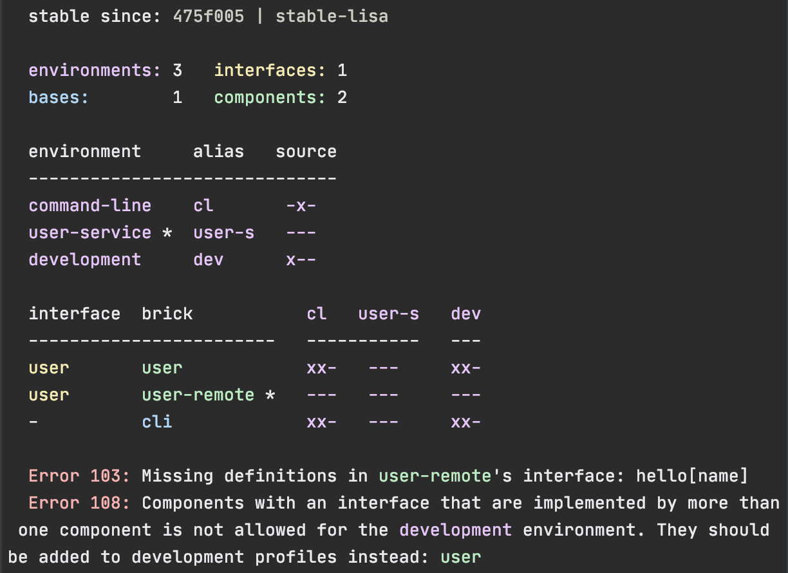 | 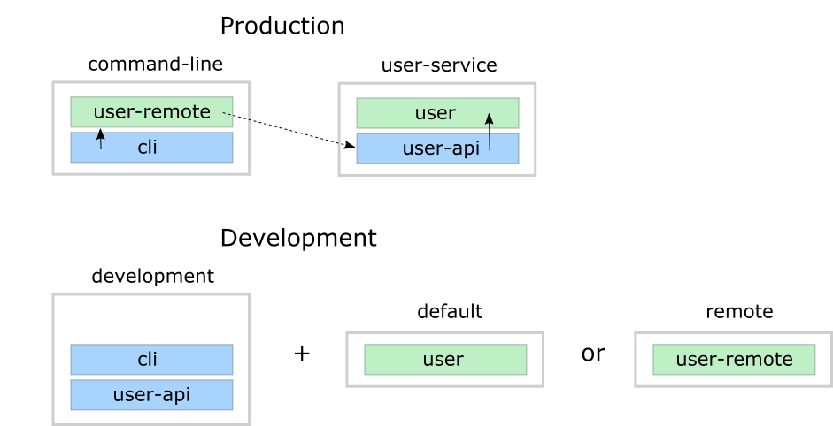|

Looks like we got everything right! 

The profile flags, `xx`, follows the same pattern as for
bricks and environments except that the last `Run the tests` flag is omitted.

When we went through this example, we added `user-remote` when the `default` profile was active.
What we should have done was to first deactivate the `default` profile and activate the `remote`
profile so that the development environment could treat the component as source code:<br>
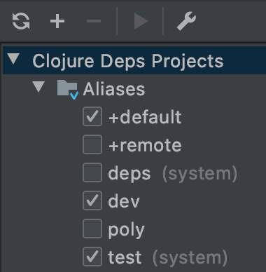

These settings are only used by the IDE, but to switch to the `remote` profile when running a command,
we need to pass in `+remote` (the `default` profile is only selected if no profiles are explicitly given):
```sh
poly info +remote
```
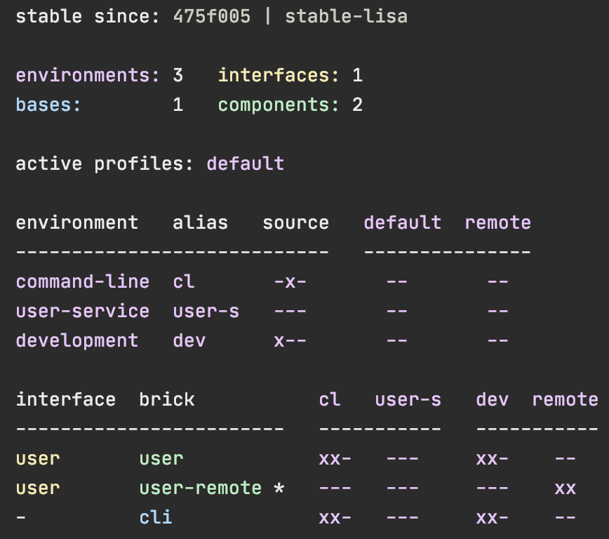

Now the `remote` profile is included in the `development` environment and listed after `active profiles`.

It's possible to give more than one profile:
```
poly info +default +remote
```
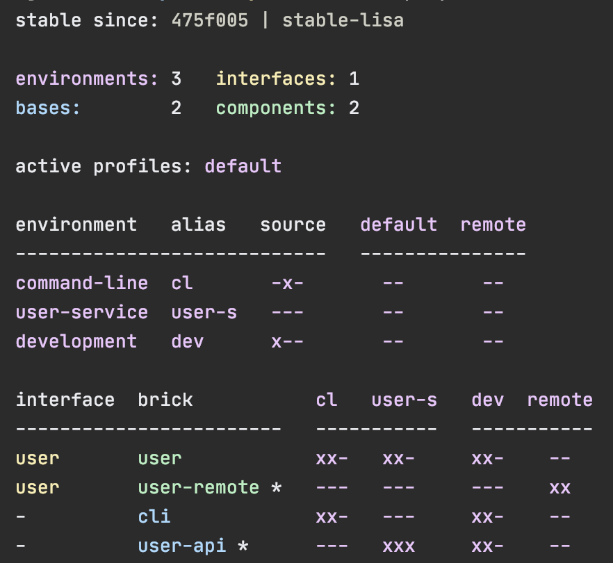

The tool complains and doesn't like that we just included both `user` and `user-remote` in the `development` 
environment!

The profiles can also contain libraries and paths to environments, but right now we have no such paths
and therefore all profiles are marked with `--` in the environment section.

Now when we are finished with our example system, it could be interesting to see how many lines of code
each brick and environment consists of. This can be done by passing in `:loc`:
```
poly info :loc
```


Each environment sumarises the number of lines of code for each brick it contains.
The `loc` column count number of lines of codes under the `src` directory,
while `(t)` counts for the `test` directory.

Let's run all the tests to see if everything works:
```
poly test :env
```
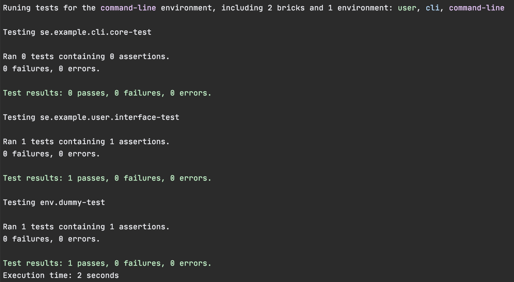

It worked!

## Dependencies

To explain dependencies, we will use the
[RealWorld example app](https://github.com/furkan3ayraktar/clojure-polylith-realworld-example-app/tree/clojure-deps).

Execute these commands from outside the `example` workspace (e.g. the parent folder of our `example` workspace):
```sh
git clone git@github.com:furkan3ayraktar/clojure-polylith-realworld-example-app.git
cd clojure-polylith-realworld-example-app
git checkout clojure-deps
```

Before we continue, it may be worth mentioning that most commands, except for the [test](#test) command,
can be executed for other workspaces by setting `ws-dir`, e.g.:
```
poly check ws-dir:../example
``` 

Let's continue with the RealWorld example and tag it as stable (this will only affect our local clone):
```
git tag -f stable-lisa
```

```
poly info
```


Now we have some bricks to play with! 

Let's list all dependencies by executing the [deps](#deps-env) command:
```
poly deps
```


This lists all dependencies in the workspace.
Notice the yellow color in the headers. They are yellow because components and bases only depend on `interfaces`. 

If we read the diagram horizontally, we can see that the `article` component uses the `database`, 
`profile` and `spec` interfaces.
If we read it vertically, we can see that `article` is used by the `comment` and `rest-api` bricks.

This is also what is shown if we specify `article` as brick:
```
poly deps brick:article
```


To list the component dependencies, we need to specify an `environment`:
```
poly deps env:rb
```


Now, all the headers are green, and that is because all the implementing components are known
within the selected environment.
The `+` signs shows indirect dependencies. An example is the `article` component
that uses `log` indirectly:  article > database > log.

> Tip: If the headers and the "green rows" doesn't match, it may indicate that we have
unused components that can be removed from the environment.

We can also show dependencies for a specific brick within an environment:
```
poly deps env:rb brick:article
```


## Libraries

Libraries are specified in `:deps` for the development environment and in `:extra-deps` under each
alias for all other environments in the respective `deps.edn` file.

To list all libraries used in the workspace, execute the [libs](#libs) command:
```
poly libs
```


Libraries can be specified in three different ways:

| Type  | Description |
|:------|:------------------------------------------------------|
| Maven | As a [Maven](https://maven.apache.org/) dependency. Example: `clj-time/clj-time {:mvn/version "0.15.2"}` where the key is the Maven `groupId/artifactId`. Those dependencies are stored locally in the `~/.m2/repositories` directory. |
| Local | As a local dependency. Example: `clj-time {:local/root "/local-libs/clj-time-0.15.2.jar"}` where the key is an arbitrary identifier. A local dependency is a path to a locally stored file. |
| Git   | As a [Git](https://git-scm.com/) dependency. Example: `clj-time/clj-time {:git/url "https://github.com/clj-time/clj-time.git", :sha "d9ed4e46c6b42271af69daa1d07a6da2df455fab"}` where the key must match the path for the library in `~/.gitlibs/libs` (to be able to calculate the `KB` column). |
 
The KB column shows the size of each library in kilobytes. If you get the key path wrong or if the library
hasn't been downloaded yet, then it will be shown as blank.
   
Library dependencies are specified per environment and the way the tool figures out what library each 
brick uses is to look in `:ns-to-lib` in `./deps.edn`, e.g:

```clojure
            :ns-to-lib {clj-time              clj-time
                        clj-jwt               clj-jwt
                        clojure               org.clojure/clojure
                        clojure.java.jdbc     org.clojure/java.jdbc
                        compojure             compojure/compojure
                        crypto.password       crypto-password
                        environ               environ
                        honeysql              honeysql
                        slugger               slugger
                        ring.logger           ring-logger-timbre
                        ring.middleware.json  ring/ring-json
                        spec-tools            metosin/spec-tools
                        taoensso.timbre       com.taoensso/timbre}}
```
 
This map specifies which namespace maps to which library, and needs to be manually populated.
The same library can occur more than once as long as the namespaces are unique.

The way the algorithm works is that it takes all the namespaces and sort them in reverse order.
Then it tries to match each namespace against that list from top to down and takes the first match.

Let's say we have this mapping:
```clojure
:ns-to-lib {com.a      library-a
            com.a.b    library-b
            com.a.b.c  library-c}
```

...then it will return the first matching namespace going from top to down:
```
namespace   library
---------   ---------
com.a.b.c   library-c
com.a.b     library-b
com.a       library-a
```  
For example:
- If we compare with the `com.a.x.y` namespace, it will match against `com.a` and return `library-a`.  
- If we compare with the `com.a.b.x` namespace, it will match against `com.a.b` and return `library-b`.

If we have a lot of libraries, we can choose a more compact format by setting `:compact-views` to `#{"libs"}` in `./deps.edn`:


## Context

The component interfaces bring context to the development experience.

Object oriented languages give us context by using objects. Let’s say we work in an 
object oriented language and that we want to save the object `userToBeSaved`. 
If we type `userToBeSaved` followed by a `.`, the intellisense in the IDE will show us a 
list of available methods for that object, for example `persist`:
```ruby
userToBeSaved.persist(db)
```

...or if implemented as a service:
```ruby
userService.persist(db, userToBeSaved)
```

With Polylith we get the same level of support from the IDE.
By first import the `user` interface and then type:
```clojure
(user/
```

...now the IDE will list all available functions in the `user` interface and one of them would be `persist!`:
```clojure
(user/persist! db user-to-be-saved)
```

## Naming

Every time we create an `interface`, `component`, `base`, `environment` or `workspace`,
we need to come up with a good name.
Finding good names is one of the hardest and most important thing in software.
Every time we fail in finding a good name, it will make the system harder to reason about and change.

The components are the core of Polylith, so let's start with them.
If a component does **one thing** then we can name it based on that, e.g.
`validator`, `invoicer` or `purchaser`. Sometime a component operates around a concept,
that we can name it after, e.g.: `account` or `car`. This can be an alternative if the component
does more than one thing, but always around that single concept.

If the component's main responsibility is to simplify access to a third party API, 
then suffixing it with `-api` is a good pattern, like `aws-api`.

If we have two components that share the same interface, e.g. `invoicer`, 
where the `invoicer` component contains the business logic, while the other component only delegates
to a service that includes the `invoicer` component, then we can name the component
that does the remote call, `invoicer-remote`.

If we have found a good name for the component, then it's generally a good idea to keep the same name for
the interface, which is also the default behaviour when a component is created with e.g. `create c invoicer`.

Bases are responsible for exposing a public API and to delegate the incoming calls to components.
A good way to name them is to start with what they do, followed by the type of the API.
If it's a REST API that takes care of invoicing, then we can name it `invoicer-rest-api`.
If it's a lambda function that generates different reports, then `report-generator-lambda` can be a 
good name.

Environments (development excluded) represents the deployable artifacts, like services. Those artifacts
should, if possible, be named after what they are, like `invoicer` or `report-generator`.

## Mix languages

Polylith allows us to run multiple languages side by side where each language lives in their own workspace.
This will work especially well if we run different languages on top of the same platform, e.g. the JVM
(see list of [JVM languages](https://en.wikipedia.org/wiki/List_of_JVM_languages)).

Let's say we have the languages A, B and C. The first thing to remember is to have different
names of the top namespace for each language, so that we don't run into name conflicts.
We would end up with top namespaces like: `com.mycompany.a`, `com.mycompany.b` and `com.mycompany.c`.
Each language will have their own workspace and they will compile each component to its own library,
alternatively compile all components into one big jar like `a.jar`, `b.jar` or `c.jar`.

So if component `com.mycompany.a.authentication` is used by `com.mycompany.b.user`,
then `com.mycompany.b.user` will include either `a-authentication.jar` or `a.jar`
in its library list, to be able to access `authentication`.

This setup allow us to share components between languages by first compiling them into libraries.
We could also use the [Java Native Interface](https://en.wikipedia.org/wiki/Java_Native_Interface) to share code between languages
that don't run on top of the JVM, or use something like [Neanderthal](https://neanderthal.uncomplicate.org)
if we want to integrate with the [GPU](https://en.wikipedia.org/wiki/Graphics_processing_unit).

An alternative approach could be to use the [GraalVM](https://www.graalvm.org) or similar.

## Configuration

The workspace configuration is stored under the `:polylith` key in `./deps.edn` and defines the following keys:

| Key                        | Description
|:---------------------------|:---------------------------------------------------------------------------------------------|
| :top-namespace             | The workspace top namespace. If changed, the source code has to be changed accordingly. |
| :interface-ns              | The default value is `interface`. If changed, the source code has to be changed accordingly. |
| :default-profile-name      | The default value is `default`. If changed, the `+default` alias in `./deps.edn` has to be renamed accordingly. |
| :build-tag-pattern         | The default value is `v[0-9]*`. If changed, old tags may not be recognised. |
| :stable-since-tag-pattern  | The default value is `stable-*`. If changed, old tags may not be recognised. |
| :compact-views             | The default value is #{}. If set to #{"libs"}, then the `libs` diagram will be shown in a more compact format. Only "libs" is supported at the moment. |
| :env-to-alias              | If the `development` key is missing, `{"development" "dev"}` will be added. |
| :ns-to-lib                 | Can be left empty, but will give a more detailed output from the [libs](#libs) command if populated. |

Settings that are specific per developer/user are stored in `~/.polylith/config.edn`:

| Key                        | Description
|:---------------------------|:---------------------------------------------------------------------------------------------|
| :thousand-separator  | Set to "," by default (when first created). |
| :color-mode          | Set to "none" on Windows, "dark" on other operating systems (when first created). Valid values are "none", "light" and "dark", see the [color](#color) section. Can be overridden, e.g.: `poly info color-mode:none`. |
| :empty-character     | Set to "." on Windows, "·" on other operating systems (when first created). Used by the [deps](#deps) and [libs](#libs) commands. |
| :m2-dir              | If left empty, the `.m2` directory will be set to USER-HOME/.m2. Used by the [libs](#libs) command. |

If `~/.polylith/config.edn` does not exists, it will be created the first time the [create w](#create-w) command is executed, e.g.:

```
{:color-mode "dark"
 :thousand-separator ","
 :empty-character "·"}
```

### The workspace state

There is a way to view all configuration that is used by the tool, and that is to execute the [ws](#ws) command
(here, against the `example` workspace):
```
poly ws get:settings
```
```clojure
{:active-profiles #{"default"},
 :build-tag-pattern "v[0-9]*",
 :changes-since "last-stable",
 :color-mode "dark",
 :compact-views #{},
 :default-profile-name "default",
 :empty-char "·",
 :env-to-alias {"command-line" "cl",
                "development" "dev",
                "user-service" "user-s"},
 :interface-ns "interface",
 :m2-dir "/Users/tengstrand/.m2",
 :ns-to-lib {"slacker" "slacker"},
 :profile-to-settings {"default" {:lib-deps {},
                                  :paths ["components/user/src"
                                          "components/user/resources"
                                          "components/user/test"]},
                       "remote" {:lib-deps {},
                                 :paths ["components/user-remote/src"
                                         "components/user-remote/resources"
                                         "components/user-remote/test"]}},
 :stable-since-tag-pattern "stable-*",
 :thousand-sep ",",
 :top-namespace "se.example",
 :user-config-file "/Users/tengstrand/.polylith/config.edn",
 :user-home "/Users/tengstrand",
 :vcs "git"}
```

If we are only interested in a specific element in this structure, we can dig deeper into it:
```
poly ws get:settings:profile-to-settings:default
```

```clojure
{:lib-deps {},
 :paths ["components/user/src"
         "components/user/resources"
         "components/user/test"]}
```

If we execute `poly ws` without any arguments, it will view the whole workspace as plain data (a hash map).
This data structure is produces by the tool itself and is used by all the commands internally.
The commands only operate on this hash map and is not performing any side effecting operations,
like touching the disk or executing git commands. Instead, everything is prepared so that all commands can
be executed in memory. 

This will not only simplify the code of the tool itself but it also gives us, as a user of the tool,
a way to explore the complete state of the workspace.

A good way to start digging into this data structure is to list all its keys:
```
poly ws get:keys
```
```clojure
[:bases
 :changes
 :components
 :environments
 :interfaces
 :messages
 :name
 :paths
 :settings
 :user-input
 :ws-dir
 :ws-reader]

```
To list the components, type:
```
poly ws get:components:keys
```
```clojure
["user" "user-remote"]
```

To show the `user` component:
```
poly ws get:components:user
```
```clojure
{:interface {:definitions [{:name "hello",
                            :parameters [{:name "name"}],
                            :type "function"}],
             :name "user"},
 :interface-deps [],
 :lib-dep-names [],
 :lib-imports-src [],
 :lib-imports-test ["clojure.test"],
 :lines-of-code-src 9,
 :lines-of-code-test 7,
 :name "user",
 :namespaces-src [{:file-path "/Users/tengstrand/source/polylith/example/example/components/user/src/se/example/user/interface.clj",
                   :imports ["se.example.user.core"],
                   :name "interface",
                   :namespace "se.example.user.interface"}
                  {:file-path "/Users/tengstrand/source/polylith/example/example/components/user/src/se/example/user/core.clj",
                   :imports [],
                   :name "core",
                   :namespace "se.example.user.core"}],
 :namespaces-test [{:file-path "/Users/tengstrand/source/polylith/example/example/components/user/test/se/example/user/interface_test.clj",
                    :imports ["clojure.test" "se.example.user.interface"],
                    :name "interface-test",
                    :namespace "se.example.user.interface-test"}],
 :type "component"}
```
There is a way to store the workspace state to a file, and that is to give the `out` parameter, e.g.:
```
poly ws out:ws.edn
```

An alternative way to reach the same result is to turn off the coloring and pipe to `ws.edn`:
```
poly ws color-mode:none > ws.edn
```

This can be used to share the workspace state with others without sending them the whole workspace.
To load this workspace, they have to give the `ws-file` parameter, e.g.:

```
poly info ws-file:ws.edn
``` 

This will give the exact same output as if we execute `poly info` on the machine that created `ws.edn`.
All commands except `test` and `create` can be executed when `ws-file` is given.

Here is an example where we inspect what command was used to produce the file:
```
poly ws get:user-input:args ws-file:ws.edn
``` 

...which returns:
```clojure
["ws" "out:ws.edn"]
```


## Commands

The goal for this documentation has so far been to give an overall understanding of what problems
this tool tries to solve and how to use it. This section zooms in and explains each command separately.
The individual help texts listed here are taken from the built-in `help` command.

**Commands**
- [check](#check)
- [create](#create)
  - [create c](#create-c)
  - [create b](#create-b)
  - [create e](#create-e)
  - [create w](#create-w)
- [deps](#deps)
  - [deps :bricks](#deps-bricks)
  - [deps :brick](#deps-brick)
  - [deps :env](#deps-env)
  - [deps :env :brick](#deps-env-brick)
- [diff](#diff)
- [info](#info)
- [libs](#libs)
- [test](#test)
- [ws](#ws)

To list all available commands, type:
```
poly help
```

```
  Polylith - https://github.com/polyfy/polylith

  poly CMD [ARGS] - where CMD [ARGS] are:

    check                   Checks if the workspace is valid.
    create E name:N [ARG]   Creates a component, base, environment or workspace.
    deps [env:E] [brick:B]  Shows dependencies.
    diff                    Shows changed files since last stable point in time.
    help [C] [ARG]          Shows this help or help for a specified command.
    info [ARGS]             Shows a workspace overview and checks if it's valid.
    libs                    Shows all libraries in the workspace.
    test [ARGS]             Runs tests.
    ws [get:X]              Shows the workspace as data.

  If ws-dir:PATH is passed in as an argument, where PATH is a relative
  or absolute path, then the command is executed from that directory. 

  If :: is passed in, then ws-dir is set to the first parent directory 
  (or current) that contains a 'deps.edn' workspace config file. The exception 
  is the 'test' command that has to be executed from the workspace root.

  If ws-file:FILE is passed in, then the workspace will be populated with the
  content from that file. All commands except 'create' and 'test' can be
  executed with this parameter set. The FILE is created by executing the
  'ws' command, e.g.: 'poly ws out:ws.edn'.

  The color mode can be overridden by passing in e.g. color-mode:none
  (valid values are: none, light, dark) which is otherwise configured in
  ~/.polylith/config.edn.

  Example:
    poly check
    poly create c name:user
    poly create c name:admin interface:user
    poly create b name:mybase
    poly create e name:myenv
    poly create w name:myws top-ns:com.my.company
    poly deps
    poly deps env:myenv
    poly deps brick:mybrick
    poly deps env:myenv brick:mybrick
    poly diff
    poly help
    poly help info
    poly help create
    poly help create c
    poly help create b
    poly help create e
    poly help create w
    poly help deps
    poly help deps :env
    poly help deps :brick
    poly help deps :env :brick
    poly info
    poly info :loc
    poly info since:previous-build
    poly info env:myenv
    poly info env:myenv:another-env
    poly info :env
    poly info :dev
    poly info :env :dev
    poly info :all
    poly info :all-bricks
    poly info ::
    poly info color-mode:none
    poly info ws-dir:another-ws
    poly libs
    poly test
    poly test env:myenv
    poly test env:myenv:another-env
    poly test :env
    poly test :dev
    poly test :env :dev
    poly test :all
    poly test :all-bricks
    poly ws
    poly ws get:keys
    poly ws get:count
    poly ws get:settings
    poly ws get:user-input:args
    poly ws get:user-input:args:0
    poly ws get:settings:keys
    poly ws get:components:keys
    poly ws get:components:count
    poly ws get:components:mycomp:lines-of-code-src
    poly ws out:ws.edn
```

### check
```
  Validates the workspace.

  poly check

  Prints 'OK' and returns 0 if no errors was found.
  If errors or warnings was found, show messages and return the error code, 
  or 0 if only warnings. If internal errors, 1 is returned.

  Error 101 - Illegal dependency on namespace.
    Triggered if a :require statement refers to a component namespace other
    than interface. Examples of valid namespaces:
     - com.my.company.mycomponent.interface
     - com.my.company.mycomponent.interface.subns
     - com.my.company.mycomponent.interface.my.subns

  Error 102 - Function or macro is defined twice.
    Triggered if a function or macro is defined twice in the same namespace.

  Error 103 - Missing definitions.
    Triggered if a def, defn or defmacro definition exists in one component's
    interface but is missing in another component that uses the same interface.

  Error 104 - Circular dependencies.
    Triggered if circular dependencies were detected, e.g.:
    Component A depends on B that depends on A (A > B > A), or A > B > C > A.

  Error 105 - Illegal name sharing.
    Triggered if a base has the same name as a component or interface.
    Environments and profiles can be given any name.

  Error 106 - Multiple components that share the same interfaces in an environment.
    Triggered if an environment contains more than one component that shares the 
    same interface.

  Error 107 - Missing components in environment.
    Triggered if a component depends on an interface that is not included in the
    environment. The solution is to add a component to the environment that
    implements the interface.

  Error 108 - Components with an interface that is implemented by more than one 
              component is not allowed for the development environment.
    The solution is to remove the component from the development environment 
    and define the paths for each component in separate profiles
    (including test paths).

  Error 109 - Missing libraries in environment.
    Triggered if an environment doesn't contain a library that is used by one
    of its bricks. Library usage for a brick is calculated using :ns-to-lib in
    './deps.edn' for all its namespaces.

  Warning 201 - Mismatching parameter lists in function or macro.
    Triggered if a function or macro is defined in the interface for a component
    but also defined in the same interface for another component but with a
    different parameter list.

  Warning 202 - Missing paths in environment.
    Triggered if a path in an environment doesn't exist on disk.
    The solution is to add the file or directory, or to remove the path.

  Warning 203 - Path exists in both dev and profile.
    It's discouraged to have the same path in both the development environment
    and a profile. The solution is to remove the path from dev or the profile. 

  Warning 204 - Library exists in both dev and a profile.
    It's discouraged to have the same library in both development and a profile.
    The solution is to remove the library from dev or the profile.

  Warning 205 - Reference to missing library in :ns-to-lib in ./deps.edn.
    Libraries defined in :ns-to-lib should also be defined by the environment.

  Warning 206 - Reference to missing namespace in :ns-to-lib in ./deps.edn.
    Namespaces defined in :ns-to-lib should also be defined by the environment.

  Warning 207 - Non top namespace was found in brick.
    Triggered if a namespace in a brick doesn't start with the top namespaces
    defined in :top-namespace in ./deps.edn.
```

### create
```
  Creates a component, base, environment or workspace.

  poly create TYPE [ARGS]
    TYPE = c -> Creates a component.
           b -> Creates a base.
           e -> Creates an environment.
           w -> Creates a workspace.

    ARGS = Varies depending on TYPE. To get help for a specific TYPE, type:
             poly help create TYPE

  Not only c, b, e and w can be used for TYPE but also component, base
  environment and workspace.

  Example:
    poly create c name:user
    poly create c name:admin interface:user
    poly create b name:mybase
    poly create e name:myenv
    poly create w name:myws top-ns:com.my.company
```

#### create c
```
  Creates a component.

  poly create c name:NAME [interface:INTERFACE]
    NAME = The name of the component to create.

    INTERFACE = The name of the interface (namespace) or NAME if not given.

  Example:
    poly create c name:user
    poly create c name:admin interface:user
```

#### create b
```
  Creates a base.

  poly create b name:NAME
    NAME = The name of the base to create.

  Example:
    poly create b name:mybase
```

#### create e
```
  Creates an environment.

  poly create e name:NAME
    NAME = The name of the environment to create.

  Example:
    poly create e name:myenv
```

#### create w
```
  Creates a workspace.

  poly create w name:NAME top-ns:TOP-NAMESPACE
    NAME = The name of the workspace to create.

    TOP-NAMESPACE = The top namespace, e.g. com.my.company.

  Example:
    poly create w name:myws top-ns:com.my.company
```

### deps
```
  Shows dependencies.

  poly deps [env:ENV] [brick:BRICK]
    (omitted) = Show dependencies for all bricks.
    ENV       = Show dependencies for specified environment.
    BRICK     = Show dependencies for specified brick.

  To get help for a specific diagram, type: 
    poly help deps ARGS:
      ARGS = :env         Help for the environment diagram.
             :brick       Help for the brick diagram.
             :bricks      Help for all bricks diagram.
             :env :brick  Help for the environment/brick diagram.
  Example:
    poly deps
    poly deps env:myenv
    poly deps brick:mybrick
    poly deps env:myenv brick:mybrick
```

#### deps :bricks
```
  Shows all brick dependencies.

  poly deps

         p      
         a  u  u
         y  s  t
         e  e  i
  brick  r  r  l
  --------------
  payer  ·  x  x
  user   ·  ·  x
  util   ·  ·  ·
  cli    x  ·  ·

  In this example, payer uses user and util, user uses util,
  and cli uses payer. Each usage comes from at least one :require
  statement in the brick.
```

#### deps :brick
```
  Shows dependencies for selected brick.

  poly deps brick:BRICK
    BRICK = The name of the brick to show dependencies for.

  used by  <  user  >  uses
  -------              ----
  payer                util

  In this example, user is used by payer and it uses util itself.

  Example:
    poly deps brick:mybrick
```

#### deps :env
```
  Shows dependencies for selected environment.

  poly deps env:ENV
    ENV = The environment name or alias to show depenencies for.

         p      
         a  u  u
         y  s  t
         e  e  i
  brick  r  r  l
  --------------
  payer  ·  x  x
  user   ·  ·  x
  util   ·  ·  ·
  cli    x  +  +

  When the environment is known, we also know which components are used.

  In this example, payer uses user and util, user uses util, and cli uses payer.
  The + signs mark indirect depencencies. Here the cli base depends on user and
  util, via 'cli > payer > user' and 'cli > payer > util'. Each usage comes from
  at least one :require statement in the brick. 

  Example:
    poly deps env:myenv
```

#### deps :env :brick
```
  Shows dependencies for selected brick and environment.

  poly deps env:ENV brick:BRICK
    ENV   = The environment (name or alias) to show dependencies for.
    BRICK = The brick to show dependencies for.

  used by  <  user  >  uses
  -------              ----
  payer                util

  In this example, user is used by payer and it uses util itself.

  Example:
    poly deps env:myenv brick:mybrick
```

### diff
```
  Shows changed files since the most recent stable point in time.

  poly diff

  Internally, it executes 'git diff SHA --name-only' where SHA is the SHA-1
  of the first commit in the repository, or the SHA-1 of the most recent tag
  that matches the default pattern 'stable-*'.

  Stable points are normally set by the CI server or by individual developers,
  e.g. Lisa, with 'git tag -f stable-lisa'.

  The pattern can be changed in :stable-since-tag-pattern in ./deps.edn.

  The way the latest tag is found is by taking the last line of the output from:
    git tag --sort=committerdate -l 'stable-*'

  Here is a compact way of listing all the commits including tags:
    git log --pretty=oneline
```

### info
```
  Shows workspace information.

  poly info [ARGS]
    ARGS = :loc       -> Shows the number of lines of code for each brick and
                         environment.

           since:WHEN -> If set to last-stable or if 'since' is not given, then 
                         the last stable point in time is calculated based on 
                         the latest git tag that follows the pattern 'stable-*', 
                         specified by :stable-since-tag-pattern in ./deps.edn.
                         If set to previous-build then it takes the second 
                         latest git tag that matches :build-tag-pattern in
                         ./deps.edn. If no tag matched, it takes the first 
                         commit in the repository.

  In addition to :loc, all the arguments used by the 'test' command
  can also be used as a way to see what tests will be executed.

    stable since: dec73ec | stable-lisa

    environments: 2   interfaces: 3
    bases:        1   components: 4

    active profiles: default

    environment   alias  source   default  admin
    ---------------------------   --------------
    command-line  cl      ---       --      --
    development   dev     x--       --      --

    interface  brick    cl    dev  admin
    -----------------   ---   ----------
    payer      payer    x--   xx-   --
    user       admin    x--   ---   xx
    user       user *   ---   xx-   --
    util       util     x--   xx-   --
    -          cli      x--   xx-   --

  This example shows a sample project. Let's go through each section:

  1. stable since: dec73ec | stable-lisa

     Shows the most recent commit marked as stable, or the previous build if 
     since:previous-build was given, or the first commit in the repository
     if no tag was found, followed by the tag (if found). More information
     can be found in the 'diff' command help.

  2. environments: 2   interfaces: 3
     bases:        1   components: 4

     Shows how many environments, bases, components and interfaces there are in
     the workspace.

  3. active profiles: default

     Shows the names of active profiles. The profile paths are merged into the
     development environment. A profiles is an aliase in ./deps.edn that starts
     with a +. If no profile is selected, the default profile is automatically 
     selected.

     Profiles are activated by passing them in by name (prefixed with '+'), e.g.:
       poly info +admin +onemore

     To deactivate all the profiles, and stop 'default' from being merged into
     the development environment, type:
       poly info +

  4. environment   alias  source   default  admin
     ---------------------------   --------------
     command-line  cl      ---       --      --
     development   dev     x--       --      --

    This table lists all environments. The 'environment' column shows the name
    of the environments, which are the directory names under the 'environments'
    directory, except for 'development' that stores its code under the
    'development' directory.

    The 'deps.edn' config files are stored under each environment, except for
    the development enviroment that stores it at the workspace root.

    Aliases are configured in :env-to-alias in ./deps.edn.

    The 'source' column has three x/- flags with different meaning:
      x--  The environment has a 'src' directory, e.g.
           'environments/command-line/src'.
      -x-  The environment has a 'test' directory, e.g.
           'environments/command-line/test'.
      --x  The environment tests (its own) are marked for execution.

    To show the 'resources' directory, also pass in :r or :resources, e.g.
    'poly info :r':
      x---  The environment has a 'src' directory, e.g.
            'environments/command-line/src'.
      -x--  The environment has a 'resources' directory, e.g. 
            'environments/command-line/resources'.
      --x-  The environment has a 'test' directory, e.g. 
            'environments/command-line/test'.
      ---x  The environment tests (its own) are marked for execution.

    The last two columns, default admin, are the profiles:
      x-  The profile contains a path to the 'src' directory, e.g. 
          'environments/command-line/src'.
      -x  The profile contains a path to the 'test' directory, e.g. 
          'environments/command-line/test'.

    If also passing in :r or :resources, e.g. 'poly info +r':
      x--  The profile contains a path to the 'src' directory, e.g. 
           'environments/command-line/src'.
      -x-  The profile contains a path to the 'resources' directory, e.g.
           'environments/command-line/resources'.
      --x  The profile contains a path to the 'test' directory, e.g. 
           'environments/command-line/test'.

  5. interface  brick    cl    dev  admin
     -----------------   ---   ----------
     payer      payer    x--   xx-   --
     user       admin    x--   ---   xx
     user       user *   ---   xx-   --
     util       util     x--   xx-   --
     -          cli      x--   xx-   --

    This table lists all bricks and in which environments and profiles they are
    added to.

    The 'interface' column shows what interface the component has. The name is
    the first namespace after the component name, e.g.:
    com.my.company.user.interface.

    The 'brick' column shows the name of the brick. In green if a component or
    blue if a base. Each component lives in a directory under the 'components' 
    directory and each base lives under the 'bases' directory. If any file for 
    a brick has changed since the last stable point in time, it will be marked 
    with an asterisk, * (user in this example).

    The changed files can be listed by executing 'poly diff'.

    The next cl column is the command-line environment that lives under the 
    'environments' directory. Each line in this column says whether a brick is
    included in the environment or not.

    The flags mean:
      x--  The environment contains a path to the 'src' directory,
           e.g. 'components/user/src'.
      -x-  The environment contains a path to the 'test' directory,
           e.g. 'components/user/test'.
      --x  The brick is marked to be executed from this environment.

    If :r or :resources is also passed in:
      x---  The environment contains a path to the 'src' directory,
            e.g. 'components/user/src'.
      -x--  The environment contains a path to the 'resources' directory, e.g. 
            'components/user/resources'.
      --x-  The environment contains a path to the 'test' directory, e.g. 
            'components/user/test'.
      ---x  The brick is marked to be executed from this environment.

    The next group of columns, dev admin, is the development environment with
    its profiles. If passing in a plus with 'poly info +' then it will also 
    show the default profile. The flags for the dev environment works the same
    as for cl.

    The flags for the admin profile means:
      x-  The profile contains a path to the 'src' directory, e.g. 
          'components/user/src'.
      -x  The profile contains a path to the 'test' directory, e.g. 
          'components/user/test'.

    If :r or :resources is also passed in:
      x--  The profile contains a path to the 'src' directory, e.g. 
           'components/user/src'.
      -x-  The profile contains a path to the 'resources' directory, e.g. 
           'components/user/resources'.
      --x  The profile contains a path to the 'test' directory, e.g. 
           'components/user/test'.

  It's not enough that a path has been added to an environment to show an 'x',
  the file or directory must also exist.

  If any warnings or errors was found in the workspace, they will be listed at
  the end, see the 'check' command help, for a complete list of validations.

  Example:
    poly info
    poly info :loc
    poly info since:previous-build
    poly info env:myenv
    poly info env:myenv:another-env
    poly info :env
    poly info :dev
    poly info :env :dev
    poly info :all
    poly info :all-bricks
    poly info ws-dir:another-ws
```

### libs
```
  Shows all libraries that are used in the workspace.

  poly libs [:all]
    :all = Also include bricks that have no library dependencies.
                                                                              u  u
                                                                              s  t
                                                                              e  i
    library                       version     KB   cl   dev  default  admin   r  l
    --------------------------------------------   --   -------------------   ----
    antlr/antlr                   2.7.7      434   x     x      -       -     ·  x
    clj-time                      0.15.2      23   x     x      -       -     x  ·
    org.clojure/clojure           1.10.1   3,816   x     x      -       -     ·  ·
    org.clojure/tools.deps.alpha  0.8.695     46   x     x      -       -     ·  ·

  In this example we have four libraries used by the cl and dev environments.
  If any of the libraries are added to the default or admin profiles, they will appear
  as 'x' in these columns.

  The 'x' in the user column, tells that clj-time is used by that component
  by having at least one :require statement that includes a clj-time namespace.

  Libraries are only specified per environment, and the way it finds out which libraries
  are used for a specific brick, is by looking in :ns-to-lib in ./deps.edn
  which in this case has the value {clj-time clj-time, antlr antlr/antlr} -
  typed in as symbols.

  Libraries are selected per environment and it's therefore possible to have different
  versions of the same library in different environments (if needed).

  This table supports all three different ways of including a dependency:
   - Maven, e.g.: clj-time/clj-time {:mvn/version "0.15.2"}
   - Local, e.g.: clj-time {:local/root "/local-libs/clj-time-0.15.2.jar"}
   - Git, e.g.: {:git/url "https://github.com/clj-time/clj-time.git"
                 :sha     "d9ed4e46c6b42271af69daa1d07a6da2df455fab"}

  The KB column shows the size in kilobytes, which is the size of the jar
  file for Maven and Local dependencies, and the size of all files in the
  ~/.gitlibs/libs/YOUR-LIBRARY directory for Git dependencies.
```

### test
```
  Executes brick and/or environment tests.

  poly test [ARGS]

  The brick tests are executed from all environments they belong to except for the development
  environment (if not :dev is passed in):

  ARGS              Tests to execute
  ----------------  -------------------------------------------------------------
  (empty)           All brick tests that are directly or indirectly changed.

  :env              All brick tests that are directly or indirectly changed +
                    tests for changed environments.

  :all-bricks       All brick tests.

  :all              All brick tests + all environment tests (except development).


  To execute the brick tests from the development environment, also pass in :dev:

  ARGS              Tests to execute
  ----------------  -------------------------------------------------------------
  :dev              All brick tests that are directly or indirectly changed,
                    only executed from the development environment.

  :env :dev         All brick tests that are directly or indirectly changed,
                    executed from all environments (development included) +
                    tests for changed environments (development included).

  :all-bricks :dev  All brick tests, executed from all environments
                    (development included).

  :all :dev         All brick tests, executed from all environments
                    (development included) + all environment tests
                    (development included).

  Environments can also be explicitly selected with e.g. env:env1 or env:env1:env2.
  :dev is a shortcut for env:dev.

  Example:
    poly test
    poly test :env
    poly test :all-bricks
    poly test :all
    poly test env:env1
    poly test env:env1:env2 :env
    poly test :dev
    poly test :env :dev
    poly test :all-bricks :dev
    poly test :all :dev
```

### ws
```
  Prints or writes the workspace as data.

  poly ws [get:ARG] [out:FILE]
    ARG = keys  -> Lists the keys for the data structure:
                   - If it's a hash map - it returns all its keys.
                   - If it's a list and its elements are hash maps, it returns
                     a list with all the :name keys.

          count -> Counts the number of elements.

          KEY   -> If applied to a hash map, it returns the value of the KEY.
                   If applied to a list of hash maps, it returns the hash map with
                   a matching :name. Environments are also matched against :alias.

          INDEX -> A list element can be looked up by INDEX.

          Several ARG keys can be given, separated by colon.
          Every new key goes one level deeper into the workspace data structure.

    FILE = Writes the output to the specified FILE. Will have the same effect
           as setting color-mode:none and piping the ouput to a file.
  Example:
    poly ws
    poly ws get:keys
    poly ws get:keys
    poly ws get:count
    poly ws get:settings
    poly ws get:user-input:args
    poly ws get:user-input:args:0
    poly ws get:settings:keys
    poly ws get:components:keys
    poly ws get:components:count
    poly ws get:components:mycomp:lines-of-code-src
    poly ws out:ws.edn
    poly ws color-mode:none > ws.edn
```

## Colors

To make things more colorful create the `~/.polylith/config.edn` config file under your `USER-HOME` directory
with the following content:
```
{:color-mode "light"
 :thousand-separator ","
 :empty-character "·"}
```
- The _color-mode_ can be set to either "none", "light" or "dark", depending on the color schema you use.
  The only difference between "light" and "dark" is that they use different [codes](https://github.com/polyfy/polylith/tree/master/components/util/src/polylith/clj/core/util/colorizer.clj) for grey.
- The _thousand-spearator_ is used to separate numbers larger then 999 like 12,345.
- The _empty-character_ can be replaced by a . (period) if your computer has problems showing it (they are used in the `deps` command).

If we run the `info` command again:
```sh
clj -A:poly info
```
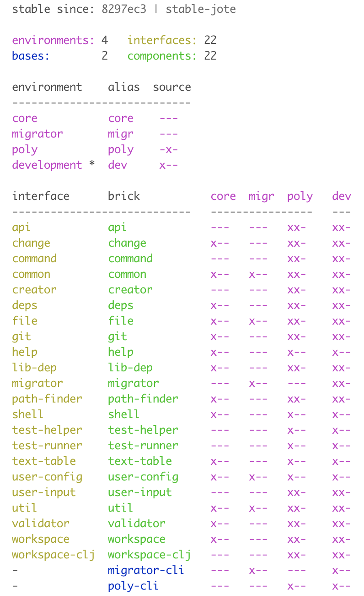

The diagram is now shown with colors! Let's improve the readability by switching to dark mode:

```
{:color-mode "dark"
 :thousand-separator ","
 :empty-character "·"}
```
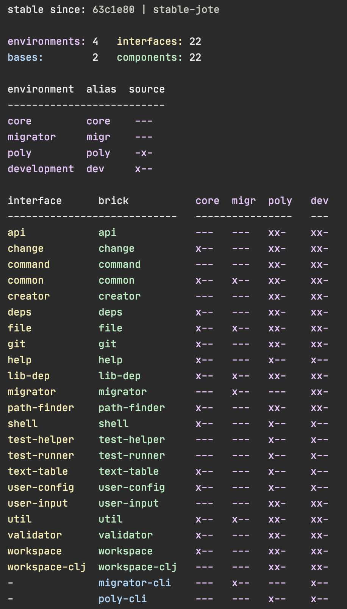

That's better! 

If you want to use the same colors in your terminal, here they are:<br>


If the colors (f8eeb6, bfefc5, 77bcfc, e2aeff, cccccc, 24272b, ee9b9a) looks familiar to you, it's because they are 
more or less stolen from the [Borealis](https://github.com/Misophistful/borealis-cursive-theme) color schema!

## Contact

Feel free to contact me:<br>
&nbsp;&nbsp;Twitter: @jtengstrand<br>
&nbsp;&nbsp;Email: info[at]polyfy[dot]com

You can also get in touch with us in the [Polylith forum](https://polylith.freeflarum.com) 
or on [Slack](https://clojurians.slack.com/archives/C013B7MQHJQ).

## License

Distributed under the Eclipse Public License, the same as Clojure.
