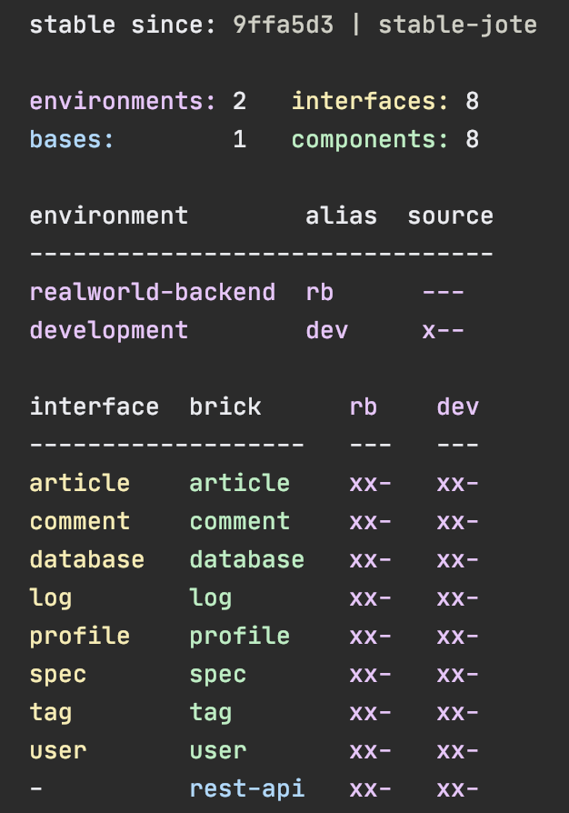

# 
A tool used to develop Polylith based architectures in Clojure.

---------

> **_UNDER CONSTRUCTION_**<br>
> This new tools.deps based tool hasn't been released yet.<br>
> Please use the old lein-polylith based tool in the meantime:<br>
> https://github.com/tengstrand/lein-polylith

Welcome to the wonderful world of Polylith!

Polylith is a new way of thinking around system architecture, 
that puts the developer in the driving seat and the code in the center.

Polylith is a way of organising code into reusable building blocks that are used to create systems. 
To better understand the principles and ideas behind it, we recommend you first read the Polylith 
[documentation](https://polylith.gitbook.io).

Organising code as a Polylith can be done manually, which was actually how it all began. With that said, 
there is no magic behind this way of organising the code. It's not a framework nor a library, 
just a simple yet powerful way to work with code at the system level.

The reason we built this tool is to make life easier for you as a developer by making the work more 
efficient and fun. 

Enjoy the ride!

## Migrate

The old [lein-polylith](https://github.com/tengstrand/lein-polylith) tool has reached its end of lifetime.  
If you have any old Leiningen based projects to migrated, follow the instructions [here](https://github.com/tengstrand/lein-polylith/blob/migrate/migrate/migrate.md).

## Table of Contents

- [Installation](#installation)
- [Realworld Example](#realworld-example)
- [Workspace](#workspace)
- [Development](#development)
- [Component](#component)
- [Interface](#interface)
- [Base](#base)
- [Environment](#environment)
- [Tools.deps](#toolsdeps)
- [Build](#build)
- [Git](#git)
- [Tagging](#tagging)
- [Flags](#flags)
- [Testing](#testing)
- [Profile](#profile)
- [Dependencies](#dependencies)
- [Libraries](#dependencies)
- [Colors](#colors)

## Installation

To use the Polylith tool and to get access to all the features in tools.deps, follow these steps:
- Make sure [git](https://git-scm.com/book/en/v2/Getting-Started-Installing-Git) is installed.
- Install the [clj](https://clojure.org/guides/getting_started) command line tool.

Make sure that `user.email` and `user.name` is configured correctly in git, by e.g. executing:
```sh
git config --list | grep user
```
If not, check it [here](https://docs.github.com/en/github/using-git/setting-your-username-in-git).

*** verify the installation ***

The next thing we want to do is to download and install the `poly` command line tool.

*** instructions on how to install 'poly' in unix/linux and windows + verify ***

## Realworld Example

If you want to have a look at a full-blown system, go to the [RealWorld](https://github.com/furkan3ayraktar/clojure-polylith-realworld-example-app) project where you can compare it with [implementations made in other languages](https://github.com/gothinkster/realworld).

## Workspace

The workspace directory is the place where all our code (Lego-like bricks) and configuration lives.

Let’s start by creating the _example_ workspace with the top namespace _se.example_:
```sh
poly create w name:example top-ns:se.example
``` 

The workspace directory structure will end up like this:
```sh
example           # workspace dir
  .git            # git repository dir
  bases           # bases dir (empty)
  components      # components dir (empty)
  development
    src           # development specific code
  environments    # environments dir (empty)
  deps.edn        # development environment config file (and some workspace config)
  logo.png        # polylith logo
  readme.md       # documentation
```

The directory makes it easier to find things and helps us reason about the system at a higher level. 
Each top directory is responsible for its own part of a Polylith system.
A `base` exposes a public API. A `component` is responsible for a specific domain 
or part of the system. 
An `environment` specifies our deployable artifacts and what libraries, components and bases they contain.
Finally, we have the `development` environment that we use when we work with the code.

A workspace is also always initialized to use [git](https://git-scm.com/), but more on this later.
 
`deps.edn`:

```clojure
{:polylith {:vcs "git"
            :top-namespace "se.example"
            :interface-ns "interface"
            :default-profile-name "default"
            :stable-since-tag-pattern "stable-*"
            :env->alias {"development" "dev"}
            :ns->lib {}}

 :aliases  {:dev {:extra-paths ["development/src"]
                  :extra-deps {org.clojure/clojure {:mvn/version "1.10.1"}
                               org.clojure/tools.deps.alpha {:mvn/version "0.8.695"}}}

            :test {:extra-paths []}

            :poly {:main-opts ["-m" "polylith.clj.core.poly_cli.poly"]
                   :extra-deps {tengstrand/polylith
                                {:git/url   "https://github.com/tengstrand/polylith.git"
                                 :sha       "69e70df8882f4d9a701ab99681a4a6870bdf052b"
                                 :deps/root "environments/cli"}}}}}
```

We will soon cover what all the different settings mean and how to use them.

## Development

When working with a Polylith codebase, we are free to choose any editor/IDE we like, for example
[Emacs](https://www.gnu.org/software/emacs/)/[Cider](https://github.com/clojure-emacs/cider), 
[VSCode](https://code.visualstudio.com/)/[Calva](https://marketplace.visualstudio.com/items?itemName=betterthantomorrow.calva) or
[IDEA](https://www.jetbrains.com/idea/)/[Cursive](https://cursive-ide.com). Here we will use Cursive.

Let's get started by creating a project. From the menu, select `File > New > Project from existing source`.
Select the `deps.edn` file, the desired version of SDK and finish the wizard.

Make sure to activate the `:dev` alias (and press the "two arrows" icon to refresh):<br>


Let's create a REPL by clicking `Add Configuration`:<br>


Click the `+` sign and select `Clojure REPL > Local`:<br>


Fill in:
- Name: REPL
- Which type of REPL to run: nREPL
- Run with Deps: (select)
- Aliases: test,dev

Now start the REPL in debug mode, by clicking the bug icon:<br>


When this turns up:
```
nREPL server started on port 53536 on host localhost - nrepl://localhost:53536
Clojure 1.10.1
```
...we are ready to go!

If we look at the `deps.edn` file again, we can see that _"development/src"_ was already added to the path:
```
 :aliases  {:dev {:extra-paths ["development/src"]
```

This gives us access to the `developent/src` directory so that we can work 
with the code. Right now there is only one directory here, but every time we create a new component or base,
they often end up here too.


The "development/src" path belongs to the `dev` alias which we activated previously and also added to the REPL
by selecting the "dev,test" aliases.
This means that we have configured everything that [tools.deps](https://github.com/clojure/tools.deps.alpha)
needs and that we are ready to write some Clojure code!

To do that we first need to create a namespace. We suggest that you use `dev` as a top namespace here and not 
the workspace top namespace `se.example`.
The reason is that we don't want to mix the code we put here with production code.

One way of structuring the code is to give every developer their own namespace under the `dev` top namespace.
Let's follow that pattern and create the namespace `dev.lisa`.

Right click on the `development/src` directory and select `New > Clojure Namespace` and type "dev.lisa":<br>


Now let's write some code:
```clojure
(ns dev.lisa)

(+ 1 2 3)
```
If we send `(+ 1 2 3)` to the REPL we should get `6` back, and if we do,
it means that we now have a working development environment!

# Component

Now when we have a working development environment, let's continue by creating our first component:
```sh
cd example
poly create c name:user
```


Our workspace will now look like this:
```sh
example
  bases
  components
    user
      resources
        user
          .keep
      src
        se/example/user/interface.clj
      test
        se/example/user/interface_test.clj
  development
    src
      dev/lisa.clj
  environments
  deps.edn
  logo.png
  readme.md
```

The `.keep` file is put there to prevent git from removing `components/user/resources/user`
(empty directories are automatically pruned by git).

The command also printed out this message:
```
  Remember to add src, resources and test directories to 'deps.edn' files.
```

This was a reminder for us to add source directories to `deps.edn`.
If we don't, then tools.deps and the development environment will not recognise our newly created component,
which would be a pity!

Let's continue by adding the component's `src`, `resources` and `test` directory to `deps.edn`:
```clojure
 :aliases  {:dev {:extra-paths ["development/src"
                                "components/user/src"
                                "components/user/resources"]
  ...
            :test {:extra-paths ["components/user/test"]}
```

Now we may need to refresh our IDE, by clicking this link, or the icon we used before:<br>


Now execute the `info` command:<br>
```sh
poly info
```


This tells us that we have one `development` environment, one `user` component and
one `user`interface but no `base`.

If you need to adjust the colors, then visit the [colors](#colors) section.

Now, let's add the `core` namespace to `user`:<br>


...and change it to:
```clojure
(ns se.example.user.core)

(defn hello [name]
  (str "Hello " name "!"))
```

...and update the `interface` to:
```clojure
(ns se.example.user.interface
  (:require [se.example.user.core :as core]))

(defn hello [name]
  (core/hello name))
``` 
Here we delegate the incoming call to the implementing `core` namespace,
which is the recommended way we structure components in Polylith.

## Interface

Interfaces are great in many ways:
- _Single point of access_. Components can only be accessed through their interface, which makes them
   easier to find, use and reason about.
- _Encapsulation_. All the implementing namespaces for a component can be changed without breaking the contract.
- _Replacability_. A component can be replaced with another components that share the same interface.


When we created the `user` component, the `user` interface was also created.


So what is an `interface` and what is it good for?

An interface in the Polylith world is a namespace named `interface` that often lives in one but 
sometimes several namespaces within a component. It defines a number of `def`, `defn` or `defmacro`
statements which forms the contract that it exposes to other components and bases.

If more than one component uses the same interface, then all these components must define the exact same set of 
`def`, `defn` and `defmacro` definitions, which is something the tool will help us with by showing
any contract violation in the `check` and `info` commands.

We often choose to have just a single `interface` namespace in a component, but it is also possible to 
divide the interface into several namespaces.
To do so we first create an `interface` package (directory) with the name `interface` at the root
and then we put the sub namaspaces in there.

We can find an example where the Polylith tool does that, by dividing its 
[util](https://github.com/tengstrand/polylith/tree/master/components/util/src/polylith/clj/core/util/interface)
interface into several sub namespaces:
```sh
util
  interface
    color.clj
    exception.clj
    os.clj
    str.clj
    time.clj
```

This can be handy if we want to group the functions and not put everyone into one place.
Every time we think of splitting up the interface, keep in mind that it instead can be an indicator
that it's time to split up the whole component into smaller components!

Code that uses an interface that has been split up, might look something like this:
```clojure
(ns dev.lisa
  (:require [se.example.util.interface.time :as time-util]))

(time-util/current-time)
```
### Interface definitions

So far, we have only used function in the interface. Polylith also supports having `def`
and `defmacro` statements in the interface.
There are no magic here, just include the definitions you want, like this:
```clojure
(def a-value 123)
```
Now it can be used as a normal definition from any other component or base.

A `defmacro` definition can look like this:
```clojure
(ns se.example.logger.interface
  (:require [logger.core :as core]))

(defmacro info [& args]
  `(core/info ~args))
```

...which deletages to:
```clojure
(ns se.example.core
  (:require [taoensso.timbre :as timbre]))

(defmacro info [args]
  `(timbre/log! :info :p ~args))
``` 

There are more to say about interfaces:
- Destructuring of parameters can be done in the delegating namespace.
  This can sometimes improve the readability, so instead of e.g. 
  `sell [{:keys [model type color]}]` we can have `sell [car]`.
- We can list the functions in alphabetic order in the interface if we like.
- If we have a [multi-arity function](http://clojure-doc.org/articles/language/functions.html#multi-arity-functions)
  in the interface then we can choose to have a single arity function in the implementing
  namespace, and pass in parameters as `nil` when needed.
- If using [variadic functions](http://clojure-doc.org/articles/language/functions.html#variadic-functions)
  in the interface, we can choose to pass in what comes after `&` as a `list` to the 
  implementing function, which sometimes can simplify the code.
- If using a `function` in two components that implement the same interface,
  all definitions must be `function`. The same goes for macros.
- The `interface` namespace name can be changed in `:interface-ns` in `./deps.edn` if you have good
  reasons to do that.
- We are allowed to access other namespaces than the `interface` from
  the `test` directory. Only the code under the `src` directory is checked
  to only access the `interface` namespace when executing the `check` or `info` command.
  This simplifies testing.

## Base

A `base` is similar to a `component` except for two things:
- It doesn't have an `interface`.
- It exposes a public API to the outside world.


The lack of an `interface` makes bases less composable compared to components. But that is not a problem,
because they solve a different problem and that is to be a bridge between the real world and our components.
This is done by taking the incomming call and delegate it to different components.

Let's create the `cli` base to see how it works:
```sh
poly create b name:cli
```

Our workspace should now look like this:
```sh
example
  bases
    cli
      resources
        cli
      src
        se/example/cli/core.clj
      test
        se/example/cli/core-test.clj
  components
    user
      resources
        user
      src
        se/example/user/interface.clj
      test
        se/example/user/interface_test.clj
  development
    src
      dev/lisa.clj
  environments
  deps.edn
  logo.png
  readme.md
```

Now we need to update `deps.edn` with our newly created base:
```clojure
 :aliases  {:dev {:extra-paths ["development/src"
                                "components/user/src"
                                "components/user/resources"
                                "bases/cli/src"
                                "bases/cli/resources"]
                  :extra-deps {org.clojure/clojure {:mvn/version "1.10.1"}
                               org.clojure/tools.deps.alpha {:mvn/version "0.8.695"}}}

            :test {:extra-paths ["components/user/test"
                                 "bases/cli/test"]}
```

Let's add some code to the base:
```clojure
(ns se.example.cli.core
  (:require [se.example.user.interface :as user])
  (:gen-class))

(defn -main [& args]
  (println (user/hello (first args))))
```

Here we added the `-main` function that later will be called from the command line.
The `(:gen-class)` statement tells the compiler to generate a callable Java class for us
when the code is compiled.

The next thing we want to do is to build an artifact that will turn the code into something useful, a command line tool.
To do that, we need to start by creating an environment.

## Environment

There are two kind of environments.


1. The `development` environment:
   - This is where we work with the code, often via a REPL. 
   - It contains all libraries, components and bases in the workspace, which is specified in `./deps.edn`.
   - Any extra code, that is not part of a component or base, lives under the `development` folder.
2. Any other `environment`:
   - Used to build deployable artifacts, e.g.: lambda functions, REST API's, libraries, and command line tools.
   - Live under the `environments` directory where each environment has its own directory.
   - Has a `deps.edn` config file that specifies which libraries, component and bases that are included.
   - It can optionally have a `resources` directory. 
   - If it has any tests of its own, they will live in the `test` directory under e.g. `environments/my-env`. 
   - It's discouraged to have a `src` directory since all production code should only live in components and bases.

Let's create an environment:
```sh
poly create e name:command-line
```
 
Our workspace should now look like this:
```sh
example
  bases
    cli
      resources
        cli
      src
        se/example/cli/core.clj
      test
        se/example/cli/core-test.clj
  components
    user
      resources
        user
      src
        se/example/user/interface.clj
      test
        se/example/user/interface_test.clj
  development
    src
      dev/lisa.clj
  environments
    command-line
      deps.edn
  deps.edn
  logo.png
  readme.md
```
 
The tool also reminded us of this:
```sh
  It's recommended to add an alias to :env->alias in ./deps.edn for the command-line environment.
```

If we don't add the alias, it will be shown up as a `?` when we execute the `info` command:
```clojure
{:polylith {:vcs "git"
            ...
            :env->alias {"development" "dev"
                         "command-line" "cl"}
```

Now add `user` and `cli` to `deps.edn` in `environments/command-line`:
```clojure
{:paths ["../../components/user/src"
         "../../components/user/resources"
         "../../bases/cli/src"
         "../../bases/cli/resources"]

 :deps {org.clojure/clojure {:mvn/version "1.10.1"}
        org.clojure/tools.deps.alpha {:mvn/version "0.8.695"}}

 :aliases {:test {:extra-paths ["../../components/user/test"
                                "../../bases/cli/test"]
                  :extra-deps  {}}}}
```

Note three things here:
- We didn't add "development/src. 
- The src paths and the test paths are configured at different levels, `:paths` and `extra-paths`.
- All paths begin with "../../".

The reson we didn't add "development/src" is because it contains code that should only be used
from the development environment.

All environments under the `environments` directory have their source paths defined in `:paths`
instead of inside the `:dev` alias, as in the `development` environment. 
This way we can keep them simpler without the need to activate a `:dev` alias.

The reason all paths begin with "../../" is that `components` and `bases` live two levels up 
compared to `environments/command-line` and not at the root as with the `development` environment.

If we add a missing path here, then we will get a warning when we execute the `check` or `info` command.


## Tools.deps

This tool is built on top of _tools.deps_. To get the most out of it, we recommend 
you to read the [documentation](https://github.com/clojure/tools.deps.alpha) that also contains some 
useful links.

To make it easier to follow the examples in the next `build` section, we will show some examples
on how to use the `clj` command.

Let's start by compiling the `command-line` environment:
```
cd environments/command-line
mkdir -p classes
clj -e "(compile,'se.example.cli.core)"
```
This will AOT compile the `command-line` environment.
The command needs the `classes` directory, so we had to create it for it.

If we add this `alias` to `command-line/deps.edn` (which we will do in the next section):
```clojure
 :aliases {:aot     {:extra-paths ["classes"]
                     :main-opts   ["-e" "(compile,'se.example.cli.core)"]}
           ...
```

...we can compile the environment by giving the `aot` alias:
```sh
clj -A:aot
```

To build an uberjar, out of the compiled classes, we need to add this alias:
```clojure
           :uberjar {:extra-deps {uberdeps {:mvn/version "0.1.10"}}
                     :main-opts  ["-m" "uberdeps.uberjar"]}}}
           ...
```

...and execute:
```
clj -A:uberdeps
```

Now let's see if we can build an artifact out of the `command-line` environment!

## Build

This tool doesn't include any `build` command. To build an artifact out of an environment, we should instead 
use scripts and maybe a build tool. We think they will do a better job and give us the level of control, 
flexibility and power we need.

Let's say we want to create an executable jar file out of the `command-line` environment.  
First, we can create a `scripts`directory at the workspace root and copy this [build-uberjar.sh](https://github.com/tengstrand/polylith/blob/master/scripts/build-uberjar.sh)
to it:
```sh
example
  scripts
    build-uberjar.sh
```

Also add `build-cli-uberjar.sh` to the `scripts` directory with this content:
```sh
#!/usr/bin/env bash
./build-uberjar.sh command-line se.example.cli.core
```

...and make sure both are executable:
```sh
chmod +x scripts/build-uberjar.sh
chmod +x scripts/build-cli-uberjar.sh
```

Now add the `aot` and `uberjar` aliases to `eps.edn` in `environments/command-line`:
```clojure

{:paths ["../../components/user/src"
         "../../components/user/resources"
         "../../bases/cli/src"
         "../../bases/cli/resources"]

 :deps {org.clojure/clojure {:mvn/version "1.10.1"}
        org.clojure/tools.deps.alpha {:mvn/version "0.8.695"}}

 :aliases {:test {:extra-paths ["../../components/user/test"
                                "../../bases/cli/test"]
                  :extra-deps  {}}

           :aot     {:extra-paths ["classes"]
                     :main-opts   ["-e" "(compile,'se.example.cli.core)"]}

           :uberjar {:extra-deps {uberdeps {:mvn/version "0.1.10"}}
                     :main-opts  ["-m" "uberdeps.uberjar"]}}}
```

The `aot` alias points to the `se.example.cli.core` namespace, which is where our `-main` function lives.
The `uberjar` alias is used to create a callable uberjar (you can read more about uberjars [here](https://github.com/tonsky/uberdeps)).

Let's try to build the `command-line` tool:
```sh
cd scripts
./build-cli-uberjar.sh
```

The end of the output should say something like:
```
[uberdeps] Packaged ./target/command-line.jar in 3052 ms
Uberjar created.
```

Let's execute it:
```sh
cd ../environments/command-line/target
java -jar command-line.jar Lisa  
```

```
Hello Lisa!
```

It worked! 

## Git

We have already used the `info` command a couple of times without explaining everything in its output.

Let's execute the `info` command again to see the current state of the workspace:<br>


At the top we have the line `stable since: c91fdad`. 
To explain what this is, let's take it from the beginning.

When a Polylith workspace is created, these `git` commands are executed:
```
git init
git add .
git commit -m "Workspace created."
``` 

If we run `git log` from the workspace root, it returns something similar to this:
```sh
commit c91fdad4a34927d9aacfe4b04ea2f304f3303282 (HEAD -> master)
Author: tengstrand <joakimtengstrand@gmail.com>
Date:   Thu Sep 3 06:11:23 2020 +0200

    Workspace created.
```

This is the first and so far only commit of this repository.
This is also the first `stable point in time` of this workspace which the tool uses when it calculates what changes have
been made (up till now). Notice that the first letters of the hash corresponds to `stable since: c91fdad`
and this is because it refers to this SHA-1 hash in git.
 
The `command-line` and `development` environment and the `user` and `cli` brick (components and bases are
also called `bricks`) are all marked with an asterisk, `*`. The way the tool calculates changes is to ask
`git` by running this command internally:
```sh
git diff c91fdad4a34927d9aacfe4b04ea2f304f3303282 --name-only
```

We can also run the `diff` command, which will execute the same git statement internally:
```clojure
poly diff
```

The output is the same:
```
bases/cli/resources/cli/.keep
bases/cli/src/se/example/cli/core.clj
bases/cli/test/se/example/cli/core_test.clj
components/user/resources/user/.keep
components/user/src/se/example/user/core.clj
components/user/src/se/example/user/interface.clj
components/user/test/se/example/user/interface_test.clj
deps.edn
development/src/dev/lisa.clj
environments/command-line/deps.edn
scripts/build-cli-uberjar.sh
scripts/build-uberjar.sh
```

Here we have the answer to were the `*` signs came from. The paths that starts with `environments/command-line`, 
`development`, `components/user` and `bases/cli` makes the tool understand that `command-line`, `development`,
`user` and `cli` are changed.

When we created the workspace, a [.gitignore](https://git-scm.com/docs/gitignore) file was also created for us.  
Now is a good time to add more rows here if needed:
```sh
**/classes
**/target
```

Let's add and commit the changed files:
```
git add --all
git commit -m "Created the user and cli bricks."
```

Let's have a look at our workspace repository again:
```sh
git log --pretty=oneline
```

```sh
e7ebe683a775ec28b7c2b5d77e01e79d48149d13 (HEAD -> master) Created the user and cli bricks.
c91fdad4a34927d9aacfe4b04ea2f304f3303282 Workspace created.
```

If we run the `info` command again, it will return the same result as before, and the reason is that we
haven't told git to move the `stable point in time` to our second commit.

# Tagging

The way we mark a `stable point in time` is to tag it with git (-f tells git to reuse the tag if already exists):
```sh
git tag -f stable-lisa
```

If we now run `git log --pretty=oneline` again:
```sh
e7ebe683a775ec28b7c2b5d77e01e79d48149d13 (HEAD -> master, tag: stable-lisa) Created the user and cli bricks.
c91fdad4a34927d9aacfe4b04ea2f304f3303282 Workspace created.
```

...we can see that the second commit has been tagged with `stable-lisa`.
 
If we execute the `info` command:


...the `stable since` hash has been updated and is now tagged with `stable-lisa`.
All the `*` signs are gone because no `component`, `base` or `environment` 
has yet changed since the second commit (which can be verified by running `poly diff` again).

We added the tag `stable-lisa` but we could have named the tag with anything that starts with `stable-`.
We choose `stable-lisa` because Lisa is our name (let's pretend that at least!). The idea is that every developer could use
their own unique tag name that doesn't conflict with other developers. The CI build should also use its own pattern,
like `stable-` plus the build number, to mark successful builds.

The pattern is configured in `deps.edn` and can be changed if we prefer something else:
```clojure
            :stable-since-tag-pattern "stable-*"
```

It's possible to move back to an earlier `stable point` in time by passing in a hash (the first few letters i enough
as long as it's unique):
```sh
git tag -f stable-lisa c91fdad
```

The way the tool finds the latest tag is to execute this command internally:
```
git tag --sort=committerdate -l 'stable-*'
``` 

Then it uses the last line of the output, or if no match was found, the first commit in the repository.

## Flags

We have one more thing to cover regarding the `info` command, and that is what the `x` and `-` flags mean:


Each flag under _source_ has a different meaning:<br>


The `---` for the `command-line` environment means we have an `environments/command-line`
directory but no `src` or `test` directories and that no tests will be executed for this environment.

The `x--` for the `development` environment means we have a `development/src` directory
but no `development/test` directory and that no tests will be executed for this environment.

We also have this section:<br>


Here the flags have a slightly different meaning:<br>


The `xx-` for the `user` component tells that both `components/user/src` and `components/user/test` 
are included in the `command-line` and `development` environments and that no brick tests will be executed.

The `xx-` for the `cli` base follows the same pattern as for the `user` component but for the
`bases/cli` directory.

The bricks for the `command-line` environment is configured in `environments/command-line/deps.edn`:
```clojure
{:paths ["../../components/user/src"
         "../../bases/cli/src"
         "../../bases/cli/resources"]

 ...
 :aliases {:test {:extra-paths ["../../components/user/test"
```

The bricks for the `development` environment is configured in `./deps.edn`:
```clojure
 :aliases  {:dev {:extra-paths [...
                                "components/user/src"
  ...
            :test {:extra-paths ["components/user/test"
```

 If we execute `poly info src:r` (or the longer `poly info src:resources`):<br>


...then the `resources` directory is also shown:<br>


## Testing

Polylith encourages a test-centric approach when working with code. New brick tests are easy to 
write, and mocking can be avoided by the fact that each brick has access to all components in the 
environments they live and are executed from.

With that said, let's continue with our example.

Nothing is marked to be tested at the moment, but if we change the `core` namespace in the `user` component
by adding an extra `!`, that should do the trick:
```clojure
(ns se.example.user.core)

(defn hello [name]
  (str "Hello " name "!!"))
```

We can verify that the tool recognises the change by running the `diff` command:
```
components/user/src/se/example/user/core.clj
```

...and if we run the `info` command again:<br>


...the `user` component is now marked with an asterisk, `*`. If we look carefully we will also notice that 
the status flags `xxx` under the `cl` column now have an `x` in its last position. As we already know, 
this means that the tests for `user` and `cli` will be executed from the `command-line` environment
if we execute the `test` command.

But why is `cli` marked to be tested? The reason is that even though `cli` itself hasn't
change, it depends on something that has, namely the `user` component.
  
The columns under the `development` environment are all marked as `xx-`. The reason the `development`
environment is not marked to be tested is that the `development` environment's tests are 
not included by default.

But before we run the test command, we should first add a test by editing the `interface-test` 
namespace in the `user` component:
```clojure
(ns se.example.user.interface-test
  (:require [clojure.test :refer :all]
            [se.example.user.interface :as user]))

(deftest hello--when-called-with-a-name--then-return-hello-phrase
  (is (= "Hello Lisa!"
         (user/hello "Lisa"))))
```

Now let's run the `test` command:
```sh
poly test
```

```
Runing tests for the command-line environment, including 2 bricks: user, cli

Testing se.example.cli.core-test

Ran 0 tests containing 0 assertions.
0 failures, 0 errors.

Test results: 0 passes, 0 failures, 0 errors.

Testing se.example.user.interface-test

FAIL in (hello--when-called-with-a-name--then-return-hello-phrase) (interface_test.clj:6)
expected: (= "Hello Lisa!" (user/hello "Lisa"))
  actual: (not (= "Hello Lisa!" "Hello Lisa!!"))

Ran 1 tests containing 1 assertions.
1 failures, 0 errors.
```


Oops, the test failed!
Remember that we added an extra `!` so now we need to update the 
corresponding test accordingly:
```clojure
(ns se.example.user.interface-test
  (:require [clojure.test :refer :all]
            [se.example.user.interface :as user]))

(deftest hello--when-called-with-a-name--then-return-hello-phrase
  (is (= "Hello Lisa!!"
         (user/hello "Lisa"))))
```

If we run the `test` command again, it will now pass:
```
Runing tests for the command-line environment, including 2 bricks: user, cli

Testing se.example.cli.core-test

Ran 0 tests containing 0 assertions.
0 failures, 0 errors.

Test results: 0 passes, 0 failures, 0 errors.

Testing se.example.user.interface-test

Ran 1 tests containing 1 assertions.
0 failures, 0 errors.

Test results: 1 passes, 0 failures, 0 errors.
Execution time: 1 seconds
```


We have already mentioned that the tests will not be executed from the `development` environment
when we run the `test` command.
But there is a way to do that, and that is to pass in `:dev` or `env:dev`.  

Let's try it out with the `info` command first:
```sh
poly info :dev
```


And yes, now the tests for the `development` environment are included. When we give an environment 
using `env` (`:dev` is a shortcut for `env:dev`) only that environment will be included. 
One way to test both the `development` environment and the `command-line` environment is to 
list them by separating them with colons:
```
poly info env:cl:dev
```


Now both the `development` and the `command-line` environment is marked for test execution.
Here we used the environment aliases `cl` and `dev` but we could also have passed in the environment 
names or a mix of the two, e.g. `poly info env:command-line:dev`.  
 
A good thing with components is that they hide the implementing namespaces by only exposing the
interface. A nice side-effect of this is that we can leave all the functions public which will
make the code easier to debug. With only public functions, we can stop at any breakpoint and evaluate
a function without having to use special syntax that is otherwise needed to access private functions.


### Environment tests

Before we execute any tests, let's add an environment test for the `command-line` environment.

Begin by adding a `test` directory for the `command-line` environment:
```sh
example
  environments
    command-line
      test
``` 

Then add that directory to `./deps.edn` which is the configuration for the development environment:
```clojure
            :test {:extra-paths ["components/user/test"
                                 "bases/cli/test"
                                 "environments/command-line/test"]}
```

Now add the `env.dummy-test` namespace to the `command-line` environment:
```sh
example
  environments
    command-line
      test
        env.dummy-test.clj
```
```clojure
(ns env.dummy-test
  (:require [clojure.test :refer :all]))

(deftest dummy-test
  (is (= 1 1)))
```

We could have choosen another top namespace, e.g., `se.example.env.command-line`, as long as 
we don't have any brick with the name `env`. But because we don't want to get into any name
conflicts with bricks and also because each environment is executed in isolation, the choice of 
namespace is less important and here we choose the `evn` top namespace to keep it simple. 

If we execute the `info` command:<br>


...the `command-line` is marked as changed and flagged as `-x-` telling us that 
it now has a `test` directory. The reason it is not tagged as `-xx` is that environment tests 
are not included in the tests without explicitly telling it to, by passing in `:env`.

```sh
poly info :env
```


Now the `command-line` environment is also marked to be tested.
Let's verify that by running the tests:
```sh
poly test :env
```


They passed!

### Test approach

We have tests at two different levels, the brick tests and the environment tests.

The environment tests should be used for our slow tests. They also give us a way to write 
tailor-made tests that are unique per environment.
To keep the feedback loop short, we should only put fast running tests in our bricks.
This will give us a faster feedback loop, because the brick tests are the ones
that are executed when we run `poly test` while the environment tests are not
executed in that case.

But does that mean we are only allowed to put unit tests in our bricks?  
No. As long as the tests are fast, they can be put in the bricks they belong to
(by e.g. using an in-memory database).

An extra bonus of using Polylith is that we can avoid most of the mocking,
because we run the tests from an environment where we have access to real components.

Before we continue, let's commit what we have done so far and mark the workspace as stable:
```sh
git add --all
git commit -m "Added tests"  
git tag -f stable-lisa
```
If we execute the `info` command:<br>


...the `*` signs are now gone and nothing is marked to be tested.

The tool only execute tests if a brick is directly or indirectly changed.  
A way to force it to test all bricks is to pass in `:all-bricks`:
```sh
poly info :all-bricks
```


Now all the brick tests are marked to be executed, except for the `development` environment.  
To include dev, also add `:dev`:
```sh
poly info :all-bricks :dev
```


To include all brick and environment tests, we can type:
```sh
poly info :all
```


...and to include dev, type:
```
poly info :all :dev
```


To include the `development` environments in the tests are normally not something we need to do,
but it's good to know that the possibility exists.

Now let's see if it actually works:
```sh
poly test :all :dev
```
```
Runing tests for the command-line environment, including 2 bricks and 1 environment: user, cli, command-line

Testing se.example.cli.core-test

Ran 0 tests containing 0 assertions.
0 failures, 0 errors.

Test results: 0 passes, 0 failures, 0 errors.

Testing se.example.user.interface-test

Ran 1 tests containing 1 assertions.
0 failures, 0 errors.

Test results: 1 passes, 0 failures, 0 errors.

Testing env.dummy-test

Ran 1 tests containing 1 assertions.
0 failures, 0 errors.

Test results: 1 passes, 0 failures, 0 errors.
Runing tests for the development environment, including 2 bricks and 1 environment: user, cli, command-line

Testing se.example.cli.core-test

Ran 0 tests containing 0 assertions.
0 failures, 0 errors.

Test results: 0 passes, 0 failures, 0 errors.

Testing se.example.user.interface-test

Ran 1 tests containing 1 assertions.
0 failures, 0 errors.

Test results: 1 passes, 0 failures, 0 errors.
Execution time: 3 seconds
```

Looks like it worked!  
Let's summarize the different ways to run the tests:

| Command                    | Tests to run                                                                                 | Run from the dev environment? |
|:---------------------------|:---------------------------------------------------------------------------------------------|:-----------------------------:|
| poly test                  | All brick tests that are marked as changed. No environment tests.                            |              no               |
| poly test :env             | All brick and environment tests that are marked as changed.                                  |              no               |
| poly test :dev             | All brick tests that are marked as changed, for selected environments. No environment tests. |              yes              |
| poly test :all-bricks      | All brick tests.                                                                             |              no               |
| poly&nbsp;test&nbsp;:all&#8209;bricks&nbsp;:dev | All brick tests.                                                        |              yes              |
| poly test :all             | All brick and environment tests.                                                             |              no               |
| poly test :all :dev        | All brick and environment tests.                                                             |              yes              |

## Profile

When working with a Polylith system, we want to keep everything as simple as possible.
We also want to be productive and it would be great if new services could be created easily.
The Lego-like way of organising code into bricks, helps us with both of these challenges.

One problem we normally have when developing software without using Polylith, is that the production environment
and the development environment has a 1:1 relationship. This happens because we use the production codebase
for development, so if we create a new service in production, it will automatically
"turn up" in development.
 
In Polylith we avoid this problem by separating the development environment from production.
Thanks to components, we can create any environment we want by putting the bricks we need into one place.
This allow us to optimize the development environment for productivity while in production, we can
focus on fulfilling non functional requirements like performance or up time. 

Right now, our `development` environment mirrors the `command-line` environment:<br>


Let's pretend we get performance problems in the `user` component and that we think
distributing the load by delegating to a new service could solve the problem:<br>


The production environment now looks good, but how about the `development` environment?
The problem here is that it contains two components that share the same `user` interface.
This will confuse both the classloader (if we start a REPL) and the IDE, because we now have
two components using the same `se.example.user` namespace in the path, which is not a desirable situation.

The solution is to use development `profiles`:<br>


By leaving out any component that implements the `user` interface from the `development` 
environment and combine it with one of the two possible `profiles` we get a complete development
environment. This solution allow us to work from a single `development` environment but still be able to
mimic the various environments we have.
The `default` profile (if exists) is automatically merged into the `development` environment, if no other profiles
are selected.

Now let's try to move from this:<br>


...to this:<br>


First we need to decide how the `command-line` tool should communicate with `user-service` over the wire.
After some searching, we found this [slacker](https://github.com/sunng87/slacker) library that 
allow us to use [remote procedure calls](https://en.wikipedia.org/wiki/Remote_procedure_call) 
in a simple way.

Let's create a checklist that will take us there:
- [ ] Create the `user-service`:
  - [ ] Update its `deps.edn` with:
    - [ ] Slacker library and libraries it needs.
    - [ ] Paths to the `user` component.
    - [ ] Paths to the `user-api` base.
    - [ ] The `aot` and `uberjar` aliases (so we can build an uberjar).
- [ ] Create the `user-api` base:
  - [ ] Implement the server.
- [ ] Create the `user-remote` component:
  - [ ] Create the `core` namespace and call `user-service` from there.
  - [ ] Delegate from the `interface` to the `core` namespace.
- [ ] Update the `development` environment:
  - [ ] Update `./deps.edn` with:
    - [ ] An alias for `user-service` (:env->alias).
    - [ ] Namespace to library mapping (:ns->lib).
    - [ ] Remove the `user` paths.
    - [ ] Slacker library and libraries it needs.
  - [ ] Create the `default` and `remote` profiles.
    - [ ] Add the `user` paths to the `default` profile.
    - [ ] Add the `user-remote` paths to the `remote` profile.
- [ ] Switch from `user` to `user-remote` in `deps.edn` for the `command-line` environment.
- [ ] Create a build script for `user-service`.
    - [ ] Make it executable.

Let's go through the list.
- [x] Create the `user-service`
  - [x] Update its `deps.edn` with:
    - [x] Slacker library and libraries it needs.
    - [x] Paths to the `user` component.
    - [x] Paths to the `user-api` base.
    - [x] The `aot` and `uberjar` aliases.

```sh
poly create e name:user-service
```
```
{:paths ["../../components/user/src"
         "../../components/user/resources"
         "../../bases/user-api/src"
         "../../bases/user-api/resources"]

 :deps {org.clojure/clojure {:mvn/version "1.10.1"}
        org.clojure/tools.deps.alpha {:mvn/version "0.8.695"}
        slacker {:mvn/version "0.17.0"}
        http-kit {:mvn/version "2.4.0"}
        ring {:mvn/version "1.8.1"}
        compojure {:mvn/version "1.6.2"}
        org.apache.logging.log4j/log4j-core {:mvn/version "2.13.3"}
        org.apache.logging.log4j/log4j-slf4j-impl {:mvn/version "2.13.3"}}

 :aliases {:test {:extra-paths ["../../components/user/test"
                                "../../bases/user-api/test"]
                  :extra-deps  {}}

           :aot     {:extra-paths ["classes"]
                     :main-opts   ["-e" "(compile,'se.example.user-api.core)"]}

           :uberjar {:extra-deps {uberdeps {:mvn/version "0.1.10"}}
                     :main-opts  ["-m" "uberdeps.uberjar"]}}}
```

- [x] Create the `user-api` base:
```
poly create b name:user-api
```
- [x] Implement the server for `user-api`:
```
bases
  user-api
    src
      se.example.user_api.api.clj
      se.example.user_api.core.clj
```
```clojure
(ns se.example.user-api.core
  (:require [se.example.user-api.api]
            [slacker.server :as server])
  (:gen-class))

(defn -main [& args]
  (server/start-slacker-server [(the-ns 'se.example.user-api.api)] 2104)
  (println "server started: http://127.0.0.1:2104"))
```
```clojure
(ns se.example.user-api.api
  (:require [se.example.user.interface :as user]))

(defn hello-remote [name]
  (user/hello (str name " - from the server")))
```

- [x] Create the `user-remote` component:
  - [x] Create the `core` namespace and call `user-service` from there.
  - [x] Delegate from the `interface` to the `core` namespace.
```sh
poly create c name:user-remote interface:user
```
```
components
  user-remote
    src
      se.example.user_remote.core.clj
      se.example.user_remote.interface.clj
```
```clojure
(ns se.example.user.core
  (:require [slacker.client :as client]))

(declare hello-remote)

(defn hello [name]
  (let [connection (client/slackerc "localhost:2104")
        _ (client/defn-remote connection se.example.user-api.api/hello-remote)]
    (hello-remote name)))
```
```clojure
(ns se.example.user.interface
  (:require [se.example.user.core :as core]))

(defn hello [name]
  (core/hello name))
```

- [x] Update the `development` environment:
  - [x] Update `./deps.edn` with:
    - [x] An alias for `user-service` (:env->alias).
    - [x] Namespace to library mapping (:ns->lib).
    - [x] Remove the `user` paths.
    - [x] Slacker library and libraries it needs.
  - [x] Create the `default` and `remote` profiles.
    - [x] Add the `user` paths to the `default` profile.
    - [x] Add the `user-remote` paths to the `remote` profile.

```clojure
{:polylith {:vcs "git"
            :top-namespace "se.example"
            :interface-ns "interface"
            :default-profile-name "default"
            :stable-since-tag-pattern "stable-*"
            :env->alias {"development" "dev"
                         "command-line" "cl"
                         "user-service" "user-s"}
            :ns->lib {slacker  slacker}}

 :aliases  {:dev {:extra-paths ["development/src"
                                "bases/cli/src"
                                "bases/cli/resources"
                                "bases/user-api/src"
                                "bases/user-api/resources"]
                  :extra-deps {org.clojure/clojure {:mvn/version "1.10.1"}
                               org.clojure/tools.deps.alpha {:mvn/version "0.8.695"}
                               slacker {:mvn/version "0.17.0"}
                               http-kit {:mvn/version "2.4.0"}
                               ring {:mvn/version "1.8.1"}
                               compojure {:mvn/version "1.6.2"}
                               org.apache.logging.log4j/log4j-core {:mvn/version "2.13.3"}
                               org.apache.logging.log4j/log4j-slf4j-impl {:mvn/version "2.13.3"}}}

            :test {:extra-paths ["bases/cli/test"
                                 "bases/user-api/test"
                                 "environments/command-line/test"]}

            :+default {:extra-paths ["components/user/src"
                                     "components/user/resources"
                                     "components/user/test"]}

            :+remote {:extra-paths ["components/user-remote/src"
                                    "components/user-remote/resources"
                                    "components/user-remote/test"]}

            :poly {:main-opts ["-m" "polylith.clj.core.poly_cli.poly"]
                   :extra-deps {tengstrand/polylith
                                {:git/url   "https://github.com/tengstrand/polylith.git"
                                 :sha       "69e70df8882f4d9a701ab99681a4a6870bdf052b"
                                 :deps/root "environments/cli"}}}}}

``` 

- [x] Switch from `user` to `user-remote` in `deps.edn` for the `command-line` environment.

```clojure
{:paths ["../../components/user-remote/src"
         "../../components/user-remote/resources"
         ...
 :aliases {:test {:extra-paths ["../../components/user-remote/test"
                                ...
```

- [x] Create a build script for `user-service`.
    - [x] Make it executable.
```sh
scripts
  build-user-service-uberjar.sh
```
```sh
#!/usr/bin/env bash
./build-uberjar.sh user-service se.example.user-api.core
```
```
chmod +x scripts/build-user-service-uberjar.sh
```


Puhh, that was it! Now let's test if if works.

Execute this from the workspace root in a separate terminal:
```
cd environments/user-service/target
java -jar user-service.jar
```
```
server started: http://127.0.0.1:2104
```

Now execute this from the other terminal:
```
cd environments/command-line/target
java -jar command-line.jar Lisa
```
The output should be:
```
Hello Lisa - from the server!!
```

Now execute the `info` command. The `+` will inactivate all profiles:
```
poly info +
```

Let's compare with the target design:
| | |
|:-|:-| 
| | |

Looks like we got everything right! 

The profile flags, `xx`, follows the same pattern as for
bricks and environments except that the last `Run the tests` flag is omitted.

When we went through this example, we added `user-remote` when the `default` profile was active.
What we should have done was to first deactivate the `default` profile and activate the `remote`
profile so that the development environment could treat the component as source code:<br>


These settings are only used by the IDE, but to switch to the `remote` profile when running a command,
we need to pass in `+remote`:
```sh
poly info +remote
```


Now the `remote` profile is included in the `development` environment.

It's possible to give more than one profile:
```
poly info +default +remote
```


The tool complains and doesn't like that we just included both `user` and `user-remote` to the `development` 
environment!

The profiles can also contain libraries and paths to environments, but right now we have no such paths
and therefore all profiles are marked with `--` in the environment section.

## Dependencies

To explain dependencies, we will use the
[RealWold example app](https://github.com/furkan3ayraktar/clojure-polylith-realworld-example-app/tree/clojure-deps).

Execute these commands from outside the `example` workspace:
```sh
git clone git@github.com:furkan3ayraktar/clojure-polylith-realworld-example-app.git
cd clojure-polylith-realworld-example-app
git checkout clojure-deps
```

```
poly info
```


Now we have some bricks to play with! Let's execute the `deps` command:

```
poly deps
```


This lists all dependencies in the workspace.
Notice the yellow color in the headers. They are yellow because components and bases only depend on `interfaces`. 

If we read the diagram horizontally, we can see that the `article` component depends on `database`, 
`profile` and `spec`. If we read it vertically, we can see that `article` is's used by 
components that implements the `comment` and `rest-api` interface.

There is a way to view the the component dependencies, and that is to specify an `environment`:
```
poly deps env:rb
```


The `+` signs shows indirect dependencies. An example is the `article` component
that is indirectly dependent on `log`:  article > database > log.  
Tip: If the headers and the "green rows" doesn't match, it may indicate that we have
unused components that can be removed from the environment.

If we give both the environment and the brick:
```
poly deps env:rb brick:article
```


...we get a complete picture of the usages of the brick in the specified environment.


If we only give the brick:
```
poly deps brick:article
```


..it lists all interfaces it uses and what bricks depend on it (including all environments).

## Libraries

To list all libraries used in the workspace, execute the `libs` command:
```
poly libs
```


Library dependencies are specified per environment. If needed, different versions
of the same library can be used in different environments. Only libraries that are
defined with `{mvn/version ...}` are listed here.

The way the tool figures out what library each brick uses is to look in `:ns->lib` in `./deps.edn`:

```clojure
            :ns->lib {clj-time              clj-time
                      clj-jwt               clj-jwt
                      clojure               org.clojure/clojure
                      clojure.java.jdbc     org.clojure/java.jdbc
                      compojure             compojure/compojure
                      crypto.password       crypto-password
                      environ               environ
                      honeysql              honeysql
                      slugger               slugger
                      ring.logger           ring-logger-timbre
                      ring.middleware.json  ring/ring-json
                      spec-tools            metosin/spec-tools
                      taoensso.timbre       com.taoensso/timbre}}
```
 
This map needs to be manually populated and specifies which namespace maps to which library.
The way the algorithm works is that it takes all the namespaces and sort them in reverse order.
Then it tries to match each namespace against that list from top to down and takes the first match.

Let's say we this mapping:
```clojure
:ns->lib {com.a      library-a
          com.a.b    library-b
          com.a.b.c  library-c}
```

...then the matching will be based on this list:
```
com.a.b.c
com.a.b
com.a
```  
If we compare with the `com.a.x.y` namespace, it will match against `com.a` and return `library-a`.  
If we compare with the `com.a.b.x` namespace, it will match against `com.a.b` and return `library-b`.


## Colors

To make things more colorful create the `~/.polylith/config.edn` config file under your `USER-HOME` directory
with the following content:
```
{:color-mode "bright"
 :thousand-separator ","
 :empty-character "·"}
```
- The _color-mode_ can be set to either "none", "light" or "dark", depending on the color schema you use.
  The only difference between "light" and "dark" is that they use different [codes](https://github.com/tengstrand/polylith/tree/master/components/util/src/polylith/clj/core/util/colorizer.clj) for grey.
- The _thousand-spearator_ is used to separate numbers larger then 999 like 12,345.
- The _empty-character_ can be replaced by a . (period) if your computer has problems showing it (they are used in the `deps` command).

If we run the `info` command again:
```sh
clj -A:poly info
```


The diagram is now shown with colors! Let's improve the readability by switching to dark mode:

```
{:color-mode "dark"
 :thousand-separator ","
 :empty-character "·"}
```


That's better! 

If you want to use the same colors in your terminal, here they are:<br>


If the colors (f8eeb6, bfefc5, 77bcfc, e2aeff, cccccc, 24272b, ee9b9a) looks familiar to you, it's because they are 
more or less stolen from the [Borealis](https://github.com/Misophistful/borealis-cursive-theme) color schema!
