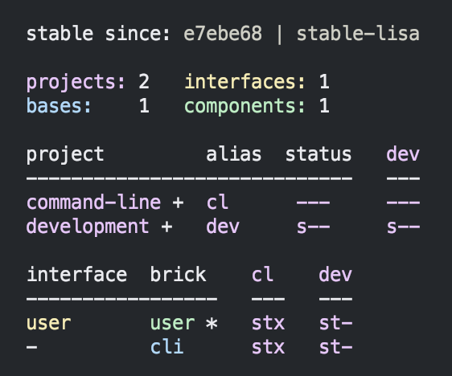
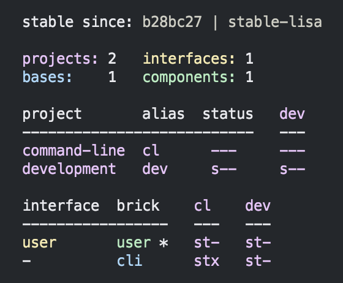
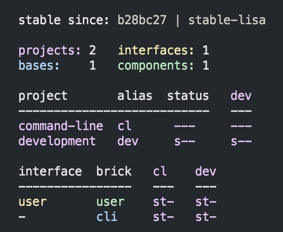
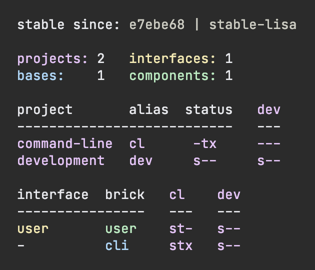
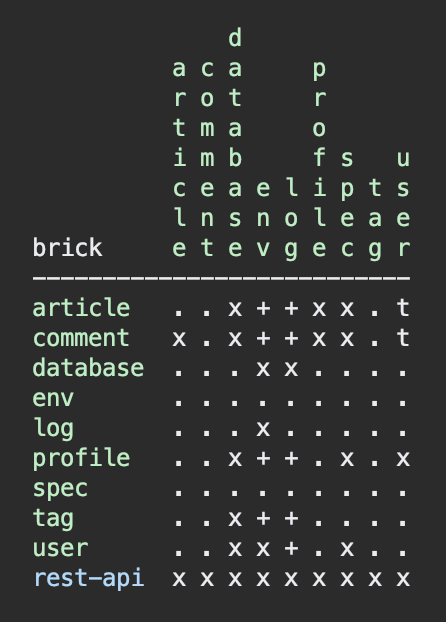
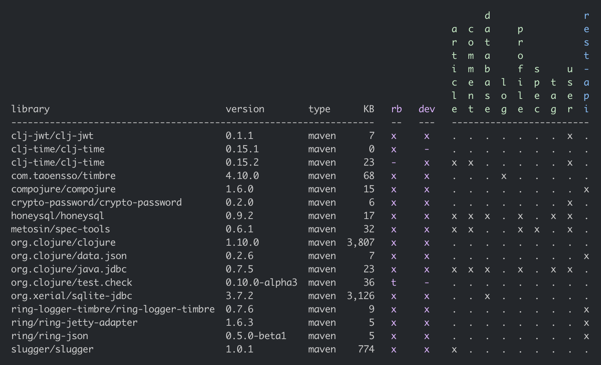

# 
An open source tool used to develop Polylith based architectures in Clojure.

---------

Welcome to the wonderful world of Polylith!

This tool is made by developers for developers with the goal to maximise productivity and
increase the quality of the systems we write.
It supports your build pipeline, but is not a build tool itself.

The Polylith concept can be implemented in any programming language,
but this version of the Polylith tool targets [Clojure](https://clojure.org)
which is a powerful and simple functional language for the [JVM](https://www.google.com/url?sa=t&rct=j&q=&esrc=s&source=web&cd=&cad=rja&uact=8&ved=2ahUKEwiB88eLxansAhUyi8MKHd6jDPEQFjAAegQIBRAC&url=https%3A%2F%2Fen.wikipedia.org%2Fwiki%2FJava_virtual_machine&usg=AOvVaw0YtnMyoG7GQIhUPeLulbfr).

Polylith introduces the architectural concept of “service level building blocks”,
which can be combined like LEGO bricks to build our services and systems.
Polylith’s LEGO-like bricks are easy to reason about, test, refactor, and reuse.
They allow us to work with all our code in one place for maximum productivity, using a single
[REPL](https://en.wikipedia.org/wiki/Read%E2%80%93eval%E2%80%93print_loop)

The bricks can easily be put together to form different kinds of deployable artifacts,
like services, tools and libraries, in the same way we put together LEGO when we were kids!
Not surprisingly, it's just as simple and fun!

To give you an idea of what that can look like, take a quick look at the bricks and libraries
that we use to build the Polylith tool (which is itself a Polylith workspace, represented by the `poly` column in the first diagram):


To better understand the principles and ideas behind this tool, we recommend you first read the...

<a href="https://polylith.gitbook.io">

<br>...high-level documentation!
</a>

<br>Enjoy the ride!

## Leiningen version

The old [lein-polylith](https://github.com/tengstrand/lein-polylith) tool has reached the
end of its life and has been replaced by the tools.deps version.
If you have any old Leiningen based projects to migrate, follow the instructions [here](https://github.com/tengstrand/lein-polylith/blob/migrate/migrate/migrate.md).

The biggest difference compared to the old tools is that the new tool is based on
[tools.deps](https://github.com/clojure/tools.deps.alpha) instead of [Leiningen](https://leiningen.org/)
which has a number of benefits, like an improved development experience, faster tests, Windows support,
and more.

## Table of Contents

- [Content](#content)
- [Installation](#installation)
- [Realworld Example](#realworld-example)
- [Workspace](#workspace)
- [Development](#development)
- [Component](#component)
- [Prompt](#prompt)
- [Interface](#interface)
- [Base](#base)
- [Project](#project)
- [Tools.deps](#toolsdeps)
- [Build](#build)
- [Git](#git)
- [Tagging](#tagging)
- [Continuous integration](#continuous-integration)
- [Flags](#flags)
- [Testing](#testing)
- [Profile](#profile)
- [Dependencies](#dependencies)
- [Libraries](#libraries)
- [Context](#context)
- [Parameters](#parameters)
- [Naming](#naming)
- [Configuration](#configuration)
- [Workspace state](#workspace-state)
- [Git hook](#git-hook)
- [Mix languages](#mix-languages)
- [Commands](doc/commands.md)
- [Colors](#colors)
- [Contact](#contact)
- [License](#license)

## Content

This documentation aims to be a practical guide to this tool with lots of code examples.
We encourage you to follow the code examples and try it out yourself.
We will guide you through the steps of creating a workspace with projects composed of
components, bases and libraries and how to work with them from the development environment.

We will give a short introduction to tools.deps and how to use build scripts to create
deployable artifacts. We will show how git is used to tag the code
and how it enables us to test and release the code incrementally.

We will show how profiles will help us work from a single development environment
for maximum efficiency and how dependencies and library usage can be displayed.

We will explain the value of components and how they bring context to our development experience,
which will help us build decoupled and scalable systems from day one.

Happy coding!

## Installation

The Polylith tool can be installed on Mac, Linux or Windows, so please follow the
installation instructions for your operating system of choice.

### Install on Mac

To use the Polylith tool and to get access to all the features in tools.deps, make sure you have
[CLI tools](https://clojure.org/guides/getting_started)
and [git](https://git-scm.com/book/en/v2/Getting-Started-Installing-Git) installed.
If you install git for the first time, don't forget to set the
[user](https://docs.github.com/en/github/using-git/setting-your-username-in-git)
name and email.

To install the `poly` command on Mac, execute:
```
brew install polyfy/polylith/poly
```

If you get the error "openjdk-13.0.2.jdk could not be opened...", do this:
- Open MacOS "System Preferences > Security & Privacy > General".
- Click Allow at the bottom for "openjdk-13.0.2.jdk".
- Run `brew install polyfy/polylith/poly` again.

Verify the installation by executing `poly help`.

### Install on Linux

To use the Polylith tool and to get access to all the features in tools.deps, make sure you have
[CLI tools](https://clojure.org/guides/getting_started)
and [git](https://git-scm.com/book/en/v2/Getting-Started-Installing-Git) installed.
If you install git for the first time, don't forget to set the
[user](https://docs.github.com/en/github/using-git/setting-your-username-in-git)
name and email.

To install the `poly` command on Linux:

- Download the [latest release](https://github.com/polyfy/polylith/releases/latest) of the `poly` jar,
  e.g. `poly-0.2.12-alpha.jar`.
- Create a directory, e.g. `/usr/local/polylith` and copy the jar file to that directory.
- Create a file with the name `poly` and put it in e.g. `/usr/local/bin` with this content:
 ```
#!/bin/sh

ARGS=""
while [ "$1" != "" ] ; do
  ARGS="$ARGS $1"
  shift
done

exec "/usr/bin/java" $JVM_OPTS "-jar" "/usr/local/polylith/poly-0.2.12-alpha.jar" $ARGS
```
- Make sure that:
  - you point to the correct jar file.
  - the path to `java` is correct (can be verified with `which java`).
- If you choose `/usr/local/bin`, it was probably already on your path, otherwise you have to add it.
- Make it executable by executing `chmod +x poly`.

Verify the installation by executing `poly help`.

#### Install via nix

`poly` tool is available in the [nixpkgs](https://github.com/NixOS/nixpkgs/blob/master/pkgs/development/tools/misc/polylith/default.nix) as well:

```bash
nix-shell -p polylith
# or
nix-env -iA 'nixos.polylith'
```

### Install on Windows

To use the Polylith tool and to get access to all the features in tools.deps, make sure you have
[CLI tools](https://clojure.org/guides/getting_started)
and [git](https://git-scm.com/book/en/v2/Getting-Started-Installing-Git) installed.
If you install git for the first time, don't forget to set the
[user](https://docs.github.com/en/github/using-git/setting-your-username-in-git)
name and email.

If you got this error when installing `clj`:
```
clj : The 'clj' command was found in the module 'ClojureTools', but the module could not be loaded.
For more information, run 'Import-Module ClojureTools'.
```

...and if you followed the instruction and executed this:
````
Import-Module ClojureTools
````
...and got this error:
```
Import-Module : File C:\Users\Admin\Documents\WindowsPowerShell\Modules\ClojureTools\ClojureTools.psm1
cannot be loaded because running scripts is disabled on this system. For more information,
see about_Execution_Policies at https:/go.microsoft.com/fwlink/?LinkID=135170.
```

...then try this:
```
Set-ExecutionPolicy -Scope Process -ExecutionPolicy Bypass
```

To install the `poly` command on Windows:

- Download the [latest release](https://github.com/polyfy/polylith/releases/latest) of the `poly` jar,
  e.g. `poly-0.1.0-alpha9.jar`.
- Create the `Polylith` directory somewhere on your machine, e.g.
  `C:\Program Files\Polylith` and copy the jar file to that directory.
- Create the file `poly.bat` with this content (make sure you point to the jar):
```sh
@echo off
start /wait /b java %JAVA_OPTS% -jar "C:\Program Files\Polylith\poly-0.2.12-alpha.jar" %*
```
- Add `C:\Program Files\Polylith` to the Windows `PATH` variable.

Test the installation by typing `poly help` from the command line.

> Note: The coloring of text are not supported on Windows.

### Install the Polylith Tool via the Clojure CLI

If you are using a recent version of the [Clojure CLI](https://clojure.org/releases/tools) --
1.10.3.933 or later -- you can install `poly` as a "tool":

```sh
clojure -Ttools install io.github.polyfy/polylith '{:git/sha "e50a1b8aa9cdf7e05543799723656b7faec9f3f6" :deps/root "projects/poly"}' :as poly
```

Then you can invoke the `poly` tool using the CLI directly:

```sh
clojure -Tpoly info loc true
```

You can get basic built-in help via the CLI's help machinery:

```sh
clojure -A:deps -Tpoly help/doc
```

> Note: the command-line argument syntax for "tool" usage follows the CLI "exec args" format which is essentially Clojure's own keyword/value syntax (it's actually read as EDN).

#### Exec Arguments vs Polylith Tool Documentation

The "native" `poly` tool has the following argument structure:
* the command, followed by
* zero or more entities (e.g., `create` can be followed by `component`), followed by
* named arguments (e.g., `project:example`), and
* flag arguments (e.g., `:loc`), and
* profiles (e.g., `+remote`).

Because "exec args" must follow key/value syntax, the argument structure for `-Tpoly` is:
* the command (which is the "exec fn"), followed by
* `entity` to name the first argument(s) to `create` or `help`,
* named arguments as key/value pairs (e.g., `project example`),
* flag arguments as keys with `true` or `false` values (e.g., `loc true`),
* `profiles` to list any profiles to enable, without the leading `+` (e.g., `profiles '[remote]'`).

For convenience, most arguments can be provided as symbols rather than requiring quoted strings:

```sh
# strings have to be quoted for EDN and the shell:
clojure -Tpoly info project '"example"'
# the following shorthand is allowed:
clojure -Tpoly info project example
```

Both `project` and `profile` exist in singular form, taking a symbol or string, and in
a plural form, taking a vector of symbols or strings:

```sh
# select more than one project:
clojure -Tpoly info projects '[example cli]'
# select just one profile:
clojure -Tpoly info profile remote
```

Some `poly` commands treat `:brick` and `:project` as flag arguments and other expect
`brick:name` or `project:name` as named arguments. When using "exec args", the meaning
is determined by whether the value is boolean or not:

```sh
# select all projects:
clojure -Tpoly info project true # flag argument
# select a specific project:
clojure -Tpoly info project cli # named argument
```

Since the exec argument format for create becomes verbose, there are four shortcut arguments:

```sh
# full create command syntax:
clojure -Tpoly create entity component name user
# shorthand:
clojure -Tpoly create c user
# similarly for b (base), p (project), and w (workspace)
clojure -Tpoly create w next-gen top-ns com.my-company
# is shorthand for:
clojure -Tpoly create workspace name next-gen top-ns com.my-company
```

Finally, for some commands, more than one "entity" can be provided and for the `entity`
exec argument, those can be `:`-separated, or use `entities` and a vector:

```sh
clojure -Tpoly help entity create:component
# equivalent to:
clojure -Tpoly help entities '[create component]'
```

### Use the Polylith Tool as a dependency

An alternative way of executing the `poly` tool is to specify it as a dependency, by giving a commit SHA.
To use it this way, add one of the following aliases to the `:aliases` section in your `deps.edn`.

#### Via Clojars

```clojure
{
...
 :aliases   {:poly  {:extra-deps {polylith/clj-poly
                                  {:mvn/version "0.2.12-alpha"}}
                     :main-opts  ["-m" "polylith.clj.core.poly-cli.core"]}}
...
}
```

#### Via GitHub

```clojure
{
...
 :aliases   {:poly  {:extra-deps {polylith/clj-poly
                                  {:git/url   "https://github.com/polyfy/polylith.git"
                                   :sha       "INSERT_LATEST_SHA_HERE"
                                   :deps/root "projects/poly"}}
                     :main-opts  ["-m" "polylith.clj.core.poly-cli.core"]}}
...
}
```

Replace `INSERT_LATEST_SHA_HERE` with a [commit SHA](https://github.com/polyfy/polylith/commits/master) from this repository (e.g. the latest).

Once you have added one of the aliases above, you can now use the poly tool from the terminal:

```sh
clojure -M:poly version
```

We will soon create our first `workspace` but before that is done, only the `version` and `help` commands will work.

### JVM options

If we want to add extra memory to the `poly` command or maybe specify where the configuration file for the logging is stored,
then we can set the `JVM_OPTS` environment variable to do that, because `JVM_OPTS` is also passed in when executing the
`poly` command.

If we use the tools.deps CLI to execute the `poly` command, e.g. `clojure -M:poly test`, we can configure the logging in the
`:poly` alias in `./deps.edn` for the project, e.g.:
```
{:aliases  {...
            :poly {...
                   :extra-deps {...
                                org.apache.logging.log4j/log4j-api {:mvn/version "2.13.3"}
                                org.apache.logging.log4j/log4j-slf4j-impl {:mvn/version "2.13.3"}}}}
```

### Add other Polylith artifacts as a dependency
Similarly, you can use other artifacts from this repository, `clj-api` or `clj-poly-migrator` as dependencies. For example, in order to add `clj-api` as a dependency, add one of the following to your `:deps` section in your `deps.edn` file:

```clojure
polylith/clj-api {:mvn/version "0.2.12-alpha"}
```
or
```clojure
polylith/clj-api {:git/url   "https://github.com/polyfy/polylith.git"
                  :sha       "ecd2cf2ede81ecd4fbf82f21a075b103b6f2d2af"
                  :deps/root "projects/api"}
```

...and remember to set the `:sha` to an existing [SHA](https://github.com/polyfy/polylith/commits/master).

## Upgrade

To upgrade the `poly` tool on Mac, execute:
```
brew upgrade polyfy/polylith/poly
```

To upgrade on Windows and Linux: download the [latest release](https://github.com/polyfy/polylith/releases/latest) and replace the poly jar (e.g. `poly-0.2.12-alpha.jar`).

## RealWorld Example

If you want to start by seeing how a full-blown system looks like in Polylith, then head over to the
[RealWorld](https://github.com/furkan3ayraktar/clojure-polylith-realworld-example-app) project,
where you can also compare it with [implementations made in other languages](https://github.com/gothinkster/realworld).
Otherwise, let’s jump in and start making our own very basic Polylith project!

## Migrate workspace

If the workspace has been created with [v0.1.0-alpha9](https://github.com/polyfy/polylith/releases/tag/v0.1.0-alpha9)
or earlier, then it has to be [migrated](doc/migrate.md).

## Workspace

The workspace directory is the place where all our code and most of the [configuration](#configuration) lives.

Let’s start by creating the `example` workspace with the top namespace `se.example` by using the [create workspace](doc/commands.md#create-workspace) command
(`create w` works as well as `create workspace`). Make sure you execute the command outside a git repository:
```sh
poly create workspace name:example top-ns:se.example
```

This will create a workspace in the `main` branch.
By giving `branch:BRANCH-NAME` the workspace can be created in a different branch, e.g.:
```sh
poly create workspace name:example top-ns:se.example branch:master
```

The workspace directory structure will end up like this:
```sh
example            # workspace dir
├── .git           # git repository dir
├── bases          # bases dir
├── components     # components dir
├── deps.edn       # development config file
├── development
│   └── src        # development specific code
├── logo.png       # polylith logo
├── projects       # projects dir
├── readme.md      # documentation
└── workspace.edn  # workspace config file
```

The directory structure is designed for quick navigation and ease of use.
It helps us to understand and find all our service-level building blocks,
which lets us reason about the system at a higher level.

Each top-level directory contains a specific type of Polylith concept.
A `base` is a building block that exposes a public API to external systems.
A `component` is a building block for encapsulating a specific domain or part of the system.
A `project` specifies our deployable artifacts and what components, bases, and libraries they contain.
Finally, we have the `development` project (`development` + `deps.edn`)
that we use to work with the code in one place.

This structure gives a consistent shape to all Polylith projects, and ensures that both new developers
and veterans can quickly understand and start working with systems that are new to them.
We think you will soon be addicted to the power and simplicity the Polylith structure gives to your projects!

The `bases`, `components` and `projects` directories also contain a `.keep` file,  which are added to prevent git
from deleting these directories, and can be removed as soon as we add something to them.
A workspace is always initialized to use [git](https://git-scm.com/), but more on that later.

The `workspace.edn` file looks like this:
```clojure
{:top-namespace "se.example"
 :interface-ns "interface"
 :default-profile-name "default"
 :compact-views #{}
 :vcs {:name "git"
       :auto-add false}
 :tag-patterns {:stable "stable-*"
                :release "v[0-9]*"}
 :projects {"development" {:alias "dev"}}}
```

...and `deps.edn` like this:

```clojure
{:aliases  {:dev {:extra-paths ["development/src"]
                  :extra-deps {org.clojure/clojure {:mvn/version "1.10.1"}
                               org.clojure/tools.deps.alpha {:mvn/version "0.12.1003"}}}

            :test {:extra-paths []}

            :poly {:main-opts ["-m" "polylith.clj.core.poly-cli.core"]
                   :extra-deps {polyfy/polylith
                                {:git/url   "https://github.com/polyfy/polylith"
                                 :sha       "ecd2cf2ede81ecd4fbf82f21a075b103b6f2d2af"
                                 :deps/root "projects/poly"}}}}}
```

If all went well, the `poly` tool managed to set the latest sha for the `:poly` alias by taking it from the `master` branch
in this repository.

```
poly ws get:settings:vcs:polylith :latest-sha
```
The output will look something like this:
```
{:branch "master",
 :latest-sha "887e4237cec8f42eaa15be3501f134732602bb41",
 :repo "https://github.com/polyfy/polylith.git"}
```

The `:latest-sha` argument will tell the tool to go out and find the latest SHA from the Polylith repo
and populate the `:latest-sha` attribute, which would otherwise not be set.

If you wonder how the `ws` command works or what all the settings are for, be patient, everything will soon be covered in detail.

### Existing git repository

A polylith workspace can also be created inside an existing git repo.
When we do that, we have two alternatives.
Either we create the workspace directly at the root of the git repository by executing e.g.:
```
cd my-git-repo-dir
poly create workspace top-ns:com.mycompany
```
```
my-git-repo-dir
├── bases
├── components
├── deps.edn
├── development
├── projects
└── workspace.edn
```

...or we put the workspace in a directory under the git repository by executing e.g.:
```
cd my-git-repo-dir
poly create workspace name:my-workspace top-ns:com.mycompany
```
```
my-git-repo-dir
└── my-workspace
    ├── bases
    ├── components
    ├── deps.edn
    ├── development
    ├── projects
    └── workspace.edn
```

To execute a command, we need to be at the root of the workspace, e.g.:
```
cd my-workspace
poly info
```

## Development

When working with a Polylith codebase, we are free to choose any editor/IDE we like, for example
[Emacs](https://www.gnu.org/software/emacs/)/[Cider](https://github.com/clojure-emacs/cider),
[VSCode](https://code.visualstudio.com/)/[Calva](https://marketplace.visualstudio.com/items?itemName=betterthantomorrow.calva) or
[IDEA](https://www.jetbrains.com/idea/)/[Cursive](https://cursive-ide.com).
Here we will use Cursive, and if you do, make sure you have [tools.deps](https://cursive-ide.com/userguide/deps.html) configured correctly.

Let's get started by creating a project. From the menu, select `File > New > Project from existing sources`.
Select the `deps.edn` file, the desired version of SDK and finish the wizard.

Make sure to activate the `:dev` alias (and press the "two arrows" icon to refresh):<br>


Let's create a REPL by clicking `Add Configuration`:<br>


Click the `+` sign and select `Clojure REPL > Local`:<br>


Fill in:
- Name: REPL
- Which type of REPL to run: nREPL
- Run with Deps: (select)
- Aliases: test,dev

Press OK and start the REPL in debug mode, by clicking the bug icon:<br>


When this turns up:
```
nREPL server started on port 53536 on host localhost - nrepl://localhost:53536
Clojure 1.10.1
```
...we are ready to go!

If we look at the `deps.edn` file again, we can see that _"development/src"_ was already added to the path:
```
 :aliases  {:dev {:extra-paths ["development/src"]
```

This gives us access to the `development/src` directory so that we can work
with the code. Right now there is only one directory here, but every time we create a new component or base,
we normally add them to the path too (the exception is if you have several components sharing the
same interface, but more on that later).

The "development/src" path belongs to the `dev` alias which we activated previously and also added to the REPL
by selecting the "dev,test" aliases.
This means that we have configured everything that [tools.deps](https://github.com/clojure/tools.deps.alpha)
needs and that we are ready to write some Clojure code!

To do that we first need to create a namespace. We suggest that you use `dev` as a top namespace here and not
the workspace top namespace `se.example`.
The reason is that we don't want to mix the code we put here with production code.

One way of structuring the code is to give all developers their own namespace under the `dev` top namespace.
Let's follow that pattern and create the namespace `dev.lisa`.

Right click on the `development/src` directory and select `New > Clojure Namespace` and type "dev.lisa":<br>


When this dialog turns up, select "Remember, don't ask again" and click the `Add` button.


Now let's write some code:
```clojure
(ns dev.lisa)

(+ 1 2 3)
```
Make sure the namespace is loaded, by sending `(ns dev.lisa)` to the REPL.
If we then send `(+ 1 2 3)` to the REPL we should get `6` back, and if we do,
it means that we now have a working development environment!

# Component


Now when we have a working development environment, let's continue and create our first component.
But before we do that, open `workspace.edn` in a text editor and set `:auto-add` to `true`:
```
...
 :vcs {:name "git"
       :auto-add true}
...
```
This will ensure that the created files and directories from the `create` command are also added to git,
which will come in handy in this example.
Continue by executing the [create component](doc/commands.md#create-component) command:
```sh
cd example
poly create component name:user
```


Our workspace will now look like this:
```sh
example
├── bases
├── components
│   └── user
│       ├── deps.edn
│       ├── resources
│       │   └── user
│       │       └── .keep
│       ├── src
│       │   └── se
│       │       └── example
│       │           └── user
│       │               └── interface.clj
│       └── test
│           └── se
│               └── example
│                   └── user
│                       └── interface_test.clj
├── deps.edn
├── development
│   └── src
│       └── dev
│           └── lisa.clj
├── logo.png
├── projects
├── readme.md
└── workspace.edn
```

The command also printed out this message:
```
  Remember to add paths and/or local/root dependency to dev and project 'deps.edn' files.
```

This was a reminder for us to add the component to `deps.edn`.
If we don't, then tools.deps and the development environment will not recognise our newly created component,
which would be a pity!
The tool leaves this task to you as a developer, with the idea to give you as much control as possible
(files are only edited by you, not by the tool).

Right now we can ignore the last part of the message, to add the component to project `deps.edn`
files, because no projects have been created yet.

Let's continue by adding the component's `src`, `resources` and `test` directory to `deps.edn`:
```clojure
 :aliases  {:dev {:extra-paths ["development/src"
                                "components/user/src"
                                "components/user/resources"]
  ...
            :test {:extra-paths ["components/user/test"]}
```

An alternative way of adding the component is by specifying it as an `:extra-deps` (the `development/src` directory
still has to be specified as a path):
```clojure
 :aliases  {:dev {:extra-paths ["development/src"]
                  :extra-deps {poly/user {:local/root "components/user"}}
  ...
            :test {:extra-paths ["components/user/test"]}
```
If you use Cursive as an IDE, this will not work correctly, and
the problem is that Cursive doesn't treat `components/user/src` as a source directory in the IDE
(it will not be marked as green). This is also why we use the first form in this example.

However, in many other IDE's like [VSCode](https://code.visualstudio.com/)/[Calva](https://marketplace.visualstudio.com/items?itemName=betterthantomorrow.calva)
and [Emacs](https://www.gnu.org/software/emacs/)/[Cider](https://github.com/clojure-emacs/cider)
this works fine, which also gives us some benefits:
- Less code, one line instead of two.
- It's consistent with how [projects](#project) are specified.
- You can add or remove the `resources` directory from a brick, without updating `./deps.edn`.

With that said, we will still specify `user` by using `:extra-paths` because we use Cursive in this example.

Notice that we still need to add the `test` directory to `./deps.edn` to be able to run the tests.

Now we may need to refresh our IDE, by clicking this link, or the icon we used before:<br>


The component also has its own `deps.edn` file that looks like this:
```
{:paths ["src" "resources"]
 :deps {}
 :aliases {:test {:extra-paths ["test"]
                  :extra-deps {}}}}
```

It specifies that it has a `src`, `resources` and `test` directory and will
later be needed by the projects that include this component.

Now execute the [info](doc/commands.md#info) command:<br>
```sh
poly info
```


This tells us that we have one `development` project, one `user` component and
one `user` interface but no base (yet). Components and bases are referred to as `bricks`
(we will soon explain what a base is).
The cryptic `s--` and `st-` will be described in the [flags](#flags) section.

If your colors don't look as nice as this, then visit the [colors](#colors) section.

# Prompt

The `poly` tool is a Java program (Clojure code compiled into Java bytecode)
and it takes a couple of seconds or more to execute a command (depending on how fast computer you have).
There is a way to execute commands instantly and that is to start an interactive prompt:
```
poly prompt
```

This will start the `poly` command in an interactive mode with the same name as the workspace:
```
example$>
```

From here we can execute any `poly` command, e.g.:
```
example$> info
```

Feel free to execute any `poly` command in this documentation interactively from now!

Type `exit` or `quit` to exit:
```
example$> exit
```

### Add implementation

Now, let's add the `core` namespace to `user`:<br>


...and change it to:
```clojure
(ns se.example.user.core)

(defn hello [name]
  (str "Hello " name "!"))
```

...and update the `interface` to:
```clojure
(ns se.example.user.interface
  (:require [se.example.user.core :as core]))

(defn hello [name]
  (core/hello name))
```
Here we delegate the incoming call to the implementing `core` namespace,
which is the recommended way of structuring the code in Polylith.
Here we put all our implementing code in one single namespace, but as the codebase grows,
more namespaces can be added to the component when needed.
The implementing `core` namespace can be renamed to something else, but here we choose to keep it as it is.

## Interface


Component interfaces give a number of benefits:
- _Single point of access_. Components can only be accessed through their interface, which makes them
   easy to find, use and reason about.
- _Encapsulation_. All the implementing namespaces for a component can be changed without breaking the interface contract.
- _Composability_. All components have access to all other components via interfaces, and can be replaced as long as they use the same interface.

When we created the `user` component, the `user` interface was also created.

So what is an `interface` and what is it good for?

An interface in the Polylith world is a namespace named `interface` that often lives in one but
sometimes several namespaces within a component. It defines a number of `def`, `defn` or `defmacro`
statements which forms the contract that it exposes to other components and bases.

If more than one component uses the same interface, then all these components must define the exact same set of
`def`, `defn` and `defmacro` definitions, which is something the tool helps us with.

To give an example, let's pretend we have the interface `user` containing the functions
`fun1` and `fun2` and that two components "implement" this interface, e.g:
```
▾ myworkspace
  ...
  ▾ components
    ▾ user
      ▾ src
        ▾ com
          ▾ mycompany
            ▾ user
                interface.clj
                  fun1
                  fun2
                ...
    ▾ admin
      ▾ src
        ▾ com
          ▾ mycompany
            ▾ user
                interface.clj
                  fun1
                  fun2
                ...
  ...
```

Now we are free to edit the `interface.clj` file for both `user` and `admin`, which means they can
get out of sync if we are not careful enough. Luckily, the Polylith tool will help us
keep them consistent, and complain if they differ when we run the [check](doc/commands.md#check),
[info](doc/commands.md#info) or [test](doc/commands.md#test) commands!

We often choose to have just a single `interface` namespace in a component, but it's also possible to
divide the interface into several sub namespaces.
To do so we first create an `interface` package (directory) with the name `interface` at the root
and then we put the sub namespaces in there.

We can find an example where the `util` component in the Polylith repository does that, by dividing its
[util](https://github.com/polyfy/polylith/tree/master/components/util/src/polylith/clj/core/util/interface)
interface into several sub namespaces:
```sh
util
└── interface
    ├── color.clj
    ├── exception.clj
    ├── os.clj
    ├── str.clj
    └── time.clj
```

This can be handy if we want to group the functions and not put everyone into one place.
A common usage is to place [clojure specs](https://clojure.org/about/spec) in its own `spec` sub namespace,
which we have an example of in the RealWorld example app, where the `article` component also has an
[interface.spec](https://github.com/furkan3ayraktar/clojure-polylith-realworld-example-app/blob/master/components/article/src/clojure/realworld/article/interface/spec.clj)
sub interface.

It can then be used from e.g. the [handler](https://github.com/furkan3ayraktar/clojure-polylith-realworld-example-app/blob/master/bases/rest-api/src/clojure/realworld/rest_api/handler.clj)
namespace in `rest-api`:
```clojure
(ns clojure.realworld.rest-api.handler
  (:require ...
            [clojure.realworld.user.interface.spec :as user-spec]
            ...))

(defn login [req]
  (let [user (-> req :params :user)]
    (if (s/valid? user-spec/login user)
      (let [[ok? res] (user/login! user)]
        (handle (if ok? 200 404) res))
      (handle 422 {:errors {:body ["Invalid request body."]}}))))
```


Every time you think of splitting up the interface, keep in mind that it may be an indicator
that it's instead time to split up the component into smaller components!

### Interface definitions

So far, we have only used functions in the interface. Polylith also supports having `def`
and `defmacro` statements in the interface.
There is no magic here, just include the definitions you want, like this:
```clojure
(def one-two-three 123)
```
Now it can be used as a normal definition from any other component or base.

A `defmacro` definition can look like this:
```clojure
(ns se.example.logger.interface
  (:require [se.example.logger.core :as core]))

(defmacro info [& args]
  `(core/info ~args))
```

...which delegates to:
```clojure
(ns se.example.logger.core
  (:require [taoensso.timbre :as timbre]))

(defmacro info [args]
  `(timbre/log! :info :p ~args))
```

This list of tips makes more sense when you have used Polylith for a while,
so take note of this section for later:
- Functions can be sorted in alphabetical order in the interface, while we can freely arrange them in the implementation namespace(s).
- The interface can expose the name of the entity, e.g. `sell [car]`, while the implementing function can do the
  destructuring, e.g. `sell [{:keys [model type color]}]` which sometimes can improve the readability.
- If we have a [multi-arity function](http://clojure-doc.org/articles/language/functions.html#multi-arity-functions)
  in the interface, a simplification can sometimes be to have a single arity function in the implementing
  namespace that allows some parameters to be passed in as `nil`.
- If using [variadic functions](http://clojure-doc.org/articles/language/functions.html#variadic-functions)
  in the interface, a simplification is to pass in what comes after `&` as a `vector` to the implementing function.
- Testing is simplified by allowing access to implementing namespaces from the `test` directory.
  Only the code under the `src` directory is restricted to only access the `interface` namespace.
  The check is performed when running the `check`, `info` or `test`command.
- All functions can be declared public while still being protected. This improves testability and the debugging experience.
  When stopping at a breakpoint to evaluate a function, we don't need to use any special syntax to access it,
  that we otherwise would have to if it was private.
- If using a `function` in two components that implement the same interface,
  all definitions must be `function`. The same goes for `macros`. The reason for this restriction is that
  functions are composable, but macros are not, which could otherwise cause problems.

Finally, if we have really good reasons to, the `interface` namespace name can be changed in `:interface-ns` in `./workspace.edn`.

## Base


A `base` is similar to a `component` except for two things:
- It doesn't have an `interface`.
- It exposes a public API to the outside world.

The lack of an `interface` makes bases less composable compared to components.
This is okay, because they serve a different purpose which is to be a bridge between
the real world and the components the base delegates to.
This gives us the modularity and structure we need to build simple and understandable services and tools.

Let's create the `cli` base to see how it works, by executing the [create base](doc/commands.md#create-base) command:
```sh
poly create base name:cli
```

Our workspace should now look like this:
```sh
example
├── bases
│   └── cli
│       ├── deps.edn
│       ├── resources
│       │   └── cli
│       ├── src
│       │   └── se
│       │       └── example
│       │           └── cli
│       │               └── core.clj
│       └── test
│           └── se
│               └── example
│                   └── cli
│                       └── core_test.clj
├── components
│   └── user
│       ├── deps.edn
│       ├── resources
│       │   └── user
│       ├── src
│       │   └── se
│       │       └── example
│       │           └── user
│       │               ├── core.clj
│       │               └── interface.clj
│       └── test
│           └── se
│               └── example
│                   └── user
│                       └── interface_test.clj
├── deps.edn
├── development
│   └── src
│       └── dev
│           └── lisa.clj
├── logo.png
├── projects
├── readme.md
└── workspace.edn
```

Now we need to update `./deps.edn` with our newly created base:
```clojure
 :aliases  {:dev {:extra-paths ["development/src"
                                "components/user/src"
                                "components/user/resources"
                                "bases/cli/src"
                                "bases/cli/resources"]
                  :extra-deps {org.clojure/clojure {:mvn/version "1.10.1"}
                               org.clojure/tools.deps.alpha {:mvn/version "0.12.1003"}}}

            :test {:extra-paths ["components/user/test"
                                 "bases/cli/test"]}
```

...and add some code to it:
```clojure
(ns se.example.cli.core
  (:require [se.example.user.interface :as user])
  (:gen-class))

(defn -main [& args]
  (println (user/hello (first args)))
  (System/exit 0))
```

Here we added the `-main` function that will later be called from the command line.
The `(:gen-class)` statement tells the compiler to generate a Java class for us
when the code is compiled.

A `deps.edn` file was also created with this content:
```
{:paths ["src" "resources"]
 :deps {}
 :aliases {:test {:extra-paths ["test"]
                  :extra-deps {}}}}
```

This config file is identical to the `user` config file, and will soon be needed when we create a project that includes it.

The next thing we want to do is to build an artifact that will turn the code into something useful, a command line tool.
To do that, we need to start by creating a project.

## Project


There are two kinds of projects in Polylith: development and deployable.

1. The `development` project:
   - This is where we work with the code, often from a REPL.
   - It contains all libraries, components and bases in the workspace, which is specified in `./deps.edn`.
   - If we have any [profiles](#profile) then they are defined in `./deps.edn`.
   - Any extra code, that is not part of a component or base, lives under the `development` directory.
2. Any `deployable` project:
   - Used to build deployable artifacts, e.g.: lambda functions, REST API's, libraries, tools, ...and more.
   - Lives under the `projects` directory where each project has its own directory.
   - Has a `deps.edn` config file that specifies which libraries, component and bases that are included.
   - Can optionally have a `resources` directory.
   - If the base (we normally have only one per project) and the components that belong to it,
     contain any tests, then they will be run when we execute the [test](doc/commands.md#test) command.
   - If it has any tests of its own, they will live in the `test` directory, e.g. `projects/my-project/test`.
   - It's discouraged to have a `src` directory since all production code should normally only live in components and bases.

The `:project` key in `./workspace.edn` configures which alias each project has and whether any tests should be excluded.

Let's create a project, by executing the [create project](doc/commands.md#create-project) command:
```sh
poly create project name:command-line
```

Our workspace should now look like this:
```sh
example
├── bases
│   └── cli
│       ├── deps.edn
│       ├── resources
│       │   └── cli
│       ├── src
│       │   └── se
│       │       └── example
│       │           └── cli
│       │               └── core.clj
│       └── test
│           └── se
│               └── example
│                   └── cli
│                       └── core_test.clj
├── components
│   └── user
│       ├── deps.edn
│       ├── resources
│       │   └── user
│       ├── src
│       │   └── se
│       │       └── example
│       │           └── user
│       │               ├── core.clj
│       │               └── interface.clj
│       └── test
│           └── se
│               └── example
│                   └── user
│                       └── interface_test.clj
├── deps.edn
├── development
│   └── src
│       └── dev
│           └── lisa.clj
├── logo.png
├── projects
│   └── command-line
│       └── deps.edn
├── readme.md
└── workspace.edn
```

The tool also reminds us of this:
```sh
  It's recommended to add an alias to :projects in ./workspace.edn for the command-line project.
```

If we don't add the alias to `workspace.edn`, the project heading will show up as `?` when we execute the `info` command,
so let's add it:
```clojure
{...
 :projects {"development" {:alias "dev"}
            "command-line" {:alias "cl"}}}
```

Now add `user` and `cli` to `projects/command-line/deps.edn`:
```clojure
{:deps {poly/user {:local/root "../../components/user"}
        poly/cli  {:local/root "../../bases/cli"}
 ...
```

All keys must be unique, and a good pattern is to prefix them with `poly/` followed by
the brick name, e.g. `poly/user` or `poly/cli` as in this case.
The reason all paths begin with "../../" is that `components` and `bases` live two levels up
compared to `projects/command-line` and not at the root as with the `development` project.

The `test` command will figure out what tests that need to be executed.
If you have resons to run the tests for each project separately using tools.deps,
then you also have to specify the test paths.

> Note: All the project `deps.edn` config files under the `projects` directory specifies what bricks to include by giving
> a list of `:local/root` mappings. The poly `test` command uses this information to figure out what bricks and
> library dependencies that should be included when executing the tests, by looking into each brick's `deps.edn` file.
> tools.deps does not "inherit" test dependencies from `:local/root` mappings, which is the reason we have to add our
> dependencis as separate paths in `/deps.edn` to allow IDE's and other tooling to work properly.

Let's summarise where the paths/dependencies to bricks are located:
- The dev project: `./deps.edn` > `:aliases` > `:dev` > `:extra-paths`
- Other projects: `projects/PROJECT-DIR` > `deps.edn` > `:deps`

## Tools.deps

This Polylith tool is built on top of _tools.deps_. To get the most out of it, we recommend
you to read its [documentation](https://github.com/clojure/tools.deps.alpha).

To make it easier to follow the examples in the next `build` section, we will show some examples
on how to use the `clojure` command.

If you are already comfortable with tools.deps, then you can skip directly to the [build](#build) section.
For the rest of you, we'll go through the step-by-step process of compiling our new project to an uberjar.

To build an uberjar we need to add this alias to `projects/command-line/deps.edn` (which we will do in the next section):
```clojure
 :uberjar {:replace-deps {com.github.seancorfield/depstar {:mvn/version "2.0.216"}}
           :exec-fn hf.depstar/uberjar
           :exec-args {:aot true, :main-class se.example.cli.core}}
           ...
```

...and execute:
```
clojure -M:uberjar
```

When we created the workspace with the [create workspace](doc/commands.md#create-workspace) command, the `poly` alias was also added to `./deps.edn`:
```clojure
            :poly {:main-opts ["-m" "polylith.clj.core.poly-cli.core"]
                   :extra-deps {polyfy/polylith
                                {:git/url   "https://github.com/polyfy/polylith.git"
                                 :sha       "ecd2cf2ede81ecd4fbf82f21a075b103b6f2d2af"
                                 :deps/root "projects/poly"}}}
```

This alias can now be used to execute the `poly` tool from the workspace root, e.g.:
```
cd ../..
clojure -M:poly info
```

It takes longer to execute the `poly` command this way, because it needs to compile the Clojure code
first, but it also allows us to execute older or newer versions of the tool by
selecting another `sha` from an [existing commit](https://github.com/polyfy/polylith/commits/master).
To speed things up we can always start a [prompt](doc/commands.md#prompt).

## Build

The Polylith tool doesn’t include a `build` command.
That’s because we don’t want the tool to restrict our build pipeline in any way.
Instead, the tool lets us choose our own way to build our Polylith artifacts for our particular pipeline;
which could be with simple build scripts, all the way to cloud-based build tools.

Let's say we want to create an executable jar file out of the `command-line` project.
First, we create a `scripts` directory at the workspace root and copy this [build-uberjar.sh](https://github.com/polyfy/polylith/blob/master/scripts/build-uberjar.sh)
to it:
```sh
example
├── scripts
│   └── build-uberjar.sh
```

Create `build-cli-uberjar.sh`:
```sh
example
├── scripts
│   ├── build-uberjar.sh
│   └── build-cli-uberjar.sh
```

...with this content:
```sh
#!/usr/bin/env bash
./build-uberjar.sh command-line
```

...and make sure both are executable:
```sh
chmod +x scripts/build-uberjar.sh
chmod +x scripts/build-cli-uberjar.sh
```

Now add the `uberjar` alias to `deps.edn` in `projects/command-line`
(if you followed the instructions in the tools.deps section, you have already done this):
```clojure
{:deps {poly/user {:local/root "../../components/user"}
        poly/cli {:local/root "../../bases/cli"}

        org.clojure/clojure {:mvn/version "1.10.1"}
        org.clojure/tools.deps.alpha {:mvn/version "0.12.1003"}}

 :aliases {:test {:extra-paths []
           :extra-deps  {}}

 :uberjar {:replace-deps {com.github.seancorfield/depstar {:mvn/version "2.0.216"}}
           :exec-fn hf.depstar/uberjar
           :exec-args {:aot true, :main-class se.example.cli.core}}}}


```

The `uberjar` alias is used to create a callable uberjar (you can read more about `depstar` [here](https://github.com/seancorfield/depstar)).

Let's try to build the `command-line` tool:
```sh
cd scripts
./build-cli-uberjar.sh
```

The end of the output should say something like:
```
[uberdeps] Packaged ./target/command-line.jar in 3052 ms
Uberjar created.
```

Let's execute it:
```sh
cd ../projects/command-line/target
java -jar command-line.jar Lisa
```

```
Hello Lisa!
```

Nice, it worked!

## Git

We have already used the [info](doc/commands.md#info) command a couple of times without explaining everything in its output.

Let's execute the `info` command again to see the current state of the workspace:<br>
```
cd ../../..
poly info
```


At the top we have the line `stable since: c91fdad` (you most likely have another git SHA/hash).
To explain what this is, let's take it from the beginning.

When a Polylith workspace is created, these `git` commands are executed:
```
git init
git add .
git commit -m "Workspace created."
```

If we run `git log` from the workspace root, it returns something like this:
```sh
commit c91fdad4a34927d9aacfe4b04ea2f304f3303282 (HEAD -> main)
Author: lisa <lisa@gmail.com>
Date:   Thu Sep 3 06:11:23 2020 +0200

    Workspace created.
```

This is the first and only commit of this repository so far.
This is also the first `stable point in time` of this workspace which the tool uses when it calculates what changes have
been made (up till now). Notice that the first letters of the hash correspond to `stable since: c91fdad`
and this is because it refers to this SHA-1 hash in git.

The `command-line` and `development` projects, and the `user` and `cli` bricks
are all marked with an asterisk, `*`. The way the tool calculates changes is to ask
`git` by running this command internally:
```sh
git diff c91fdad4a34927d9aacfe4b04ea2f304f3303282 --name-only
```

We can also run the [diff](doc/commands.md#diff) command, which will execute the same git statement internally:
```clojure
poly diff
```

The output is the same (this assumes that you have [added](https://git-scm.com/docs/git-add) the files to your git repository):
```
bases/cli/resources/cli/.keep
bases/cli/src/se/example/cli/core.clj
bases/cli/test/se/example/cli/core_test.clj
components/user/resources/user/.keep
components/user/src/se/example/user/core.clj
components/user/src/se/example/user/interface.clj
components/user/test/se/example/user/interface_test.clj
deps.edn
development/src/dev/lisa.clj
projects/command-line/deps.edn
scripts/build-cli-uberjar.sh
scripts/build-uberjar.sh
workspace.edn
```

Here we have the answer to where the `*` signs come from. The paths that start with `projects/command-line/`,
`development/`, `components/user/` and `bases/cli/` makes the tool understand that `command-line`, `development`,
`user` and `cli` are changed.

When we created the workspace, a [.gitignore](https://git-scm.com/docs/gitignore) file was also created for us.
Now is a good time to add more rows here if needed:
```sh
**/classes
**/target
```

Let's add and commit the changed files:
```
git add --all
git commit -m "Created the user and cli bricks."
```

Let's have a look at our workspace repository again:
```sh
git log --pretty=oneline
```

```sh
e7ebe683a775ec28b7c2b5d77e01e79d48149d13 (HEAD -> main) Created the user and cli bricks.
c91fdad4a34927d9aacfe4b04ea2f304f3303282 Workspace created.
```

If we run the `info` command again, it will return the same result as before, and the reason is that we
haven't told git to move the `stable point in time` to our second commit.

We said that the `diff` command returns the same result as `git diff SHA --name-only`.
This i normally true, except for the case when the workspace lives inside a git repo.
In that case, the `git diff` command will also return the workspace directory in the path
(which is stripped away by the `poly` tool).
This directory can be shown by running the `poly ws get:ws-local-dir`command.

# Tagging

Tags are used in Polylith to mark points in time where we consider the whole codebase (workspace)
to be in a valid state, for example that everything compiles and that all the tests and the `check` command executes
without errors.
This is then used by the [test](doc/commands.md#test) command to run the tests incrementally, by only executing
the affected tests, which substantially speeds up the tests.

The way we mark a `stable point in time` is to tag it with git (-f tells git to reuse the tag if already exists):
```sh
git tag -f stable-lisa
```

If we now run `git log --pretty=oneline` again:
```sh
e7ebe683a775ec28b7c2b5d77e01e79d48149d13 (HEAD -> main, tag: stable-lisa) Created the user and cli bricks.
c91fdad4a34927d9aacfe4b04ea2f304f3303282 Workspace created.
```

...we can see that the second commit has been tagged with `stable-lisa`.
Note that your hash tags will be different and when we refer to e.g. `c91fdad`
in the following examples, you should instead give your own corresponding hash code.

If we execute the `info` command:


...the `stable since` hash has been updated and is now tagged with `stable-lisa`.
All the `*` signs are gone because no `component`, `base` or `project`
has yet changed since the second commit (which can be verified by running `poly diff` again).

We added the tag `stable-lisa` but we could have named the tag with anything that starts with `stable-`.
We choose `stable-lisa` because Lisa is our name (let's pretend that at least!). The idea is that every developer could use
their own unique tag name that doesn't conflict with other developers.

The CI build should also use its own pattern, like `stable-` plus branch name or build number, to mark successful builds.
It may be enough to only use the stable points that the CI server creates. That is at least a good way to start out
and only add custom tags per developer when needed.

The pattern is configured in `workspace.edn` and can be changed if we prefer something else:
```clojure
 :tag-patterns {:stable "stable-*"
                :release "v[0-9]*"}
```

An alternative to tag patterns is to give a git SHA,
where the first few letters is enough as long as they are unique (but let's not do that now):
```sh
git tag -f stable-lisa c91fdad
```

The way the tool finds the latest tag is to execute this command internally:
```
git log --pretty=format:'%H %d'
```

Then it uses the first line of the output that matches the regular expression
(e.g. `stable-*`) or if no match was found, the first commit in the repository.

### Release

When we release, we probably want the CI server to tag the release. Here we tag the first commit as `v1.1.0`
and the second as `v1.2.0` (make sure you replace `c91fdad` with your corresponding sha):
```
git tag v1.1.0 c91fdad
git tag v1.2.0
```

If we execute:
```
poly info since:release
```


...it picks the latest release tag that follows the pattern defined in `workspace.edn`:
```
 :tag-patterns {...
                :release "v[0-9]*"}
```

If we execute:
```
poly info since:previous-release
```


...it picks the second latest release tag.

By executing `git log --pretty=oneline` we can verify that the tags are correctly set:

```
e7ebe683a775ec28b7c2b5d77e01e79d48149d13 (HEAD -> main, tag: v1.2.0, tag: stable-lisa) Created the user and cli bricks.
c91fdad4a34927d9aacfe4b04ea2f304f3303282 (tag: v1.1.0) Workspace created.
```

The `since` parameter is used by the CI server to run all tests since the previous release, e.g.:
```
poly test since:previous-release
```

Depending on whether we tag before or after the build, we will choose `release` or `previous-release`.
If `since` is not given, `stable` will be used by default.

Some other variants, like `since:e7ebe68`, `since:head`, or `since:head~1` are also valid.

## Continuous integration

How this repository sets up its own continuous integration and deployment is described [here](doc/ci-and-deployment.md).
In this document we will look at the general setup of CI.

When setting up continuous integration, we sometimes want to keep track of changes per project.
To support this we need to add tag patterns for the projects we want to build, e.g.:
```clojure
 :tag-patterns {:stable "stable-*"
                :release "v[0-9]*"
                :myproject "myproject-*"}
```

When our build is triggered, e.g. via a web hook, we can ask the `poly` tool what projects have changed since the last successful build:
```
poly ws get:changes:changed-or-affected-projects since:myproject
```
output, e.g.:
```
["invoicer" "myproject"]
```

If `myproject` is returned, which is the case here, then we know that this project
needs to be built and deployed, as long as all tests also pass.
After a successful build, we tag the repository, e.g.:
```
git tag myproject-1
```
We want to keep the release tags, which is the reason each tag gets its own unique tag name,
e.g. `myproject-1`, `myproject-2`, and so on. It's not important that the IDs are
sequential. The tool will always sort them by the order they exist in git anyway.

If the CI build is set up so that it builds all projects in one go, then we could first start by asking
what projects we have:
```
poly ws get:projects:keys skip:dev
```
The `skip:dev` parameter tells the tool to ignore the development environment (we are not interested in deploying `dev`).
More than one project can be ignored, e.g. `skip:dev:invoicer`, where both project names and aliases can be used.

Then we can ask for changed or affected projects:
```
poly ws get:changes:changed-or-affected-projects since:release skip:dev
```

Here we rely on `release-*` tags that mark the whole repo as released.

## Flags

We have one more thing to cover regarding the `info` command, and that is what the `x` and `-` flags mean:


Each flag under has a different meaning:<br>

| status | Explanation                        |
|:------:|:-----------------------------------|
| s--    | The project has a 'src' directory  |
| -t-    | The project has a 'test' directory |
| --x    | Run the tests for this project     |

If the "to be tested" flag `--x` is marked for a project under the status column,
it means that the tests for that project will be executed from at least one project,
which often is the project itself and/or the `development` project.

Under the `status` column, the `---` means we have a `projects/command-line`
directory but no `src` or `test` directories in it and that no tests will be executed for this project.

Under the `status` column, the `s--` means we have a `development/src` directory
but no `development/test` directory and that no tests will be executed for this project.

Each flag under `dev` has a slightly different meaning, where project refers to `development`:<br>

| status | Explanation                                      |
|:------:|:-------------------------------------------------|
| s--    | The 'src' directory is included in this project  |
| -t-    | The 'test' directory is included in this project |
| --x    | Run the tests for this brick from this project   |

Under the `dev` column, the `---` means that neither `projects/command-line/src` or `projects/command-line/test`
is added to `./deps.edn` and that no tests in `projects/command-line/test` will be executed from the `development` project.

Under the `dev` column, the `s--` means that `development/src` is added to `./deps.edn` but not `development/test`
and that no tests in `development/test` will be executed from the `development` project.

We also have this section:<br>


Here the flags have a slightly different meaning:<br>

| status | Explanation                                              |
|:------:|:---------------------------------------------------------|
| s--    | The brick's `src` directory is included in this project  |
| -t-    | The brick's `test` directory is included in this project |
| --x    | Run the tests for this brick from this project           |

The `st-` for the `user` component under the `dev` column tells that both `components/user/src`
and `components/user/test` are included in the `development` projects,
and that no brick tests will be executed.

`./deps.edn`:
```clojure
 :aliases  {:dev {:extra-paths [...
                                "components/user/src"
                                "components/user/resources"
  ...
            :test {:extra-paths ["components/user/test"
```

The `st-` for the `user` component under the `cl` column tells that `user` is included in the
`command-line` project and that `user` has both a `src` and `test` directory specified in its `deps.edn`
(probably indirectly included via a `:local/root` statement)
and that no brick tests will be executed.

The bricks for the `command-line` project are configured in `projects/command-line/deps.edn`:
```clojure
{:deps {poly/remote {:local/root "../../components/user"}
        poly/cli {:local/root "../../bases/cli"}
```

...where the `src`, `resources` and `test` folders for the bricks are specified in `components/user/deps.edn` and `bases/cli/deps.edn`
where both have this content:
```
{:paths ["src" "resources"]
 :deps {}
 :aliases {:test {:extra-paths ["test"]
                  :extra-deps {}}}}
```

The `st-` for the `cli` base follows the same pattern as for the `user` component but for the
`bases/cli` directory.


If we execute `poly info :r` (or the longer `poly info :resources`):<br>


...then the `resources` directory is also shown, where `r` stands for `resources`.

## Testing

Polylith encourages a test-centric approach when working with code. New brick tests are easy to
write, and mocking can be avoided in most cases as we have access to all components from the
projects they live in.

Let's go back to our example.

Nothing is marked to be tested at the moment, but if we change the `core` namespace in the `user` component
by adding an extra `!`, that should do the trick:
```clojure
(ns se.example.user.core)

(defn hello [name]
  (str "Hello " name "!!"))
```

We can verify that the tool recognises the change by running the `diff` command, which will give us this output:
```
components/user/src/se/example/user/core.clj
```

...and if we run the `info` command again:<br>


...the `user` component is now marked with an asterisk, `*`. If we look carefully we will also notice that
the status flags `stx` under the `cl` column now has an `x` in its last position. As we already know,
this means that the tests for `user` and `cli` will be executed from the `command-line` project
if we execute the `test` command.

But why is `cli` marked to be tested? The reason is that even though `cli` itself hasn't changed,
it depends on something that has, namely the `user` component.

The columns under the `development` project are all marked as `st-`. The reason the `development`
project is not marked to be tested is that the `development` project's tests are
not included by default.

But before we run the test command, we should first add a test by editing the `interface-test`
namespace in the `user` component:
```clojure
(ns se.example.user.interface-test
  (:require [clojure.test :refer :all]
            [se.example.user.interface :as user]))

(deftest hello--when-called-with-a-name--then-return-hello-phrase
  (is (= "Hello Lisa!"
         (user/hello "Lisa"))))
```

Now we can run the test from the IDE:
- Make sure the namespace is loaded, e.g. via the menu (or keyboard shortcuts) `Tools > REPL > Load File in REPL`
- Run the test, e.g:
  - Run all tests in the current namespace: `Tools > REPL > Run Tests in Current NS in REPL`
  - Or, place the cursor under the test and run: `Tools > REPL > Run Test under carret in REPL`

Oops, the test failed!


And if we run the [test](doc/commands.md#test) command:
```sh
poly test
```

...it fails here too:

```
projects to run tests from: command-line

Running tests from the command-line project, including 2 bricks: user, cli

Testing se.example.cli.core-test

Ran 1 tests containing 1 assertions.
0 failures, 0 errors.

Test results: 1 passes, 0 failures, 0 errors.

Testing se.example.user.interface-test

FAIL in (hello--when-called-with-a-name--then-return-hello-phrase) (interface_test.clj:6)
expected: (= "Hello Lisa!" (user/hello "Lisa"))
  actual: (not (= "Hello Lisa!" "Hello Lisa!!"))

Ran 1 tests containing 1 assertions.
1 failures, 0 errors.
```

Remember that we added an extra `!` so now we need to update the
corresponding test accordingly:
```clojure
(ns se.example.user.interface-test
  (:require [clojure.test :refer :all]
            [se.example.user.interface :as user]))

(deftest hello--when-called-with-a-name--then-return-hello-phrase
  (is (= "Hello Lisa!!"
         (user/hello "Lisa"))))
```

If we run the test again from the REPL, it will now turn to green:


...and the `test` command will pass too:
```
Projects to run tests from: command-line

Running tests from the command-line project, including 2 bricks: user, cli

Testing se.example.cli.core-test

Ran 1 tests containing 1 assertions.
0 failures, 0 errors.

Test results: 1 passes, 0 failures, 0 errors.

Testing se.example.user.interface-test

Ran 1 tests containing 1 assertions.
0 failures, 0 errors.

Test results: 1 passes, 0 failures, 0 errors.

Execution time: 1 seconds
```

We have already mentioned that the brick tests will not be executed from the `development` project
when we run the `test` command.
But there is a way to do that, and that is to pass in `:dev` or `project:dev`.

Let's try it out with the `info` command first:
```sh
poly info :dev
```


And yes, now the tests for the `development` project are included. When we give a project
using `project` (`:dev` is a shortcut for `project:dev`) only that project will be included.
One way to test both the `development` project and the `command-line` project is to
select both:
```
poly info project:cl:dev
```


Now both the `development` and the `command-line` project is marked for test execution.
Here we used the project aliases `cl` and `dev` but we could also have passed in the project
names or a mix of the two, e.g. `poly info project:command-line:dev`.

#### Filter on bricks

It's not just possible to filter which projects to run our tests from, but also which bricks to include.

Right now our workspace looks like this:
```
poly info
```


Both bricks in the `cl` project are marked to be tested.

If we select the `cli` brick:
```
poly info brick:cli
```


...now only that brick is marked to be tested.


Let's pretend that no bricks were marked to be tested:




If we run the same command again:
```
poly info brick:cli
```


...we get the same result, and that's because the `brick:cli` parameter is just a filter that is applied
after the other status calculations have been performed.

If we want to force the `cli` tests to be executed, we need to pass in
`:all-bricks` (or `:all` if we also want to execute the project tests):
```
poly info brick:cli :all-bricks
``` 


Finally, the `cli` brick is now marked to be tested!

It's also possible to give more than one brick, e.g. `brick:cli:user`.
Another trick we can do is exclude all bricks with `brick:` which can be useful in combination
with `:project` or `:all` to execute only the project tests.

### Project tests

Before we execute any tests, let's add a project test for the `command-line` project.

Begin by adding a `test` directory for the `command-line` project:
```sh
example
├── projects
│   └── command-line
│       └── test
```

Then add the "test" path to `projects/command-line/deps.edn`:
```clojure
 :aliases {:test {:extra-paths ["test"]
                  :extra-deps  {}}
```

...and to `./deps.edn`:
```clojure
            :test {:extra-paths ["components/user/test"
                                 "bases/cli/test"
                                 "projects/command-line/test"]}
```

Now add the `project.command-line.dummy-test` namespace to the `command-line` project:
```sh
example
├── projects
│   └── command-line
│       └── test
│           └── project
│               └──command_line
│                  └──dummy_test.clj

```
```clojure
(ns project.command-line.dummy-test
  (:require [clojure.test :refer :all]))

(deftest dummy-test
  (is (= 1 1)))
```

We could have chosen another top namespace, e.g., `se.example.project.command-line`, as long as
we don't have any brick with the name `project`. But because we don't want to get into any name
conflicts with bricks and also because each project is executed in isolation, the choice of
namespace is less important and here we choose the `project.command-line` top namespace to keep it simple.

Normally, we are forced to put our tests in the same namespace as the code we want to test,
to get proper access, but in Polylith the encapsulation is guaranteed by the `poly` tool and
all code can therefore be declared public, which allows us to put the test code wherever we want.

If we execute the `info` command:<br>


...the `command-line` is marked as changed and flagged as `-t-` telling us that
it now has a `test` directory.
The reason it is not tagged as `-tx` is that project tests are not marked to be executed
without explicitly telling them to, by passing in `:project`.

```sh
poly info :project
```


Now the `command-line` project is also marked to be tested.
Let's verify that by running the tests:
```sh
poly test :project
```

```
Projects to run tests from: command-line

Running tests from the command-line project, including 2 bricks and 1 project: user, cli, command-line

Testing se.example.cli.core-test

Ran 1 tests containing 1 assertions.
0 failures, 0 errors.

Test results: 1 passes, 0 failures, 0 errors.

Testing se.example.user.interface-test

Ran 1 tests containing 1 assertions.
0 failures, 0 errors.

Test results: 1 passes, 0 failures, 0 errors.

Testing project.command-line.dummy-test

Ran 1 tests containing 1 assertions.
0 failures, 0 errors.

Test results: 1 passes, 0 failures, 0 errors.

Execution time: 1 seconds
```

They passed!

### Test approaches

As you have just seen, with Polylith we can add tests at two different levels: brick and project.

The _project_ tests should be used for our slow tests, e.g. tests that takes more than 100 miliseconds
to execute, or whatever we draw the line, to keep our fast _brick_ tests fast enough to give us
a really fast feedback loop.
The project tests also give us a way to write tailor-made tests that are unique per project.

The second category is the _brick_ tests.
To keep the feedback loop short, we should only put fast running tests in our bricks.
This will give us a faster feedback loop, because the brick tests are the ones
that are executed when we run `poly test` while the project tests are not.

But does that mean we are only allowed to put unit tests in our bricks?
No. As long as the tests are fast (by e.g. using in-memory databases)
they should be put in the bricks they belong to.

Before we continue, let's commit what we have done so far and mark the workspace as stable:
```sh
git add --all
git commit -m "Added tests"
git tag -f stable-lisa
```
If we execute the `info` command again:<br>


...the `*` signs are now gone and nothing is marked to be tested.

The tool only executes tests if a brick is directly or indirectly changed.
A way to force it to test all bricks is to pass in `:all-bricks`:
```sh
poly info :all-bricks
```


Now all the brick tests are marked to be executed, except for the `development` project.
To include dev, also add `:dev`:
```sh
poly info :all-bricks :dev
```


To include all brick and project tests (except `dev`) we can type:
```sh
poly info :all
```


...to also include dev, type:
```
poly info :all :dev
```


Running the brick tests from the `development` projects is something we don't normally need to do,
but it's good to know that it's supported.

Now let's see if it actually works:
```sh
poly test :all :dev
```
```
Projects to run tests from: command-line, development

Running tests from the command-line project, including 2 bricks and 1 project: user, cli, command-line

Testing se.example.cli.core-test

Ran 1 tests containing 1 assertions.
0 failures, 0 errors.

Test results: 1 passes, 0 failures, 0 errors.

Testing se.example.user.interface-test

Ran 1 tests containing 1 assertions.
0 failures, 0 errors.

Test results: 1 passes, 0 failures, 0 errors.

Testing project.dummy-test

Ran 1 tests containing 1 assertions.
0 failures, 0 errors.

Test results: 1 passes, 0 failures, 0 errors.
Running tests from the development project, including 2 bricks and 1 project: user, cli, command-line

Testing se.example.cli.core-test

Ran 1 tests containing 1 assertions.
0 failures, 0 errors.

Test results: 1 passes, 0 failures, 0 errors.

Testing se.example.user.interface-test

Ran 1 tests containing 1 assertions.
0 failures, 0 errors.

Test results: 1 passes, 0 failures, 0 errors.

Execution time: 3 seconds
```

Looks like it worked!

### Test setup and teardown

Sometimes we need to perform some test setup/teardown before and after we execute the tests for a project.

If any code is used by more than one project, we can put it in a separate component,
but in this case we should put it in the `command-line` project's `test` directory
because it's not used by any other project.

Let's create a `test-setup` namespace in the project's test directory and add two functions to it:
```
example
├── projects
│   └── command-line
│       └── test
│           └── project
│               └──command_line
│                  └──test_setup.clj
```
```
(ns project.command-line.test-setup
  (:require [clojure.test :refer :all]))

(defn test-setup [project-name]
  (println (str "--- test setup for " project-name " ---")))

(defn test-teardown [project-name]
  (println (str "--- test teardown for " project-name " ---")))
```
We need to keep two things in mind:
- Make sure the source code which contains our function, is accessible from the project
  it's executed from (the `command-line` project in this case). Here the project's own `test` directory
  was already added earlier by the `create project` command, so we are fine.
- Make sure the functions take exactly one parameter, the project name.

We also need to specify the two functions in `workspace.edn`:
```
 ...
 :projects {"development" {:alias "dev"}
            "command-line" {:alias "cl"
                            :test {:setup-fn project.command-line.test-setup/setup
                                   :teardown-fn project.command-line.test-setup/teardown}}}}
```

If we don't need the tear down function, we can leave it out.

Let's run our tests:
```
poly test
```
```
Projects to run tests from: command-line

Running test setup for the command-line project: project.command-line.test-setup/test-setup
--- test setup for command-line ---

Running tests from the command-line project, including 2 bricks: user, cli

Testing se.example.cli.core-test

Ran 1 tests containing 1 assertions.
0 failures, 0 errors.

Test results: 1 passes, 0 failures, 0 errors.

Testing se.example.user.interface-test

Ran 1 tests containing 1 assertions.
0 failures, 0 errors.

Test results: 1 passes, 0 failures, 0 errors.

Running test teardown for the command-line project: project.command-line.test-setup/test-teardown
--- test teardown for command-line ---

Execution time: 1 seconds
```

Nice, it worked!

### Summary

Let's summarize the different ways to run the tests.
The brick tests are executed from all projects they belong to except for the development project
(if `:dev` is not passed in):

| Command                    | Tests to execute                                                                             |
|:---------------------------|:---------------------------------------------------------------------------------------------|
| poly test                  | All brick tests that are directly or indirectly changed. |
| poly test :project         | All brick tests that are directly or indirectly changed + tests for changed projects. |
| poly&nbsp;test&nbsp;:all&#8209;bricks | All brick tests. |
| poly test :all             | All brick tests + all project tests (except development), executed from all projects. |

To also execute the brick tests from the development project, pass in `:dev`:

| Command                    | Tests to execute                                                                             |
|:---------------------------|:---------------------------------------------------------------------------------------------|
| poly test :dev              | All brick tests that are directly or indirectly changed, only executed from the development project. |
| poly test :project :dev     | All brick tests that are directly or indirectly changed, executed from all projects (development included) + tests for changed projects (development included). |
| poly&nbsp;test&nbsp;:all&#8209;bricks&nbsp;:dev | All brick tests, executed from all projects (development included). |
| poly test :all :dev         | All brick tests, executed from all projects (development included) + all project tests (development included). |

Projects can also be explicitly selected with e.g. `project:proj1` or `project:proj1:proj2`. `:dev` is a shortcut for `project:dev`.

We can also filter which bricks to run the tests for with e.g. `brick:b1` or `brick:b1:b2`.

These arguments can also be passed in to the `info` command, as we have done in the examples above,
to get a view of which tests will be executed.

Finally, there is a way to restrict what test code to include for a project,
by giving a list of bricks. This can be specified in `workspace.edn`, e.g.:
```
{...
 :projects {"development" {:alias "dev", :test []}
            "command-line" {:alias "cl", 
                            :test {:include ["cli]
                                   :setup-fn se.example.test-helper.interface/setup
                                   :teardown-fn se.example.test-helper.interface/teardown}}}}
```
...or by using this syntax:
```
{...
 :projects {"development" {:alias "dev", :test {:include []}
            "command-line" {:alias "cl", :test {:include ["cli"]}}}
```
If we run the `info` command with these settings:
```
poly info :all :dev
```


...the test source code will no longer be included in the development project,
and only `cli` is included for the `command-line` project.
This can be useful when we don't want to run the same brick tests from all our projects,
as a way to get a faster test suit.

Note that if the tests directory for a brick is excluded from a project like this, 
they will never be tested from that project even if we pass in `:all`.

### How tests are executed

Let's start with the development project. The main purpose of this project is to allow us to work with our
code from an IDE using a single REPL. When doing that, the project must be set up in a way that
it 100% compatible with tool.deps and the IDE integration. This is also the reason we have to
add the test paths explicitly in `./deps.edn`, which gives us access to the tests from the REPL.

To give us access to the `src` and `resources` paths from the REPL, we often add them as `:extra-paths`
because we want to make sure that the IDE integration will work in all the development 
environments on the market.

> Note: At the time of writing, adding bricks to `development` using the `:local/root` syntax works fine in 
> VSCode/Calva and Emacs/CIDER, but unfortunately not in IDEA/Cursive, see [this](https://github.com/cursive-ide/cursive/issues/2554) issue. 
> However, if your organisation doesn't use Cursive, it should be fine to use the `:local/root` syntax even for the development project.

The `./deps.edn` config file sets up all our paths and dependencies,
and when we include the `dev` and `test` aliases (and sometimes `profile` aliases, described in the next section)
we inform tools.deps what source code and libraries should be accessible from our IDE and REPL.
When this is set up correctly, we are also able to run our tests from the REPL,
which will have access to all `test` and `src` code. Libraries that are defined in the `src`
context will therefore automatically be accessible when running the tests. Additional libraries that are
only used from the tests should be defined in the `test` context.

When we run the `test` command, the tool will detect which components, bases and projects have been
affected since the last stable point in time. Based on this information, it will go through all
the affected projects, one at a time, and run the component, base, and project tests that are included in each project.
This set of tests will be executed in isolation from its own class loader
which will speed up the test execution and make it more reliable. Libraries from both the `src` and `test` context
(and libraries that they depend on) will be used when the tests are executed.
If `:verbose` is given when running the tests, the libraries and paths that are being used will be printed out.
The development project can also be used to run tests, but that's not its main purpose.

The libraries to use in each project when running the `poly test` command is the sum of all library dependencies that are defined in all the
components and bases (either indirectly via `local/root` or directly by using `:deps`/`extra-deps`).
If a library is defined more than once in the set of bricks and projects, then the latest version of
that library will be used, if not overridden by `:override-deps` in the project.

At the project level we only need to define the libraries that are not defined in the included bricks (specified by its `:deps` key)
which can be libraries like clojure itself, `org.clojure/clojure`, that we don't want to repeat in all our bricks.

Finally, if we have a brick like `datomic-ions`, we can specify which repository it needs, like [this](examples/local-dep/deps.edn).
We can verify that the repo is picked up by the brick by executing `poly ws get:components:datomic-ions:maven-repos`:
```
{"datomic-cloud" {:url "s3://datomic-releases-1fc2183a/maven/releases"}}
```
...and used by the `invoicing` project by executing `poly ws get:projects:invoicing:maven-repos`:
```
{"central" {:url "https://repo1.maven.org/maven2/"},
 "clojars" {:url "https://repo.clojars.org/"},
 "datomic-cloud" {:url "s3://datomic-releases-1fc2183a/maven/releases"}}
```

Every project that uses the `datomic-ions` brick will now also include the `datomic-cloud` repository.

## Profile

When working with a Polylith system, we want to keep everything as simple as possible
and maximize our productivity.
The Lego-like way of organising code into bricks, helps us with both of these goals.

One problem we normally have when developing software without using Polylith, is that the production environment
and the development environment has a 1:1 relationship. This happens because we use the production codebase
for development, so if we create a new service in production, it will automatically
"turn up" in the development project.

In Polylith we avoid this problem by separating the development project from production.
Thanks to components, we can create any project we want by putting the bricks we need into one place.
This allows us to optimize the development environment for productivity while in production, we can
focus on fulfilling non functional requirements like performance or up time.

Right now, our `development` project mirrors the `command-line` project:<br>


Let's pretend we get performance problems in the `user` component and that we think
distributing the load, by delegating to a new service, could solve the problem:<br>


The production environment now looks good, but how about the `development` environment?
The problem here is that it contains two components that share the same `user` interface.
This will confuse both the classloader (if we start a REPL) and the IDE, because we now have
two components using the same `se.example.user` namespace in the path, which is not a desirable situation.

The solution is to use `profiles`:<br>


By leaving out any component that implements the `user` interface from the `development`
project and combining it with one of the two possible `profiles` we get a complete development
project. This allows us to work with the code from a single place, but still be
able to mimic the various projects we have.

The `default` profile (if exists) is automatically merged into the `development` project, if no other profiles
are selected. The name `default` is set by `:default-profile-name` in `workspace.edn` and can be changed,
but here we will leave it as it is.

Now let's try to move from this design:<br>


...to this:<br>


First we need to decide how the `command-line` tool should communicate with `user-service` over the wire.
After some searching, we found this [slacker](https://github.com/sunng87/slacker) library that
allows us to use [remote procedure calls](https://en.wikipedia.org/wiki/Remote_procedure_call)
in a simple way.

Let's create a checklist that will take us there:
1. Create the `user-api` base.
2. Create the `user-remote` component.
3. Switch from `user` to `user-remote` in `deps.edn` for the `command-line` project.
4. Create the `user-service` project.
5. Create a build script for `user-service`.

Let's go through the list.

#### 1. Create the `user-api` base:

- [x] Create the base.
- [x] Add the `slacker` library to the base.
- [x] Add paths to `./deps.edn`.
- [x] Add `slacker` related libraries to `./deps.edn`.
- [x] Implement the server for `user-api`:

Execute this statement:
```
poly create base name:user-api
```

Add the `slacker` library to `bases/user-api/deps.edn`:
```
 ...
 :deps {slacker/slacker {:mvn/version "0.17.0"}}
```

Add `user-api` paths to `./deps.edn`:
```
 :aliases  {:dev {:extra-paths [...
                                "bases/user-api/src"
                                "bases/user-api/resources"]

            :test {:extra-paths [...
                                 "bases/user-api/test"
```

Add `slacker` related libraries to `./deps.edn`:
```
 :aliases  {:dev
            ...

            :test {:extra-paths [...

                  :extra-deps {slacker/slacker {:mvn/version "0.17.0"}
                               org.apache.logging.log4j/log4j-core {:mvn/version "2.13.3"}
                               org.apache.logging.log4j/log4j-slf4j-impl {:mvn/version "2.13.3"}}}
```

> Note: You may wonder why we don't follow the same pattern in the development project
>       as we do for all other projects, by treating the bricks as dependencies,
>       and the reason is that some tooling don't support it correctly at the moment,
>       so we decided to wait till they do.

Create the _api_ namespace:

```
example
├── bases
│   └── user-api
│       └── src
│           ├── se.example.user_api.api.clj
│           └── se.example.user_api.core.clj
```

...with this content:
```clojure
(ns se.example.user-api.api
  (:require [se.example.user.interface :as user]))

(defn hello-remote [name]
  (user/hello (str name " - from the server")))
```
...and update the `core` namespace:

```clojure
(ns se.example.user-api.core
  (:require [se.example.user-api.api]
            [slacker.server :as server])
  (:gen-class))

(defn -main [& args]
  (server/start-slacker-server [(the-ns 'se.example.user-api.api)] 2104)
  (println "server started: http://127.0.0.1:2104"))
```

#### 2. Create the `user-remote` component:

- [x] Create the component.
- [x] Add the `slacker` library to the component.
- [x] Remove the `user` paths from `./deps.edn`.
- [x] Create the `default` and `remote` profiles.
- [x] Activate the `remote` profile in the IDE.
- [x] Activate the `default` profile in the REPL configuration.
- [x] Implement the component.

Create the component:
```sh
poly create component name:user-remote interface:user
```

Add the `slacker` library to `components/user-remote/deps.edn`:
```
 ...
 :deps {slacker/slacker {:mvn/version "0.17.0"}}
```

Remove the `user` related paths from `./deps.edn`:
```
:aliases  {:dev {:extra-paths ["...
                               "components/user/src"
                               "components/user/resources"]

           ...

           :test {:extra-paths ["components/user/test"
                                ...]}
```

Add the `default` and `remote` profiles to `./deps.edn`:
```
:aliases  {:dev
           ...

           :test
           ...

           :+default {:extra-paths ["components/user/src"
                                    "components/user/resources"
                                    "components/user/test"]}

           :+remote {:extra-paths ["components/user-remote/src"
                                   "components/user-remote/resources"
                                   "components/user-remote/test"]}
```

Notice here that the profiles contain both `src` and `test` directories.
This works as profiles are only used from the development project.

The next step is to activate the `remote` profile in our IDE:


Create the `core` namespace:

```
example
├── components
│   └── user-remote
│       └── src
│           ├── se.example.user_remote.core.clj
│           └── se.example.user_remote.interface.clj
```

...with this content:
```clojure
(ns se.example.user.core
  (:require [slacker.client :as client]))

(declare hello-remote)

(defn hello [name]
  (let [connection (client/slackerc "localhost:2104")
        _ (client/defn-remote connection se.example.user-api.api/hello-remote)]
    (hello-remote name)))
```

...and update the `interface` namespace:
```clojure
(ns se.example.user.interface
  (:require [se.example.user.core :as core]))

(defn hello [name]
  (core/hello name))
```

Edit the REPL configuration:


...and add the `default` profile to `Aliases`: "test,dev,+default"

The reason we have to do this, is because we removed the `user` component from the "main"
paths in `./deps.edn` and now we have to add it via a profile instead.
We need the source code for the `se.example.user.interface` namespace, and we have two
alternatives, the `user` or the `user-remote` component that both use this interface.
The `user` component is a better default because it's simpler and only communicates via
direct function calls without hitting the wire.

For the changes to take affect we now need to restart the REPL. Normally we don't have to do that,
but when adding profiles it's necessary.

#### 3. Switch from `user` to `user-remote` in `deps.edn` for the `command-line` project.
- [x] Replace `user` with `user-remote` for the `command-line` project.
- [x] Add the log4j library to `deps.edn` for `command-line`.
- [x] Create a `command-line` uberjar.

Update the configuration file for the `command-line` project:

```
example
├── projects
│   └── command-line
│       └── deps.edn
```

Replace `user` with `user-remote`, and add the `log4j` library (to get rid of warnings)
in `projects/command-line/deps.edn`:
```clojure
{:deps {poly/user-remote {:local/root "../../components/user-remote"}
         ...

 :deps {...
        org.apache.logging.log4j/log4j-core {:mvn/version "2.13.3"}
        org.apache.logging.log4j/log4j-slf4j-impl {:mvn/version "2.13.3"}}
```

Create an uberjar by executing:
```
cd scripts
./build-cli-uberjar.sh
cd ..
```

#### 4. Create the `user-service` project:

- [x] Create the project.
- [x] Update its `deps.edn`:
  - [x] Add dependency to the `user` component.
  - [x] Add dependency to the `user-api` base.
  - [x] Add the `aot` and `uberjar` aliases.
- [x] Add the `cl` alias for the `user-service`.

Create the project:
```sh
poly create project name:user-service
```

Set the content of `projects/user-service/deps.edn` to this:
```
{:deps {poly/user {:local/root "../../components/user"}
        poly/user-api {:local/root "../../bases/user-api"}

        org.clojure/clojure {:mvn/version "1.10.1"}
        org.clojure/tools.deps.alpha {:mvn/version "0.12.1003"}
        org.apache.logging.log4j/log4j-core {:mvn/version "2.13.3"}
        org.apache.logging.log4j/log4j-slf4j-impl {:mvn/version "2.13.3"}}

 :aliases {:test {:extra-paths []
                  :extra-deps  {}}

           :uberjar {:replace-deps {com.github.seancorfield/depstar {:mvn/version "2.0.216"}}
                     :exec-fn hf.depstar/uberjar
                     :exec-args {:aot true, :main-class se.example.user-api.core}}}}
```

Add the `user-s` alias for the `user-service` and remove the `:test` keys in `workspace.edn`:
```
 :projects {"development" {:alias "dev"}
            "command-line" {:alias "cl"}
            "user-service" {:alias "user-s"}}}
```

#### 5. Create a build script for `user-service`.
- [x] Make it executable.
- [x] Execute it.

Create this file:
```sh
example
├── scripts
│   └── build-user-service-uberjar.sh
```

...with this content:
```sh
#!/usr/bin/env bash
./build-uberjar.sh user-service
```

Create an uberjar for the `user-service`:
```
cd scripts
chmod +x build-user-service-uberjar.sh
./build-user-service-uberjar.sh
```

Puhh, that should be it! Now let's test if it works.

Execute this from the workspace root in a separate terminal:
```
cd ../projects/user-service/target
java -jar user-service.jar
```

It should output:
```
server started: http://127.0.0.1:2104
```

Now when we have a running service, we could test if we can call it from the REPL.
We activated the `remote` profile in our IDE earlier, which made the `user-remote` component active.
Note that this only instructs the IDE to treat `user-remote` as source code:


...but it **doesn't load** its source code into the REPL!

We can verify this by adding this code to `development/src/dev/lisa.clj`:
```
(ns dev.lisa
  (:require [se.example.user.interface :as user]))

(user/hello "Lisa")
```
...and if we execute the `hello` function, we still get:
```
"Hello Lisa!!"
```

Remember that we set the REPL configuration to "dev,test,+default"
which loads the `user` component into the REPL every time we start or restart the REPL.
This is the recommended way of configuring the default REPL, by selecting the "simple" components that
communicate with each other using direct function calls.
Because of this, we should keep the "dev,test,+default" configuration as it is.

What we can do is to create another REPL configuration, e.g. "REPL prod", and set `Aliases` to "dev,test,+remote".
This REPL will use the `user-remote` component and can be used to "emulate" a production like environment.

But let's continue with the REPL we already have and let's see if we can switch to `user-remote` without restarting the REPL.
Open the `core` namespace of the `user-remote` component and select `Tools > REPL > Load file in REPL`.
This will replace the `user` implementaton with the `user-remote` component, which works because both
live in the same `se.example.user` namespace, which is also their interface (`user`).

If we execute the `hello` function agan, we should get:
```
Hello Lisa - from the server!!
```

Now, let's continue with our example. Execute this from the other terminal
(the one that we didn't start the server from):
```
cd ../../command-line/target
java -jar command-line.jar Lisa
```
```
Hello Lisa - from the server!!
```

Wow, that worked too! The complete code can also be found in [here](examples/doc-example).

Now execute the `info` command (`+` inactivates all profiles, and makes the `default` profile visible):
```
cd ../../..
poly info +
```

...and compare it with the target design:
| | |
|:-|:-|
| |  |

Looks like we got everything right!

The profile flags, `st`, follows the same pattern as for
bricks and projects except that the last `Run the tests` flag is omitted.

This example was quite simple, but if our project is more complicated, we may want to manage state during
development with a tool like [Mount](https://github.com/tolitius/mount) or we could create our own
helper functions that we put in the `dev.lisa` namespace, which can help us switch profiles
by using a library like [tools.namespace](https://github.com/clojure/tools.namespace).

If we want to switch profile when running a command, we need to pass them in, e.g.:
```sh
poly info +remote
```


Now the `remote` profile is included in the `development` project and listed after `active profiles`.

It's possible to give more than one profile:
```
poly info +default +remote
```


The tool complains and doesn't like that we just included both `user` and `user-remote` in the `development`
project!

The profiles can also contain libraries and paths to projects, but right now we have no such paths
and therefore all profiles are marked with `--` in the project section.

Now when we are finished with our example system, it could be interesting to see how many lines of code
each brick and project consists of. This can be done by passing in `:loc`:
```
poly info :loc
```


Each project summarises the number of lines of code for each brick it contains.
The `loc` column counts the number of lines of codes under the `src` directory,
while `(t)` counts for the `test` directory.

Our projects are still quite small, but they will eventually reach 1000 lines of code,
and when that happens we may want to change the thousand delimiter in `~/.polylith/config.edn`
which is set to `,` by default.

Let's run all the tests to see if everything works:
```
poly test :project
```


It worked!

## Dependencies

If you are looking for library dependencies, then visit the [Libraries](#libraries) section.

To explain dependencies, we will use the
[RealWorld example app](https://github.com/furkan3ayraktar/clojure-polylith-realworld-example-app).

Start by cloning the project by executing these commands from outside the `example` workspace,
e.g. the parent folder of our `example` workspace:

```
clone-from-here
├── example
└── clojure-polylith-realworld-example-app
```

```sh
git clone git@github.com:furkan3ayraktar/clojure-polylith-realworld-example-app.git
cd clojure-polylith-realworld-example-app
```

Before we continue, it may be worth mentioning that most commands, except the [test](doc/commands.md#test) command,
can be executed from other workspaces by giving `ws-dir`, e.g.:
```
poly check ws-dir:../example
```

Another way of giving the `ws-dir` is to pass in `::` which will set it to the first parent directory that contains
a `deps.edn` workspace file, e.g.:
```
cd projects/realworld-backend
poly info ::
```

...which in this case is the same as:
```
poly info ws-dir:../..
```

Now, let's tag the RealWorld application as stable (which will only affect our local clone):
```
cd ../..
git tag -f stable-lisa
```

```
poly info
```


Now we have some bricks to play with!

Let's list all dependencies by executing the [deps](doc/commands.md#deps) command:
```
poly deps
```


This lists all dependencies in the workspace.
Notice the yellow color in the headers. They are yellow because components and bases only depend on `interfaces`.
Each `x` is a `src` dependencies, while a `t` means it only exists in the `test` context.

If we read the diagram horizontally, we can see that the `article` component uses the `database`,
`profile` and `spec` interfaces.
If we read it vertically, we can see that the `article` is used by the `comment` and `rest-api` bricks.

This is also what is shown if we specify `article` as brick:
```
poly deps brick:article
```


To list the component dependencies, we need to specify a `project`:
```
poly deps project:rb
```


Now, all the headers are green, and that is because all the implementing components are known
within the selected project.
The `+` signs mark indirect dependencies, while `-` signs marks indirect test depencencies (not present here).
An example is the `article` component that uses `log` indirectly:  article > database > log.

> Tip: If the headers and the "green rows" don't match, it may indicate that we have
unused components that can be removed from the project.

If we have many libraries, they can be viewed in a more compact format:
```
poly deps project:rb :compact
```


This can be set permanently by setting `:compact-views #{"deps"}` in `workspace.edn`.


We can also show dependencies for a specific brick within a project:
```
poly deps project:rb brick:article
```


## Libraries

Libraries are specified in `deps.edn` in each component, base, and project:
| Entity         | Scope | Location |
|:---------------|:------|:------------------------------------------------|
| Components     | src   | `components/COMPONENT-DIR` > `deps.edn` > `:deps`
|                | test  | `components/COMPONENT-DIR` > `deps.edn` > `:aliases` > `:test` > `:extra-deps`
| Bases          | src   | `bases/BASE-DIR` > `deps.edn` > `:deps`
|                | test  | `bases/BASE-DIR` > `deps.edn` > `:aliases` > `:test` > `:extra-deps`
| Dev project    | src   | `./deps.edn` > `:aliases` > `:dev` > `:extra-deps`
|                | test  | `./deps.edn` > `:aliases` > `:test` > `:extra-deps`
| Other projects | src   | `projects/PROJECT-DIR` > `deps.edn` > `:deps`
|                | test  | `projects/PROJECT-DIR` > `deps.edn` > `:aliases` > `:test` > `:extra-deps`

The `poly` tool parses each `deps.edn` file and looks for library dependencies, which are then used by the [libs](doc/commands.md#libs)
and [test](doc/commands.md#test) commands.

To list all libraries used in the workspace, execute the [libs](doc/commands.md#libs) command:
```
poly libs
```


An 'x' means that the library is added to the 'src' context, while 't' means that it's only used from the test context.

Libraries can be specified in three different ways in `tools.deps`:

| Type  | Description |
|:------|:------------------------------------------------------|
| Maven | As a [Maven](https://maven.apache.org/) dependency. Example: `clj-time/clj-time {:mvn/version "0.15.2"}` where the key is the Maven `groupId/artifactId`. Those dependencies are stored locally in the `~/.m2/repositories` directory (but can be changed in `~/.polylith/config.edn`, property `m2-dir`). |
| Local | As a local dependency. Example: `clj-time {:local/root "/local-libs/clj-time-0.15.2.jar"}` where the key is an arbitrary identifier. A local dependency is a path to a locally stored file. |
| Git   | As a [Git](https://git-scm.com/) dependency. Example: `clj-time/clj-time {:git/url "https://github.com/clj-time/clj-time.git", :sha "d9ed4e46c6b42271af69daa1d07a6da2df455fab"}` where the key must match the path for the library in `~/.gitlibs/libs` (to be able to calculate the `KB` column). |

The KB column shows the size of each library in kilobytes. If you get the key path wrong or if the library
hasn't been downloaded yet, then it will appear as `-`. One way to solve this is to force dependencies
to be downloaded by executing something like this from the workspace root:
```
clojure -A:dev:test -P
```

In the tools.deps CLI tool, when a dependency is included using `:local/root`, only `:src` dependencies will be inherited
while the `:test` dependencies will be ignored. The `poly` tool builds upon tools.deps but has its own
test runner that is accessed via the `test` command. A difference between tools.deps CLI and the `poly`
tool is that it also inherits dependencies from the test context. If you want to run the tests directly
from a project using the tools.deps CLI tool, then you also have to add the test dependencies again in
the project's `deps.edn` file under `:aliases > :test > :extra-paths`. As long as you run the tests with the
built-in test command you don't have to worry about this.

#### Brick libraries

The brick columns are marked with an `x` if the library is used by the `src` code and with a `t` if it's only used
by the `test` code.

#### Project libraries

The project columns are marked with an `x` if the library is used by the `src` code and with a `t` if it's only used
by the `test` code.

The dependencies for a project is the sum of all dependencies that are indirectly included via its bricks,
together with dependencies declared by the project itself. If different versions of the same dependency exists,
then the latest version will be used for the project. An exception is if a dependency is overridden
with `override-deps` in a project's `deps.edn` file, e.g.:

```clojure
{...
 :deps {poly/article  {:local/root "../../components/article"}
        poly/comment  {:local/root "../../components/comment"}
        poly/database {:local/root "../../components/database"}
        ...

 :override-deps {clj-time/clj-time {:mvn/version "0.15.1"}}
 ...
}
```

If we now run the `libs` command:



...we will have two versions of `clj-time` where the `rb` project uses "0.15.1"
and the `user` component uses "0.15.2".

Here are all the places where libraries can be overridden:
| Entity         | Scope | Location |
|:---------------|:------|:------------------------------------------------|
| Dev project    | src   | `./deps.edn` > `:aliases` > `:dev` > `:override-deps`
|                | test  | `./deps.edn` > `:aliases` > `:test` > `:override-deps`
| Other projects | src   | `projects/PROJECT-DIR` > `deps.edn` > `:override-deps`
|                | test  | `projects/PROJECT-DIR` > `deps.edn` > `:aliases` > `:test` > `:override-deps`

If a library is overridden in the `src` scope it will also affect the `test` scope.
If a library is overridden in the `test` scope it will only affect the `test` scope.

#### Compact view

If we have a lot of libraries, we can choose a more compact format by setting `:compact-views` to `#{"libs"}` in `./deps.edn`
or by passing in `:compact`:


## Context

The component interfaces bring context to the development experience.

Object oriented languages give us context by using objects. Let’s say we work in an
object oriented language and that we want to save the object `userToBeSaved`.
If we type `userToBeSaved` followed by a `.`, the intellisense in the IDE will show us a
list of available methods for that object, for example `persist`:
```ruby
userToBeSaved.persist(db)
```

...or if implemented as a service:
```ruby
userService.persist(db, userToBeSaved)
```

With Polylith we get the same level of support from the IDE
by first importing the `user` interface and then typing:
```clojure
(user/
```

...now the IDE will list all available functions in the `user` interface and one of them would be `persist!`:
```clojure
(user/persist! db user-to-be-saved)
```

## Parameters

There are a few parameters that are added to simplify the work with the Polylith codebase itself,
which is the reason they are not included when executing the `help` command.
What they have in common is that they are all used to control the output of the different `poly` commands.

### compact

The output from the `libs` and `deps` commands can output a more compact format if we set `"libs"`
and/or `"deps"` for the key `:compact-views` in `workspace.edn`. Another way is to pass in `:compact`:

- `poly libs :compact`
- `poly deps :compact`

### fake-sha

This parameter can be passed in to fake a `sha` when executing the `info` command, which is used when
taking the screenshots used by this documentation.

`poly info fake-sha:c91fdad`

### no-changes

This parameter can be used to fake that no changes have been made since the last stable point in time,
and can be used when we want to take a screenshot of the `info` command without getting the `*` characters.

- `poly diff :no-changes` Returns no rows.
- `poly info :no-changes` Gets rid of the `*` characters.

### no-exit

When the `poly` command is executed, it exits with `System/exit` internally, see the [poly-cli](bases/poly-cli/src/polylith/clj/core/poly_cli/core.clj) base.
If executing the poly tool from a REPL, this will also exit the REPL. To avoid that, we can pass in `:no-exit`.

If we execute `poly info :no-exit` we have to press <ctrl>+C to exit, which is not so useful!

### replace

This parameter is used to manipulate the output of the `ws` command. When we execute
`poly ws get:settings:user-home` it will return something like `"/Users/joakimtengstrand"`.
We can tell the `ws` command to search for strings (using regular expressions) and replace the occurrences
with another string, e.g.:

- `poly ws get:settings:user-home replace:$HOME:MY-HOME` Outputs "MY-HOME".
- `poly ws get:settings:user-config-filename replace:$HOME:MY-HOME` Outputs "MY-HOME/.polylith/config.edn".
- `poly ws get:settings:user-config-filename replace:$HOME:MY-HOME:config.edn:USER-CONFIG` Outputs "MY-HOME/.polylith/USER-CONFIG".
- `poly ws get:settings:vcs:stable-since:sha replace:"[0-9]+":"*"` Outputs "*d*f*cb*ef*f*d*e*f*dcf*c*be".
  Here we need to surround the regular expressions with "" for the terminal to ignore the special characters.

## Naming

Every time we create an `interface`, `component`, `base`, `project` or `workspace`,
we need to come up with a good name.
Finding good names is one of the hardest and most important thing in software.
Every time we fail to find a good name, it will make the system harder to reason about and change.

The components are the core of Polylith, so let's start with them.
If a component does **one thing** then we can name it based on that, e.g.
`validator`, `invoicer` or `purchaser`. Sometime a component operates around a concept
that we can name it after, e.g.: `account` or `car`. This can be an alternative if the component
does more than one thing, but always around that single concept.

If the component's main responsibility is to simplify access to a third party API,
then suffixing it with `-api` is a good pattern, like `myexternalsystem-api`.
API's that are heavily used like `aws` can skip the suffix.

If we have two components that share the same interface, e.g. `invoicer`,
where the `invoicer` component contains the business logic, while the other component only delegates
to a service that includes the `invoicer` component, then we can name the component
that does the remote call, `invoicer-remote`.

If we have found a good name for the component, then it's generally a good idea to keep the same name for
the interface, which is also the default behaviour when a component is created, e.g.:

```
poly create component name:invoicer
```
...which is the same as:
```
poly create component name:invoicer interface:invoicer
```

Bases are responsible for exposing a public API and delegating the incoming calls to components.
A good way to name them is to start with what they do, followed by the type of the API.
If it's a REST API that takes care of invoicing, then we can name it `invoicer-rest-api`.
If it's a lambda function that generates different reports, then `report-generator-lambda` can be a
good name.

Projects (development excluded) represent the deployable artifacts, like services. Those artifacts
should, if possible, be named after what they are, like `invoicer` or `report-generator`.

## Configuration

The workspace configuration is stored in `./workspace.edn` and defines the following keys:

| Key                    | Description
|:-----------------------|:---------------------------------------------------------------------------------------------|
| :vcs                   | A map with two keys, where `name` is set to "git" which is the only supported [version control](https://en.wikipedia.org/wiki/Version_control) system at the moment. The key `auto-add` is a boolean flag that tells whether directories and files added by the create command should automatically be added to git or not. |
| :top-namespace         | The workspace top namespace. If changed, the source code has to be changed accordingly. |
| :interface-ns          | The default value is `interface`. If changed, the source code has to be changed accordingly. |
| :default&#8209;profile&#8209;name  | The default value is `default`. If changed, the `+default` alias in `./deps.edn` has to be renamed accordingly. |
| :compact-views         | The default value is `#{}`. If set to `#{"libs"}`, then the `libs` diagram will be shown in a more compact format. The `deps` view is also supported, e.g. `#{"libs" "deps"}`. |
| :tag-patterns          | The default value for the 'release' key is `v[0-9]*`, and for the 'stable' key it's `stable-*`. If changed, old tags may not be recognised. |
| :projects              | If the `development` key is missing, `{"development" {:alias "dev"}` will be added. |

Only the `:top-namespace` attribute is mandatory, all other attributes will use their default values.

Settings that are unique per developer/user are stored in `~/.polylith/config.edn`:

| Key                  | Description
|:---------------------|:---------------------------------------------------------------------------------------------|
| :thousand&#8209;sep  | Set to "," by default (when first created). |
| :color-mode          | Set to "none" on Windows, "dark" on other operating systems (when first created). Valid values are "none", "light" and "dark", see the [color](#color) section. Can be overridden, e.g.: `poly info color-mode:none`. |
| :empty-character     | Set to "." by default (when first created). Used by the [deps](doc/commands.md#deps) and [libs](doc/commands.md#libs) commands. |
| :m2-dir              | If omitted, the `.m2` directory will be set to USER-HOME/.m2. Used by the [libs](doc/commands.md#libs) command to calculate file sizes (KB). |

If `~/.polylith/config.edn` doesn't exists, it will be created the first time the [create workspace](doc/commands.md#create-workspace) command is executed, e.g.:

```
{:color-mode "dark"
 :thousand-separator ","
 :empty-character "."}
```

## Workspace state

There is a way to view the workspace state, and that is to execute the [ws](doc/commands.md#ws) command:

```
poly ws
```

This will view the whole workspace as plain data (a hash map) and is fully explained [here](doc/ws.md).
This data structure is produced by the tool itself and is used by all the commands internally.
The commands only operate on this hash map and are not performing any io operations,
such as touching the disk or executing git commands. Instead, everything is prepared so that all commands can
be executed in memory.

This will not only simplify the code of the tool itself but it also gives us, as a user of the tool,
a way to explore the complete state of the workspace.

We can limit the "query" by passing in `get`, here against the [example](examples/doc-example), e.g.:

```
poly ws get:settings
```
```clojure
{:active-profiles #{"default"},
 :color-mode "none",
 :compact-views #{},
 :default-profile-name "default",
 :empty-character ".",
 :interface-ns "interface",
 :m2-dir "/Users/joakimtengstrand/.m2",
 :profile-to-settings {"default" {:paths ["components/user/src"
                                          "components/user/resources"
                                          "components/user/test"],
                                  :lib-deps {},
                                  :component-names ["user"],
                                  :base-names [],
                                  :project-names []},
                       "remote" {:paths ["components/user-remote/src"
                                         "components/user-remote/resources"
                                         "components/user-remote/test"],
                                 :lib-deps {},
                                 :component-names ["user-remote"],
                                 :base-names [],
                                 :project-names []}},
 :projects {"development" {:alias "dev"},
            "command-line" {:alias "cl"
                            :test {:setup-fn project.command-line.test-setup/test-setup,
                                   :teardown-fn project.command-line.test-setup/test-teardown},
            "user-service" {:alias "user-s"}},
 :tag-patterns {:stable "stable-*", :release "v[0-9]*"},
 :thousand-separator ",",
 :top-namespace "se.example",
 :user-config-filename "/Users/joakimtengstrand/.polylith/config.edn",
 :user-home "/Users/joakimtengstrand",
 :vcs {:auto-add true,
       :branch "main",
       :git-root "/me/source/...",
       :name "git",
       :polylith {:branch "master",
                  :repo "https://github.com/polyfy/polylith.git"}
       :stable-since {:tag "stable-lisa",
                      :sha "5091f18cfb182545be87e079e872205c3fb049d2"}}}
```

If we are only interested in a specific element in this structure, we can dig deeper into it:
```
poly ws get:settings:profile-to-settings:default:paths
```

...which outputs:
```clojure
["components/user/src" "components/user/resources" "components/user/test"]
```

A good way to start digging into this data structure is to list all its keys:
```
poly ws get:keys
```
```clojure
[:bases
 :changes
 :components
 :interfaces
 :messages
 :name
 :paths
 :projects
 :settings
 :user-input
 :version
 :ws-dir
 :ws-reader]
```
To list the components, type:
```
poly ws get:components:keys
```
```clojure
["user" "user-remote"]
```

To show the `user` component:
```
poly ws get:components:user
```
```clojure
{:interface {:name "user",
             :definitions [{:name "hello", :type "function", :parameters [{:name "name"}]}]}
 :interface-deps {:src [], :test []}
 :lib-deps {}
 :lib-imports {:test ["clojure.test"]}
 :lines-of-code {:src 9, :test 7}
 :name "user"
 :namespaces {:src [{:name "interface",
                     :namespace "se.example.user.interface"
                     :file-path "/Users/joakimtengstrand/source/polylith/example/output/example/components/user/src/se/example/user/interface.clj"
                     :imports ["se.example.user.core"]}
                    {:name "core"
                     :namespace "se.example.user.core"
                     :file-path "/Users/joakimtengstrand/source/polylith/example/output/example/components/user/src/se/example/user/core.clj"
                     :imports []}]
              :test [{:name "interface-test"
                      :namespace "se.example.user.interface-test"
                      :file-path "/Users/joakimtengstrand/source/polylith/example/output/example/components/user/test/se/example/user/interface_test.clj"
                      :imports ["clojure.test" "se.example.user.interface"]}]}
 :type "component"}
```

Earlier, we used the [libs](doc/commands.md#libs) to show library usage.
The same information is also stored in the workspace structure, e.g.:
```
poly ws get:components:user-remote:lib-deps
```
```clojure
{"compojure/compojure" {:size 15172, :type "maven", :version "1.6.2"},
 "http-kit/http-kit" {:size 191467, :type "maven", :version "2.4.0"},
 "ring/ring" {:size 4621, :type "maven", :version "1.8.1"},
 "slacker/slacker" {:size 28408, :type "maven", :version "0.17.0"}}
```

There is a way to store the workspace state to a file, and that is to give the `out` parameter, e.g.:
```
poly ws out:ws.edn
```

An alternative way to reach the same result is to turn off the coloring and pipe to `ws.edn`:
```
poly ws color-mode:none > ws.edn
```

This can be used to share the workspace state with others without sending them the whole workspace including the code.
To load this workspace, they have to give the `ws-file` parameter, e.g.:

```
poly info ws-file:ws.edn
```

This will give the exact same output as if we execute `poly info` on the machine that created `ws.edn`.
All commands except `test` and `create` can be executed when `ws-file` is given.

Here is an example where we inspect the arguments used to produce the file:
```
poly ws get:old:user-input:args ws-file:ws.edn
```

...which returns:
```clojure
["ws" "out:ws.edn"]
```

## Git hook

We can ensure that we don't push code that puts the workspace in an invalid state,
by adding a [git hook](https://git-scm.com/book/en/v2/Customizing-Git-Git-Hooks) to our workspace,
that executes the [check](doc/commands.md#check) command.

To make this work, all developers should add `.git/hooks/commit-msg` to the root of the workspace
on their local disk with the following content, e.g.:

```
#!/usr/bin/env bash

exec /usr/bin/java -jar /usr/local/polylith/poly.jar check color-mode:none ws-dir:PATH-TO-WORKSPACE-DIRECTORY

if [[ $? -ne 0 ]] ; then
  exit 1
fi
```

Replace `PATH-TO-WORKSPACE-DIRECTORY` with the path to the workspace root.

## Mix languages

Polylith allows us to run multiple languages side by side where each language lives in its own workspace.
This will work especially well if we run different languages on top of the same platform, e.g. the JVM
as for this tool (see list of [JVM languages](https://en.wikipedia.org/wiki/List_of_JVM_languages)).

Let's say we have the languages A, B and C. The first thing to remember is to have different
names of the top namespace for each language, so that we don't run into name conflicts.
We would end up with top namespaces like: `com.mycompany.a`, `com.mycompany.b` and `com.mycompany.c`.

Each language will have its own workspace and will compile all components and bases
into one big jar like `a.jar`, `b.jar` or `c.jar`, that can then be used by other languages.

## Colors

When we created the `example` workspace, the file `~/.polylith/config.edn` was also created:
```
{:color-mode "dark"
 :thousand-separator ","
 :empty-character "·"}
```

For Windows systems the `color-mode` is set to `none` and for all other systems, `dark` will be used as default.
Valid values are: `none`, `light` and `dark`.

In this documentation we have used the `dark` color schema, but we can switch to `light`
by giving the `color-mode` parameter (or by updating `~/.polylith/config.edn`):
```
poly info color-mode:light
```


...everything suddenly looks much brighter!
The only difference between "light" and "dark" is that they use different [codes](https://github.com/polyfy/polylith/tree/master/components/util/src/polylith/clj/core/util/colorizer.clj) for grey.

If we switch back to dark background and select `none`:
```
poly info color-mode:none
```


...things are now displayed without colors.

To refresh our memory, this is what it looked like using the `dark` color schema:


If you want to use the same colors in your terminal, here they are:<br>


If the colors (f8eeb6, bfefc5, 77bcfc, e2aeff, cccccc, 24272b, ee9b9a) looks familiar to you, it's because they are
more or less stolen from the [Borealis](https://github.com/Misophistful/borealis-cursive-theme) color schema!
This color schema gives a really pleasant user experience when used from the text editor / IDE.

Happy coding!

## Contact

Feel free to contact me:<br>
&nbsp;&nbsp;Twitter: @jtengstrand<br>
&nbsp;&nbsp;Email: info[at]polyfy[dot]se

You can also get in touch with us in the [Polylith forum](https://polylith.freeflarum.com)
or on [Slack](https://clojurians.slack.com/archives/C013B7MQHJQ).

## License

Distributed under the [Eclipse Public License 1.0](http://opensource.org/licenses/eclipse-1.0.php), the same as Clojure.
